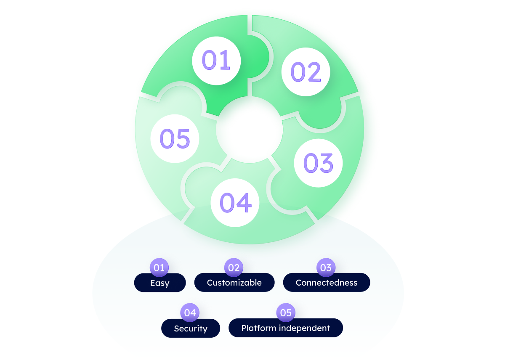

# Why uAgents 🤔💡

In the evolving landscape of decentralized technology, the emergence of autonomous agents has revolutionized the approach we have to problem-solving, decision-making, and collaborative behaviors. Intelligent agents hold immense potential to transform industries and enhance the understanding of complex systems.

Fetch.ai introduces the **uAgents Framework** designed to empower developers with the tools to build intelligent, autonomous agents that interact, collaborate, and navigate the complexity of the modern world.

At the core of this revolutionary technology lies the concept of uAgents, a type of decentralized, autonomous entities that transcend traditional boundaries, unlocking a realm of possibilities yet unexplored. As pioneers, we are strongly driven by our passion for innovation and the potential of uAgents to reshape the structure of our society.

uAgents offer a gateway to a future where intelligent entities communicate, negotiate, and collaborate in a straightforward and trustless fashion, harnessing the power of decentralized networks. The days of centralized decision-making have come to an end! Now, autonomous agents have the chance of taking charge, empowered by the Framework to manifest unique, customizable behaviors that suit the most specific use cases. The journey begins with a few lines of code, where creativity meets functionality, and the potential to build intelligent agents that adapt, learn, and engage with the world becomes a tangible reality.

## Reasons to build with uAgents

    - **Easiness to learn**: the uAgents Framework offers a user-friendly learning curve, allowing developers to quickly grasp the concepts and get started with building intelligent and autonomous uAgents. Follow our guides to install the [Python ↗️](https://pypi.org/project/uagents/) package and create your first uAgents in just a few minutes.

    - **Customizability**: with uAgents you have the freedom to unleash your creativity and build any type of agent you can imagine. The Framework provides extensive customization options, empowering you to tailor the behavior, decision-making processes, and interactions of your uAgents according to your specific use case.

    - **Connectedness**: when an uAgents starts up, it becomes part of the rapidly expanding network of uAgents. By registering on the [Almanac ↗️](/references/contracts/uagents-almanac/almanac-overview.md)️, which is the smart contract developed and deployed on the Fetch.ai blockchain, your uAgents instantaneously joins this dynamic ecosystem of agents, enabling effortless collaboration and interaction with other participants.

    - **Security**: security is a top priority in decentralized environments, and the Framework ensures the protection of your uAgents' messages and wallets. Through cryptographic measures, the identities and assets associated with uAgents are safeguarded, providing peace of mind and maintaining the integrity of your uAgents' interactions and transactions.

    - **Platform and language independency**: while initially launched as a Python library, the [Exchange Protocol ↗️](/references/uagents/uagents-protocols/exchange-protocol.md)️ used by uAgents is defined in terms of standard data types. This inherent flexibility allows the Framework to transcend any specific platform or programming language. As a lightweight and adaptable Framework, expect the emergence of packages and implementations in other programming languages to further expand the reach and accessibility of uAgents in the near future.
