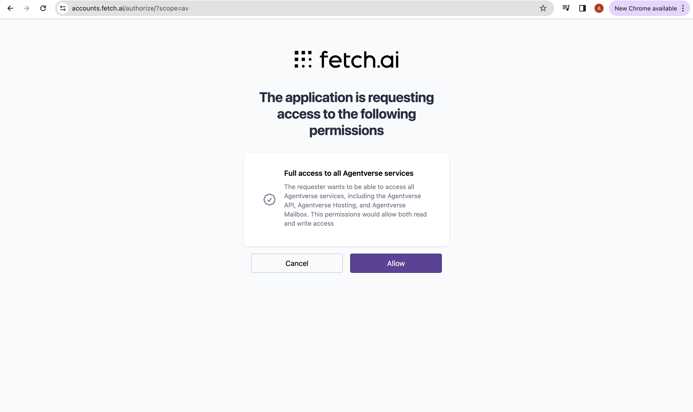
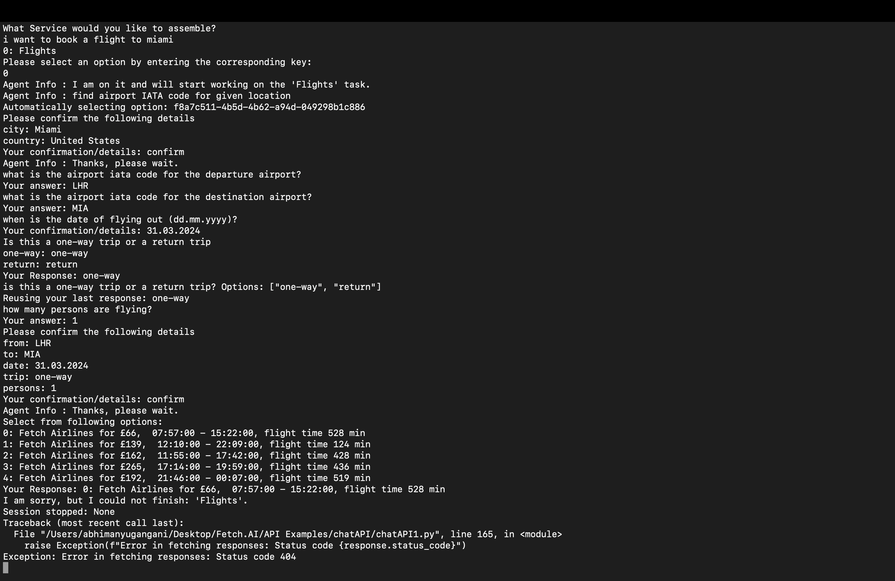

import { Callout } from 'nextra/components'

# AI-Engine Chat API guide

## Introduction

This guide offers details on utilizing the AI-engine's chat API to interact with deltaV. We will demonstrate a python script that interacts 
with deltaV via the chat API, handling session IDs, sending messages, managing responses, and processing user requests and selections.


## Prerequisites

- Before you begin, ensure you have the following:

    - Python version greater than 3.9 and less than 3.11.
    - The requests library installed. You can install it using pip install requests.
    - An API token (fauna) from Agentverse, which will be used for authentication.

- Steps to get API Token:

    1. Login to agentverse.
    2. Right click on chrome browser and select Inspect
    3. Go to the application tab and look for cookies.
    4. Select Agenverse.ai and select fauna cookie.
    5. Copy the fauna’s value and this is your token key.


## Script Break down

This script includes various functions for handling different API interactions. Below is a summary of the main functions and their 
respective purposes.

    1. Importing Required libraries:

    ```python
    # Importing Required libraries
    import re
    import requests
    import time
    import json
    ```

    These libraries are used to handle user regular expressions, HTTP requests, time delays and JSON responses.

    2. normalize_question function:

    ``` python
    # Define function to normalize questions asked by AI-engine
    def normalize_question(question):
        # Convert to lowercase
        question_lower = question.lower()
        # Remove punctuation
        question_normalized = re.sub(r'[^\w\s]', '', question_lower)
        return question_normalized
    ```

    This function converts questions from a JSON response, identified by the key 'text', into lowercase and removes any punctuation. 
    It helps standardize user input for consistent processing.

    3. send_user_choice_as_uuid function:
    ```python
    # Define function to respond to subtask selection
    def send_user_choice_as_uuid(session_id, user_choice, token):
        data = {
            "payload": {
                "type": "user_json",
                "user_json": {
                    "type": "options",
                    "selection": [user_choice]
                },
                "session_id": session_id
            }
        }
        response = requests.post(f"https://agentverse.ai/v1beta1/engine/chat/sessions/{session_id}/submit", json=data, headers={"Authorization": token})
    ```

    This function is designed to send user's choice back to AI-engine through Chat API, specially in case of user getting options from multiple
    subtask options as UUID. The function takes three parameters:

        - session_id - chat session Id on DeltaV.
        - user_choice - the choice of subtask user wants AI-Engine to use.
        - token - AI-Engine fauna token to connect DeltaV or AI-Engine.

    4. send_user_message function:

    ``` python
    # Define function to send message to AI-Engine
    def send_user_message(session_id, user_message, token):
        data = {
            "payload": {
                "type": "user_message",
                "user_message": user_message
            }
        }
        response = requests.post(f"https://agentverse.ai/v1beta1/engine/chat/sessions/{session_id}/submit", json=data, headers={"Authorization": token})
    ```

    This function is designed to send a message from the user to the chat session. This is used to submit user input as part of the chat flow.
    The session_id and token parameters are same as 'Send_user_choice_as_uuid' function, 'user_message' is the message which user wants to send to 
    the ongoing chat session.

    5. is_uuid function:

    ``` python
    # Define function to check if option is uuid (Subtask Key)
    def is_uuid(key):
        # Function to check if a string is a valid UUID
        pattern = re.compile(r"^[0-9a-f]{8}-[0-9a-f]{4}-[1-4][0-9a-f]{3}-[89ab][0-9a-f]{3}-[0-9a-f]{12}$", re.IGNORECASE)
        return pattern.match(key)
    ```

    This function checks whether the given key is in UUID (Universal Unique Identifier) format.The function uses a regular expression pattern to match the 
    standard UUID format, which consists of 32 hexadecimal characters split into five groups separated by hyphens (8-4-4-4-12).

    The function takes the 'key' parameter and returns match object if key is UUID else it returns None.

    6. stop_session functions:
    ``` python
    # Define function to stop user session
    def stop_session(session_id, token):
        data = {
            "payload": {
                "type": "stop"
            }
        }
    response = requests.post(f"https://agentverse.ai/v1beta1/engine/chat/sessions/{session_id}/submit", json=data, headers={"Authorization": token})
    print("Session stopped:", response.json())
    ```

    This function is designed to stop the ongoing deltaV chat session.

## Main Script Flow

The main script flow includes:

    1. Setting up a chat session on DeltaV using AI-Engine Chat API.
    2. Taking input from the user for service they want to assemble or objective to achieve.
    3. Handling the chat flow which includes sending messages and processing requests.
    4. Managing User selection from provided options.
    5. Handling special requests where agents ask the same questions back to back. (The same question is asked in agent_json and agent_info response type when user input is required.)
    6. Handling error codes provided by agent.
    7. Stopping chat session with the user.

Chunk-by-chunk explaination:

    - Setting up a Chat Session with AI_engine Chat API

    ``` python
    # User and model details
    data = {
        "email": "your_userName@fetch.ai", # replace with agentverse username
        "requestedModel": "talkative-01" # Model type for chat interaction
    }

    # Your authentication token
    token  = 'bearer <YOUR_FAUNA_TOKEN>' #Replace your fauna value with 

    # Connecting to deltaV and getting session ID
    response = requests.post("https://agentverse.ai/v1beta1/engine/chat/sessions", json=data, headers={"Authorization": token})
    response_data = response.json()
    session_id = response_data.get('session_id')
    print("Session Id:", session_id)
    ```


    The above section of code creates payload(data) for request to start a session. Please update the following details accordingly:
        - email: Update this with your agentverse email-id. 
        - requestedModel: This is the chat model you want to make request to
        - token: The token you got in section [Prerequisites ↗️](/apis/ai-engine/chat-api-example#Prerequisites) and place it in place of YOUR_FAUNA_TOKEN.
    
    On the basis of details provided and POST request sent to chat API. AI-engine responds with a session-Id where we can communicate further with deltaV.
    Session-id is extracted from the response which is vital for interacting with DeltaV.

    - Taking user input from the user for service they would like to assemble/ Objective they want to accomplish.

    ``` python
    # Taking user query as input
    objective = input('What Service would you like to assemble?\n')

    # Defining initial payload for quering deltaV
    data_query = {
        "payload": {
            "type": "start",
            "objective": objective,
            "context": f"User full Name: Test User\nUser email: {data['email']}\nUser location: latitude=51.5072, longitude=0.1276\n",
            "session_id": session_id
        }
    }

    # Sending query to user
    response = requests.post(f"https://agentverse.ai/v1beta1/engine/chat/sessions/{session_id}/submit", json=data_query, headers={"Authorization": token})
    print(response.json())
    # waiting to get next response from AI engine
    time.sleep(10)
    response = requests.get(f"https://agentverse.ai/v1beta1/engine/chat/sessions/{session_id}/responses", headers={"Authorization": token}).json()
    print(response)
    ```

    This section of code is responsible for sending a start message after chat session is initialized. Below is the step-by-step explaination:
        - Taking user objective/query as input.
        - Creating a payload to make a start request to AI-engine Chat API. which includes objective, username, location and session-id.
        - POST start request with query to AI-Engine.
        - Getting latest responses from AI-Engine chat API using GET Request.

    - Selecting required service from options and sending response back to AI_engine

    ``` python
    # Getting agent response for the services options
    agent_response = response['agent_response'][0]
    agent_response_dict = json.loads(agent_response)
    # Getting Services options for user's objective
    agent_json = agent_response_dict['agent_json']

    # Taking input from user for which service to use.
    for option in agent_json['options']:
        print(f"{option['key']}: {option['value']}")
    user_choice = input("Please select an option by entering the corresponding key: \n")

    # Payload for selected service
    data_service = {
        "payload": {
            "type": "user_json",
            "user_json": {
                "type": "task_list",
                "selection": [user_choice]
            }
        }
    }

    # Submitting selected service to DeltaV
    response = requests.post(f"https://agentverse.ai/v1beta1/engine/chat/sessions/{session_id}/submit", json=data_service, headers={"Authorization": token})
    ```

    The above section of code gets response for available services options for the user query or objective. Below is step-by-step guide to achieve this
        - Getting agent response for the service options
        - Displaying options to the user and taking user choice input.
        - Creating payload for selected service.
        - submitting selected service to deltaV.

    - Handling the chat flow which includes sending messages and processing responses.

    ```Python
    # Setting response count to track irresponsive agent.
    no_response_count = 0
    ## Variables to track the last question and response
    last_question = ""
    last_response = ""

    while True:
    time.sleep(5)  # Wait before fetching responses to avoid overwhelming the server
    response = requests.get(f"https://agentverse.ai/v1beta1/engine/chat/sessions/{session_id}/responses", headers={"Authorization": token}) # Getting response from deltaV
    
    if response.status_code != 200:
        raise Exception(f"Error in fetching responses: Status code {response.status_code}")
    
    response = response.json()

    # Handling unresponsive deltaV
    if not response['agent_response']:
        no_response_count += 1
        if no_response_count < 10:
            continue  # Wait for a bit longer if no response yet
        else:
            print("No response from the agent.")
            stop_session(session_id, token)
            break  # Exit loop if no response after several attempts
    
    no_response_count = 0  # Reset counter on receiving a response
    ```

    This section of the script implements a loop to continuously monitor responses from the DeltaV agent within a chat session:
        - Initialize a counter for response to track empty deltaV agent responses.
        - Tracing last interaction questions, and responses to avoid asking same questions to the user.
        - The script is in continuous infinite loop repeatedly every 5 seconds unless we get 10 empty responses.
    
    ``` python
        # Reading agent response
        for agent_resp in response['agent_response']:
            agent_resp_dict = json.loads(agent_resp) #getting response dictionary from deltaV
            current_message_text = "" # Setting current message to empty string
            
            if agent_resp_dict.get('type') == 'agent_json': #handling agent_json type response
                agent_json = agent_resp_dict['agent_json']
                current_message_text = normalize_question(agent_json.get('text', '')) # Setting current message from deltaV

                # Handle options provided in agent_json
                if 'options' in agent_json and agent_json['options']:
                    option_keys = [str(option['key']) for option in agent_json['options']] # setting options keys in list to check if its UUID
                    
                    # Automatically select the first option if it's a UUID
                    if is_uuid(option_keys[0]):
                        print(f"Automatically selecting option: {option_keys[0]}")
                        send_user_choice_as_uuid(session_id, option_keys[0], token)
                        last_response = option_keys[0]  # Update last response
                        continue  # Skip the rest of the loop to wait for the next agent response
                    else:
                        # If the first option is not a UUID, prompt for user input
                        print(agent_json.get('text', '')) # printing deltaV message on terminal
                        for option in agent_json['options']:
                            print(f"{option['key']}: {option['value']}") # Printing options on terminal
                        user_choice = input("Your Response: ") # Taking user selection from options
                        send_user_message(session_id, user_choice, token) # Sending response to deltaV
                        last_response = user_choice  # Update last response
                else:
                    # No options provided
                    print(agent_json.get('text', 'Please confirm the details or provide the requested information:')) # Printing user message
                    if agent_json.get('context_json') and 'args' in agent_json['context_json']: #Printing arguments to confirm if present
                        args = agent_json['context_json']['args']
                        for key, value in args.items():
                            print(f"{key}: {value}")
                    user_confirmation = input("Your confirmation/details: ") # Confirming arguements by user
                    send_user_message(session_id, user_confirmation, token)
                    last_response = user_confirmation  # Update last response
    ```

    This section of scripts processes responses from the agent in DeltaV system:
        - The loop continuously iterates through each response and converts json string into python dictionary.
        - The script initializes `current_message_text` as an empty string to prepare for new messages.
        - This script handles different types of responses. If the response type is `agent_json`:
            - Extracts the message and normalizes it using the normalize_question function, which converts the text to lowercase and removes punctuation.
            - Checks if there are options associated with the message, if there are:
                - It extracts the option keys and checks if the first option is a UUID, indicating a subtask trigger.
                - If it is a UUID, the script automatically selects first option without user intervention, updating last_response and skipping the remaining loop to await further responses.
                - If the options are not UUIDs, the script displays them to the user and prompts for a choice, which is then sent back to DeltaV using `send_user_message`.
        - If the agent_json does not contain options (indicating a request for confirmation or information):
            - The script prints the message and, if present, details (arguments) for user confirmation.
            - It then collects user input and sends it back to DeltaV, updating last_response with the user's input for continuity.    

    ``` python
    elif agent_resp_dict.get('type') == 'agent_message': #handling agent_message type response
            agent_message = agent_resp_dict.get('agent_message', '')
            print(agent_message)
            # If agent_message repeats the last question, reuse last response
            if normalize_question(agent_message.split('?')[0]) == last_question:
                print(f"Reusing your last response: {last_response}")
                send_user_message(session_id, last_response, token)
            else: # if question not repeated taking input from user
                user_response = input("Your answer: ")
                send_user_message(session_id, user_response, token)
                last_response = user_response  # Update last response
    ```
    
    - Handling `agent_message` type response:
        - if the questions asked is same as the previous response in agent_json, it automatically sends previous response to deltav using `send_user_message` message.
        - else the input or is taken from user for the given question and sent to deltaV agent using `send_user_message` and `last_response` is stored.

    ```python
    # Stopping session in case of error.
        elif agent_resp_dict.get('type') == 'agent_error':
            agent_message = agent_resp_dict.get('agent_error')
            print(agent_message)
            stop_session(session_id, token)
    ```

    - This section of script handles `error` type response and stops the session in case of error with error message.

    ```python
    elif 'agent_info' in agent_resp_dict or agent_resp_dict.get('type') == 'stop': #handling agent_info and stop messages
            # Print agent_info or handle stop type
            info_message = agent_resp_dict.get('agent_info', '') if agent_resp_dict.get('type') == 'agent_info' else "Session stopping." 
            print(f'Agent Info : {info_message}') # Print agent info
            if 'I have completed your task! Please reset your chat session before submitting your new request.' in info_message:
                stop_session(session_id, token)
                break  # Exit loop if session is stopped
            if agent_resp_dict.get('type') == 'stop':
                stop_session(session_id, token)
                break  # Exit loop if session is stopped
    ```

    - Handling 'agent_info' and 'stop' Type Responses:
        - If the response contains 'agent_info' or the type is 'stop', the script processes these specific messages.
        - For 'agent_info' type messages, it extracts and prints the information content provided by the agent. This could be feedback, status updates, or other informative messages relevant to the user's query or the chat session.
        - If the message type is 'stop', the script prints "Session stopping." to indicate that the DeltaV session is ending.


    - Session Complete and Reset:
        - If the agent's information message indicates that the user's task has been completed (identified by a specific message, "I have completed your task! Please reset your chat session before submitting your new request."), the script triggers the stop_session function to properly close the session on the server side.
        - Similarly, if the response type is 'stop', it also calls stop_session to end the session.
        - In both cases, after stopping the session, the script breaks out of the loop, effectively ending the script's execution.

    ```python
    else:
        print("Received an unhandled response type:", agent_resp_dict.get('type')) # Handling any other message type

        # Update last_question with current message text up to a question mark
        last_question = current_message_text.split('?')[0] if '?' in current_message_text else current_message_text
    ```

    This section of script handles any other agent response and also updates the last question.It removes the options and punctuation mark from the question to check it with the current question in agent_json.

## Whole Script

    ```python copy filename="agent.py"
    #importing required libraries
import re
import requests
import time
import json

# define function to normalize questions asked by AI-engine
def normalize_question(question):
    # Convert to lowercase
    question_lower = question.lower()
    # Remove punctuation
    question_normalized = re.sub(r'[^\w\s]', '', question_lower)
    return question_normalized

# define function to respond to subtask selection
def send_user_choice_as_uuid(session_id, user_choice, token):
    data = {
        "payload": {
            "type": "user_json",
            "user_json": {
                "type": "options",
                "selection": [user_choice]
            },
            "session_id": session_id
        }
    }
    response = requests.post(f"https://agentverse.ai/v1beta1/engine/chat/sessions/{session_id}/submit", json=data, headers={"Authorization": token})
    
# Define function to send message to AI-Engine
def send_user_message(session_id, user_message, token):
    data = {
        "payload": {
            "type": "user_message",
            "user_message": user_message
        }
    }
    response = requests.post(f"https://agentverse.ai/v1beta1/engine/chat/sessions/{session_id}/submit", json=data, headers={"Authorization": token})

# Define function to check if option is uuid (Subtask Key)
def is_uuid(key):
    # Function to check if a string is a valid UUID
    pattern = re.compile(r"^[0-9a-f]{8}-[0-9a-f]{4}-[1-4][0-9a-f]{3}-[89ab][0-9a-f]{3}-[0-9a-f]{12}$", re.IGNORECASE)
    return pattern.match(key)

# Define function to stop user session
def stop_session(session_id, token):
    data = {
        "payload": {
            "type": "stop"
        }
    }
    response = requests.post(f"https://agentverse.ai/v1beta1/engine/chat/sessions/{session_id}/submit", json=data, headers={"Authorization": token})
    print("Session stopped:", response.json())

# User and model details
data = {
    "email": "username@fetch.ai", # replace this section with the agentverse username
    "requestedModel": "talkative-01"
}


# Your authentication token
token = 'bearer <Your_fauna_token>' #replace this your fauna token from agentverse

# Connecting to deltaV and getting session ID
response = requests.post("https://agentverse.ai/v1beta1/engine/chat/sessions", json=data, headers={"Authorization": token})
response_data = response.json()
session_id = response_data.get('session_id')
print("Session Id:", session_id)

# Taking user query as input
objective = input('What Service would you like to assemble?\n')

# Defining initial payload for quering deltaV
data2 = {
    "payload": {
        "type": "start",
        "objective": objective,
        "context": f"User full Name: Test User\nUser email: {data['email']}\nUser location: latitude=51.5072, longitude=0.1276\n",
        "session_id": session_id
    }
}

# Sending query to user
response = requests.post(f"https://agentverse.ai/v1beta1/engine/chat/sessions/{session_id}/submit", json=data2, headers={"Authorization": token})
print(response.json())
# waiting to get next response from AI engine
time.sleep(10)
response = requests.get(f"https://agentverse.ai/v1beta1/engine/chat/sessions/{session_id}/responses", headers={"Authorization": token}).json()
print(response)
agent_response = response['agent_response'][0]
agent_response_dict = json.loads(agent_response)
# Getting Services options for user's objective
agent_json = agent_response_dict['agent_json']

# Taking input from user for which service to use.
for option in agent_json['options']:
    print(f"{option['key']}: {option['value']}")
user_choice = input("Please select an option by entering the corresponding key: \n")

# Payload for selected service
data3 = {
    "payload": {
        "type": "user_json",
        "user_json": {
            "type": "task_list",
            "selection": [user_choice]
        }
    }
}

# Submitting selected service to DeltaV
response = requests.post(f"https://agentverse.ai/v1beta1/engine/chat/sessions/{session_id}/submit", json=data3, headers={"Authorization": token})


# Setting response count to track empty agent response
no_response_count = 0
## Variables to track the last question and response
last_question = ""
last_response = ""


while True:
    time.sleep(5)  # Wait before fetching responses to avoid overwhelming the server
    response = requests.get(f"https://agentverse.ai/v1beta1/engine/chat/sessions/{session_id}/responses", headers={"Authorization": token}) # Getting response from deltaV
    
    if response.status_code != 200:
        raise Exception(f"Error in fetching responses: Status code {response.status_code}")
    
    response = response.json()

    # Handling unresponsive deltaV
    if not response['agent_response']:
        no_response_count += 1
        if no_response_count < 10:
            continue  # Wait for a bit longer if no response yet
        else:
            print("No response from the agent.")
            stop_session(session_id, token)
            break  # Exit loop if no response after several attempts
    
    no_response_count = 0  # Reset counter on receiving a response

    # Reading agent response
    for agent_resp in response['agent_response']:
        agent_resp_dict = json.loads(agent_resp) #getting response dictionary from deltaV
        current_message_text = "" # Setting current message to empty string
        
        if agent_resp_dict.get('type') == 'agent_json': #handling agent_json type response
            agent_json = agent_resp_dict['agent_json']
            current_message_text = normalize_question(agent_json.get('text', '')) # Setting current message from deltaV

            # Handle options provided in agent_json
            if 'options' in agent_json and agent_json['options']:
                option_keys = [str(option['key']) for option in agent_json['options']] # setting options keys in list to check if its UUID
                
                # Automatically select the first option if it's a UUID
                if is_uuid(option_keys[0]):
                    print(f"Automatically selecting option: {option_keys[0]}")
                    send_user_choice_as_uuid(session_id, option_keys[0], token)
                    last_response = option_keys[0]  # Update last response
                    continue  # Skip the rest of the loop to wait for the next agent response
                else:
                    # If the first option is not a UUID, prompt for user input
                    print(agent_json.get('text', '')) # printing deltaV message on terminal
                    for option in agent_json['options']:
                        print(f"{option['key']}: {option['value']}") # Printing options on terminal
                    user_choice = input("Your Response: ") # Taking user selection from options
                    send_user_message(session_id, user_choice, token) # Sending response to deltaV
                    last_response = user_choice  # Update last response
            else:
                # No options provided
                print(agent_json.get('text', 'Please confirm the details or provide the requested information:')) # Printing user message
                if agent_json.get('context_json') and 'args' in agent_json['context_json']: #Printing arguments to confirm if present
                    args = agent_json['context_json']['args']
                    for key, value in args.items():
                        print(f"{key}: {value}")
                user_confirmation = input("Your confirmation/details: ") # Confirming arguements by user
                send_user_message(session_id, user_confirmation, token)
                last_response = user_confirmation  # Update last response
        
        elif agent_resp_dict.get('type') == 'agent_message': #handling agent_message type response
            agent_message = agent_resp_dict.get('agent_message', '')
            print(agent_message)
            # If agent_message repeats the last question, reuse last response
            if normalize_question(agent_message.split('?')[0]) == last_question:
                print(f"Reusing your last response: {last_response}")
                send_user_message(session_id, last_response, token)
            else: # if question not repeated taking input from user
                user_response = input("Your answer: ")
                send_user_message(session_id, user_response, token)
                last_response = user_response  # Update last response

        # Stopping session in case of error.
        elif agent_resp_dict.get('type') == 'agent_error':
            agent_message = agent_resp_dict.get('agent_error')
            print(agent_message)
            stop_session(session_id, token)

        elif 'agent_info' in agent_resp_dict or agent_resp_dict.get('type') == 'stop': #handling agent_info and stop messages
            # Print agent_info or handle stop type
            info_message = agent_resp_dict.get('agent_info', '') if agent_resp_dict.get('type') == 'agent_info' else "Session stopping." 
            print(f'Agent Info : {info_message}') # Print agent info
            if 'I have completed your task! Please reset your chat session before submitting your new request.' in info_message:
                stop_session(session_id, token)
                break  # Exit loop if session is stopped
            if agent_resp_dict.get('type') == 'stop':
                stop_session(session_id, token)
                break  # Exit loop if session is stopped

        else:
            print("Received an unhandled response type:", agent_resp_dict.get('type')) # Handling any other message type

        # Update last_question with current message text up to a question mark
        last_question = current_message_text.split('?')[0] if '?' in current_message_text else current_message_text
    ```

Save this script as chatAPI.py and replace ‘email’ and ‘fauna_token’ in the script.

Running this app on the terminal:
    1. Locate the dictionary where the script is located.
    2. Run script using python chatAPI.py and type in the user’s objective.
    3. Select the key of the service you want to use.
    4. Confirm/ Reject the details whenever asked.
    5. Reply back to the agent when a question is asked.
    6. When the final response is received, type OK or stop to be sent to the deltaV agent.

Please refer below images for sample chat session with AI_engine Chat_API






