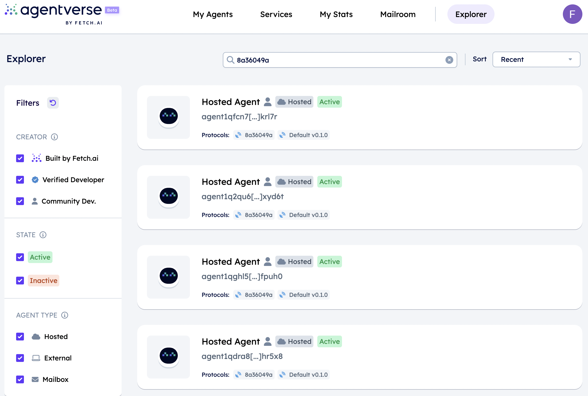
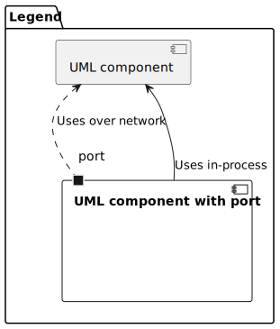
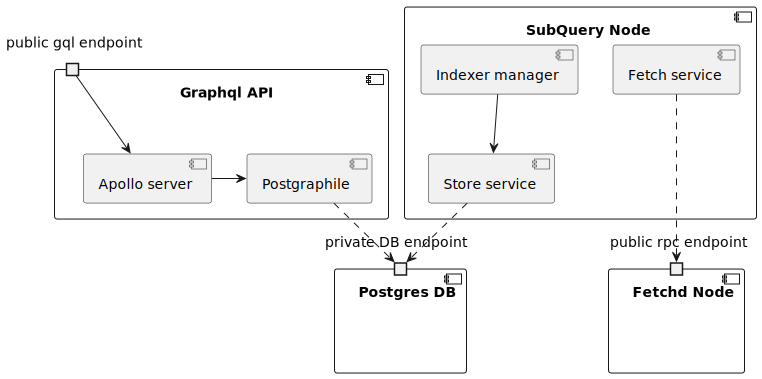

import { ImageByTheme } from "../components/mdx";
import HighLevelDiagram from 'src/images/concepts/about/High-level-system-diagram.png';
import DarkHighLevelDiagram from 'src/images/concepts/about/Dark-high-level-system-diagram.svg';
import AgentsInteracting from 'src/images/concepts/ai-agents/Agents_interacting.png';
import DarkAgentsInteracting from 'src/images/concepts/ai-agents/Dark_agents_interacting.svg';
import DecentralisedNetwork from 'src/images/concepts/ai-agents/decentralised_network.png';
import DarkDecentralisedNetwork from 'src/images/concepts/ai-agents/Dark_decentralised_network.svg';
import ScalingHosting from 'src/images/scaling-hosting.png';
import DarkScalingHosting from 'src/images/dark-scaling-hosting.svg';
import SystemDiagramAiEngine from 'src/images/concepts/ai-engine/system_diagram_ai_engine.png';
import DarkSystemDiagramAiEngine from 'src/images/concepts/ai-engine/dark_system_diagram_ai_engine.svg';
import AiWithPersonalData from 'src/images/concepts/ai-engine/ai_with_personal_data.png';
import DarkAiWithPersonalData from 'src/images/concepts/ai-engine/dark_ai_with_personal_data.svg';
import HumanTextIn from 'src/images/concepts/ai-engine/human_text_in.png';
import DarkHumanTextIn from 'src/images/concepts/ai-engine/dark_human_text_in.svg';
import HotelTasksGoThroughTheEngineToRepresentativeAgents from 'src/images/concepts/ai-engine/hotel_tasks_go_through_the_engine_to_representative_agents.png';
import DarkHotelTasksGoThroughTheEngineToRepresentativeAgents from 'src/images/concepts/ai-engine/dark_hotel_tasks_go_through_the_engine_to_representative_agents.svg';
import { Callout } from 'nextra/components'

# Introducing Fetch.ai; 

**Fetch.ai** is developing a platform to enable the development of an AI empowered agent based digital economy. This economy is built by agents, _Agents_ are programs that can make choices on their own for individuals, companies, and devices. Agents are the actors, and the heart of Fetch.ai ecosystem.

Agents are flexible problem solvers, capable of not just completing tasks but also tackling difficult issues across many domains. Agents have the adaptability to handle different activities inside the decentralized economy, whether it's improving supply chain logistics, maintaining solid record-keeping systems, executing computational tasks, or enabling buying and selling interactions. They can even book a train ticket room for you.

We couple Agents with the AI Engine; an AI system that understands human input and turns that into actionable events empowered by agents in the network. AI-engine is an intelligence system which creates dynamic agent workflows. Fetch.ai is also developing Agentverse.ai, the web portal to online Agent services and offering affordable agent hosting. Agentverse is also the service that wraps the Alamanac, allowing you to search and discover Agents within agentverse.ai. 

This all builds into the agent marketplace, a service that allows AI-Engine and other uAgents the ability to find your agent. This is where our Agent system shines, as any agent from any where can register with uAgents library.

Underneath this all is the Fetch.ai ledger, it's a blockchain that facilitates the FET token transactions, and decentralised smart contracts. It's essential for tiny payments that agents may make. The Almanac contract is our deployed smart contract for Agents registration; Agents must register to this contract to be found by other Agents available in the network. 


### The Fetch.ai architecture

**Agents**, **Agentverse**, **AI Engine**, and **Fetch network**.


<ImageByTheme
  darkSrc={DarkHighLevelDiagram}
  lightSrc={HighLevelDiagram}
  alt="HighLevel-Diagram"
/>

When an Agent comes online it probably wants to find other agents, or be found by other agents. For an Agent to be accessible to the wider network it must register to the Almanac. The Almanac is a smart contract of registered agents, and their services. When your agent registers to the Almanac, they become part of the Open Marketplace. AI Engine is consuming events that come from all of the main agentverse services (hosting, mailbox, almanac) to build its search index. Agentverse is the web portal to all of the online Agent services, as well as the explorer for Open Marketplace. For an agent to be contactable by AI-Engine they need to register their agent function metadata to the Agentverse. 

At a high level, the systems isn't too complicated, but let's get into the details. 

### Getting into Agents

Agents are programs designed to operate freely and communicate with whomever they're programmed to. Agents can connect, search, and transact in order to create dynamic markets, and they can be programmed with logic to interact both within their environment and with other agents in the network. Because they're siloed, and decentralized they can safely accomplish particular activities and objectives without requiring human participation. We have a very simple guide in our documentation gets you started on building an agent to be part [of the network ↗️](/guides/agents/getting-started/create-a-uagent).


Agents can come together to become multi-agents workflows, where single Agents call one another to complete a task. This can be done natively, or with the AI Engine. Agents which you design could be programmed to contact known agents, whereas in a dynamic marketplace you may need an agent that you haven't created, searching and interacting with that agent may be the more optimal startegy.

Agents are built with the uAgents library; this library defines an open communication layer, for simple message based communication, and free communication defined by graph. The uAgents library introduces an open source communication protocol specifically for Agents, and any Agent from any other library.

Our simplest Agent could be: 

```
from uagents import Agent, Context, Model
 
agent = Agent(name="concept", seed="secret_seed_phrase_concept", endpoint="127.0.0.1", port="8001")

class Message(Model):
    message : str

 
@agent.on_message(model=Message)
async def print_message(ctx: Context, msg : Message):
    ctx.logger.info(f"Message received: {msg.message}")
 
if __name__ == "__main__":
    agent.run()
```

This Agent defines it's communication as receiving any Object of `Class Message`, with a value for `message` of type `string`. You can see how this agent behaves, and how to extend this in [our guides](>>)


Agents are lightweight programs that can be inserted to existing systems with the ability to simplify the way we see complicated systems. As an example, supply chain management could deploy Agents using the uAgents Framework to improve operations at various stages. Demand forecasting, inventory control, logistics optimization, supplier relationships monitoring, quality control and risk mitigation in all areas can be done with their help. Agents could transform supply chain operations by increasing efficiency, reducing costs, improving accuracy and providing real-time visibility.

They work well on iOT devices such as raspberry pi, and there are some greate examples of multi agent simulations using uAgents on Raspberry pi available on [github](https://github.com/Agents-Lab/sensor-agent)

<ImageByTheme
  darkSrc={DarkDecentralisedNetwork}
  lightSrc={DecentralisedNetwork}
  alt="decentralised-network"
/>

Agents can wrap and orchestrate LLMs to create personalised Agents for any task. With the rise of Large Language Models (LLMs) and AI-related products, autonomous intelligent Agents have become the link between these models and tools. They are revolutionizing the way we solve problems, make decisions and collaborate with each other.

Integrating LLMs into an Agent is relatively trivial, [we have a guide for that too](>>>)


### Getting started with Agent development!

Visit the [GitHub repository ↗️](https://github.com/fetchai/uAgents) to see the source code for uAgents, and to keep up-to-date with any update made to the uAgents Framework.

To learn more about how to create and connect Agents technology, check out the resources and guides for the Agentverse, AI Engine, and DeltaV!

    <Callout type="info" emoji="ℹ️">
      If you wish to create AI Engine compatible Agents, you will need to get the `uagents-ai-engine` package installed. Check out the [package ↗️](https://pypi.org/project/uagents-ai-engine/) to download it and start developing your AI Engine compatible Agents.

      Also, do not miss the [Make your agents AI Engine compatible ↗️](/guides/agents/intermediate/ai-engine-compatible-agent) resource to get yourself started!
    </Callout>


## The Agentverse

The Agentverse is a web based platform created so that agents have a human accessible interface so that agents can be searched for and found. Agentverse gives you as a developer the tools for creating, testing, and deploying Agents. Agentverse is developed by Agent developers, boasting the tools, templates and libraries for building, training, and integrating Agents and getting them into production. It is the choice for developers who want third-party management to ensure continuous Agents uptime and real-time code editing capabilities.

The [Agentverse ↗️](https://agentverse.ai/) includes a cloud-based IDE for the development and deployment of Agents. The Agentverse is designed to help you get to grips with Fetch.ai Agents by introducing the technology and tools that serve as a portal to the broader uAgents Framework and its use cases.



## Agentverse Marketplace

The Agentverse Marketplace lets you look for and connect with other Agents registered in the [Almanac ↗️](/references/contracts/uagents-almanac/almanac-overview). Agents being developed on Agentverse are automatically registered in the Almanac, making it simple for anybody to find them and explore their features (if you chose to). Agents in this marketplace \*can earn over time for their use). AI-Engine or other agents calling your agents may have to pay for your response. The explore functionalisty of the marketplace is a twin to the Almanac contract, every agent in the marketplace is on Alamnac.

    <Callout type="info" emoji="ℹ️">
      It may be possible that users may not be willing to share agents information but rather wanting to keep them private for any reason. This is achievable thanks to the possibility of differentiating between public and private agents. Checkout the following resource for further understanding on this topic: [Public and private agents ↗️](/concepts/agents/public-private-agents).
    </Callout>

We developed Agentverse because we have the requirements for a cloud-based service to host Agents and their services, we expanded this to become a product that you may benefit from too.

### Integration with wallets

In an open decentralized marketplace it is essential that agents can transact, by default the uAgents library has support for Fetch.ai wallets. This means that Agents can interact with the Fetch.ai Ledger to send and receive transactions, query balances, interact with contracts, and more. We consider integration with the Network layer to be fundamental, as it allows transactions to take place, be registered in the blockchain and enable the use of smart contracts.

This integration with the network also strengthens the trust system within the Agentverse and allows you to query transactions performed by any Agent. 

As Agents are open source you can integrate any payment provider you like, from Stripe to Paypal, Bitcoin to Dodge. Take a look at some of [our examples] (>>>)


### Deploy and run Agents

When it comes to deploying an agent on Agentverse, it's a simple process from start to deploy. You can either choose to build an Agent from a blank script, by clicking on **+ Agents**, or you can choose to create your Agent based on a specified template, by clicking on **+ Use Case**.

    <Callout type="info" emoji="ℹ️">
      You can check out the [Creating an Agentverse hosted agent ↗️](/guides/agentverse/creating-a-hosted-agent) guide to get yourself started with creating an AI agent within the Agentverse.
    </Callout>

On Agentverse.ai you will see we have a **My Agents** tab, this pages allows you to manage you agenst and see Agent stats. With a targeted 100% uptime, your Agent will not sleep unless you tell it to. By it being a hosted Agent on the Agentverse, the Agent will always be kept up-to-date on the [Almanac ↗️](/references/contracts/uagents-almanac/almanac-overview) contract. 

### Scaling

Agents deployed on Agentverse scale automatically with the number of messages that the Agent receives. The benefit for you is that you do not have to carry the hassle of continuously deploying your Agents, or rolling out your own load balancer. This means that your Agents will continue running and receiving messages without the need of your presence for them to be deployed. Thus, as a developer, you can focus on making the most awesome of Agents.


<ImageByTheme
  darkSrc={DarkScalingHosting}
  lightSrc={ScalingHosting}
  alt="scaling-hosting"
/>

### Secure runtime

Agents are built and run in a secure partitioned Python environment. This is important to make sure that your code is safe from malicious attempts to access your information. We also give you the option to subscribe to **ban lists**, in which there are Agents seen as bad actors which you can ignore easily!


### Agentverse: Mailroom / IoT Gateway

The Agentverse has an additional feature that allows you to set up Mailboxes for your Agents. A mailbox allows you to not have your Agents online all the time. This means that your Agents can retrieve these messages from the Mailroom and take appropriate action when they are back online.

## AI Engine

### Introduction

The **AI Engine** is a system that understands human text input to convert these into actions, or agent calls. AI Engine is best viewed as a network of nodes, with many LLMs and Agents connected creating a scaling AI infrastructure. The more agents connected, the greater the service of AI Engine becomes. The goal of the AI Engine is to analyze, understand and link human input to agents by facilitating natural language interactions. The AI Engine reads user input, converts it into actionable tasks and selects the most appropriate AI agent registered in the Agentverse to perform the Objective Tasks provided by users.


<ImageByTheme
  darkSrc={DarkSystemDiagramAiEngine}
  lightSrc={SystemDiagramAiEngine}
  alt="system-diagram-ai-engine"
/>

The AI Engine is characterized by a variety of tasks. It is able to provide answers to complex queries and then carry out various actions, such as making a booking for a hotel. This is achieved through its ability to understand users' preferences and goals through contextual understanding. The AI Engine examines trends and turns random inputs into meaningful insights by evaluating previous interactions. When uncertainty comes into play, the AI Engine solicits feedback from the user to verify that its suggestions and recommendations match the user's end goal - this is a stage of beta training. The goal here is that the AI Engine actively anticipates the needs of users and adapts to them. We look forward to creating an ecosystem in which technology becomes an ally in achieving users' goals.

In addition to the AI Engine's ability to understand different contexts, its smart routing ability allows the AI Engine to perform a careful evaluation of the available agents registered in the [Almanac ↗️](/concepts/agent-services/agentverse-intro); taking into account their performance spectrum and past performance data. This ensures that objectives are assigned to agents with the appropriate expertise and Functions.

AI-Engine understands that a request for an action can't always be completed by one agent, so AI Engine builds dynamic multi agent workflows in the background, on the fly. Enabling agents to solve complex requests as individual actors linked by AI-Engine. 


### DeltaV and the AI Engine: enabling user interactions

DeltaV is a web based chat interface that acts as a link between users and registered agents in the Agentverse. Currently in public beta, it shows how AI Engine streamlines input from human into actions to be taken by Agents. This webpage is primarily designed for developers to test their agents as part fo the open marketplace, and AI Engine agent function pipelines. 

### Powering connections and smart operations in DeltaV


<ImageByTheme
  darkSrc={DarkAiWithPersonalData}
  lightSrc={AiWithPersonalData}
  alt="ai-with-personal-data"
/>


AI Engine has personalities, it affects the conversion flow and accuracy. Each eprsonality is an agent that is created by AI Engine. Every interaction you have with DeltaV is with an agent that is created for that communication by AI Engine. To earn more about personalities, [read our references]()

### Establishing connections

The AI Engine introduces users and developers to a unified ecosystem of agent-based Functions. Once an agent and its Functions are registered in the Agentverse and consequently in the [Almanac ↗️](/references/contracts/uagents-almanac/almanac-overview), they become an integral part of the AI Engine landscape and coordinate dynamic connections between users and Functions. For example, if you ask the DeltaV agent what the weather will be like tomorrow at your location, it will connect to a registered agent in the Almanac and receive the latitude and longitude values of your current location. The weather forecast for that day is then retrieved by the chat agent via a connection to another registered agent which specializes in weather-related Agent Functions. Of course this is a simple interaction, but multi agent workflows of many actors have are executed all the time.

### Objectives, Primary and Secondary Functions

At the heart of the AI Engine, there is an architecture consisting of the following components:

    - **Objectives** are the encapsulation of the user's general goals, communicated in natural language via the DeltaV chat.

    - **Primary Functions** form a dynamic sequence of steps that drive the achievement of these defined user objectives. Primary functions involve complicated processes, including the allocation of resources and dependencies. Primary Functions are expected to fully or partially fulfill an objective provided by users.

    - **Secondary Functions** are Agent Sub-functions providing secondary services that likely need additional context or information to carry out the Primary Function. Secondary Functions are executed in combination with the Objective task. The AI Engine would see that the Agent Primary Function can be fulfilled by executing a Secondary Function, thus, it will contact this latter one which may or may not require gaining context directly from the user.

In this context, a **Primary function** refers to an agent function that provides a specific action or information requested by the user that is directly accessible via DeltaV. In contrast, a **Secondary function** also responds to user requests within DeltaV, but typically provides additional or complementary functions that often rely on a prior context or additional information for their execution. For example, while a Primary function might be an agent that provides the user's current account balance, a Secondary function might involve converting the account balance to a different currency, which requires additional context or user input.

### Deconstructing tasks: context building and smart routing

<ImageByTheme
  darkSrc={DarkHumanTextIn}
  lightSrc={HumanTextIn}
  alt="human-text-in"
/>

Finding new information is a key focus of the AI Engine to significantly improve the user journey. This is crucial for the execution of Agent Functions, such as booking a hotel room for your holiday in a specific city. In an environment where reservations are centralized, this seems like a simple process. However, for the booking to be successful, the AI Engine must be able to understand the user's input and objectives and communicate with multiple agents. At this stage, the AI Engine's ability to understand and plan is very important: the user's goal is broken down into a series of smaller primary and secondary functions, each representing an integral step towards the desired end result. This coordination may be automatic, or in certain situations where the AI Engine is unsure, it may require user input to confirm the function selection.

Context building plays a crucial role, allowing the AI Engine to continuously improve its understanding by transforming data. Context building is an ongoing process within the AI Engine that involves the continuous improvement of the knowledge base during the AI Engine session. In other words, context building is the continuous act of collecting and/or transforming new knowledge to complete a task.

<ImageByTheme
  darkSrc={DarkHotelTasksGoThroughTheEngineToRepresentativeAgents}
  lightSrc={HotelTasksGoThroughTheEngineToRepresentativeAgents}
  alt="hotel-tasks-go-through-the-engine-to-representative-agents"
/>

The final step of the AI Engine is smart routing, that is the ongoing process within the AI Engine that makes it aware of all registered Agents and Agent Function according to the objective for which they are best suited for. This process takes into account the context and past performance history of these agents to guide the AI Engine's decision-making process. In this way, the AI Engine selects the most suitable agents, taking into account the agents' functions and their past performance metrics. Trust becomes a key factor, favoring agents with a track record of reliable behavior. Smart routing not only ensures the completion of objectives, but also creates a sense of reliability and efficiency in the operations.

## The Fetch Network

### Introduction

The **Fetch Network** represents the foundation of the Fetch.ai Ecosystem as it enables the decentralized digital economy driven by [Agents ↗️](/guides/agents/getting-started/whats-an-agent), AI Engine, Agentverse and DeltaV. The Network provides integration with Fetch blockchain technology and ensures security, transparency, and scalability of transactions, and enhanced trust across the overall Ecosystem.

### The Almanac Contract

The Almanac contract is an important component within the Fetch Network. It connects together Agents, the Agentverse, and the AI Engine by working as decentralized registry and allowing for agents discoverability and coordination. Whenever agents are registered in the Almanac, they become accessible across the entire Fetch Ecosystem, allowing the AI Engine to dynamically locate and engage with them based on users' or agents' requests and queries. This ensures the accurate and reliable execution of objectives, as the Almanac supports the AI Engine in identifying and deploying the most appropriate agents for any given function being requested for execution, amongst all those registered agents in the Agentverse and Fetch Network.

The Almanac facilitates remote communication between agents but also provides a layer of trust and verification, ensuring that accurate and up-to-date information is available at all times for everybody. By maintaining an organized directory of agents and their functions, the Almanac empowers the AI Engine to coordinate complex multi-agents workflows efficiently.

Agents must register within the Almanac to enable remote interactions and be found via the Agentverse Marketplace. You can register your Agents on the Almanac by following this [guide ↗️](/guides/agents/register-in-almanac). You can also explore the [Communicating with other agents ↗️](/guides/agents/communicating-with-other-agents) guide to understand how Agents leverage the Almanac to communicate remotely.

Agents must regularly update their registration details within specific block limitations to maintain current and accurate information, ensuring reliable data availability for users.

Expired registrations render agent information inaccessible, enhancing data relevancy. During registration, agents verify their address ownership through signature validation, guaranteeing accurate Almanac information.

    <Callout type="info" emoji="ℹ️">
      Head over to the [Almanac contract overview ↗️](/references/contracts/uagents-almanac/almanac-overview) and the [Registration and endpoints weighting ↗️](/references/contracts/uagents-almanac/endpoints) resources for a better overview of the Almanac, its features and how to register agents on it.
    </Callout>

#### Public and private agents: the role of protocols and Almanac

Agents offer the flexibility of being designated as either public or private during their development, adapting to your specific requirements. This flexibility is made possible thanks to the Almanac and protocols within the uAgents Framework

    <Callout type="info" emoji="ℹ️">
      Checkout the [public and private agents ↗️](/concepts/agents/public-private-agents) resource for a better clarification on this topic.
    </Callout>

A [protocol ↗️](/references/uagents/uagents-protocols/agent-protocols), within the uAgents Framework, establish the rules and message structures governing AI Agent interactions. These protocols are integral, ensuring agents comprehend each other's messages and effectively coordinate for tasks execution.

Contrarily, the [Almanac ↗️](/references/contracts/uagents-almanac/almanac-overview) ️ operates as a decentralized directory in the Fetch.ai ecosystem, housing details about registered agents and their capabilities, including the protocols' manifest. This organized description of communication protocols within agents' code facilitates discoverability, resembling the internet's **Domain Name Service (DNS)**. Users can explore and interact with agents via the Agentverse Explorer, filtering agents based on unique protocols' digests.

    <Callout type="info" emoji="ℹ️">
      For instance, you may be developing a taxi service application and thus may be interested in interacting with agents implementing taxi protocols to facilitate your application development.
    </Callout>

    <Callout type="info" emoji="ℹ️">
      For additional information on the Agentverse and its tools, visit our dedicated [concepts ↗️](/concepts/agent-services/agentverse-intro) and [guides ↗️](/guides#agentverse) resources to start developing your Agents straightforwardly using the Agentverse **Agent Editor**.
    </Callout>

### Fetch Name Service - FNS

The [Fetch Name Service (FNS) ↗️](/guides/agents/advanced/name-service) is another key element providing human-readable names for interacting with Agents and Functions. The FNS simplifies resource identification and makes it easier for developers and users to access agents and functions and thus enhancing overall user accessibility.

### Fetch Ledger and Indexer

The Fetch Ledger is an additional central component of the Fetch Network. It provides a secure, decentralized, and transparent record of all transactions and data exchanges that take place within the Fetch Ecosystem itself. The Ledger uses the FET token to facilitate transactions, agent interactions, and smart contracts execution, but it also to ensure that the integrity and efficiency of the Network is maintained.

The **ledger-subquery** is a [SubQuery-based ↗️](https://www.subquery.network/) indexer for the Fetch ledger. An indexer is a tool which allows to create a structured list of data items (i.e., an index) that allows to quickly search and retrieve information. In this context, the ledger-subquery acts as an indexer specifically designed to optimize data accessibility by providing a [Graphql ↗️](https://www.subquery.network/) API to enable developers to efficiently query and retrieve information for their applications directly from the Fetch Ledger. This enables direct and efficient retrieval of data, simplifying the process for developers who need to access information from the ledger.

A detailed list of tracked entities is accessible via the [schema.graphql file ↗️](https://github.com/fetchai/ledger-subquery/blob/main/schema.graphql).

    <Callout type="info" emoji="ℹ️">
      You can learn more on how to [run ↗️](https://academy.subquery.network/run_publish/run.html) or [change the SubQuery Project ↗️](https://academy.subquery.network/quickstart/quickstart_chains/cosmos.html), get your own custom GraphQL API for your app, by [visiting the SubQuery Academy ↗️](https://academy.subquery.network/) for further documentation.
    </Callout>

    <Callout type="info" emoji="ℹ️">
      Check out the [GitHub repository ↗️](https://github.com/fetchai/ledger-subquery) or head over to the [Indexer references ↗️](/references#indexer) for additional information.
    </Callout>

#### Architecture: Components Diagram

The ledger-subquery architecture comprises several key components that work together to provide a GraphQL API for querying data from the Fetch ledger, enabling efficient data retrieval and interaction with the Fetch ledger.

Here, we outline the components and their relationships:





##### Key Components

The system architecture core is the **SubQuery Node** and showcases a GraphQL-based interface for client interactions and a  backend for data management and storage.

The entry point for users to interact with the system is the **Public GraphQL Endpoint** through which they can submit GraphQL queries. The **Apollo Server** receives the GraphQL query and processes it based on the GraphQL schema generated by **Postgraphile**. This latter one acts as a translator between the structure of the PostgreSQL database (i.e., **PostgresDB**) and the GraphQL query language. It automatically generates a GraphQL schema based on the structure of the database which allows to efficiently query and manipulate data through the GraphQL interface. In few words, it simplifies the process of exposing the PostgresDB data as GraphQL APIs.

The data retrieval process starts when the **SubQuery Node** receives the GraphQL query from the Apollo Server. Based on the query, the **Indexer Manager** and **Fetch service** work together within the SubQuery Node to efficiently retrieve and process the data. The **Indexer Manager** oversees the management of various indexers selecting the most suitable ones based on the incoming GraphQL query and coordinates their activities. Once the Indexer Manager identifies the required indexers, the **Fetch service** retrieves data from the specified sources to fetch the requested information (e.g., **Fetch Ledger Node**) thanks to the **public RPC endpoint** which works as the gateway to external data. Once the data is fetched, it is returned to the Indexer Manager for further processing and storage.

The received data is the processed by the Indexer Manager and it is then stored by the **Store Service** in the PostgresDB. Indeed, the Store Service acts as the bridge between this two components by storing and retrieving data based on requests from the Indexer Manager.

Once a query from the GraphQL API is received, the data requested is retrieved by the Store Service, which in turn fetches it from the PostgresDB through the **Private DB Connection**. By isolating the database interaction with this private connection, the system enhances security, performance, and reliability. The data is then formatted into a structure that aligns with the original GraphQL query by the SubQuery Node prepares this data in a format suitable for the GraphQL API to process and return it to the client. The data is then sent back to the Apollo Server. This last component takes in this data, combines it with the information from the GraphQL query, and constructs the final GraphQL response which is finally transmitted back to the client who initiated the query.

This architecture enables efficient data retrieval and querying, providing a powerful tool for developers to interact with the Fetch ledger.


### Jenesis

An additional tool is [Jenesis ↗️](/guides/fetch-network/jenesis/getting-started); it simplifies the development and deployment of smart contracts and decentralized applications (i.e., dApps) on the Fetch Network and other CosmWasm-enabled platforms. Jenesis offers a streamlined environment for developers that reduces the complexity of building blockchain-based solutions and accelerates the deployment of decentralized services and applications.

### CosmPy

As a complementary tool to the above ones, [CosmPy ↗️](/guides/fetch-network/cosmpy/install) is a Python-based library that facilitates interactions with Cosmos SDK-based blockchains, including the Fetch Network. CosmPy provides developers with a straightforward way to manage blockchain transactions, write and test smart contracts but also interact with agents; all within the familiar Python environment.

### Conclusions

These components together constitute the backbone structure of the Fetch Network. These tools are essential in enabling a decentralized economy of autonomous Agents and AI-driven Agent Functions. By leveraging the Fetch Ledger, Almanac Contract, FNS, Indexer, Jenesis, and CosmPy, the Fetch Network focuses on creating an environment where agents can autonomously manage tasks, interact with each other, and create value in a secure and scalable way.

The FET token empowers the Fetch Ecosystem, providing the economic incentive and governance framework necessary for the sustainability and evolution of the Network itself. The token acts both as the medium of exchange and the incentive structure for participants, while supporting the Network's governance and staking mechanisms.


\* payments are in closed beta
\** additional payment methods are supported

\***