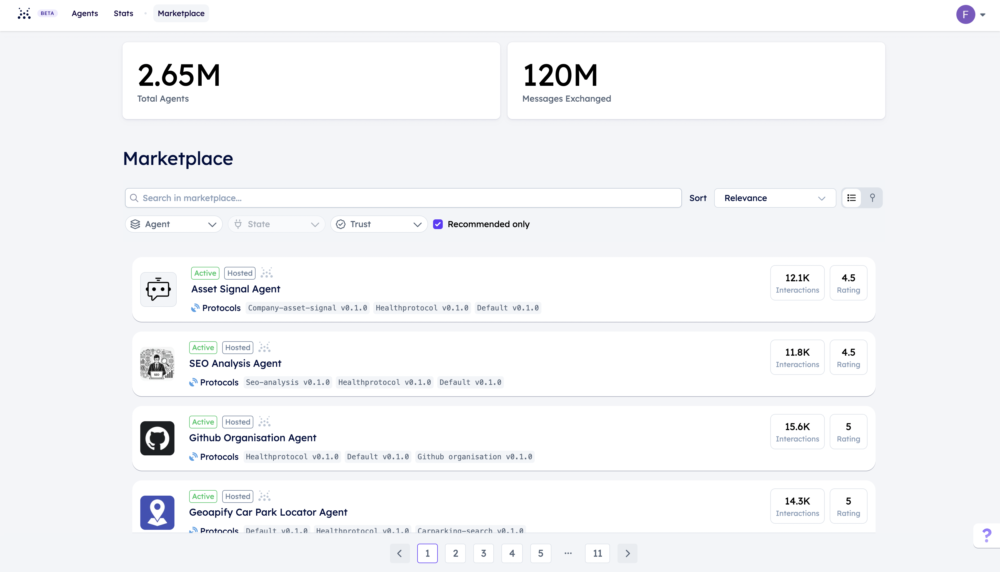

import { ImageByTheme } from "../components/mdx";
import HighLevelDiagram from 'src/images/concepts/about/High-level-system-diagram.png';
import DarkHighLevelDiagram from 'src/images/concepts/about/Dark-high-level-system-diagram.svg';
import AgentsInteracting from 'src/images/concepts/ai-agents/Agents_interacting.png';
import DarkAgentsInteracting from 'src/images/concepts/ai-agents/Dark_agents_interacting.svg';
import DecentralisedNetwork from 'src/images/concepts/ai-agents/decentralised_network.png';
import DarkDecentralisedNetwork from 'src/images/concepts/ai-agents/Dark_decentralised_network.svg';
import { Callout } from 'nextra/components'
import PackageVersion from 'components/package-version'
import AnAgentForEveryone from 'src/images/an-agent-for-everyone.png';
import DarkAnAgentForEveryone from 'src/images/dark-an-agent-for-everyone.svg';
import ScalingHosting from 'src/images/scaling-hosting.png';
import DarkScalingHosting from 'src/images/dark-scaling-hosting.svg';
import HostingNameService1 from 'src/images/hosting-name-service_1.png';
import DarkHostingNameService1 from 'src/images/dark-hosting-name-service_1.svg';
import Mailroom from 'src/images/mailroom.png';
import DarkMailroom from 'src/images/dark-mailroom.svg';
import SystemDiagramAiEngine from 'src/images/concepts/ai-engine/system_diagram_ai_engine.png';
import DarkSystemDiagramAiEngine from 'src/images/concepts/ai-engine/dark_system_diagram_ai_engine.svg';
import AiWithPersonalData from 'src/images/concepts/ai-engine/ai_with_personal_data.png';
import DarkAiWithPersonalData from 'src/images/concepts/ai-engine/dark_ai_with_personal_data.svg';
import HumanTextIn from 'src/images/concepts/ai-engine/human_text_in.png';
import DarkHumanTextIn from 'src/images/concepts/ai-engine/dark_human_text_in.svg';
import HotelTasksGoThroughTheEngineToRepresentativeAgents from 'src/images/concepts/ai-engine/hotel_tasks_go_through_the_engine_to_representative_agents.png';
import DarkHotelTasksGoThroughTheEngineToRepresentativeAgents from 'src/images/concepts/ai-engine/dark_hotel_tasks_go_through_the_engine_to_representative_agents.svg';

## Introducing Fetch.ai: pioneering an AI powered decentralized digital economy

**Fetch.ai** is developing a platform to enable the development of an AI empowered decentralized digital economy. _Agents_ are programs that can make choices on their own for individuals, companies, and devices. Agents are the actors, and the heart of Fetch.ai ecosystem.

Agents are flexible problem solvers, capable of not just completing tasks but also tackling difficult issues across several domains. Agents have the adaptability to handle different activities inside the decentralized economy, whether it's improving supply chain logistics, maintaining solid record-keeping systems, executing computational tasks, or enabling buying and selling interactions. They can even book a hotel room for you.

We couple agents with AI-Engine, the AI system that understands human input and turns that into actionable events empowered by agents in the network. AI-engine is an intelligence system which create dynamic agent workflows. Agentverse offers cheap agent hosting and the Fetch Network  provides an open layer of trust.

This all builds into the agent marketplace, a service that allows AI-Engine and other uAgents the abililty to find your agent, for your economic gain.

Underneath this all is the Fetch.ai ledger, it's a blockchain that facilitates the FET token transactions, and decetralised smart contracts. It's essential for tiny payments that agents may make. Almanac contarct is our deployed smart contract for agent registration, agents must register to this contract to be found by other agents in the network. 

### The Fetch.ai architecture

**Agents**, **Agentverse**, **AI Engine**, and **Fetch network**.

When an agent comes online they register to the Almanac; currently AI-Engine indexes the almanac to find agents as part of it's system. To have your agent be part of the agent marketplace, they need to register their functions to Agentverse so that AI-Engine can index these agents so that they can be called by AI-Engine. The Fetch network offers a layer of truth and trust by inherently being open.

<ImageByTheme
  darkSrc={DarkHighLevelDiagram}
  lightSrc={HighLevelDiagram}
  alt="HightLevel-Diagram"
/>

At a high level, the systems isn't too complicated.

### Getting into Agents

Agents are programs designed to operate freely and communicate with whomever they're programmed to. Agents can connect, search, and transact in order to create dynamic markets, and they can be programmed with logic to interact both within their environment and with other agents in the network. Because they're siloed, and decentralized they can safely accomplish particular activities and objectives without requiring human participation. Our documentation gets your started on building an agent to be part [of the network ↗️](/guides/agents/getting-started/create-a-uagent)

Agents can come together to become multi-agent workflows, single agents which call one another to complete a task.  This can be done natively, or with AI-Engine.

Agents are to us, agents built with the uAgents library, this library defines an open communication layer, for simple messages based communication, and free communication defined by graph. The uAgents library introduces an open source communication protocol specifficaly for agents, any agent from any library.

<ImageByTheme
  darkSrc={DarkAgentsInteracting}
  lightSrc={AgentsInteracting}
  alt="agent-interacting"
/>

Agents are lightweight progarms that can be inserted to existing systems with the ability to simplify the way we see complicated systems. As an example, supply chain management could deploy Agents using the uAgents Framework to improve operations at various stages. Demand forecasting, inventory control, logistics optimization, supplier relationships monitoring, quality control and risk mitigation in all areas can be done with their help. Agents could transform supply chain operations by increasing efficiency, reducing costs, improving accuracy and providing real-time visibility.

<ImageByTheme
  darkSrc={DarkDecentralisedNetwork}
  lightSrc={DecentralisedNetwork}
  alt="decentralised-network"
/>

Agents can wrap and orchestrate LLMs to create personalized agents for any task. With the rise of Large Language Models (LLMs) and AI-related products, autonomous intelligent agents have become the link between these models and tools. They are revolutionizing the way we solve problems, make decisions and collaborate with each other.

### Getting started with Agents development!

Visit the [GitHub repository ↗️](https://github.com/fetchai/uAgents) for more information on the aforementioned topics.
. This will also keep you up-to-date with any update made to the uAgents Framework.

To learn more about how to create and connect Agents technology, check out the resources and guides for the [Agentverse ↗️](/concepts/agent-services/agentverse-intro), [AI Engine ↗️](/concepts/ai-engine/ai-engine-intro), and [DeltaV ↗️](/concepts/deltav/intro)!

    <Callout type="info" emoji="ℹ️">
      If you wish to create AI Engine compatible Agents, you will need to get the `uagents-ai-engine` package installed. Check out the [package ↗️](https://pypi.org/project/uagents/) to download it and start developing your AI Engine compatible Agents.

      Also, do not miss the [Make your agents AI Engine compatible ↗️](/guides/agents/intermediate/ai-engine-compatible-agent) resource to get yourself started!
    </Callout>

## The Agentverse

The Agentverse is an web based platform designed for creating, testing, and deploying customizable Agents. Built by agent developers for agent developers, it offers tools and libraries for building, training, and integrating agents and getting them live on to the network. It is the choice for developers who need third-party management to ensure continuous Agents uptime and real-time code editing capabilities.

The [Agentverse ↗️](https://agentverse.ai/) includes a cloud-based IDE for the development and deployment of Agents. The Agentverse is designed to help you get to grips with Fetch.ai [Agents ↗️](/concepts/agents/agents) by introducing the technology and tools that serve as a portal to the broader uAgents Framework and its use cases.

## Agent marketplace

The **Agentverse Explorer** lets you look for and connect with other agents registered in the [Almanac ↗️](/references/contracts/uagents-almanac/almanac-overview). Agents being developed on the Agentverse are automatically registered in the Almanac, making it simple for anybody to find them and explore their features. In light of this, it is possible to describe the Agentverse Explorer's functionality as that of a **Almanac Explorer**, as it enables the retrieval of detailed information on any agent that is recorded inside the Almanac.

    <Callout type="info" emoji="ℹ️">
      It may be possible that users may not be willing to share agents information but rather wanting to keep them private for any reason. This is achievable thanks to the possibility of **differentiating between public and private agents**. Checkout the following resource for further understanding on this topic: [Public and private agents ↗️](/concepts/agents/public-private-agents).
    </Callout>

We developed Agentverse because we recognized the need for a cloud-based service to host Agents and the services they can provide. Agentverse is a platform that allows users to quickly view, edit and run Agents in real time and this is bolstered by a library of predefined agent code templates that can be copied and edited to deploy agents in just a click.

#### Integration with wallets

Agents have wallets This means that agents can interact with the [Fetch.ai Ledger ↗️](/concepts/fetch-network/ledger/intro) to send and receive transactions, query balances, interact with contracts, and more. We consider integration with the network layer to be fundamental, as it allows transactions to take place, be registered in the blockchain and enable the use of smart contracts.

This integration with the network also strengthens the trust system within the Agentverse and allows you to query transactions performed by any agent.

#### More than a simple search and discovery platform!

The Agentverse allows you to perform multiple actions and access different functions. Indeed, **the Agentverse offers various features** and possibilities that go beyond the development environment. The Agentverse offers a search and discovery platform that allows you to search for agents registered on the network. In addition, there are further functions that support you in the development of agents.

The [Agentverse: Mailroom ↗️](/concepts/agent-services/agent-mail) is very useful for setting up email-like mailboxes for your agents, allowing them to receive messages even when they are offline and retrieve them when the agent is back online. This means that your agents do not need to be online all the time, saving you costs as a developer.

You can also take advantage of the [Agentverse Functions ↗️](/guides/services/services) feature. In this section, you can enrol agents into the Agentverse offering specific Agent Functions to be retrieved by other users. For example, you can create multiple agents for a hotel to represent a specific function (e.g. one agent for reception, one for individual rooms, and so on). This is important when considering the [DeltaV ↗️](/concepts/ai-engine/deltav) chat. **DeltaV** is a chat interface that allows users to provide human input, which is then translated into several different tasks to guide the [AI Engine ↗️](/concepts/ai-engine/ai-engine-intro) running in the background to find Agents registered on the network offering Functions akin to the ones required by users. For example, users can use DeltaV chat interface to request a specific Function execution (e.g. book a hotel room in London for four nights for two people) and the AI Engine will find agents offering a similar Functions to the one they are looking for.

    <Callout type="info" emoji="ℹ️">
      check out the [DeltaV guides ↗️](/guides#deltav) for a better understanding of types of services being retrievable using this tool.
    </Callout>

    <Callout type="info" emoji="ℹ️">
      In this context, it is also possible for you to develop an Agent locally offering some Functions and then register it on the Agentverse and subsequently retrieve it on DeltaV chat interface. Just check our dedicated [guide ↗️](/guides/agents/running-locally) for this.
    </Callout>

### Deploy and run agents

Deploying a new agent is quick and easy. You can have a new running agent deployed in a matter of a few clicks, and with many pre-made examples you can have an active agents doing tasks for you with ease. You can either choose to build an agent from a blank script, by clicking on **+ Agents**, or you can choose to create your agent based on a specified template, by clicking on **+ Use Case**.

    <Callout type="info" emoji="ℹ️">
      You can check out the [Creating an Agentverse hosted agent ↗️](/guides/agentverse/creating-a-hosted-agent) guide to get yourself started with creating an AI agent within the Agentverse.
    </Callout>

The **My Agents** section manages all the important steps about making sure that your agent stays online. With a targeted 100% uptime, your agent will not sleep unless you tell it to. By it being a hosted agent on the Agentverse, the agent will always be kept up-to-date on the [Almanac ↗️](/references/contracts/uagents-almanac/almanac-overview) contract. This latter one also manages your agent private keys for you too, keeping these safe and secure.

### Scaling

Agents deployed on Agentverse scale automatically with the number of messages that your agent receives. The benefit for you is that you do not have to carry the hassle of continuously deploying your agents, or rolling out your own loadbalancer. This means that your agents will continue running and receiving messages without the need of your presence for them to be deployed. Thus, as a developer, you can focus on making the most awesome of agents.

<ImageByTheme
  darkSrc={DarkScalingHosting}
  lightSrc={ScalingHosting}
  alt="scaling-hosting"
/>

### Secure runtime

Agents are built and run in a secure partitioned Python environment. This is important to make sure that your code is safe from malicious attempts to access your information. We also give you the option to subscribe to **ban lists**, in which there are agents seen as bad actors which you can ignore easily!

## Agentverse: Mailroom / IoT Gateway

Agentverse has an additional service that allows you to set up mailboxes for your agents. This mailbox allows you to not have your agents online all the time. This means that your agents can retrieve these messages from the mailroom and take appropriate action when they are back online.

    <Callout type="info" emoji="ℹ️">
      The mailroom is particularly valuable when running a server becomes a challenge and an operator service is required. It manages incoming messages sent by other agents and serves as a trusted intermediary for these messages. This way, you can download the messages later without having to maintain a constantly running server for this purpose
    </Callout>

The mailroom service also enables communication between agents registered in Agentverse and local agents: your local agents can access the APIs in the Agentverse to retrieve the information needed to communicate with the hosted agents registered in the Agentverse platform.

..
..

# AI Engine

## Introduction

The **AI Engine** is a system that combines [Agents ↗️](/concepts/agents/agents) with human-readable text input to create a scalable AI infrastructure that supports Large Language Models (LLMs). It is at the heart of [DeltaV ↗️](/concepts/ai-engine/deltav) and its functionalities. The goal of the AI Engine is to analyze, understand and link human input to agents by facilitating natural language interactions. The AI Engine reads user input, converts it into actionable tasks and selects the most appropriate AI agent registered in the Agentverse to perform the Objective Tasks provided by users.

<ImageByTheme
  darkSrc={DarkSystemDiagramAiEngine}
  lightSrc={SystemDiagramAiEngine}
  alt="system-diagram-ai-engine"
/>

The AI Engine is characterized by a variety of different tasks. It is able to provide answers to complex queries and then carry out various actions, such as making a booking for a hotel. This is achieved through its ability to understand users' preferences and goals through **contextual understanding**. The AI Engine examines trends and turns random inputs into meaningful insights by evaluating previous interactions. When uncertainty comes into play, the AI Engine solicits feedback from the user to verify that its suggestions and recommendations match the user's end goal. In this way, the AI Engine actively anticipates the needs of users and adapts to them. We look forward to creating an ecosystem in which technology becomes an ally in achieving users' goals.

In addition to the AI Engine's ability to understand different contexts, its smart routing ability allows the AI Engine to perform a careful evaluation of the available agents registered in the [Almanac ↗️](/concepts/agent-services/agentverse-intro); taking into account their performance spectrum and past performance data. This ensures that objectives are assigned to agents with the appropriate expertise and Functions.

AI-Engine understands that a request for an action can't always be completed by one agent, and building dynamic multi agent workflows in the background. Enabling agents to solve complex requests as individual actors linked by AI-Engine. 

## DeltaV and the AI Engine: enabling user interactions

DeltaV is a web based chat interface that acts as a link between users and registered agents in the Agentverse. It streamlines connections to these agents and wraps agent functions in a human-readable way, allowing everyone to easily obtain and query for different types of Functionalities. DeltaV is primarily a developer tool to interact with your deployed agents.

The AI Engine is at the heart of DeltaV's functionalities; the AI Engine's aim is to parse, comprehend, and link human input to agents by facilitating natural language interactions. The AI Engine reads user inputs, converts them into actionable objectives, and selects the most suitable Agent registered in the Agentverse for objective task execution.

## Powering connections and smart operations in DeltaV

The AI Engine stands at the core of [DeltaV ↗️](https://deltav.agentverse.ai/login) and its features, as it allows users and developers to connect to a wide range of agent-based [functions ↗️](/guides/agents/intermediate/agent-functions). Once an agent is [registered ↗️](/guides/agentverse/registering-agent-services), the offered Agent Function is visible to the AI Engine and it can start connecting users and Agent functionalities.

<ImageByTheme
  darkSrc={DarkAiWithPersonalData}
  lightSrc={AiWithPersonalData}
  alt="ai-with-personal-data"
/>

This system is equipped with personalized capabilities, supported by an internal agent that performs tasks efficiently. An internal agent is created by the AI Engine and made available for communication via the DeltaV user interface. The AI Engine interprets the human text input provided to the agent and starts working asynchronously on your behalf as soon as it receives your intent. This customized method uses Large Language Models (LLMs), which are essential for improving the AI Engine's understanding, coordination and problem-solving capabilities.

## Establishing connections

The AI Engine introduces users and developers to a unified ecosystem of agent-based Functions. Once an agent and its Functions are registered in the [Agentverse ↗️](/concepts/agent-services/agentverse-intro) and consequently in the [Almanac ↗️](/references/contracts/uagents-almanac/almanac-overview), they become an integral part of the AI Engine landscape and coordinate dynamic connections between users and Functions. For example, if you ask the DeltaV agent what the weather will be like tomorrow at your location, it will connect to a registered agent in the Almanac and receive the latitude and longitude values of your current location. The weather forecast for that day is then retrieved by the chat agent via a connection to another registered agent which specializes in weather-related Agent Functions.

## Objectives, Primary and Secondary Functions

At the heart of the AI Engine, there is an architecture consisting of the following components:

    - **Objectives** are the encapsulation of the user's general goals, communicated in natural language via the DeltaV chat.

    - **Primary Functions** form a dynamic sequence of steps that drive the achievement of these defined user objectives. Primary functions involve complicated processes, including the allocation of resources and dependencies. Primary Functions are expected to fully or partially fulfill an objective provided by users.

    - **Secondary Functions** are Agent Sub-functions providing secondary services that likely need additional context or information to carry out the Primary Function. Secondary Functions are executed in combination with the Objective task. The AI Engine would see that the Agent Primary Function can be fulfilled by executing a Secondary Function, thus, it will contact this latter one which may or may not require gaining context directly from the user.

In this context, a **Primary function** refers to an agent function that provides a specific action or information requested by the user that is directly accessible via DeltaV. In contrast, a **Secondary function** also responds to user requests within DeltaV, but typically provides additional or complementary functions that often rely on a prior context or additional information for their execution. For example, while a Primary function might be an agent that provides the user's current account balance, a Secondary function might involve converting the account balance to a different currency, which requires additional context or user input.

## Deconstructing tasks: context building and smart routing

<ImageByTheme
  darkSrc={DarkHumanTextIn}
  lightSrc={HumanTextIn}
  alt="human-text-in"
/>

Finding new information is a key focus of the AI Engine to significantly improve the user journey. This is crucial for the execution of Agent Functions, such as booking a hotel room for your holiday in a specific city. In an environment where reservations are centralized, this seems like a simple process. However, for the booking to be successful, the AI Engine must be able to understand the user's input and objectives and communicate with multiple agents. At this stage, the AI Engine's ability to understand and plan is very important: the user's goal is broken down into a series of smaller primary and secondary functions, each representing an integral step towards the desired end result. This coordination may be automatic, or in certain situations where the AI Engine is unsure, it may require user input to confirm the function selection.

Context building plays a crucial role, allowing the AI Engine to continuously improve its understanding by transforming data. Context building is an ongoing process within the AI Engine that involves the continuous improvement of the knowledge base during the AI Engine session. In other words, context building is the continuous act of collecting and/or transforming new knowledge to complete a task.

<ImageByTheme
  darkSrc={DarkHotelTasksGoThroughTheEngineToRepresentativeAgents}
  lightSrc={HotelTasksGoThroughTheEngineToRepresentativeAgents}
  alt="hotel-tasks-go-through-the-engine-to-representative-agents"
/>

The final step of the AI Engine is smart routing, that is the ongoing process within the AI Engine that makes it aware of all registered Agents and Agent Function according to the objective for which they are best suited for. This process takes into account the context and past performance history of these agents to guide the AI Engine's decision-making process. In this way, the AI Engine selects the most suitable agents, taking into account the agents' functions and their past performance metrics. Trust becomes a key factor, favoring agents with a track record of reliable behavior. Smart routing not only ensures the completion of objectives, but also creates a sense of reliability and efficiency in the operations.

# Ledger

# The Fetch Network

## Introduction

The **Fetch Network** represents the foundation of the Fetch.ai Ecosystem as it enables the decentralized digital economy driven by [Agents ↗️](/guides/agents/getting-started/whats-an-agent), [AI Engine ↗️](/concepts/ai-engine/ai-engine-intro), [Agentverse ↗️](/concepts/agent-services/agentverse-intro) and [DeltaV ↗️](/concepts/ai-engine/deltav). The Network provides integration with Fetch blockchain technology and ensures security, transparency, and scalability of transactions, and enhanced trust across the overall Ecosystem.

### The Almanac Contract

The [Almanac Contract ↗️](/concepts/fetch-network/almanac) is an important component within the Fetch Network. It connects together Agents, the Agentverse, and the AI Engine by working as decentralized registry and allowing for agents discoverability and coordination. Whenever agents are registered in the Almanac, they become accessible across the entire Fetch Ecosystem, allowing the AI Engine to dynamically locate and engage with them based on users' or agents' requests and queries. This ensures the accurate and reliable execution of objectives, as the Almanac supports the AI Engine in identifying and deploying the most appropriate agents for any given function being requested for execution, amongst all those registered agents in the Agentverse and Fetch Network.

The Almanac facilitates remote communication between agents but also provides a layer of trust and verification, ensuring that accurate and up-to-date information is available at all times for everybody. By maintaining an organized directory of agents and their functions, the Almanac empowers the AI Engine to coordinate complex multi-agent workflows efficiently.

### Fetch Name Service - FNS

The [Fetch Name Service (FNS) ↗️](/guides/agents/advanced/name-service) is another key element providing human-readable names for interacting with Agents and Functions. The FNS simplifies resource identification and makes it easier for developers and users to access agents and functions and thus enhancing overall user accessibility.

### Fetch Ledger and Indexer

The [Fetch Ledger ↗️](/concepts/fetch-network/ledger/intro) is an additional central component of the Fetch Network. It provides a secure, decentralized, and transparent record of all transactions and data exchanges that take place within the Fetch Ecosystem itself. The Ledger uses the [FET token ↗️](/concepts/fetch-network/native-and-erc20-fet-tokens) to facilitate transactions, agent interactions, and smart contracts execution, but it also to ensure that the integrity and efficiency of the Network is maintained.

In order to enhance the Ledger data accessibility, the Fetch Network employs an [Indexer ↗️](/concepts/fetch-network/indexer) which is based on **SubQuery**. The aim of the Indexer is to organize and index the Ledger data and provide a GraphQL API to enable developers to efficiently query and retrieve information for their applications directly from the Fetch Ledger.

### Jenesis

An additional tool is [Jenesis ↗️](/guides/fetch-network/jenesis/getting-started); it simplifies the development and deployment of smart contracts and decentralized applications (i.e., dApps) on the Fetch Network and other CosmWasm-enabled platforms. Jenesis offers a streamlined environment for developers that reduces the complexity of building blockchain-based solutions and accelerates the deployment of decentralized services and applications.

### CosmPy

As a complementary tool to the above ones, [CosmPy ↗️](/guides/fetch-network/cosmpy/install) is a Python-based library that facilitates interactions with Cosmos SDK-based blockchains, including the Fetch Network. CosmPy provides developers with a straightforward way to manage blockchain transactions, write and test smart contracts but also interact with agents; all within the familiar Python environment.

### Conclusions

These components together constitute the backbone structure of the Fetch Network. These tools are essential in enabling a decentralized economy of autonomous Agents and AI-driven Agent Functions. By leveraging the Fetch Ledger, Almanac Contract, FNS, Indexer, Jenesis, and CosmPy, the Fetch Network focuses on creating an environment where agents can autonomously manage tasks, interact with each other, and create value in a secure and scalable way.

The FET token empowers the Fetch Ecosystem, providing the economic incentive and governance framework necessary for the sustainability and evolution of the Network itself. The token acts both as the medium of exchange and the incentive structure for participants, while supporting the Network's governance and staking mechanisms.

# The Almanac

The **Almanac** contract is a critical component within the Fetch.ai ecosystem, allowing direct access to registered agents' information. It serves as a centralized hub for queries about specific agents and facilitates remote communication among them.

Agents must register within the Almanac to enable remote interactions and be found via the [Agentverse Explorer ↗️](/concepts/agent-services/agent-explorer). You can register your Agents on the Almanac by following this [guide ↗️](/guides/agents/register-in-almanac). You can also explore the [Communicating with other agents ↗️](/guides/agents/communicating-with-other-agents) guide to understand how Agents leverage the Almanac to communicate remotely.

Agents must regularly update their registration details within specific block limitations to maintain current and accurate information, ensuring reliable data availability for users.

Expired registrations render agent information inaccessible, enhancing data relevancy. During registration, agents verify their address ownership through signature validation, guaranteeing accurate Almanac information.

    <Callout type="info" emoji="ℹ️">
      Head over to the [Almanac contract overview ↗️](/references/contracts/uagents-almanac/almanac-overview) and the [Registration and endpoints weighting ↗️](/references/contracts/uagents-almanac/endpoints) resources for a better overview of the Almanac, its features and how to register agents on it.
    </Callout>

## Public and private agents: the role of protocols and Almanac

Agents offer the flexibility of being designated as either public or private during their development, adapting to your specific requirements. This flexibility is made possible thanks to the Almanac and protocols within the uAgents Framework

    <Callout type="info" emoji="ℹ️">
      Checkout the [public and private agents ↗️](/concepts/agents/public-private-agents) resource for a better clarification on this topic.
    </Callout>

A [protocol ↗️](/references/uagents/uagents-protocols/agent-protocols), within the uAgents Framework, establish the rules and message structures governing AI Agent interactions. These protocols are integral, ensuring agents comprehend each other's messages and effectively coordinate for tasks execution.

Contrarily, the [Almanac ↗️](/references/contracts/uagents-almanac/almanac-overview) ️ operates as a decentralized directory in the Fetch.ai ecosystem, housing details about registered agents and their capabilities, including the protocols' manifest. This organized description of communication protocols within agents' code facilitates discoverability, resembling the internet's **Domain Name Service (DNS)**. Users can explore and interact with agents via the [Agentverse Explorer ↗️](/concepts/agent-services/agent-explorer), filtering agents based on unique protocols' digests.

    <Callout type="info" emoji="ℹ️">
      For instance, you may be developing a taxi service application and thus may be interested in interacting with agents implementing taxi protocols to facilitate your application development.
    </Callout>

    <Callout type="info" emoji="ℹ️">
      For additional information on the Agentverse and its tools, visit our dedicated [concepts ↗️](/concepts/agent-services/agentverse-intro) and [guides ↗️](/guides#agentverse) resources to start developing your Agents straightforwardly using the Agentverse **Agent Editor**.
    </Callout>

# Indexer / Ledger SubQuery

##  Overview

The **ledger-subquery** is a [SubQuery-based ↗️](https://www.subquery.network/) indexer for the [Fetch ledger ↗️](/concepts/fetch-network/ledger/intro). An indexer is a tool which allows to create a structured list of data items (i.e., an index) that allows to quickly search and retrieve information. In this context, the ledger-subquery acts as an indexer specifically designed to optimize data accessibility by providing a [Graphql ↗️](https://www.subquery.network/) API for querying tracked entities within the Fetch ledger. This enables direct and efficient retrieval of data, simplifying the process for developers who need to access information from the ledger.

A detailed list of tracked entities is accessible via the [schema.graphql file ↗️](https://github.com/fetchai/ledger-subquery/blob/main/schema.graphql).

    <Callout type="info" emoji="ℹ️">
      You can learn more on how to [run ↗️](https://academy.subquery.network/run_publish/run.html) or [change the SubQuery Project ↗️](https://academy.subquery.network/quickstart/quickstart_chains/cosmos.html), get your own custom GraphQL API for your app, by [visiting the SubQuery Academy ↗️](https://academy.subquery.network/) for further documentation.
    </Callout>

    <Callout type="info" emoji="ℹ️">
      Check out the [GitHub repository ↗️](https://github.com/fetchai/ledger-subquery) or head over to the [Indexer references ↗️](/references#indexer) for additional information.
    </Callout>

## Architecture: Components Diagram

The ledger-subquery architecture comprises several key components that work together to provide a GraphQL API for querying data from the Fetch ledger, enabling efficient data retrieval and interaction with the Fetch ledger.

Here, we outline the components and their relationships:

### Key Components

The system architecture core is the **SubQuery Node** and showcases a GraphQL-based interface for client interactions and a  backend for data management and storage.

The entry point for users to interact with the system is the **Public GraphQL Endpoint** through which they can submit GraphQL queries. The **Apollo Server** receives the GraphQL query and processes it based on the GraphQL schema generated by **Postgraphile**. This latter one acts as a translator between the structure of the PostgreSQL database (i.e., **PostgresDB**) and the GraphQL query language. It automatically generates a GraphQL schema based on the structure of the database which allows to efficiently query and manipulate data through the GraphQL interface. In few words, it simplifies the process of exposing the PostgresDB data as GraphQL APIs.

The data retrieval process starts when the **SubQuery Node** receives the GraphQL query from the Apollo Server. Based on the query, the **Indexer Manager** and **Fetch service** work together within the SubQuery Node to efficiently retrieve and process the data. The **Indexer Manager** oversees the management of various indexers selecting the most suitable ones based on the incoming GraphQL query and coordinates their activities. Once the Indexer Manager identifies the required indexers, the **Fetch service** retrieves data from the specified sources to fetch the requested information (e.g., **Fetch Ledger Node**) thanks to the **public RPC endpoint** which works as the gateway to external data. Once the data is fetched, it is returned to the Indexer Manager for further processing and storage.

The received data is the processed by the Indexer Manager and it is then stored by the **Store Service** in the PostgresDB. Indeed, the Store Service acts acts as the bridge between this two components by storing and retrieving data based on requests from the Indexer Manager.

Once a query from the GraphQL API is received, the data requested is retrieved by the Store Service, which in turn fetches it from the PostgresDB through the **Private DB Connection**. By isolating the database interaction with this private connection, the system enhances security, performance, and reliability. The data is then formatted into a structure that aligns with the original GraphQL query by the SubQuery Node prepares this data in a format suitable for the GraphQL API to process and return it to the client. The data is then sent back to the Apollo Server. This last component takes in this data, combines it with the information from the GraphQL query, and constructs the final GraphQL response which is finally transmitted back to the client who initiated the query.

This architecture enables efficient data retrieval and querying, providing a powerful tool for developers to interact with the Fetch ledger.

