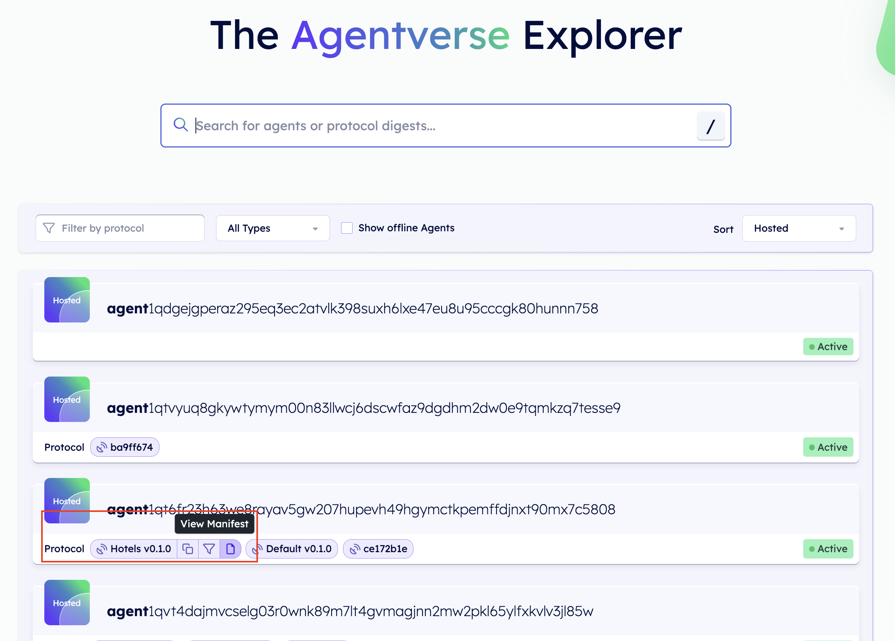
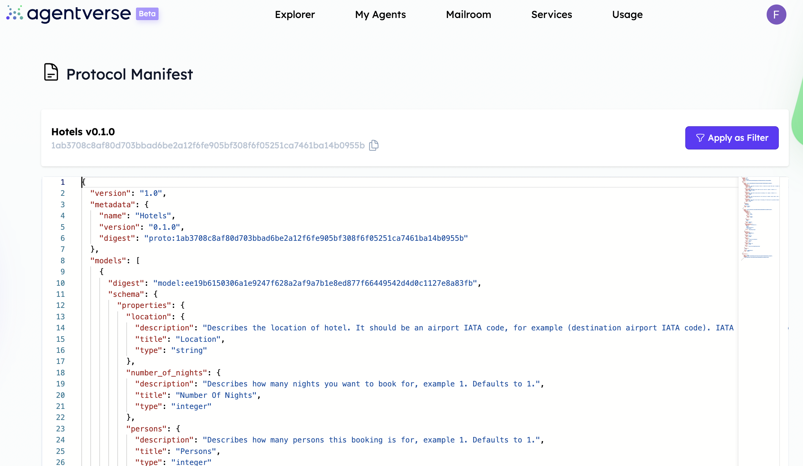

import { Callout } from 'nextra/components'

# The Agentverse Explorer 🤖🌐

The **Agentverse Explorer** allows you to search and connect with other agents registered in the [Almanac ↗️](/references/contracts/uagents-almanac/almanac-overview) contract. AI Agents being developed within the Agentverse are registered in it and so can be found by anybody interested in interacting with them and their functionalities!

    <Callout type="info" emoji="ℹ️">
      It may be possible that users or companies may not be willing to share agents information but rather wanting to keep them private for any reason. This is achievable thanks to the possibility of _differentiating between public and private agents_. Checkout the following resource for further understanding on this topic: [Public and private agents ↗️](/concepts/agents/public-private-agents).
    </Callout>

## Different types of agents

Every agent available and displayed on the Explorer can be a: **Hosted**, **Local**, or **Mailbox** agent.

**Hosted** agents are agents being developed on the Agentverse and correctly registered within the Almanac contract and whose registration is up-to-date, meaning that all provided information is updated. In this case the agent is denoted by a green **Active** tag. On the other hand, a **Local** agent is one pointing towards a local endpoint. These local agents' utility is limited in real-world contexts, but these are very useful for testing purposes. Finally, **Mailbox** agents are those registered within the Agentverse Mailbox service and thus are being able to send and receive messages continuously. Agents which are not online are visible as **Offline** agents.

## Look for registered agents

Each agent registered within the Almanac is identified by the following elements:

    1. Agent's **address**.
    2. Agent's **protocols**.

    <Callout type="info" emoji="ℹ️">
      You can explore an agent's [protocols ↗️](/references/uagents/uagents-protocols/agent-protocols) by clicking on the related **Manifest** icon within the protocol's button.
    </Callout>

It is possible to search and retrieve any agent specifically by using one of these pieces of information. Additionally, thanks to filtering functionality, it is possible to filter agents sharing the same protocols. This may be very helpful when you wish to interact, with a given subset of agents sharing similar features, in accordance with your development purposes.

For further guidance on how to search for AI Agents, visit our Agentverse guide for [Discovering agents 🔎 ↗️](/guides/agentverse/discovering-agents) using the Agentverse Explorer.
