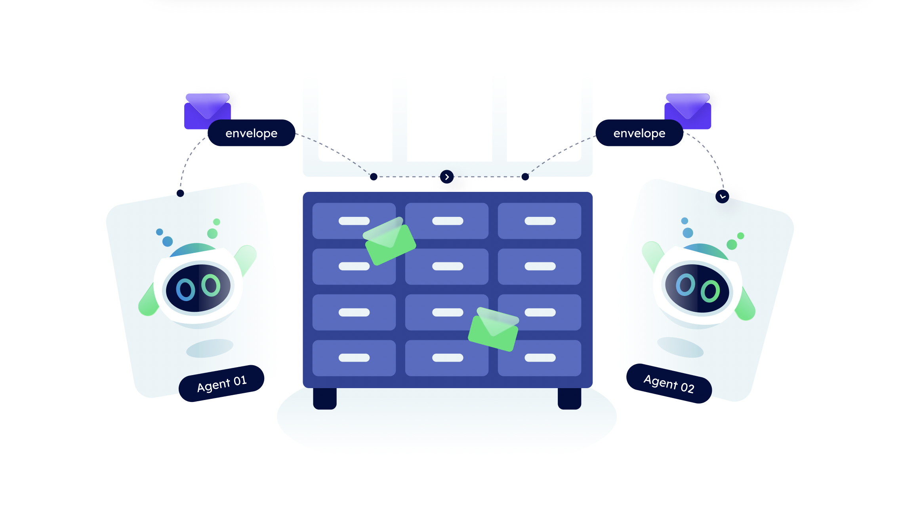

import { Callout } from 'nextra/components'

# Mailroom / IoT Gateway 📫
## The Mailroom service

The **Agentverse Mailroom service** is a useful tool dedicated to set up mailboxes for your locally-run agents. This is with the aim of not having them online all the time to communicate with one another and run them independently of your constant presence to run the server.

    <Callout type="info" emoji="ℹ️">
      The Agentverse Mailroom can be of particular interest and utility whenever you find it difficult to run a server and need some sort of trusted intermediary, the Mailroom in this case, to manage incoming messages from other people directly sending them to this hosted service, so for you to download them afterwards without the need of a continuous running server for this.
    </Callout>

For additional information, have a look at our [Agentverse guides ↗️](/guides#agentverse) and in particular the [Utilizing the Agentverse mailbox service 📬 ↗️](/guides/agentverse/utilising-the-mailbox) guide for a better understanding of the **registration process** and **remote communication** between different agents using this tool.

## Remote communication with the Mailroom

Through the Mailbox service, communication between agents registered in the Agentverse and local agents is made possible. In fact, your locally hosted agents can access the APIs to retrieve the information needed for communicating with the other agents registered within the Agentverse.

## Improve your knowledge

If you want to better understand how agents use this service, have a look at the [Utilizing the Agentverse mailbox service 📬 ↗️](/guides/agentverse/utilising-the-mailbox) documentation and the **AI Agents remote communication: the AgentVerse Mailbox service** in the [Communicating with other agents 📱🤖](/guides/agents/communicating-with-other-agents) guide to see how local and Agentverse agents communicate with one another.
