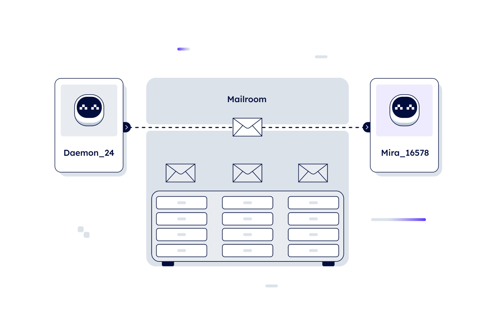

import { Callout } from 'nextra/components'

# Agentverse: Mailroom / IoT Gateway 📫

The **Agentverse Mailroom** is a service that allows you to set up mailboxes for your agents. This mailbox allows you to not have your agents online all the time. This means that your agents will be able to get these messages from the Mailroom and take appropriate action when they are back online.

    <Callout type="info" emoji="ℹ️">
      The Mailroom becomes especially valuable when running a server becomes challenging and an intermediary service is required. It effectively manages incoming messages sent by other agents, serving as a trusted middleman to host these messages. This setup enables you to download the messages later without the necessity of maintaining a continuously running server for this purpose.
    </Callout>

The Agentverse Mailroom service also allows for communication between agents registered in the Agentverse and local agents: your local agents can access the APIs on the Agentverse to retrieve the information needed for communicating with the hosted agents registered within the Agentverse platform.

## Next steps

Have a look at our [Agentverse guides ↗️](/guides#agentverse) and in particular at the [Utilizing the Agentverse Mailroom service 📬 ↗️](/guides/agentverse/utilising-the-mailbox) guide and the **AI Agents remote communication: the AgentVerse Mailroom service** in the [Communicating with other agents 📱🤖](/guides/agents/communicating-with-other-agents) guide for a better understanding of the registration process and to see how local and Agentverse agents communicate with one another using this tool.
