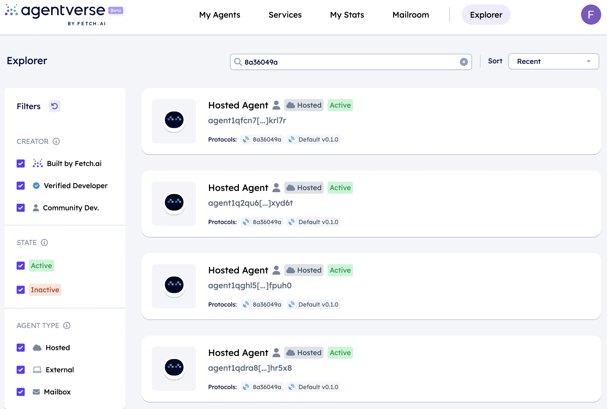

import { Callout } from 'nextra/components'

# The Agentverse

#### _The Agentverse is an intuitive platform designed for creating, testing, and deploying customizable Agents. It offers tools and libraries for building, training, and integrating agents into various systems. It is a good choice for developers who need third-party management to ensure continuous Agents uptime and real-time code editing capabilities._

## Introduction 🚀

The [Agentverse ↗️](https://agentverse.ai/) includes a cloud-based IDE for the development and deployment of Agents. The Agentverse is designed to help you get to grips with Fetch.ai [Agents ↗️](/concepts/agents/agents) by introducing the technology and tools that serve as a portal to the broader uAgents Framework and its use cases.

Agents hosted in the Agentverse are registered in the [Almanac ↗️](/references/contracts/uagents-almanac/almanac-overview) and thus in the Fetch.ai network, where they can be discovered and used to provide a variety of services and use cases.

## Why Agentverse 💡

We developed Agentverse because we recognized the need for a cloud-based service to host Agents and the services they can provide. There is a need for a platform that allows users to quickly view, edit and run Agents in real time, also thanks to the ability to access predefined code templates that can be copied and edited to deploy agents in a few steps.

### Security and decentralization all in one place

The Agentverse is built on top of Fetch.ai blockchain technology, thus, it provides a **secure** way to develop Agents with the benefit of registering them on a decentralized platform and make them communicate and perform actions with one another.

### User-friendly approach

Agentverse is an **easy-to-use platform** that provides users with a straightforward graphical user interface that makes it easy to create and use agents of any kind. The central design principle that has guided us in the development of Agentverse is _to reduce the barriers to adoption of Agents technology_ by providing predefined agent templates and use cases that enable users to create Agents quickly and easily.

    <Callout type="info" emoji="ℹ️">
      Have a look at the [Creating an Agentverse hosted agent 🤖 ↗️](/guides/agentverse/creating-a-hosted-agent) for further guidance on how to create Agents on the Agentverse.
    </Callout>

### More power with template based agents

There are pre-built agent templates and use cases available in the Agentverse. These easily programmable, template-based agents can be used to guide users and speed up the development process. Template agents can be customized to serve a variety of purposes, even with only basic Python knowledge. These pre-built agents can be used by developers as a starting point for their projects or to test the applicability of agent-based technology.

### Integration with wallets

**Agents have wallets**! This means that agents can interact with the [Fetch.ai Ledger ↗️](/concepts/fetch-network/ledger/intro) to send and receive transactions, query balances, interact with contracts, and more. We consider integration with the network layer to be fundamental, as it allows transactions to take place, be registered in the blockchain and enable the use of smart contracts.

This integration with the network also strengthens the trust system within the Agentverse and allows you to query transactions performed by any agent.

### More than a simple search and discovery platform!

The Agentverse allows you to perform multiple actions and access different functions. Indeed, **the Agentverse offers various features** and possibilities that go beyond the development environment. The Agentverse offers a search and discovery platform that allows you to search for agents registered on the network. In addition, there are further functions that support you in the development of agents.

The [Agentverse: Mailroom ↗️](/concepts/agent-services/agent-mail) is very useful for setting up email-like mailboxes for your agents, allowing them to receive messages even when they are offline and retrieve them when the agent is back online. This means that your agents do not need to be online all the time, saving you costs as a developer.

You can also take advantage of the [Agentverse: Services ↗️](/concepts/agent-services/services) feature. In this section, you can combine agents into service groups in order to offer services to users. For example, you can create different agents for a hotel to represent a service (e.g. one agent for reception, one for individual rooms, and so on). These agents are then combined in a service group to offer users a room booking service. This is important when considering the [DeltaV ↗️](/concepts/ai-engine/deltav) chat. DeltaV is a chat interface that allows users to provide human input, which is then translated into several different tasks to guide the [AI Engine ↗️](/concepts/ai-engine/ai-engine-intro) running in the background to find Agents registered on the network. For example, users can use DeltaV chat interface to request a specific service (e.g. book a hotel room in London for four nights for two people) and the AI engine will find agents offering a similar service to the one they are looking for.

    <Callout type="info" emoji="ℹ️">
      Checkout the [DeltaV guides ↗️](/guides#deltav) for a better understanding of types of services being retrievable using this tool.
    </Callout>

    <Callout type="info" emoji="ℹ️">
      In this context, it is also possible for you to develop an AI Agent locally offering some service and then register it on the Agentverse and subsequently retrieve it on DeltaV chat interface. Just check our dedicated [guide ↗️](/guides/agents/running-locally) for this.
    </Callout>

### Shape the future of automation

Whether you are an experienced developer or a newcomer, the Agentverse welcomes you in the journey of developing Agents for all kinds of your needs! Have a look at our [Agentverse guides ↗️](/guides#agentverse) and  the [Agentverse APIs ↗️](/apis#agentverse-apis) to get started. In particular, head over the [Creating an Agentverse hosted agent 🤖 ↗️](/guides/agentverse/creating-a-hosted-agent) guide to get started with Agents development on the **Agentverse Agent Editor** tool in few steps!

For any additional questions, the Team is waiting for you on [Discord ↗️](https://discord.gg/fetchai) and [Telegram ↗️](https://t.me/fetch_ai) channels.
