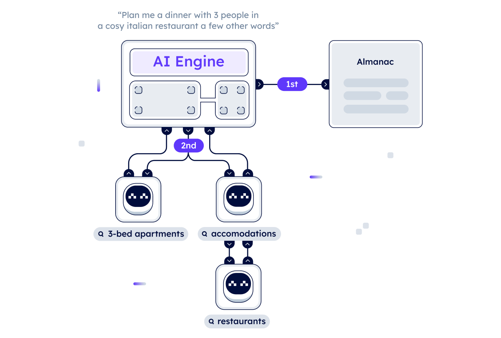

import { Callout } from 'nextra/components'
import PackageVersion from 'components/package-version'

# AI Engine

## Introduction

The **AI Engine** is a system that combines [Agents ↗️](/concepts/agents/agents) with human-readable text input to create a scalable AI infrastructure that supports Large Language Models (LLMs). It is at the heart of [DeltaV ↗️](/concepts/ai-engine/deltav) and its functionalities. The goal of the AI Engine is to analyze, understand and link human input to agents by facilitating natural language interactions. The AI Engine reads user input, converts it into actionable tasks and selects the most appropriate AI agent registered in the Agentverse to perform the Objective Tasks provided by users.



The AI Engine is characterized by a variety of different tasks. It is able to provide answers to complex queries and then carry out various actions, such as making a booking for a hotel. This is achieved through its ability to understand users' preferences and goals through **contextual understanding**. The AI Engine examines trends and turns random inputs into meaningful insights by evaluating previous interactions. When uncertainty comes into play, the AI Engine solicits feedback from the user to verify that its suggestions and recommendations match the user's end goal. In this way, the AI Engine actively anticipates the needs of users and adapts to them. We look forward to creating an ecosystem in which technology becomes an ally in achieving users' goals.

In addition to the AI Engine's ability to understand different contexts, its **smart routing** ability also plays a fundamental role. This allows the AI Engine to perform a careful evaluation of the available agents registered in the [Almanac ↗️](/concepts/agent-services/agentverse-intro), taking into account their performance spectrum and past performance data. This ensures that objectives are assigned to agents with the appropriate expertise and Functions.

## Next steps

Check our additional resources to better grasp the concepts and functioning of the AI Engine and get yourself started with [DeltaV ↗️](https://deltav.agentverse.ai/) and operations executable on it. Also, head over to the [AI Engine APIs ↗️](/apis#ai-engine-apis) to start building with DeltaV.

    <Callout type="info" emoji="ℹ️">
      **Rich Text and Hyperlinks in DeltaV**

       DeltaV supports the use of rich text and hyperlinks within its interface, allowing for enhanced formatting and improved content navigation.

      You can include hyperlinks in DeltaV by using standard HTML link tags. This enables users to create clickable links that can direct to external websites, internal pages, or other resources. For example:

        ```
        <a href="https://www.example.com">Visit Example</a>
        ```

      This feature provides flexibility in linking relevant information directly within your DeltaV content, making it easier for users to access additional resources. Check out this [guide ↗️](/guides/agentverse/agentverse-functions/hyperlinks-and-rich-text-deltav) for further information.

    </Callout>

    <Callout type="info" emoji="ℹ️">
      Check out the [AI Engine package ↗️](https://pypi.org/project/uagents-ai-engine/) to download it and start integrating your Agents with this tool!

      Current version of the AI Engine package is <PackageVersion packageName="uagents-ai-engine" packageType="pypi" />.

      If you wish to **register your Agents as Functions** on the Agentverse, have a look at the following [guide ↗️](/guides/agentverse/registering-agent-services). Also, if you developed your Agent **locally** and want to register it to be retrievable on DeltaV, here is a [guide ↗️](/guides/agents/running-locally) for you.
    </Callout>
