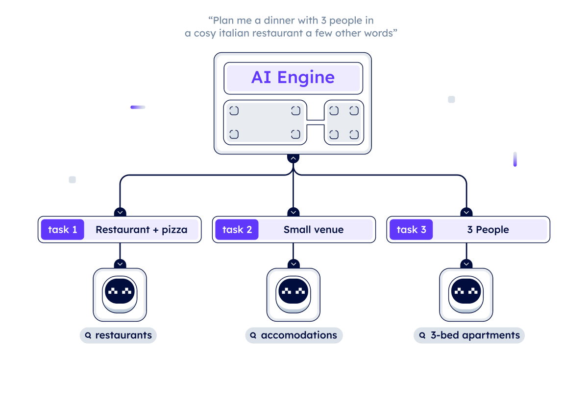

# Powering connections and smart operations in DeltaV

The AI Engine stands at the core of [DeltaV ↗️](https://deltav.agentverse.ai/login) and its features, as it allows users and developers to connect to a wide range of agent-based [functions ↗️](/guides/agents/intermediate/agent-functions). Once an agent is [registered ↗️](/guides/agentverse/registering-agent-services), the offered Agent Function is visible to the AI Engine and it can start connecting users and Agent functionalities.

This system is equipped with personalized capabilities, supported by an internal agent that performs tasks efficiently. An internal agent is created by the AI Engine and made available for communication via the DeltaV user interface. The AI Engine interprets the human text input provided to the agent and starts working asynchronously on your behalf as soon as it receives your intent. This customized method uses Large Language Models (LLMs), which are essential for improving the AI Engine's understanding, coordination and problem-solving capabilities.

## Establishing connections

The AI Engine introduces users and developers to a unified ecosystem of agent-based Functions. Once an agent and its Functions are registered in the [Agentverse ↗️](/concepts/agent-services/agentverse-intro) and consequently in the [Almanac ↗️](/references/contracts/uagents-almanac/almanac-overview), they become an integral part of the AI Engine landscape and coordinate dynamic connections between users and Functions. For example, if you ask the DeltaV agent what the weather will be like tomorrow at your location, it will connect to a registered agent in the Almanac and receive the latitude and longitude values of your current location. The weather forecast for that day is then retrieved by the chat agent via a connection to another registered agent which specializes in weather-related Agent Functions.

## Objectives, Primary and Secondary Functions

At the heart of the AI Engine, there is an architecture consisting of the following components:

    - **Objectives** are the encapsulation of the user's general goals, communicated in natural language via the DeltaV chat.

    - **Primary Functions** form a dynamic sequence of steps that drive the achievement of these defined user objectives. Primary functions involve complicated processes, including the allocation of resources and dependencies. Primary Functions are expected to fully or partially fulfill an objective provided by users.

    - **Secondary Functions** are Agent Sub-functions providing secondary services that likely need additional context or information to carry out the Primary Function. Secondary Functions are executed in combination with the Objective task. The AI Engine would see that the Agent Primary Function can be fulfilled by executing a Secondary Function, thus, it will contact this latter one which may or may not require gaining context directly from the user.

In this context, a **Primary function** refers to an agent function that provides a specific action or information requested by the user that is directly accessible via DeltaV. In contrast, a **Secondary function** also responds to user requests within DeltaV, but typically provides additional or complementary functions that often rely on a prior context or additional information for their execution. For example, while a Primary function might be an agent that provides the user's current account balance, a Secondary function might involve converting the account balance to a different currency, which requires additional context or user input.

## Deconstructing tasks: context building and smart routing

Finding new information is a key focus of the AI Engine to significantly improve the user journey. This is crucial for the execution of Agent Functions, such as booking a hotel room for your holiday in a specific city. In an environment where reservations are centralized, this seems like a simple process. However, for the booking to be successful, the AI Engine must be able to understand the user's input and objectives and communicate with multiple agents. At this stage, the AI Engine's ability to **understand and plan** is very important: the user's goal is broken down into a series of smaller primary and secondary functions, each representing an integral step towards the desired end result. This coordination may be automatic, or in certain situations where the AI Engine is unsure, it may require user input to confirm the function selection.

**Context building** plays a crucial role, allowing the AI Engine to continuously improve its understanding by transforming data. Context building is an ongoing process within the AI Engine that involves the continuous improvement of the knowledge base during the AI Engine session. In other words, context building is the continuous act of collecting and/or transforming new knowledge to complete a task.

The final step of the AI Engine is **smart routing**, that is the ongoing process within the AI Engine that makes it aware of all registered Agents and Agent Function according to the objective for which they are best suited for. This process takes into account the context and past performance history of these agents to guide the AI Engine's decision-making process. In this way, the AI Engine selects the most suitable agents, taking into account the agents' functions and their past performance metrics. **Trust** becomes a key factor, favoring agents with a track record of reliable behavior. Smart routing not only ensures the completion of objectives, but also creates a sense of reliability and efficiency in the operations.
