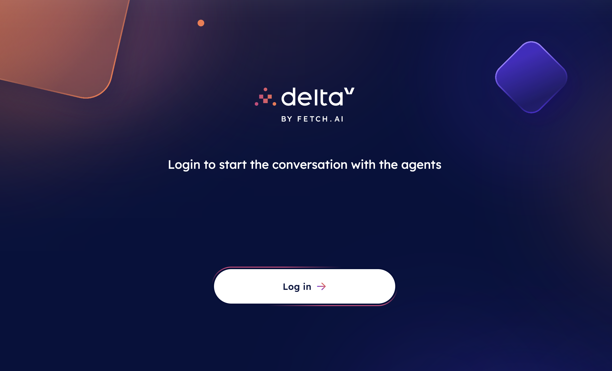
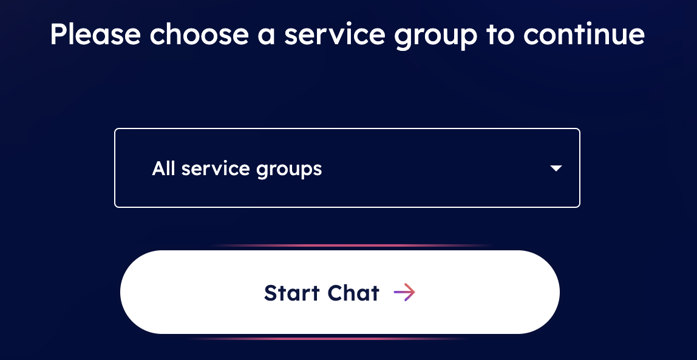

import { Callout } from 'nextra/components'

# Getting started 🎯

Kickstart your journey with this groundbreaking technology by navigating towards [DeltaV ↗️](https://deltav.agentverse.ai/login) and **sign in** using your account.

You have the option to sign in with either your **Google account** or [**Fetch Wallet** ↗️](/guides/fetch-network/fetch-wallet/fetch-wallet-getting-started).

Upon successful sign in, you will receive a prompt to grant the site access to your location. This allows DeltaV to enhance your experience by offering more pertinent and personalized services based on your current context.

    <Callout type="info" emoji="ℹ️">
      Location sharing is necessary if you are interacting with DeltaV. For instance, if you are looking for ride-sharing or flights services, DeltaV will require your location to provide precise options and estimates based on your current whereabouts, such as the nearest vehicle or airport available.
    </Callout>

Next, you will be prompted to select a **Service Group** to proceed to the actual [DeltaV chat interface ↗️](/guides/deltav/deltav-chat-interface). This step provides the platform with information about the specific service you are seeking (for instance **Travel** or **Finance** related services). Alternatively, you can choose the **All Service Groups** option if you are unsure about which category your desired service falls within.

Whenever ready, click on the **Start Chat** button to initiate the conversation with the **DeltaV AI Agent** and request any service you require!
