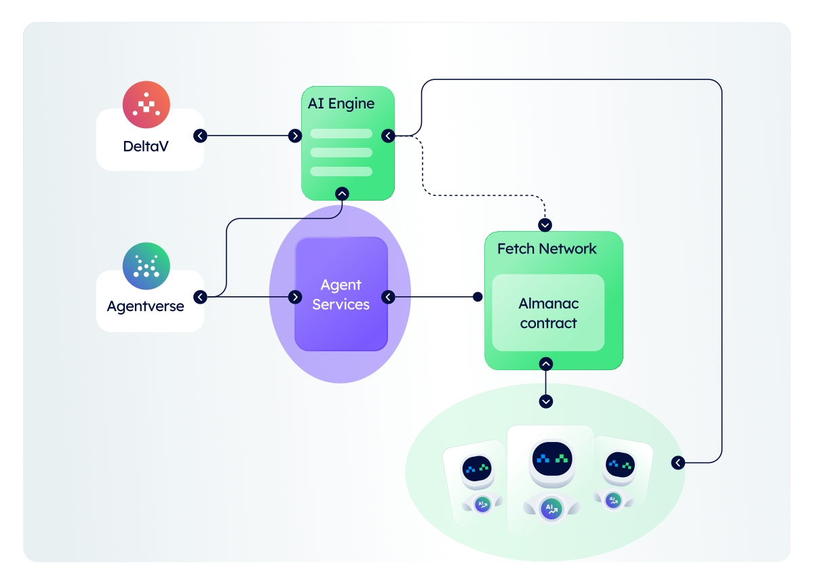

# Introducing Fetch.ai: pioneering an AI powered decentralized digital economy

**Fetch.ai** is developing a platform to help the development of an AI enabled decentralized digital economy. _AI Agents_ are programs that can make choices on their own for individuals, companies, and devices. Agents are the actors, and the heart of Fetch.ai ecosystem.

Agents are flexible problem solvers, capable of not just completing tasks but also tackling difficult issues across several domains. Agents have the adaptability to handle different activities inside the decentralized economy, whether it's improving supply chain logistics, maintaining solid record-keeping systems, executing computational tasks, or enabling buying and selling interactions.

Fetch.ai places a high priority on **accessibility**. Agent technology is designed to be inclusive, allowing anybody to create an AI Agent. Agents are made possible with the Fetch.ai platform.

### The architecture

Fetch.ai is made up of four key layers: **AI Agents**, **Agentverse**, **AI Engine**, and **Fetch network**.

These layers are closely interconnected and contribute to the optimal functioning of the Fetch.ai ecosystem and its apps.

### AI Agents: the core

**AI Agents** are programs designed to operate freely in a decentralized landscape. AI Agents can connect, search, and transact in order to create dynamic markets, and they can be programmed with logic to interact both within their environment and with other agents in the network. Because of they're silod, and decentralized; they can safely accomplish particular activities and objectives without requiring human participation.

### The Agentverse: your gateway to AI Agents

The **Agentverse** is a Software as a Service (SaaS) platform built primarily for the creation and registration of AI Agents solutions. This platform enables the smooth deployment and management of agents, as well as their development and registration. This is an easy approach for managing and hosting your agents all in one place.

The Agentverse provides multiple use cases ranging from simple "Hello World" to AI-driven recommendation systems. These use cases are only a click away from being edited, tweaked, and deployed for yourself.

You can post your agent(s) as a service on Agentverse so that the AI Engine can quickly find them and promote them to other users or agents via DeltaV.

### DeltaV and the AI Engine: enabling user interactions

**DeltaV** is a chat interface that acts as a link between users and registered agents in the Agentverse. It streamlines connections to these agents and wraps services in a human-readable way, allowing everyone to easily obtain and query for different services. DeltaV is primarily a developer tool to interact with your deployed agents.

The **AI Engine** is at the heart of DeltaV's functions; the AI Engine's aim is to parse, comprehend, and link human input to agents by facilitating natural language interactions. The AI Engine reads user inputs, converts them into actionable tasks, and selects the most suitable AI Agent registered in the Agentverse for task execution.

### The Fetch.ai network: the foundations

The **Fetch.ai network** serves as the foundation of Fetch.ai's entire ecosystem, underpinning and empowering the functionalities of AI Agents, the Agentverse, DeltaV, and the AI Engine. This is the structural framework that enables the decentralized digital economy envisioned by Fetch.ai.

The Fetch.ai network comprises multiple essential elements including the _Almanac contract_, the _Fetch Name Service_, the _Fetch ledger_, and the _FET Token_. The tools constituting the network are essential for the correct development of your ideas and solutions and to make them discoverable to a greater audience of users.

At the heart of the Fetch.ai network lies the **Almanac contract**. It operates as a comprehensive repository, storing critical information about AI Agents, and it is crucial for the execution of various functionalities. The Almanac is a point of truth and a place to search for all registered agents. This contract enables the smooth exchange of data and ensures the efficient functioning of AI Agents within the Fetch.ai ecosystem.

The **Fetch Name Service** works as a decentralized naming system which simplifies resource identification within the network. This service offers human-readable naming conventions and facilitates easy access and interaction with decentralized services and AI Agents.

The backbone of Fetch.ai decentralized infrastructure is represented by the **Fetch ledger**. It acts as a secure and immutable record-keeping system and provides a transparent record of transactions, fostering trust and reliability across the network. The Fetch ledger supports the decentralized economy, ensuring secure data sharing and transactional integrity.

The overall system we depicted runs on a specific fuel: **FET tokens**. These tokens hold intrinsic value and utility, drive transactions, promote active participation, and empower various decentralized services within the Fetch network. FET serves as a medium of exchange and facilitates interactions among users, AI Agents, and services within the Fetch ecosystem.

### Next steps

The foundational structure set by the Fetch network serves as a launchpad for the creation, cooperation, and integration of the many tools and technologies available inside the Fetch.ai ecosystem. The integration of the Fetch.ai network with AI Agents, the Agentverse, and DeltaV propels the Fetch.ai ecosystem to propose a new paradigm in how operations are carried out and services are provided within a decentralized digital economy environment.

This way, Fetch.ai presents a shift towards a future where the benefits of AI and technology are available to everybody!

For a deeper dive into Fetch.ai's concepts, tools, and components building up this vision, have a look at the following resources:

    - [AI Agents ↗️](/concepts/agents/agents)
    - [The AI Engine ↗️](/concepts/ai-engine/ai-engine-intro)
    - [The Agentverse ↗️](/concepts/agent-services/agentverse-intro)
    - [DeltaV ↗️](/concepts/deltav/intro)
    - [Fetch network ↗️](/concepts#fetch-network)
