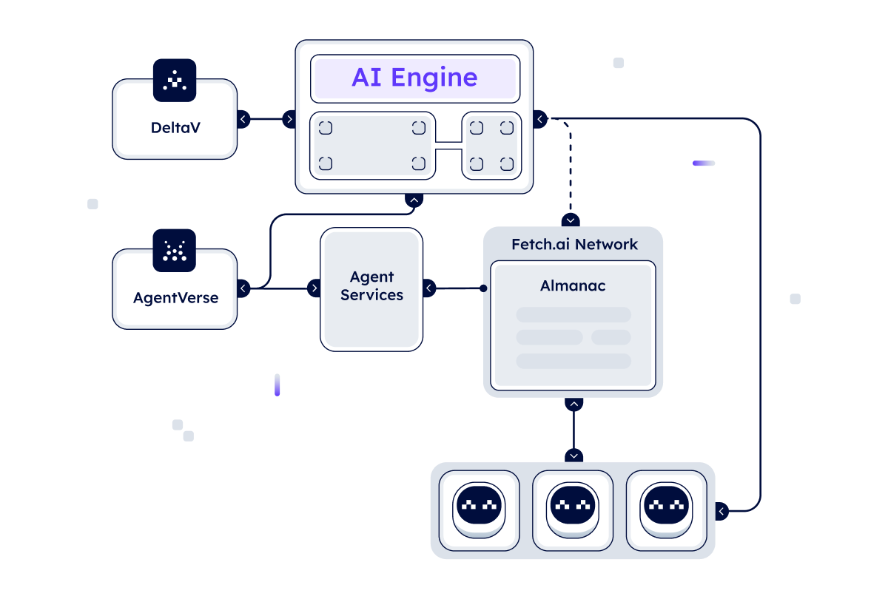

# Introducing Fetch.ai: pioneering an AI powered decentralized digital economy

**Fetch.ai** is developing a platform to enable the development of an AI empowered decentralized digital economy. _Agents_ are programs that can make choices on their own for individuals, companies, and devices. Agents are the actors, and the heart of Fetch.ai ecosystem.

Agents are flexible problem solvers, capable of not just completing tasks but also tackling difficult issues across several domains. Agents have the adaptability to handle different activities inside the decentralized economy, whether it's improving supply chain logistics, maintaining solid record-keeping systems, executing computational tasks, or enabling buying and selling interactions. They might even book a hotel room for you.

We couple agents with AI-Engine, the AI system that understands human input and turns that into actionable events empowered by agents in the network. AI-engine is an intelligence system which create dynamic agent workflows. Agentverse offers cheap agent hosting and the Fetch Network  provides an open layer of trust.

These services make up the core architecture of Fetch.ai

### The architecture

**Agents**, **Agentverse**, **AI Engine**, and **Fetch network**.

Agents register to Almanac so that they can be discovered in the network by other agents. Agents may register their functions to Agentverse so that AI-Engine can index these agents so that they can be called by AI-Engine. The Fetch network offers a layer of truth and trust by inherently being open.

### Agents: the core

**Agents** are programs designed to operate freely and communicate with whomever they're programmed to. Agents can connect, search, and transact in order to create dynamic markets, and they can be programmed with logic to interact both within their environment and with other agents in the network. Because they're siloed, and decentralized they can safely accomplish particular activities and objectives without requiring human participation. Our documentation gets your started on building an agent to be part [of the network ↗️](/guides/agents/getting-started/create-a-uagent)

Agents can come together to become multi-agent workflows, single agents which call one another to complete a task.  This can be done natively, or with AI-Engine.

Agents are built with the  **uAgents Framework**, a lightweight library designed to facilitate the development of decentralized **Agents**. At the uAgents core is an open sourced communication protocol for agents.

Agents can fundamentally change the way we see complicated systems. For example, supply chain management could deploy Agents using the uAgents Framework to improve operations at various stages. Demand forecasting, inventory control, logistics optimization, supplier relationships monitoring, quality control and risk mitigation in all areas can be done with their help. Agents could transform supply chain operations by increasing efficiency, reducing costs, improving accuracy and providing real-time visibility.

These agents are the building blocks that allow developers to gain access to the tools and resources provided by the uAgents Framework, enabling them to create and participate in intelligent and self-managed systems that can be used in various real-world domains.

Agents can wrap and cannibalize LLMs to create personalized agents for any task. With the rise of Large Language Models (LLMs) and AI-related products, autonomous intelligent agents have become the link between these models and tools. They are revolutionizing the way we solve problems, make decisions and collaborate with each other.

The concept of agents refers to autonomous, decentralized micro-systems that overcome conventional limitations. Agents provide a gateway to a future where intelligent agents alongside the Fetch network and the [AI Engine ↗️](/concepts/ai-engine/ai-engine-intro), can communicate, negotiate and collaborate to streamline complex tasks, solve complicated problems and improve decision-making processes in various fields.

### The Agentverse: your gateway to Agents

The **Agentverse** is a Software as a Service (SaaS) platform built primarily for the creation and registration of Agents solutions. This platform enables the smooth deployment and management of agents, as well as their development and registration. This is an easy approach for managing and hosting your agents all in one place.

The Agentverse provides multiple use cases ranging from simple "Hello World" to AI-driven recommendation systems. These use cases are only a click away from being edited, tweaked, and deployed for yourself.

You can post your agent(s) and their functions on Agentverse so that the AI Engine can quickly find them and promote them to other users or agents via DeltaV.

### DeltaV and the AI Engine: enabling user interactions

**DeltaV** is a chat interface that acts as a link between users and registered agents in the Agentverse. It streamlines connections to these agents and wraps agent functions in a human-readable way, allowing everyone to easily obtain and query for different types of Functionalities. DeltaV is primarily a developer tool to interact with your deployed agents.

The **AI Engine** is at the heart of DeltaV's functionalities; the AI Engine's aim is to parse, comprehend, and link human input to agents by facilitating natural language interactions. The AI Engine reads user inputs, converts them into actionable objectives, and selects the most suitable Agent registered in the Agentverse for objective task execution.

### The Fetch.ai Network: the foundations

The **Fetch.ai network** serves as the foundation of Fetch.ai's entire ecosystem, underpinning and empowering the functionalities of Agents, the Agentverse, DeltaV, and the AI Engine. This is the structural framework that enables the decentralized digital economy envisioned by Fetch.ai.

The Fetch.ai network is composed of multiple essential elements; at the networks core is the [Almanac contract ↗️](/concepts/fetch-network/almanac), the [Fetch Name Service ↗️](/guides/agents/advanced/name-service), the [Fetch ledger ↗️](/concepts/fetch-network/ledger/intro), and the [FET Token ↗️](/concepts/fetch-network/native-and-erc20-fet-tokens). These web3 components are essential for a decentralized network for AI agents, and enable an easier path to developing your ideas and solutions and making them discoverable to a wider audience.

At the heart of the Fetch.ai network lies the **Almanac contract**. It operates as a comprehensive repository, storing critical information about Agents, and it is crucial for the execution of various functionalities. The Almanac is a point of truth and a place to search for all registered agents. This contract enables the smooth exchange of data and ensures the efficient functioning of Agents within the Fetch.ai ecosystem.

The **Fetch Name Service** works as a decentralized naming system which simplifies resource identification within the network. This service offers human-readable naming conventions and facilitates easy access and interaction with decentralized services and Agents.

The backbone of Fetch.ai decentralized infrastructure is represented by the **Fetch ledger**. It acts as a secure and immutable record-keeping system and provides a transparent record of transactions, fostering trust and reliability across the network. The Fetch ledger supports the decentralized economy, ensuring secure data sharing and transactional integrity.

The overall system we depicted runs on a specific fuel: **FET tokens**. These tokens hold intrinsic value and utility, drive transactions, promote active participation, and empower various decentralized services within the Fetch network. FET serves as a medium of exchange and facilitates interactions among users, Agents, and Functions within the Fetch ecosystem.

### Next steps

The foundational structure set by the Fetch network serves as a launchpad for the creation, cooperation, and integration of the many tools and technologies available inside the Fetch.ai ecosystem. The integration of the Fetch.ai network with Agents, the Agentverse, and DeltaV propels the Fetch.ai ecosystem to propose a new paradigm in how operations are carried out and Agent functions are provided within a decentralized digital economy environment.

This way, Fetch.ai presents a shift towards a future where the benefits of AI and technology are available to everybody!

For a deeper dive into Fetch.ai's concepts, tools, and components building up this vision, have a look at the following resources:

    - [Agents ↗️](/concepts/agents/agents)
    - [The AI Engine ↗️](/concepts/ai-engine/ai-engine-intro)
    - [The Agentverse ↗️](/concepts/agent-services/agentverse-intro)
    - [DeltaV ↗️](/concepts/ai-engine/deltav)
    - [Fetch Network ↗️](/concepts#fetch-network)
