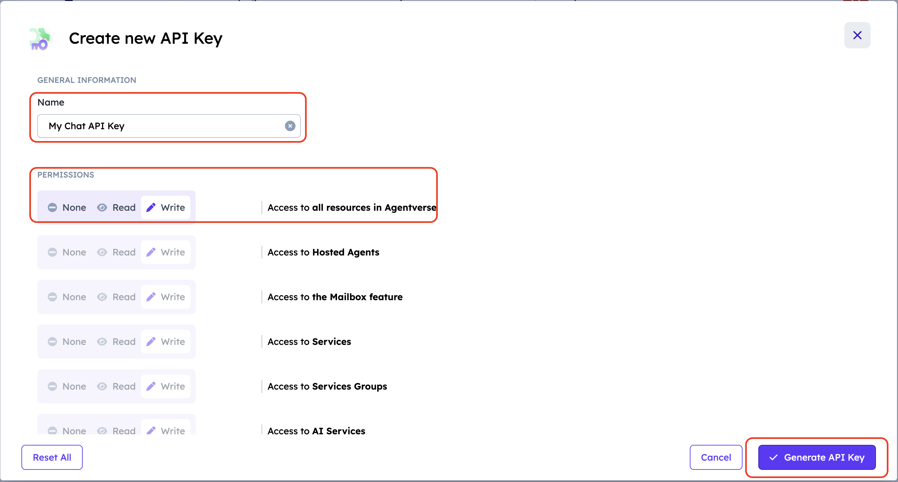
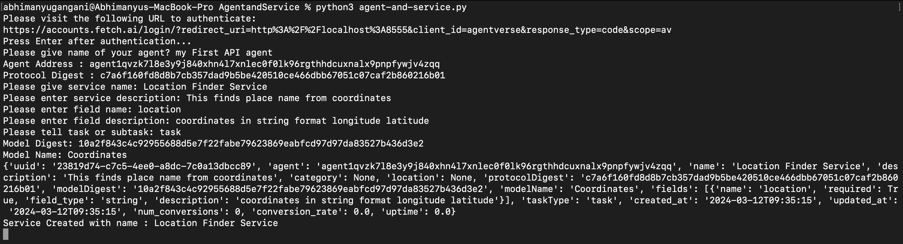
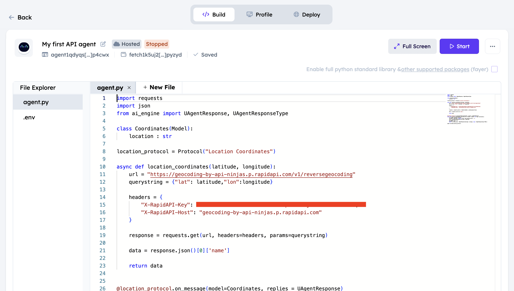
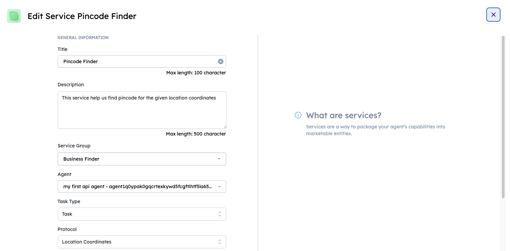

# uAgent and Service Creation using APIs

## Introduction

This example gives details on how to create uagents and respective services in Agentverse using APIs. we will demonstrate python script that interacts with Agentverse and help us creating agents and services.

## Prerequisites

- Before you begin, ensure you have the following:  

    - Python version greater than 3.9 and less than 3.11.
    - The requests library installed. You can install it using `pip install requests`.
    - [Agentverse ↗️](https://agentverse.ai/) Credentials.

## Steps to get API Tokens 

    - Go to Profile section in [Agentverse ↗️](https://agentverse.ai/profile/api-keys).
    - Click on button `+ New API Key`.
    - Give name to your API key.
    - Click on `write` for `Access to all resources in Agentverse` and click on `Generate API Key`



## Steps to create agent and respective service

    - Open terminal and create a directory `agents` using `mkdir agents`.
    - Create a python file `agent.py` in this directory and include the following sample script in the python file.

    ```python copy filename = 'agent.py'
    import requests
    import json
    from ai_engine import UAgentResponse, UAgentResponseType

    class Coordinates(Model):
        location : str

    location_protocol = Protocol("Location Coordinates")

    async def location_coordinates(latitude, longitude):
        url = "https://geocoding-by-api-ninjas.p.rapidapi.com/v1/reversegeocoding"
        querystring = {"lat": latitude,"lon":longitude}

        headers = {
            "X-RapidAPI-Key": "YOUR_API_KEY",
            "X-RapidAPI-Host": "geocoding-by-api-ninjas.p.rapidapi.com"
        }

        response = requests.get(url, headers=headers, params=querystring)

        data = response.json()[0]['name']

        return data


    @location_protocol.on_message(model=Coordinates, replies = UAgentResponse)
    async def location_coordinates_calculator(ctx: Context, sender: str, msg: Coordinates):
        ctx.logger.info(msg.location)
        latitude, longitude = map(str.strip, msg.location.split(','))
        city = location_coordinates(latitude, longitude)
        ctx.logger.info(city)
        message = city
        await ctx.send(sender, UAgentResponse(message = message, type = UAgentResponseType.FINAL))

    agent.include(location_protocol)
    ```

    - Create a python file with name `agent_create.py`.

### Script breakdown

    - Importing required libraries and setting up authorization token

    ``` python
    # Importing Required libraries
    import time
    import requests

    # Decode the refresh token
    token = f'Bearer 'Your_access_token'  
    ```

    - Taking agent Name from user and storing agent address

    ```python
    # Take name of agent from user
    name = input('Please give name of your agent? ')

    # Create payload for agent creation request
    agent_creation_data = {
        "name": name
    }

    # Post request to create an agent and store address
    response_agent = requests.post("https://agentverse.ai/v1/hosting/agents", json=agent_creation_data, headers={
        "Authorization": token
    }).json()
    address = response_agent['address']
    print(f'Agent Address : {address}')
    ```

    - Taking code from `agent.py` file and storing it as created agent script.

    ```python
    # Reading code to be placed in agent
    with open('agent.py', 'r') as file:
        code = file.read()
    agent_code_data = {
        "code": code
    }

    # Creating agent.py script for created agent
    respone_code_update = requests.put(f"https://agentverse.ai/v1/hosting/agents/{address}/code", json=agent_code_data, headers={
        "Authorization": token
    })

    # Starting the agent
    requests.post(f"https://agentverse.ai/v1/hosting/agents/{address}/start", headers={
        "Authorization": token
    })

    time.sleep(10) # waiting before getting agent's protocol
    ```

    - Requesting protocol digest for the created agent

    ```python
    # Request to get agent protocol digest
    response_protcol = requests.get(f"https://agentverse.ai/v1/almanac/agents/{address}", headers={
        "Authorization": token
    })
    protocol_digest = response_protcol.json()['protocols'][1]
    print(f'Protocol Digest : {protocol_digest}')

    time.sleep(10) # Waiting before getting model_digest
    ```

    - Request model digest and name using almanac API

    ```python
    # Request to get agent's model details
    response_model = requests.get(f"https://agentverse.ai/v1/almanac/manifests/protocols/{protocol_digest}", headers={
        "Authorization": token
    })
    model = response_model.json()['models']

    time.sleep(10) # Waiting before storing details to create services
    ```
    
    - Saving all the details required for creating service and creating service on basis of details recieved

    ```python
    # Taking inputs from user for details required to create a service
    name_service = input('Please give service name')
    description = input('Please enter service description')
    field_name = input('Please enter field name')
    field_description = input('Please enter field description')
    tasktype = input('Please tell task or subtask')

    # Logging details provided by user
   print(f'Service name: {name_service} \nService Description: {description} \nField Name: {field_name}\nField Description: {field_description}\nTask Type: {tasktype}')

    # Storing model diges and name to be used for service creation
    model_digest = response_model.json()['interactions'][0]['request'].replace('model:', '')
    print(f'Model Digest : {model_digest}')
    model_name = model[0]['schema']['title']
    print(f'Model Name : {model_name}')

    # Creating payload for service creation
    data = {
        "agent": address,
        "name": name_service,
        "description": description,
        "protocolDigest": protocol_digest,
        "modelDigest": model_digest,
        "modelName": model_name,
        "fields": [
            {
                "name":field_name,
                "required": True,
                "field_type": "string",
                "description": field_description
            }
        ],
        "taskType": tasktype
    }

    # Requesting AI Engine services API to create a service with created payload and storing the response.
    response_service = requests.post("https://agentverse.ai/v1beta1/services", json=data, headers={
        "Authorization": token
    })

    # Storing name of serive and printing it to check if service was created successfully
    name = response_service.json()['name']
    print(f'Service Created with name: {name}')
    ```

### Whole Script

    ```py copy filename = 'agent_create.py'
    # Importing libraries
    import time
    import requests
    from faunatoken import start_server, shutdown_server, get_auth_url, get_tokens 


    # Starting the authentication and session initiation process
    server = start_server()
    print("Please visit the following URL to authenticate:")
    print(get_auth_url())
    input("Press Enter after authentication...")
    filename = 'access_code.txt'

    with open(filename, 'r') as file:
        access_code = file.read().strip()

    if access_code:
        tokens = get_tokens(access_code)
        fauna_token = tokens[0]
        refreshed_token = tokens[1]
        token = f'Bearer {fauna_token}'
    else:
        print("Authentication failed. Please ensure you have entered the correct access code.")
        exit()

    # Take name of agent from user
    name = input('Please give name of your agent? ')

    # Create payload for agent creation request
    agent_creation_data = {
        "name": name
    }

    # Post request to create an agent and store address
    response_agent = requests.post("https://agentverse.ai/v1/hosting/agents", json=agent_creation_data, headers={
        "Authorization": token
    }).json()
    address = response_agent['address']
    print(f'Agent Address : {address}')

    # Reading code to be placed in agent
    with open('agent_code.py', 'r') as file:
        code = file.read()
    agent_code_data = {
        "code": code
    }

    # Putting code into created agent
    respone_code_update = requests.put(f"https://agentverse.ai/v1/hosting/agents/{address}/code", json=agent_code_data, headers={
        "Authorization": token
    })

    # Starting the agent
    requests.post(f"https://agentverse.ai/v1/hosting/agents/{address}/start", headers={
        "Authorization": token
    })

    time.sleep(10) # waiting before getting agent's protocol

    # Request to get agent protocol digest
    response_protcol = requests.get(f"https://agentverse.ai/v1/almanac/agents/{address}", headers={
        "Authorization": token
    })
    protocol_digest = response_protcol.json()['protocols'][1]
    print(f'Protocol Digest : {protocol_digest}')

    time.sleep(10) # Waiting before getting model_digest

    # Request to get agent's model details
    response_model = requests.get(f"https://agentverse.ai/v1/almanac/manifests/protocols/{protocol_digest}", headers={
        "Authorization": token
    })
    model = response_model.json()['models']

    time.sleep(10) # Waiting before storing details to create services

    # Taking input and storing payload details to create service
    name_service = input('Please give service name: ')
    description = input("Please enter service description: ")
    field_name = input('Please enter field name: ')
    field_description = input('Please enter field description: ')
    tasktype = input('Please tell task or subtask: ')
    model_digest = response_model.json()['interactions'][0]['request'].replace('model:', '')
    print(f'Model Digest: {model_digest}')
    model_name = model[0]['schema']['title']
    print(f'Model Name: {model_name}')

    # Creating payload using details obtained from user
    data = {
        "agent": address,
        "name": name_service,
        "description": description,
        "protocolDigest": protocol_digest,
        "modelDigest": model_digest,
        "modelName": model_name,
        "fields": [
            {
                "name":field_name,
                "required": True,
                "field_type": "string",
                "description": field_description
            }
        ],
        "taskType": tasktype
    }

    # Post request to register agent.
    response_service = requests.post("https://agentverse.ai/v1beta1/services", json=data, headers={
        "Authorization": token
    })
    print(response_service.json())
    name = response_service.json()['name']
    print(f'Service Created with name : {name}') # Confirming serivce sucessfully created.


    ```
    
## Steps to run the script

1. Open terminal and go to directory `agents` created above.
2. Make sure agent.py and agent_create.py are in this directory.
3. Open [Agentverse ↗️](https://agentverse.ai/profile/api-keys) and [generate API keys](chat_api_example#steps-to-get-api-tokens).
4. Open script in editor and replace `access_token` and `refresh_token`.
5. Run command `python agent_create.py` and enter the required details.
6. Provide Agent and service Details as asked and check agent and service on agentverse.


## Expected Output

- Provide all details asked in the script.



- Agent created on Agentverse



- Service created on Agentverse

