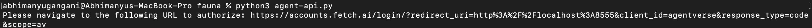
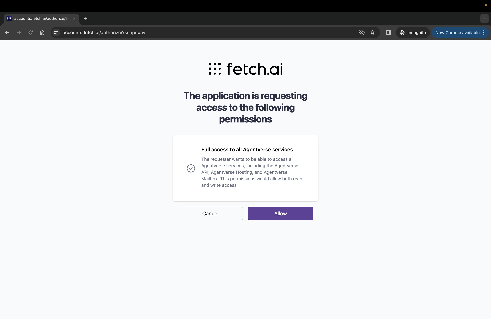
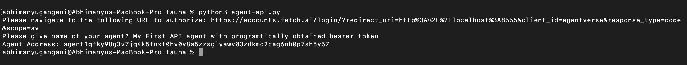
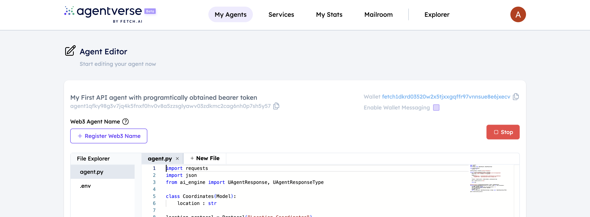

import { Callout } from 'nextra/components'

# Creating agent using agentverse API and programmatically obtained Bearer token

## Introduction

This example shows how to obtain bearer token programmatically and also create an agent using **Agentverse APIs** and python's **request** library.

## Steps to create Agent using API

    - Create a directory `agent` using `mkdir agent`.
    - Run `cd agent` to switch to agent directory.
    - Run `touch faunatoken.py` on terminal to setup programmatically fetchable fauna tokens and fauna refresh tokens. 

    ```python
    # import required libraries
    import threading
    import time
    import requests
    import urllib.parse
    from http.server import BaseHTTPRequestHandler, HTTPServer

    # Constants for the OAuth flow and API interaction
    FAUNA_URL = 'https://accounts.fetch.ai'
    SCOPE = 'av'
    CLIENT_ID = 'agentverse'
    TOKEN_URL = f'{FAUNA_URL}/v1/tokens'
    REDIRECT_URI = 'http://localhost:8555'
    access_code = None

    class OAuthServer(BaseHTTPRequestHandler):
        def log_message(self, format, *args):
            # Suppress default logging for clarity
            return

        def do_GET(self):
            global access_code
            parsed = urllib.parse.urlparse(self.path)
            params = urllib.parse.parse_qs(parsed.query)
            if 'code' in params:
                access_code = params['code'][0]
                with open('access_code.txt', 'w') as f:
                    f.write(access_code)
                self.send_response(200)
                self.end_headers()
                self.wfile.write(b'Authentication successful, you may now close this tab.')
            else:
                self.send_response(400)
                self.end_headers()
                self.wfile.write(b'Missing authorization code.')

    def start_server():
        server = HTTPServer(('127.0.0.1', 8555), OAuthServer)
        threading.Thread(target=server.serve_forever).start()
        return server

    def get_tokens(auth_code):
        response = requests.post(
            TOKEN_URL,
            json={
                'grant_type': 'authorization_code',
                'code': auth_code,
                'client_id': CLIENT_ID,
                'redirect_uri': REDIRECT_URI,
                'scope': SCOPE,
            }
        )
        response.raise_for_status()
        return response.json()

    def get_auth_url():
        return f'{FAUNA_URL}/login/?{urllib.parse.urlencode({"redirect_uri": REDIRECT_URI, "client_id": CLIENT_ID, "response_type": "code", "scope": SCOPE})}'

    def shutdown_server(server):
        server.shutdown()
    ```

    - Run `touch agent-api.py` on terminal for creating agent and include below script in that file.

    ```python
    # main_api_script.py
    import time
    import requests
    from faunatoken import start_server, get_auth_url, get_tokens, shutdown_server
    import os

    # Start the OAuth flow to obtain tokens
    server = start_server()
    print("Please navigate to the following URL to authorize:", get_auth_url())

    # Wait for the user to authorize the app and the server to receive the code
    access_code = None
    while access_code is None:
        try:
            with open('access_code.txt', 'r') as f:
                access_code = f.read().strip()
            os.remove('access_code.txt')  # Optionally remove the file after reading
        except FileNotFoundError:
            time.sleep(1) 

    tokens = get_tokens(access_code)  # Exchange the authorization code for tokens
    token = 'Bearer ' + tokens['access_token']  # Format the access token for use in headers
    shutdown_server(server)  # Shutdown the server as it's no longer needed

    # The rest of your API interaction code goes here...

    # Taking agent name input from user
    name = input('Please give name of your agent? ')

    # Creating payload for agent creation request
    agent_creation_data = {
        "name": name
    }

    # Storing response of agent creation request
    response_agent = requests.post("https://agentverse.ai/v1/hosting/agents", json=agent_creation_data, headers={
        "Authorization": token
    })
    response_agent = response_agent.json()

    # Storing and printing agent address for further use
    address = response_agent['address']
    print(f'Agent Address: {address}')

    # Reading code from agent.py file and storing it in code variable
    with open('agent.py', 'r') as file:
        code = file.read()

    # Creating payload for updating agent code
    agent_code_data = {
        "code": code
    }

    # Updating code for the created agent using Hosting API
    response_code_update = requests.put(f"https://agentverse.ai/v1/hosting/agents/{address}/code", json=agent_code_data, headers={
        "Authorization": token
    })

    # Starting the agent once the code is updated.
    requests.post(f"https://agentverse.ai/v1/hosting/agents/{address}/start", headers={
        "Authorization": token
    })
    ```

    - Run `touch agent.py` on terminal to include code for agent.

    ```python
    import requests
    import json
    from ai_engine import UAgentResponse, UAgentResponseType

    class Coordinates(Model):
        location : str

    location_protocol = Protocol("Location Coordinates")

    async def location_coordinates(latitude, longitude):
        url = "https://geocoding-by-api-ninjas.p.rapidapi.com/v1/reversegeocoding"
        querystring = {"lat": latitude,"lon":longitude}

        headers = {
            "X-RapidAPI-Key": "bfbb45f406msh896d7cec950b169p129fffjsn5cf5b07811d6",
            "X-RapidAPI-Host": "geocoding-by-api-ninjas.p.rapidapi.com"
        }

        response = requests.get(url, headers=headers, params=querystring)

        data = response.json()[0]['name']

        return data


    @location_protocol.on_message(model=Coordinates, replies = UAgentResponse)
    async def location_coordinates_calculator(ctx: Context, sender: str, msg: Coordinates):
        ctx.logger.info(msg.location)
        latitude, longitude = map(str.strip, msg.location.split(','))
        city = location_coordinates(latitude, longitude)
        ctx.logger.info(city)
        message = city
        await ctx.send(sender, UAgentResponse(message = message, type = UAgentResponseType.FINAL))

    agent.include(location_protocol)
    ```

    - Run `python3 agent-api.py` on terminal and provide name for agent.

## Expected Output

    - Running `agent-api.py` in terminal and providing Agent name.

    

    - Use the URL on the screen and paste it in browser of own choice to authenticate. Once logged in please Allow for permission required.

    

    - Provide the agent name on the terminal.

    

    - Checking new agent on Agentverse UI.

    
