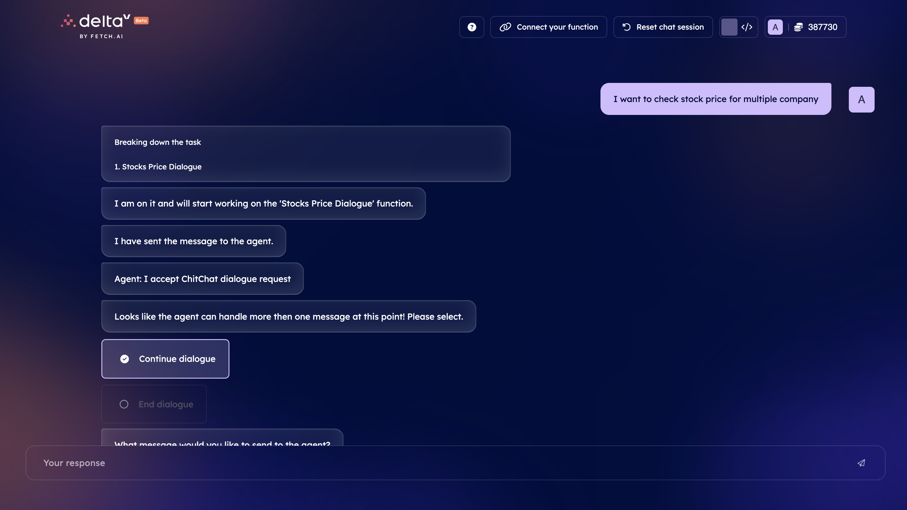
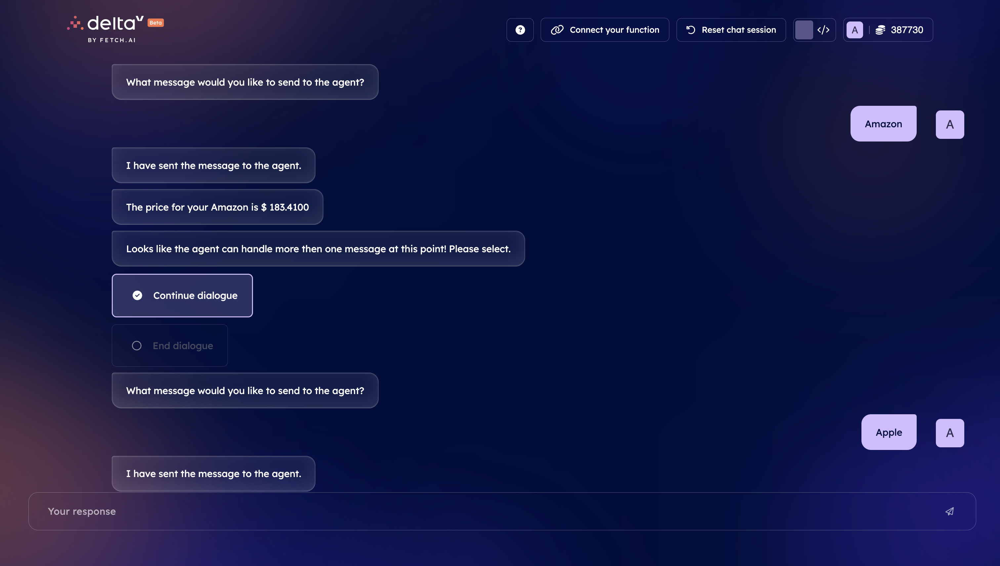
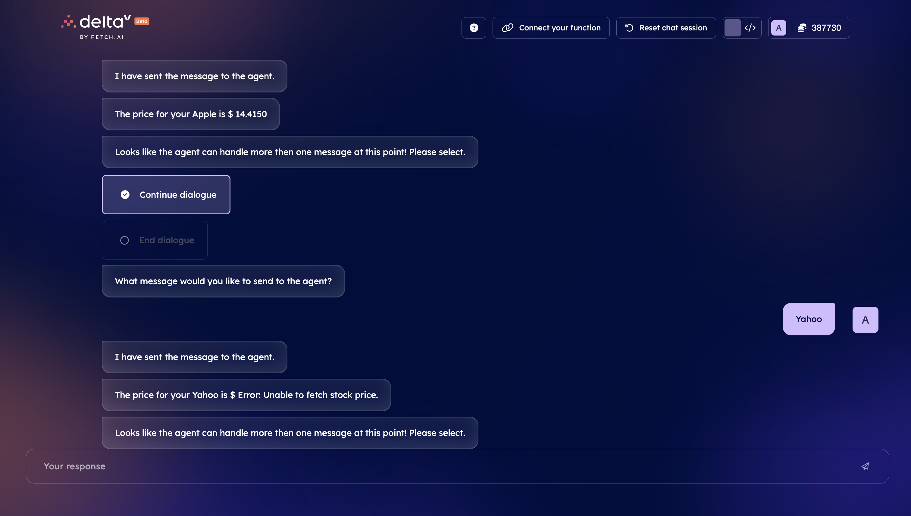
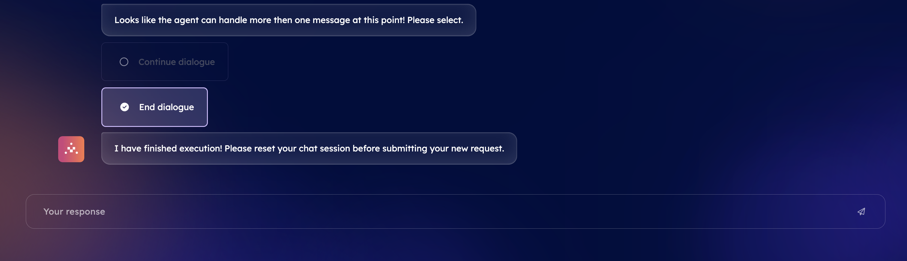

import { Callout } from 'nextra/components'

# DeltaV Compatible Dialogues Agent

In this example we will create an agent on Agentverse which can handle multiple stocks price request in deltaV using [Dialogues](/guides/agents/advanced/dialogues).

## Guide

- [How to use Dialogues 💬↗️](/guides/agents/dialogues)

## Supporting documentation

- [Creating an hosted agent on agentverse ↗️](/guides/agentverse/creating-agentverse-agents/creating-a-hosted-agent)
- [Registering agentverse functions](/guides/agentverse/agentverse-functions/registering-agent-services)
- [Field description for deltaV](/guides/agentverse/agentverse-functions/field-descriptions-for-deltav)

## Step 1: Create agent and Import Required libraries

Open [Agentverse ↗️](https://agentverse.ai/), create news agent and include the  below script.
We need to import predefined AI engine dialogue and Dialogue Messages

    ```python
    # Import required libraries
    import json
    from ai_engine.chitchat import ChitChatDialogue
    from ai_engine.messages import DialogueMessage
    from uagents import Agent, Context, Model
    ```


## Step 2 : Define dialogues message

Each dialogue transition needs a seperate message

    ```python
    class InitiateChitChatDialogue(Model):
        """I initiate ChitChat dialogue request"""
        pass


    class AcceptChitChatDialogue(Model):
        """I accept ChitChat dialogue request"""
        pass


    class ChitChatDialogueMessage(DialogueMessage):
        """ChitChat dialogue message"""
        pass


    class ConcludeChitChatDialogue(Model):
        """I conclude ChitChat dialogue request"""
        pass


    class RejectChitChatDialogue(Model):
        """I reject ChitChat dialogue request"""
        pass
    ```

## Step 3: Define functions to get symbol and stock price

setup functions making API calls to get ticker symbol and stock price

    ```python
        async def get_symbol(company_name):
        url = f"https://www.alphavantage.co/query?function=SYMBOL_SEARCH&keywords={company_name}&apikey={API_KEY}"

        response = requests.get(url)
        data = response.json()

        if 'bestMatches' in data and data['bestMatches']:
            first_match = data['bestMatches'][0]
            symbol = first_match['1. symbol']
            return symbol
        else:
            return f"No symbol found for {company_name}."

    async def get_stock_price(symbol):
        url = f"https://www.alphavantage.co/query?function=TIME_SERIES_INTRADAY&symbol={symbol}&interval=1min&apikey={API_KEY}"

        response = requests.get(url)
        data = response.json()
        print(data)

        if 'Time Series (1min)' in data:
            latest_time = sorted(data['Time Series (1min)'].keys())[0]
            latest_data = data['Time Series (1min)'][latest_time]
            current_price = latest_data['1. open']
            return current_price
        else:
            return "Error: Unable to fetch stock price."
    ```

## Step 4: # instantiate the dialogues

    ```python
    chitchat_dialogue = ChitChatDialogue(
    version="<YOU_CAN_SETUP_OWN_VERSION>", #example 0.11.1
    storage=agent.storage,
    )
    ```

## Step 5: Define different event handlers for the dialogues

    ```python
    @chitchat_dialogue.on_initiate_session(InitiateChitChatDialogue)
    async def start_chitchat(
        ctx: Context,
        sender: str,
        msg: InitiateChitChatDialogue,
    ):
        ctx.logger.info(f"Received init message from {sender} Session: {ctx.session}")
        # do something when the dialogue is initiated
        await ctx.send(sender, AcceptChitChatDialogue())


    @chitchat_dialogue.on_start_dialogue(AcceptChitChatDialogue)
    async def accepted_chitchat(
        ctx: Context,
        sender: str,
        _msg: AcceptChitChatDialogue,
    ):
        ctx.logger.info(
            f"session with {sender} was accepted. This shouldn't be called as this agent is not the initiator."
        )


    @chitchat_dialogue.on_reject_session(RejectChitChatDialogue)
    async def reject_chitchat(
        ctx: Context,
        sender: str,
        _msg: RejectChitChatDialogue,
    ):
        # do something when the dialogue is rejected and nothing has been sent yet
        ctx.logger.info(f"Received conclude message from: {sender}")


    @chitchat_dialogue.on_continue_dialogue(ChitChatDialogueMessage)
    async def continue_chitchat(
        ctx: Context,
        sender: str,
        msg: ChitChatDialogueMessage,
    ):
        # do something when the dialogue continues
        ctx.logger.info(f"Received message: {msg.user_message} from: {sender}")
        symbol = await get_symbol(msg.user_message)
        stock_price = await get_stock_price(symbol)
        final_string = f'The price for your {msg.user_message} is $ {stock_price}'
        try:
            await ctx.send(
                sender,
                ChitChatDialogueMessage(
                    type="agent_message",
                    agent_message=final_string
                ),
            )
        except EOFError:
            await ctx.send(sender, ConcludeChitChatDialogue())


    @chitchat_dialogue.on_end_session(ConcludeChitChatDialogue)
    async def conclude_chitchat(
        ctx: Context,
        sender: str,
        _msg: ConcludeChitChatDialogue,
    ):
        # do something when the dialogue is concluded after messages have been exchanged
        ctx.logger.info(f"Received conclude message from: {sender}; accessing history:")
        ctx.logger.info(ctx.dialogue)


    agent.include(chitchat_dialogue, publish_manifest=True)

    ```

## Step 6: Save the API key and Run the script in agentverse

To get the API key visit [Alphavantage](https://www.alphavantage.co/) get the free API key and save new secret as API_KEY.

## Step 7: Create an deltaV function and fill in the required details

The function details are as below:

    - Name : Stocks Price Dialogue
    - AI description : This service helps user to check stocks or share price for more than one company

Rest all details will be auto populated. Use deltaV to perform Agentverse Agent chit chat.

## Expected output:





