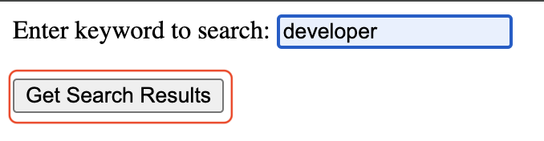
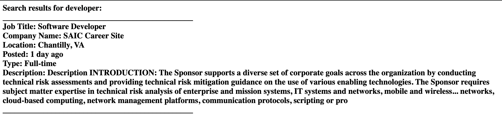

import { Callout } from 'nextra/components'

# On Query decorator example

This documentation outlines the steps to set up and enable communication between Agent and flask app based webpage, using the uAgents framework. flask app sends a query to Agent, and Agent processes this query and responds. Both agent and app use a simple request-response model for communication.

## Guide

- [How to use on_query decorator ↗️](../guides/agents/on-query)

## Supporting documentation

- [Creating an agent ↗️](/guides/agents/create-a-uagent)
- [Communicating with other agents 📱🤖💻 ↗️](/guides/agents/communicating-with-other-agents)
- [Register in Almanac ↗️](/guides/agents/register-in-almanac)
- [Almanac Contract ↗️](/references/contracts/uagents-almanac/almanac-overview)
- [Protocols ↗️](/references/uagents/uagents-protocols/agent-protocols)

## Agent Script

### Agent Script

This agent handle queries. Asking the jobs available for given job title using serpAPI.

```py copy filename = JobSearchAgent.py
# Import Required libraries
from uagents import Agent, Context, Model
from uagents.setup import fund_agent_if_low
from serpapi import GoogleSearch
 
# Define Request and Response Models
class Request(Model):
    query: str
class Response(Model):
    response: str
 
# Define function to handle job serach queries
async def get_job_summary(query, api_key):
    # Parameters for the API request
    params = {
      "engine": "google_jobs",
      "q": query,
      "hl": "en",
      "api_key": api_key
    }

    # Perform the search
    search = GoogleSearch(params)
    results = search.get_dict()
    jobs_results = results.get("jobs_results", [])
    
    # Initialize the result string
    res_str = ""
    # Get summary for the first job result
    if jobs_results:
        job = jobs_results[0]  # Get the first job
        res_str += (
            "\n_______________________________________________<br>"
            + f"\nJob Title: {job.get('title', 'N/A')}<br>"
            + f"Company Name: {job.get('company_name', 'N/A')}<br>"
            + f"Location: {job.get('location', 'N/A')}<br>"
            + f"Posted: {job['detected_extensions'].get('posted_at', 'N/A')}<br>"
            + f"Type: {job['detected_extensions'].get('schedule_type', 'N/A')}<br>"
            + f"Description: {job.get('description', 'N/A')[:500]}<br>"
            + "\n_______________________________________________\n"
        )
    else:
        res_str = "No job results found."

    return res_str


# Define Search Agent
SearchAgent = Agent(
    name="SearchAgent",
    port=8000,
    seed="SearchAgent secret phrase",
    endpoint=["http://127.0.0.1:8000/submit"],
)

# Registering agent on Almananc and funding it.
fund_agent_if_low(SearchAgent.wallet.address())
 
# On agent startup printing address
@SearchAgent.on_event('startup')
async def agent_details(ctx: Context):
    ctx.logger.info(f'Search Agent Address is {SearchAgent.address}')

# On_query handler
@SearchAgent.on_query(model=Request, replies={Response})
async def query_handler(ctx: Context, sender: str, msg: Request):
    ctx.logger.info("Query received")
    try:
        ctx.logger.info(f'Fetching job details for query: {msg.query}')
        response = await get_job_summary(msg.query, "<YOUR_JOB_SEARCH_SERP_API_KEY>")
        # Ensure the response is a string
        response_str = str(response)
        ctx.logger.info(f'Response: {response_str}')
        await ctx.send(sender, Response(response=response_str))
    except Exception as e:
        error_message = f"Error fetching job details: {str(e)}"
        ctx.logger.error(error_message)
        # Ensure the error message is sent as a string
        await ctx.send(sender, Response(response=str(error_message)))


if __name__ == "__main__":
    SearchAgent.run()
```


### Flask App Script

Async Agent-Based Flask App for Keyword base Job Search Results Retrieval.

```py copy filename = jobsearchapp.py
# Import required libraries
from flask import Flask, request, render_template_string
import json
import asyncio
from uagents import Model
from uagents.query import query

# Initialise flask app
app = Flask(__name__)

AGENT_ADDRESS = 'Provide your job search agent address'

# Definining request model
class Request(Model):
    query: str

# Define the root route, which presents the user with a form to input their search keyword
@app.route('/')
def index():
    # The form submits a POST request to /get-search-results with the user's keyword
    return render_template_string('''
                                  <form action="/get-search-results" method="post">
                                      <label for="keyword">Enter keyword to search:</label>
                                      <input type="text" id="keyword" name="keyword"><br><br>
                                      <input type="submit" value="Get Search Results">
                                  </form>
                                  ''')

# Define the route to handle form submissions and fetch search results
@app.route('/get-search-results', methods=['POST'])
def get_search_results():
    # Extract keyword from form and perform query agent for job search
    keyword = request.form['keyword']
    req = Request(query=keyword)
    
    loop = asyncio.new_event_loop()
    asyncio.set_event_loop(loop)
    response = loop.run_until_complete(make_agent_call(req))
    loop.close()
    
    return f'<h2>Search results for {keyword}: </br>{response}</h2>'

# Define an asynchronous function to query the agent with the specified request
async def agent_query(req):
    response = await query(destination=AGENT_ADDRESS, message=req, timeout=15.0)
    data = json.loads(response.decode_payload())
    return data["response"]

# Define an asynchronous function to handle the agent call, which will be used within the synchronous Flask route
async def make_agent_call(req: Request):
    try:
        response = await agent_query(req)
        return f"{response}"
    except Exception as e:
        return f"unsuccessful agent call - {str(e)}"

# Run the Flask application if this script is executed directly
if __name__ == "__main__":
    app.run(debug=True)
```

## Steps to run the app
- Update `Agent Address` in jobsearchapp.py and [`serp_api_key`](https://serpapi.com/google-jobs-api) in JobSearchAgent.py.
- Run both the script `JobSearchAgent.py` and `jobsearchapp.py` on your terminal.
- Run URL `http://127.0.0.1:5000` in browser and provide job search keyword on webpage.
- Click on `Get Search Results`.



## Expected Output

- jobsearchapp.py 

```
abhimanyugangani@Abhimanyus-MacBook-Pro On Query % python3 SearchAgent.py
INFO:     [SearchAgent]: Almanac registration is up to date!
INFO:     [SearchAgent]: Search Agent Address is agent1qdmgt4txxlvve4fmk8cw6jcp4gd2l709ctllx7jvz0kx4jzace5hu8n00hj
INFO:     [SearchAgent]: Starting server on http://0.0.0.0:8000 (Press CTRL+C to quit)
INFO:     [SearchAgent]: Query received
INFO:     [SearchAgent]: Fetching job details for query: developer
INFO:     [SearchAgent]: Response: 
_______________________________________________</br>
Job Title: Software Developer</br>Company Name: SAIC Career Site</br>Location:   Chantilly, VA   </br>Posted: 1 day ago</br>Type: Full-time</br>Description: Description

INTRODUCTION: The Sponsor supports a diverse set of corporate goals across the organization by conducting technical risk assessments and providing technical risk mitigation guidance on the use of various enabling technologies. The Sponsor requires subject matter expertise in technical risk analysis of enterprise and mission systems, IT systems and networks, mobile and wireless... networks, cloud-based computing, network management platforms, communication protocols, scripting or pro</br>
_______________________________________________
```

- Webpage




