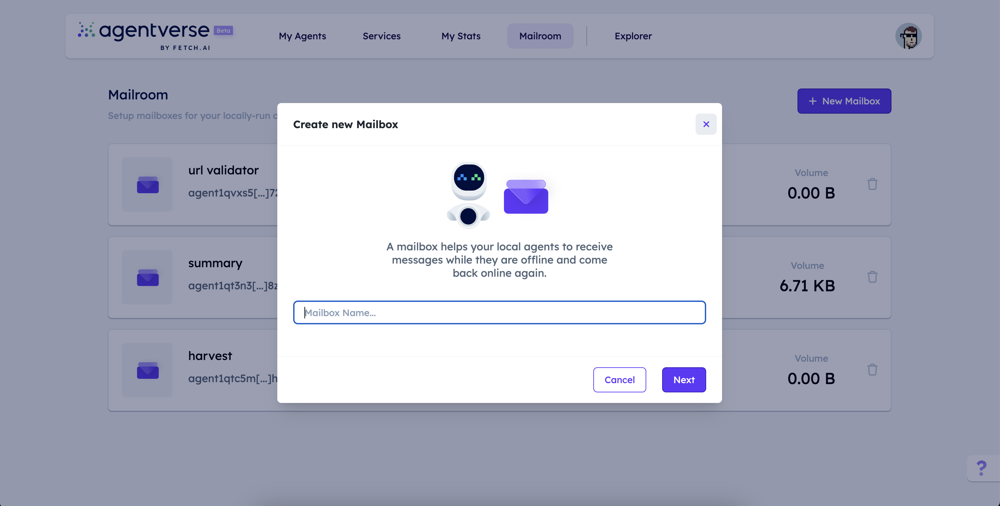
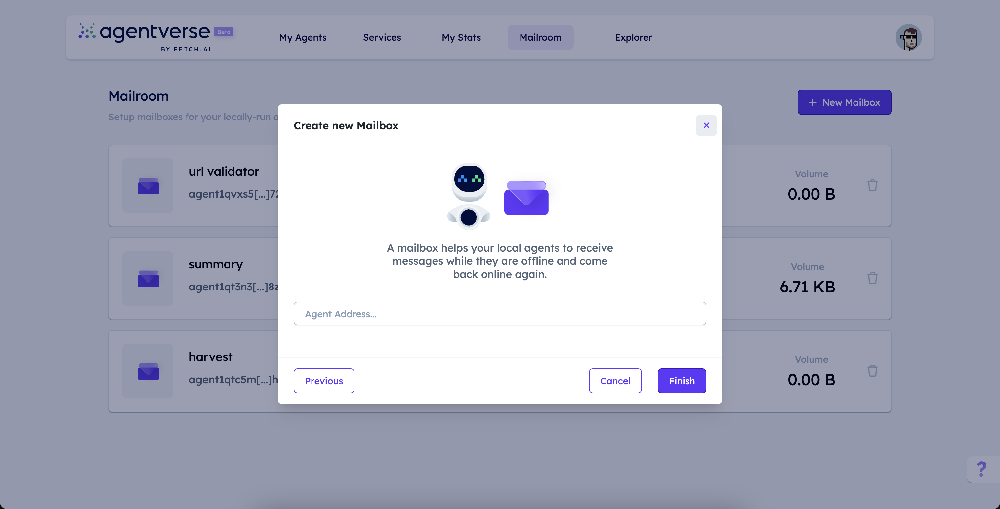
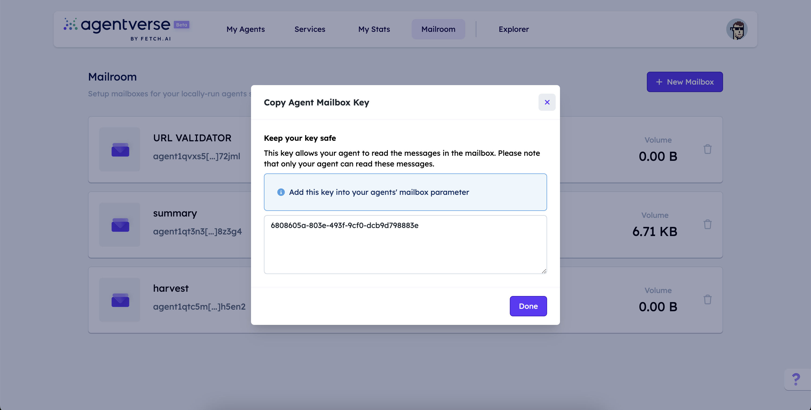
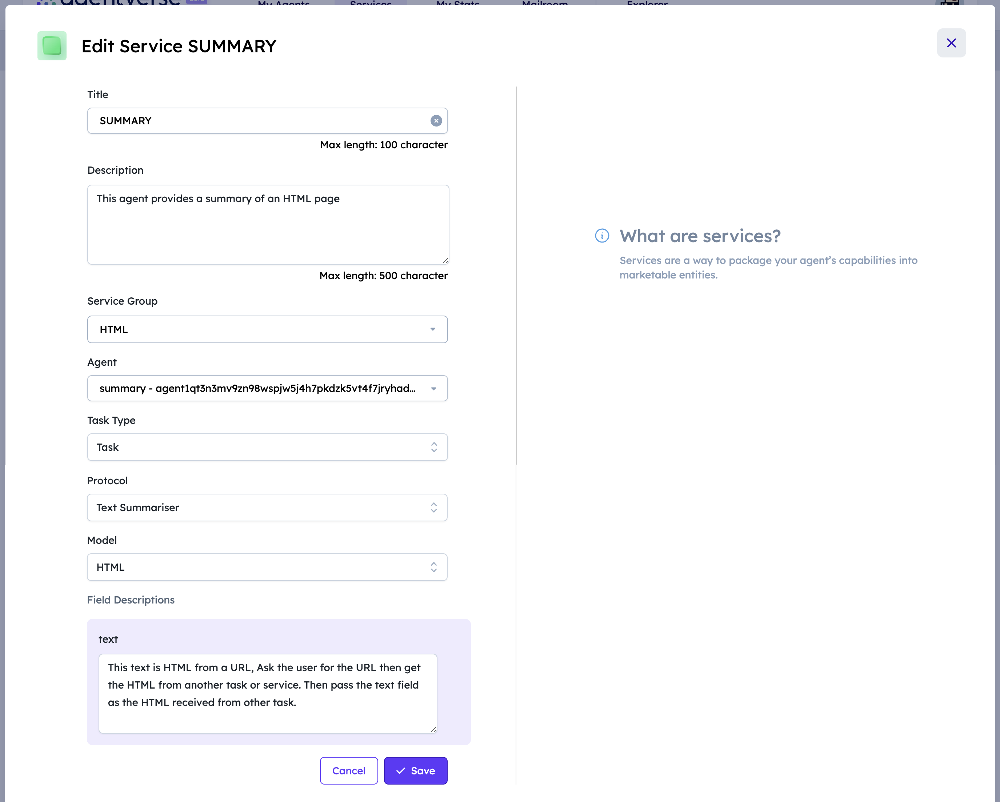
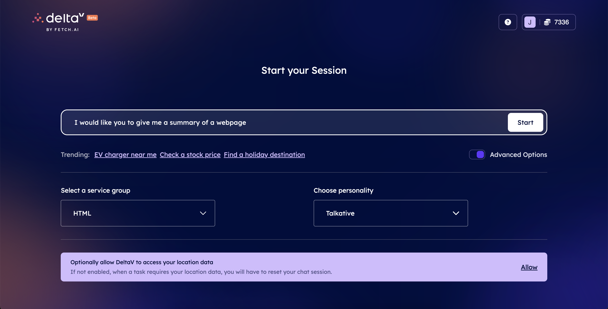
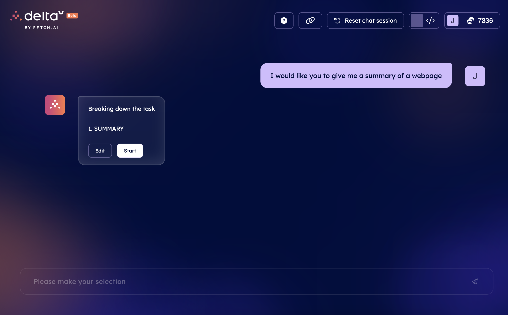
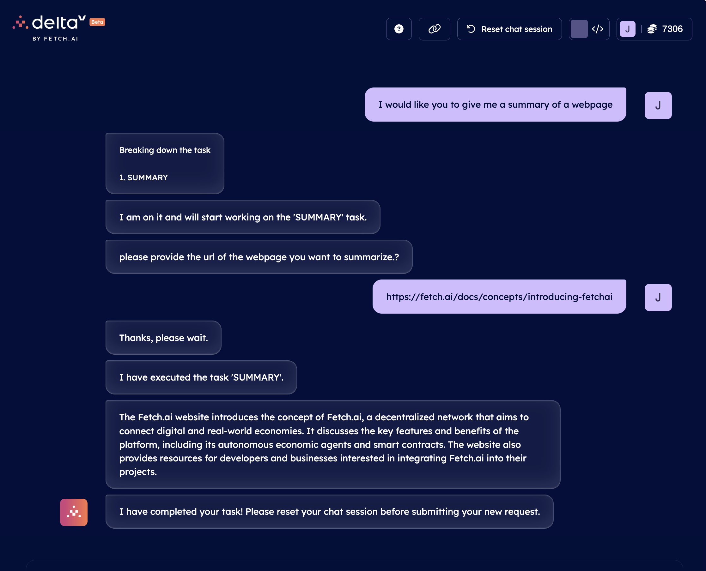

import { Callout } from 'nextra/components'

<Callout type="info" emoji="ℹ️">
This article is a work-in-progress. It will be expanded rapidly.
</Callout>

# Agents 101 for AI Engine 🤖

## Overview

Welcome to **Agents 101 for AI engine**! This course is designed to introduce you to the overall system of Fetch.ai, and shows how to
build agents to be accessible to the AI Engine and integrate with other projects. This course is a parallel track to
[Agents 101 🤖↗️](/guides/agent-courses/introductory-course) which instead focuses only on Agents creation.

At any stage, if you encounter issues or have questions about specific terms or topics, our support team is available on [Discord ↗️](https://discord.gg/fetchai) to assist you.

## Quick overview of Fetch.ai

Fetch.ai is developing a platform to help build an AI-enabled decentralized digital economy. Agents are
programs that can make choices on their own for individuals, companies, and devices. Agents are the actors and the
heart of Fetch.ai Ecosystem.

To build your solution on Fetch.ai, you need to understand four concepts: [Agents ↗️](/concepts/agents/agents), [Agentverse ↗️](/concepts/agent-services/agentverse-intro), [AI Engine ↗️](/concepts/ai-engine/ai-engine-intro), and [DeltaV ↗️](/concepts/ai-engine/deltav).

### Agent, Agentverse, AI Engine and DeltaV

Let's try and keep this simple 🎉:

 - **Agents**: These are programs that work as you instruct them. Classically, they are part of a multi-agent system where they have a task and communicate with other agents. But their primary use is to represent a service, a function or data that can be accessed by DeltaV.

 - **Agentverse**: It is a managed hosting platform, an online IDE, and an entry point to AI Engine for Agents. You would register your Agents on Agentverse to be a service in the network.

 - **AI Engine**: The AI Engine is a system that combines Agents with human-readable text input to create a scalable AI infrastructure that supports Large Language Models (LLMs). It's an AI system that can convert human text into actionable (computer) commands.

 - **DeltaV**: DeltaV is an assistive chat interface that allows human input to interact with agents registered through the Agentverse.

    <Callout type="warning" emoji="⚠️">
       Agents are <i>programs</i>, whereas services are the <i>functions</i> your agents offer.
    </Callout>

In a nutshell, AI Engine indexes Agents, and translates human input into **tasks**. It may sound like a search
engine, but it does much more.


The AI Engine allows **chaining**. Say that you ask DeltaV "Tell me about the animal
Zebra". The AI Engine would then look for an agent that could give you a summary, as well as another agent that could provide information about zebras. The AI Engine understands that the **Summary Agent** requires text to parse and summarise. So it would contact the **Zebra Agent** and get the information from it. The AI Engine would then call the **Summary Agent** with the **Zebra Agent** information so that the former would return the summarized text.

It works like this:


Simply put, when the AI Engine selects a response, the subtasks available to be called for that task are already known to it.

Of course, this could be more complicated. What if every sensor on a car was an agent? You could ask your car for
diagnostics on a system, and each component in that system would independently give its status - making everything extremely complex. That's where the power of the AI Engine comes in. It understands the schema of each Agent, so there would be little need for each component to be compatible in communication with each other.

## Okay, so how does this all work?

To understand this, we need to look into a few more concepts:


Here, two separate processes are happening. The first part of the sequence diagram registers two Agents:

 1. Firstly, agents register to a smart contract thus effectively paying to be discoverable.
 2. Agents then register as a service on Agentverse (you'd usually do this manually).

Now that the Agents are registered and discoverable - let's move on on to the second part of the diagram. The second part of the diagram introduces the flow of the AI Engine. This shows the role of a user who has entered a
search term into DeltaV.

    1. A query comes in and it is sent to the AI Engine.
    2. The AI Engine has an internal loop that updates services registered and indexed.
    3. It also has another internal loop that creates embeddings of these services.
    4. Upon receiving text, the AI Engine understands and maps the text to Services.
    5. It now requests addresses from [Almanac ↗️](/references/contracts/uagents-almanac/almanac-overview) to message these Agents.
    6. The AI Engine sees that Agent (A) needs some text to perform its services.
    7. It finds subtasks that can provide the required data.
    8. It then contacts the subtask, and the required data is returned.
    9. Data is passed to Agent (A) which returns a summary of the data.
    10. The response is then returned to the user on DeltaV.

**Tasks and subtasks are agent functions**. In the context of the AI Engine, these are (sub)tasks, but you're developing
Agents.

## Okay, let's build a couple of Agents!

We've got a high-level idea of how this works. Let's build this on Agentverse so that we can get this running on
DeltaV and see the whole stack connected.

If you've never installed anything for uAgent development, checkout these guides:

    - [setup the development environment](/guides/agents/installing-uagent#development-tools)
    - [Install uAgents locally](/guides/agents/installing-uagent#install-with-pip)

### Create your first agent: the HTML summariser

We're going to run our agents locally, and set up a Mailbox on Agentverse.

    <Callout type="info" emoji="ℹ️">
       Checkout the [Utilizing the Agentverse Mailroom service 📬 ↗️](/guides/agentverse/utilising-the-mailbox) for a better understanding of Agentverse Mailroom feature.
    </Callout>

In this guide, our first agent takes some HTML and summarises the contents with **Langchain** and **OpenAI**.

We need to create a Python file for this example.
We can do this by running: `touch html_summary_agent.py`

    ```py copy filename="html_summary_agent.py"
    from langchain.chains.summarize import load_summarize_chain
    from langchain_community.document_loaders import UnstructuredHTMLLoader
    from langchain_openai import ChatOpenAI
    from uagents import Agent, Context, Protocol, Model
    from ai_engine import UAgentResponse, UAgentResponseType
    import os

    class HTML(Model):
        text: str

    SEED_PHRASE = "let us summarise v2"
    AGENT_MAILBOX_KEY = "AGENT_MAILBOX_KEY"
    OPENAI_API_KEY = "OPENAI_API_KEY"

    summaryAgent = Agent(
        name="SummaryAgent",
        seed=SEED_PHRASE,
        mailbox=f"{AGENT_MAILBOX_KEY}@https://agentverse.ai",
    )

    summary_protocol = Protocol("Text Summariser")

    print(summaryAgent.address)
    print(OPENAI_API_KEY)

    @summary_protocol.on_message(model=HTML, replies={UAgentResponse})
    async def summarise(ctx: Context, sender: str, msg: HTML):
        with open("./temp.html", "w", encoding="utf-8") as f:
            f.write(msg.text)

        # Step 1: Initialize WebBaseLoader with the given URL
        loader = UnstructuredHTMLLoader("./temp.html")

        # Step 2: Load the document
        docs = loader.load()

        # Step 3: Load summarization chain
        llm = ChatOpenAI(openai_api_key=OPENAI_API_KEY, temperature=0, model_name="gpt-3.5-turbo-1106")
        chain = load_summarize_chain(llm, chain_type="stuff")

        # Step 4: Run the summarization chain on the loaded document
        summarized_content = chain.invoke(docs)
        summarized = summarized_content["input_documents"][0].to_json()

        # Step 5: Define the needed dependencies
        dependencies = {
            "langchain": ">=1.0.0",
            "langchain_community": ">=1.0.0",
            "langchain_openai": ">=1.0.0"
        }

        result = chain.invoke(docs)

        await ctx.send(
            sender,
            UAgentResponse(message=(result["output_text"]), type=UAgentResponseType.FINAL),
        )

    summaryAgent.include(summary_protocol, publish_manifest=True)
    summaryAgent.run()
    ```

Okay, we've got the whole code block above for our first Agent. We're going to assume you know about Python imports on Agentverse; if you don't, please have a look at the [Agentverse: allowed imports ↗️](/guides/agentverse/allowed-imports) guide for clarity around the imports currently available within the Agentverse.

There are a lot of really cool, neat things you need to know from code above. Let's explore it:

    ```py copy
    class HTML(Model):
            text: str

        SEED_PHRASE = "SEED_PHRASE"
        AGENT_MAILBOX_KEY = "AGENT_MAILBOX_KEY"
        OPENAI_API_KEY = "OPENAI_API_KEY"

        summaryAgent = Agent(
            name="SummaryAgent",
            seed=SEED_PHRASE,
            mailbox=f"{AGENT_MAILBOX_KEY}@https://agentverse.ai",
        )

        summary_protocol = Protocol("Text Summariser")
    ```

    - The `class HTML` defines the structure of the message the agent expects to receive. In this case, each message
    should have `text` variable

    - `SEED_PHRASE` is our agents unique seed.

    - `AGENT_MAILBOX_KEY` mailbox key is our ID of our mailbox hosted on Agentverse.

    - `OPENAI_API_KEY` is our API key to OpenAI's APIs.

We can now initialise the Agent and define the [Protocol ↗️](/references/uagents/uagents-protocols/agent-protocols). To read more about **Agent objects**, please checkout [the reference docs](/references/uagents/uagents-api/agent#agent-objects)

Then, we have the **on_message()** handler.

    ```py copy
    @summary_protocol.on_message(model=HTML, replies={UAgentResponse})
    async def summarise(ctx: Context, sender: str, msg: HTML):
        with open("./temp.html", "w", encoding="utf-8") as f:
            f.write(msg.text)

        # Step 1: Initialize WebBaseLoader with the given URL
        loader = UnstructuredHTMLLoader("./temp.html")

        # Step 2: Load the document
        docs = loader.load()

        # Step 3: Load summarization chain
        llm = ChatOpenAI(openai_api_key=OPENAI_API_KEY, temperature=0, model_name="gpt-3.5-turbo-1106")
        chain = load_summarize_chain(llm, chain_type="stuff")

        # Step 4: Run the summarization chain on the loaded document
        summarized_content = chain.invoke(docs)
        summarized = summarized_content["input_documents"][0].to_json()

        # Step 5: Define the needed dependencies
        dependencies = {
            "langchain": ">=1.0.0",
            "langchain_community": ">=1.0.0",
            "langchain_openai": ">=1.0.0"
        }

        result = chain.invoke(docs)

        await ctx.send(
            sender,
            UAgentResponse(message=(result["output_text"]), type=UAgentResponseType.FINAL),
        )

    ```

We  need a way for our Agent to receive messages. We do this by creating a function for our agent to handle all
 incoming messages from other Agents. We use `on_message()` decorator which activates the `summarise()` function once
 our Agent receives a message matching the `HTML` Message data Model we previously defined.

We can finally run the Agent at the bottom of the script:

    ```py
    summaryAgent.include(summary_protocol, publish_manifest=True)
    summaryAgent.run()
    ```

Including the protocol in the Agent effectively allows other Agents to know how this Agent expects communication.

You can run this with `poetry run python html_summary_agent.py`.

You'll see something like `agent1qtc5m8xudkm6gjv98k3kxl3ydzhkhzsfx6pgla0mzlgsawlqkzkvcjh5en2` in the terminal.

Let's use this address to create a **Mailbox** on the Agentverse.

### Creating a Mailbox for Summary Agent

Let's go to [agentverse.ai](https://agentverse.ai/mailroom) and create a Mailbox.

Add a **name**:



Let's paste in the Agent's address we printed before to screen:



Then, let's copy the new **Mailbox API Key**.



Update the `AGENT_MAILBOX_KEY = "AGENT_MAILBOX_KEY"` inline.

Now, you can restart your agent and it will be registered to the Mailbox.

Your terminal output will looking similar to the following:

    ```
    Poetry run python html_summary_agent.py
    agent1XXXXXXXXXXXXXXXXXXXXXXXXXXXXXXXXXXXXX4
    INFO:     [SummaryAgent]: Manifest published successfully: Text Summariser
    INFO:     [SummaryAgent]: Almanac registration is up to date!
    INFO:     [SummaryAgent]: Connecting to mailbox server at agentverse.ai
    INFO:     [SummaryAgent]: Mailbox access token acquired
    ```

Okay, take a quick break then let's create the second agent ☕.

### Create the HTML downloading Agent

The next agent in the chain is the **HTML downloading agent**. Let's name the script `web_download_agent.py`. This Agents has the same structure as the summary agent we previously defined.

Let's take a look.

    ```py copy filename="web_download_agent.py"
        from uagents import Agent, Context, Protocol, Model
        from ai_engine import UAgentResponse, UAgentResponseType
        import requests

        class Text(Model):
            url: str

        SEED_PHRASE = "harvesting your sunshine forever okah"
        AGENT_MAILBOX_KEY = "2006010d-24ec-4874-b83a-eb992b64946a"
        textAgent = Agent(
            name="aloha",
            seed=SEED_PHRASE,
            mailbox=f"{AGENT_MAILBOX_KEY}@https://agentverse.ai",
        )

        content_protocol = Protocol("Web page content getter")

        print(textAgent.address)

        def get_webpage(url):
            r = requests.get(url)
            return r.text

        @content_protocol.on_message(model=Text, replies={UAgentResponse})
        async def page_content(ctx: Context, sender: str, msg: Text):
            message = get_webpage(msg.url)
            await ctx.send(
                sender, UAgentResponse(message=message, type=UAgentResponseType.FINAL)
            )

        textAgent.include(content_protocol, publish_manifest=True)
        textAgent.run()
    ```

This Agent is simple again, hopefully you're seeing a pattern here. These Agents are part of a chain, a chain of
two. They're Agents that really are functions; each agent on message returns an explicit response.

    <Callout type="info" emoji="ℹ️">
       Checkout the [Communicating with other agents 📱🤖](/guides/agents/communicating-with-other-agents) guide to check how agents communication work without the AI Engine.
    </Callout>

The key difference in `web_download_agent.py` is that this agent calls another function, the logic itself is different in that the purpose is to call a webpage and return its content; and of course the `Model` is different.

Let's run this one too. Again, follow the steps for the previous Agent and go and register a Mailbox and update this
agent with the new Mailbox. Each agent much have a unique Mailbox.

## Let's go create some services!

A **Service** refers to an Agent enrolled within the Agentverse (thus, on the Fetch Network), and made discoverable by other agents and users for interaction. For instance, a service could be an Agent helping in booking an airplane ticket to some destination. Successfully registered Agent Services are discoverable and accessible through DeltaV and users can engage with them using natural language queries.

You can create an Agent Service by first developing an Agent embodying the service you intend to offer - and then making sure your agent is up and running. You will then need to upload its protocols and manifests to the Almanac contract by running the agent. This step integrates your agent into the Fetch network, enabling it to be discovered by other agents. After successful uploading, you can register your agent as a service on the Agentverse platform using the available dedicated section. During registration, you'll need to provide comprehensive information about your service, including its title, description, group, protocols, models, and field descriptions. Here you will also have to classify your service as a **task** or a **subtask**:

    - **Tasks** define the primary goals or functionalities that users expect agents to perform. Tasks can widely vary ranging from retrieving specific information to performing actions on behalf of the user. For instance, a task could be "Retrieve News Headlines," "Book a Flight," or "Schedule a Meeting."

    - **Subtasks** handle specific aspects of the task and often require additional context or information to execute effectively. For instance, if the task is "Retrieve News Headlines" then the subtasks could be "Fetch Business News," "Retrieve Technology News," or "Get News from USA". Subtasks break down larger tasks into smaller, more manageable steps, allowing to efficiently execute the desired functionalities.

It is at this point that you have the option to organize your services into customized **Service Groups** which act as convenient bundles, thus making it easier for the AI Engine to categorize and understand the services available within the Agentverse. To guarantee the correct functioning of the AI Engine and ensuring it will pick the correct Agents for execution, **you need to provide a detailed description of the service you are registering**. This is super important given that the AI Engine would rely on these descriptions to accurately comprehend the functionality of the services being registered. Therefore, it's crucial to provide clear and comprehensive descriptions!

The following is the service for the **SummaryAgent**:



## Let's go to DeltaV!

**DeltaV** serves as an AI-based chat acting as a front-end interface for users to engage with the AI Engine using natural language queries. Users' queries are interpreted by the underlying AI Engine which elaborates them and execute tasks accordingly to guarantee the best service execution to users. Developers can integrate their Agent services with Large Language Models (LLMs), Machine Learning (ML) models or APIs and make them accessible via DeltaV.







## What's next?

It's time to put your newfound skills to work and create your first Agent Service. We invite you to dive deeper into the world of Agents, Agentverse and AI Engine by exploring the dedicated documentation and [GitHub ↗️](https://github.com/fetchai/) repository. Join our [Discord ↗️](https://discord.com/invite/fetchai) and team up with other developers to participate in hackathons, collectively build projects, or simply have fun!

We look forward to seeing your contributions and witnessing your continued growth in the realm of AI and agent-based systems.
