import { Callout } from 'nextra/components'
import PackageVersion from 'components/package-version'

# Agents 101 for AI Engine

## Overview

Welcome to **Agents 101 for AI Engine**! This course is designed to introduce you to the overall system of Fetch.ai, and shows how to
build agents to be accessible to the AI Engine and integrate with other projects. This course is a parallel track to
[Agents 101 ↗️](/guides/agent-courses/introductory-course) which instead focuses only on Agents creation.

At any stage, if you encounter issues or have questions about specific terms or topics, our support team is available on [Discord ↗️](https://discord.gg/fetchai) to assist you.

    <Callout type="info" emoji="ℹ️">
      Checkout the [AI Engine package ↗️](https://pypi.org/project/uagents-ai-engine/) to download it and start integrating your Agents with this tool!

      Current version of the AI Engine package is <PackageVersion packageName="uagents-ai-engine" packageType="pypi" />
    </Callout>
    
## Quick overview of Fetch.ai

Fetch.ai is developing a platform to help build an AI-enabled decentralized digital economy. Agents are
programs that can make choices on their own for individuals, companies, and devices. Agents are the actors and the
heart of Fetch.ai Ecosystem.

To build your solution on Fetch.ai you need to understand four concepts: [Agents ↗️](/concepts/agents/agents), [Agentverse ↗️](/concepts/agent-services/agentverse-intro), [AI Engine ↗️](/concepts/ai-engine/ai-engine-intro) and [DeltaV ↗️](/concepts/ai-engine/deltav).

### Agent, Agentverse, AI Engine and DeltaV

Let's try and keep this simple 🎉:

 - **Agents**: These are programs that work as you instruct them. Classically, they are part of a multi-agent system where they have a task and communicate with other agents. But their primary use in this case is to offer a functionality that can be accessed by DeltaV.

 - **Agentverse**: It is a managed hosting platform, an online IDE, and an entry point to AI Engine for Agents. You would register your Agents on Agentverse to be a Function in the network.

 - **AI Engine**: The AI Engine is a system that combines Agents with human-readable text input to create a scalable AI infrastructure that supports Large Language Models (LLMs). It's an AI system that can convert human text into actionable (computer) commands.

 - **DeltaV**: It is an assistive chat interface that allows human input to interact with agents registered through the Agentverse.

    <Callout type="warning" emoji="⚠️">
       Agents are <i>programs</i>, whereas <i>functions</i> are specific Agent Functions your agents offer.
    </Callout>

In a nutshell, AI Engine indexes Agents, and translates human input into **objectives**. It may sound like a search engine, but it does much more.

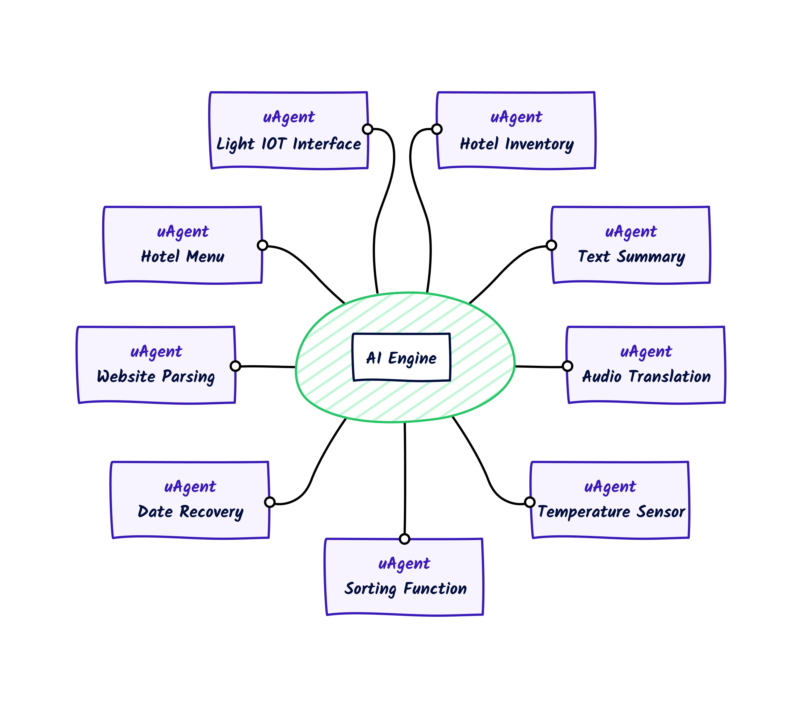

The AI Engine allows **chaining**. Say that you ask DeltaV "Tell me about the animal
Zebra". The AI Engine would then look for an agent that could give you a summary, as well as another agent that could provide information about zebras. The AI Engine understands that the **Summary Agent** requires text to parse and summarise. So it would contact the **Zebra Agent** and get the information from it. The AI Engine would then call the **Summary Agent** with the **Zebra Agent** information so that the former would return the summarized text.

It works like this:

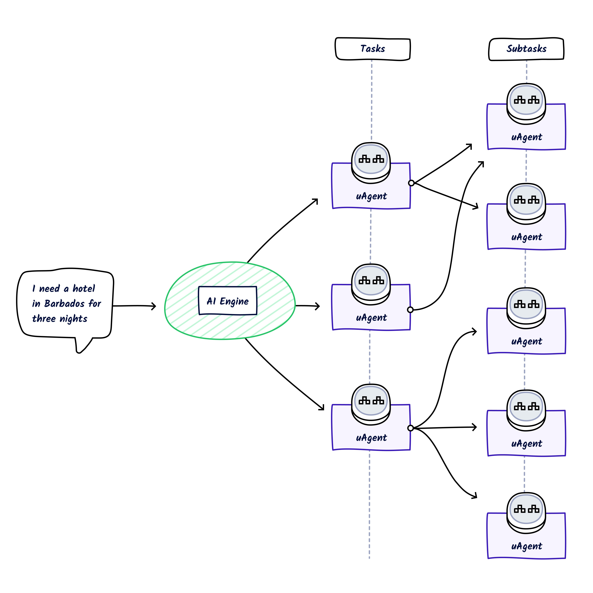

Simply put, when the AI Engine selects a response, the Secondary Functions available to be called for that Primary Function are already known to it.

Of course, this could be more complicated. What if every sensor on a car was an agent? You could ask your car for
diagnostics on a system, and each component in that system would independently give its status - making everything extremely complex. That's where the power of the AI Engine comes in. It understands the schema of each Agent, so there would be little need for each component to be compatible in communication with each other.

## Okay, so how does this all work?

To understand this, we need to look into a few more concepts:


Here, **two separate** processes are happening. The first part of the sequence diagram registers two agents:

 1. Firstly, agents register to a smart contract thus effectively paying to be discoverable.
 2. Agents then register as a Function on Agentverse (you'd usually do this manually).

Now that the Agents are registered and discoverable - let's move on to the second part of the diagram. The second part of the diagram introduces the flow of the AI Engine. This shows the role of a user who has entered a search term into DeltaV.

    1. A query comes in and it is sent to the AI Engine.
    2. The AI Engine has an internal loop that updates Agent Functions registered and indexed.
    3. It also has another internal loop that creates embeddings of these Functions.
    4. Upon receiving text, the AI Engine understands and maps the text to Functions.
    5. It now requests addresses from [Almanac ↗️](/references/contracts/uagents-almanac/almanac-overview) to message these Agents.
    6. The AI Engine sees that Agent (A) needs some text to perform its functions.
    7. It finds Secondary Function that can provide the required data.
    8. It then contacts the the Secondary Function, and the required data is returned.
    9. Data is passed to Agent (A) which returns a summary of the data.
    10. The response is then returned to the user on DeltaV.

**Primary and Secondary Functions are fundamental to accomplish users' objectives**.

## Okay, let's build a couple of Agents!

We've got a high-level idea of how this works. Let's build this on Agentverse so that we can get this running on
DeltaV and see the whole stack connected.

If you've never installed anything for Agent development, checkout these guides:

    - [Setup the development environment ↗️](/guides/agents/installing-uagent#development-tools)
    - [Install Agents locally ↗️](/guides/agents/installing-uagent#install-with-pip)

### Create your first agent: the text sentiment agent

We're going to run our agents locally, and set up a Mailbox on Agentverse.

    <Callout type="info" emoji="ℹ️">
       Check out the [Utilizing the Agentverse Mailroom service ↗️](/guides/agentverse/utilising-the-mailbox) for a better understanding of the Agentverse Mailroom feature.
    </Callout>

In this guide, our first agent takes any text and returns a sentiment of contents with **openAI**.

We need to create a Python file for this example.
We can do this by running: `touch sentiment_agent.py`

    ```py copy filename="sentiment_agent.py"
    from uagents import Agent, Context, Protocol, Model
    from ai_engine import UAgentResponse, UAgentResponseType
    import openai

    class SentimentResponse(Model):
        text: str

    SEED_PHRASE = ""
    AGENT_MAILBOX_KEY = ""

    sentimentagent = Agent(
        name="SentimentAgent", #or any name
        seed=SEED_PHRASE,
        mailbox=f"{AGENT_MAILBOX_KEY}@https://agentverse.ai",
    )

    print(sentimentAgent.address)

    content_protocol = Protocol("text sentiment analysis")

    def get_sentiment(text):
        response = openai.chat.completions.create(

            messages=[{
                "role": "user",
                "content": f"Sentiment analysis of the following text:\n{text}\n",
            }], model = ("gpt-3.5-turbo"))

        return response.choices[0].message.content

    @content_protocol.on_message(model=SentimentResponse, replies={UAgentResponse})
    async def sentiment(ctx: Context, sender: str, msg: SentimentResponse):

        sentiment = get_sentiment(msg.text)
        await ctx.send(
            sender, UAgentResponse(message=sentiment, type=UAgentResponseType.FINAL)
        )

    sentimentAgent.include(content_protocol, publish_manifest=True)
    sentimentAgent.run()
    ```

    <Callout type="warning" emoji="⚠️">
      Remember that you need to provide the `SEED_PHRASE`, `AGENT_MAILBOX_KEY`, `name`, `seed` and `mailbox` parameters to correctly run this example.
    </Callout>

Okay, we've got the whole code block above for our first agent. This agent does not run on Agentverse currently, as
`openai` is not supported. Have a look at list of available packages on the Agentverse [here ↗️](/guides/agentverse/allowed-imports).

There are a lot of really cool, neat things you need to know from code above. Let's explore it:

    ```py copy
    class SentimentResponse(Model):
        text: str

    SEED_PHRASE = ""
    AGENT_MAILBOX_KEY = ""

    sentimentAgent = Agent(
        name="SentimentAgent", #or any name
        seed=SEED_PHRASE,
        mailbox=f"{AGENT_MAILBOX_KEY}@https://agentverse.ai",
    )

    print(sentimentAgent.address)

    content_protocol = Protocol("text sentiment analysis")
    ```

    - The `class SentimentResponse` defines the structure of the message the agent expects to receive. In this case, each message
    should have `text` variable

    - `SEED_PHRASE` is our agents unique seed.

    - `AGENT_MAILBOX_KEY` mailbox key is our ID of our mailbox hosted on Agentverse.

    - `OPENAI_API_KEY` is our API key to OpenAI's APIs.

We can now initialize the Agent and define the [Protocol ↗️](/references/uagents/uagents-protocols/agent-protocols). To read more about **Agent objects**, please checkout [the reference docs ↗️](/references/uagents/uagents-api/agent#agent-objects).

Then, we have the **on_message()** handler:

    ```py copy
    @content_protocol.on_message(model=SentimentResponse, replies={UAgentResponse})
    async def sentiment(ctx: Context, sender: str, msg: SentimentResponse):

        sentiment = get_sentiment(msg.text)
        await ctx.send(
            sender, UAgentResponse(message=sentiment, type=UAgentResponseType.FINAL)
        )

    ```

We need a way for our Agent to receive messages. We do this by creating a function for our agent to handle all
 incoming messages from other Agents. We use `on_message()` decorator which activates the `sentiment()` function once
 our Agent receives a message matching the `SentimentResponse` message data `Model` we previously defined. Internally
you can see that `sentiment()` calls `get_sentiment()`, this is useful for you as a developer as this shows that
calling another function inside a decorated function is easy to do.

We can finally run the Agent at the bottom of the script:

    ```py
    sentimentAgent.include(content_protocol, publish_manifest=True)
    sentimentAgent.run()
    ```

Including the protocol in the Agent effectively allows other Agents to know how this Agent expects communication.

You can run this with: `poetry run python sentiment_agent.py`.

You'll see something like `agent1qtc5m8xudkm6gjv98k3kxl3ydzhkhzsfx6pgla0mzlgsawlqkzkvcjh5en2` in the terminal.

Let's use this address to create a **Mailbox** on the Agentverse.

### Creating a Mailbox for Sentiment Agent

A **mailbox** is a service provided by Agentverse that allows agents to receive messages when they're not running online.
`uagents` library will poll for new messages (and old unread ones) when your agent is running. Pretty handy.

Let's go to [Agentverse ↗️](https://agentverse.ai/agents/local) and create a Mailbox for this agent.

First of all, head over to the **My Agents** tab and click on the **Local Agents** tab.

Then, click on **Connect Local Agent** button and insert the **address** of the agent you want to retrieve.

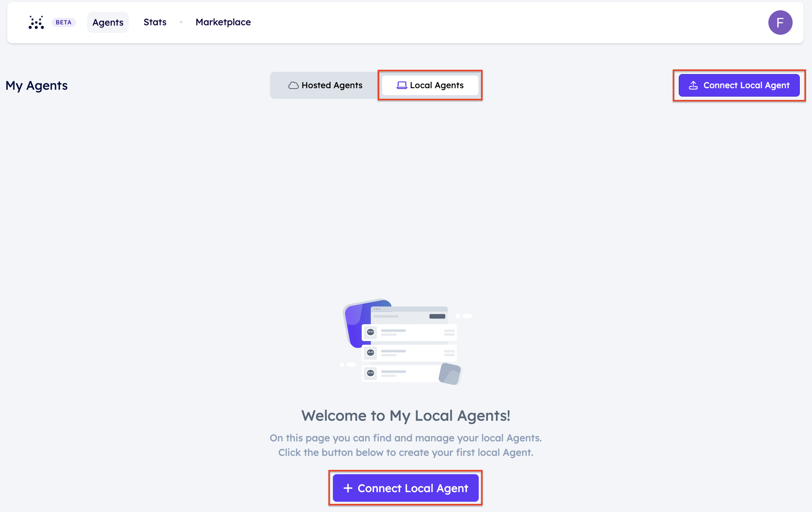

Let's paste in the Agent's address we printed before to screen.

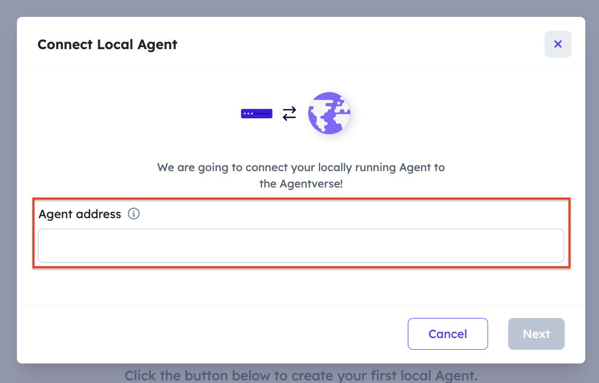

Once the Agent will be successfully fetched, add a **Name** to it.

A new **Mailbox API Key** will be provided for the local agent. Let's first copy the new Mailbox API Key and then update the `AGENT_MAILBOX_KEY = "AGENT_MAILBOX_KEY"` inline.

Now, you can restart your agent and it will be registered to the Mailbox.

Your terminal output will look similar to the following:

    ```
    Poetry run python html_summary_agent.py
    agent1XXXXXXXXXXXXXXXXXXXXXXXXXXXXXXXXXXXXX4
    INFO:     [SentimentAgent]: Manifest published successfully: Text Sentiment
    INFO:     [SentimentAgent]: Almanac registration is up to date!
    INFO:     [SentimentAgent]: Connecting to mailbox server at agentverse.ai
    INFO:     [SentimentAgent]: Mailbox access token acquired
    ```

#### Let's run this agent on DeltaV, it'll be good to test, right?

We're going to need to create an **Agent Function** on Agentverse; to get a comprehensive overview of what Agent Functions visit [our dedicated guide ↗️](/guides/services/services). To get the idea, an **Agent Function** refers to an Agent enrolled within the Agentverse, and made discoverable by other agents and users for interaction, which is retrievable through natural language queries. For instance, a Function could be an Agent helping in booking an airplane ticket to some destination. Successfully registered Agent Functions are discoverable and accessible through DeltaV and users can engage with them using natural language queries.

Let's go to the [Agentverse ↗️](https://agentverse.ai/) and head over to the **My Agents** tab and select the Agent we have fetched above through **Connect Local Agent** button. A page will open showing your Agent Profile details.

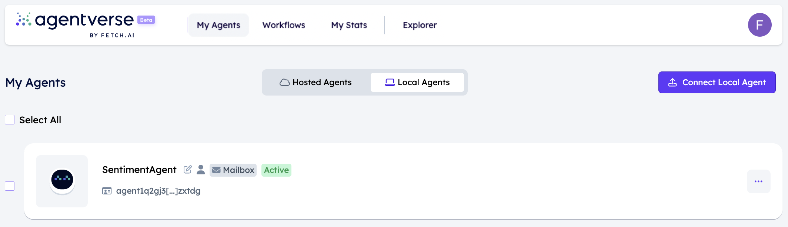

Click on **Deploy** tab to start creating an Agent Function retrievable via DeltaV. Provide all the needed information to correctly register the Function. Remember that descriptions need to be as detailed as possible.

The following is the Agent Function for the **SentimentAgent**:

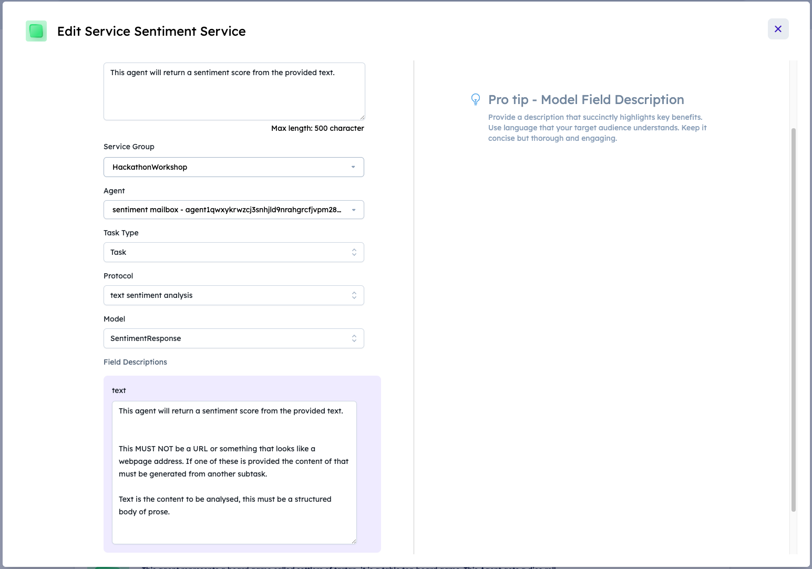

Really simple just defining what this function does. Simplicity for single function descriptions is good.

Let's head over to DeltaV and communicate with our agent.

I'm going to go ahead and ask:

 > "Provide the sentiment from this text "Petrol prices across the UK have hit an average 150.1 pence a litre, reaching the
 highest level since last November, according to the AA motoring group. Data also showed that average diesel prices rose to 158.3 pence a litre on Monday. Experts blamed a rise in oil prices because of tensions in the Middle East, as well as a weaker pound compared to the dollar. The AA predicted drivers would "re-tighten their belts on other spending". While overall inflation - which measures the pace of price rises - has eased, the cost of petrol and diesel both rose in March. "Inflation has been heading downwards at quite some speed but petrol's rebound to 150p a litre leaves a big boulder in the road," said Luke Bosdet, the AA's spokesman on pump prices. Prices are based on data collected by the Competition and Markets Authority (CMA) from nearly 3,000 forecourts and analyzed by market research firm Fuel Prices Online. Data showed that 28.1% of the forecourts were charging at least 150p per litre for petrol on Monday, up from 23.8% a week earlier. But Mr Bosdet predicted that fuel prices are unlikely to be elevated for long with wholesale costs easing a little in recent days, adding that filling up "may not get much worse in the short-term". Oil prices have fallen after they spiked in the wake of Israel's retaliatory attack on Iran last week. Caroline Bain, chief commodities economist at Capital Economics, said: "Given that there will be some lag between spot crude oil prices in financial markets and prices on the forecourt, the latest rise is perhaps not so surprising." While Brent crude - a key benchmark for oil prices internationally - has receded from last week, it is still trading 13% higher at $87 per barrel compared to the start of the year."

Oil is often an issue in UK news. Let's find out the sentiment.

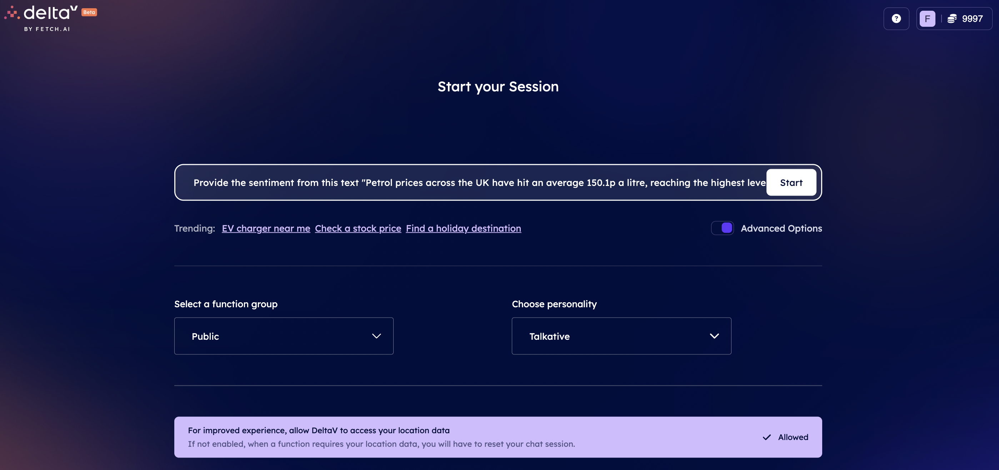

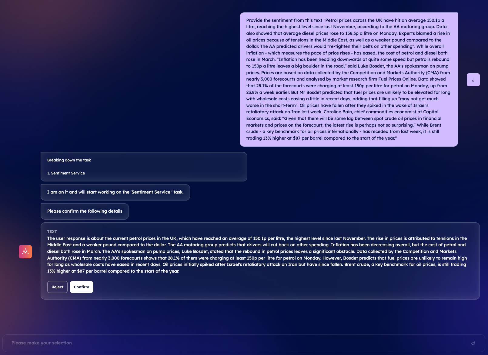

DeltaV tells us AI Engine has found an Agent Function for our query, and checks we want to send the information we defined.

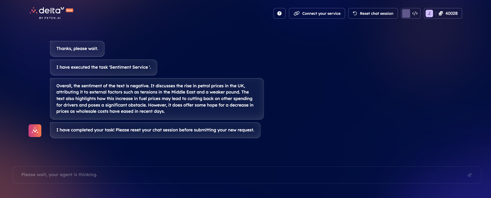

Then, DeltaV get the response from the Agent Function and returns this to the user.

Your Agent running locally should provide a similar output to this one below:

    ```
    INFO:     [sentiment]: Manifest published successfully: text sentiment analysis
    INFO:     [sentiment]: Almanac registration is up to date!
    INFO:     [sentiment]: Connecting to mailbox server at agentverse.ai
    INFO:     [sentiment]: Mailbox access token acquired
    INFO:httpx:HTTP Request: POST https://api.openai.com/v1/chat/completions "HTTP/1.1 200 OK"
    ```

Okay, take a quick break then let's create the second Agent; it's time to introduce multi-agent workflows ☕.

### Create the Webpage Summary Agent

The next agent in the chain is the **Summary agent**. Let's name the script `web_summary_agent.py`.

This Agent has the same structure as the sentiment Agent we previously defined.

Let's take a look.

    ```py copy filename="web_download_agent.py"
    from langchain.chains.summarize import load_summarize_chain
    from langchain_community.document_loaders import UnstructuredHTMLLoader
    from langchain_openai import ChatOpenAI
    from uagents import Agent, Context, Protocol, Model
    from ai_engine import UAgentResponse, UAgentResponseType
    import requests
    import os

    class SummaryRequest(Model):
        url: str


    SEED_PHRASE = "<your_seed_phrase>"
    AGENT_MAILBOX_KEY = "<your_mailbox_key>"
    OPENAI_API_KEY = "<your_open_ai_key>"

    summaryAgent = Agent(
        name="SummaryAgent",
        seed=SEED_PHRASE,
        mailbox=f"{AGENT_MAILBOX_KEY}@https://agentverse.ai",
    )

    summary_protocol = Protocol("Text Summariser")

    print(summaryAgent.address)
    print(OPENAI_API_KEY)


    @summary_protocol.on_message(model=SummaryRequest, replies={UAgentResponse})
    async def summarise(ctx: Context, sender: str, msg: SummaryRequest):

    r = requests.get(msg.url)
    with open("./temp.html", "w", encoding="utf-8") as f:
        f.write(r.text)

    # Step 1: Initialize WebBaseLoader with the given URL
    loader = UnstructuredHTMLLoader("./temp.html")

    # Step 2: Load the document
    docs = loader.load()

    # Step 3: Load summarization chain
    llm = ChatOpenAI(openai_api_key=OPENAI_API_KEY, temperature=0, model_name="gpt-3.5-turbo-1106")
    chain = load_summarize_chain(llm, chain_type="stuff")

    # Step 4: Run the summarization chain on the loaded document
    summarized_content = chain.invoke(docs)
    summarized = summarized_content["input_documents"][0].to_json()

    # Step 5: Define the needed dependencies
    dependencies = {
        "langchain": ">=1.0.0",
        "langchain_community": ">=1.0.0",
        "langchain_openai": ">=1.0.0"
    }

    result = chain.invoke(docs)

    await ctx.send(
        sender,
        UAgentResponse(message=(result["output_text"]), type=UAgentResponseType.FINAL),
    )


    summaryAgent.include(summary_protocol, publish_manifest=True)
    summaryAgent.run()
    ```

    <Callout type="warning" emoji="⚠️">
      Remember that you need to provide the `SEED_PHRASE`, `AGENT_MAILBOX_KEY`, `OPENAI_API_KEY`, `name`, `seed` and `mailbox` parameters to correctly run this example.
    </Callout>

This Agent is simple again, hopefully you're seeing a pattern here. These Agents while independent of each other can
compliment one another.

    <Callout type="info" emoji="ℹ️">
       Check out the [Communicating with other agents ↗️](/guides/agents/communicating-with-other-agents) guide to check how agents communication works without the AI Engine.
    </Callout>

Aside from the different logic, the primary difference in `web_summary_agent.py` is that this agent does not rely on a separate function, and wraps the whole logic in the message handler.

Let's run this one too. Again, follow the steps for the previous Agent and go and register a Mailbox and update this agent with the new Mailbox. Each agent must have a unique [Mailbox ↗️](/guides/agents/intermediate/mailbox).

## One more Agent Function 🎵

The following is the Function for the **Summary_agent**:

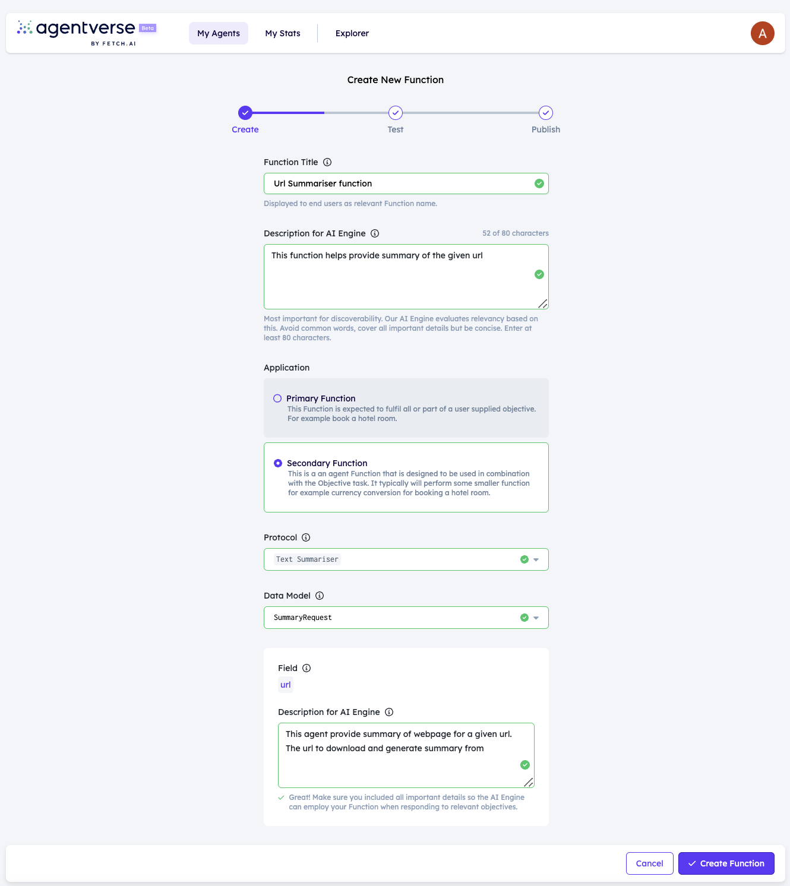

This one is quite simple, but we are defining this as a Secondary Function. A Secondary Function tells the AI Engine that this function should only be called to support another agent, and not as a primary response. You can learn more about this in our [guide ↗️](/guides/services/services#primary-and-secondary-functions)

We also need to go and update the Sentiment Agent Function.

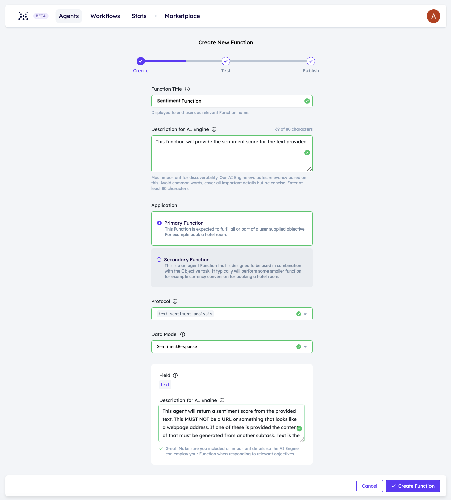

Oh my, that is quite the field description.

> "This agent will return a sentiment score from the provided text.
This MUST NOT be a URL or something that looks like a webpage address. If one of these is provided the content of
that must be generated from another subtask.
Text is the content to be analyzed, this must be a structured body of prose."

We're talking to an LLM and the above should reinforce that. We're telling the AI Engine that this function returns sentiment analysis on text. However when this function is called, the user could also provide a URL. If a URL is provided then the AI Engine must get that from somewhere else. Let's test this.

## Let's go to DeltaV!

We're hoping here that we can ask for a sentiment of a webpage. You may need to adjust your question, or update field descriptions for this to work perfectly, but in latest this is working for us.

    <Callout type="warning" emoji="⚠️">
      We encourage everyone operating on DeltaV to select the **Next Generation** AI Engine personality type. This AI Engine personality stands as a significant personality type offering _enhanced scalability_, _reliability_, and _flexibility_. The major key features include advanced context understanding, improved function recommendations, and the ability to handle multiple dialogue formats.
    </Callout>

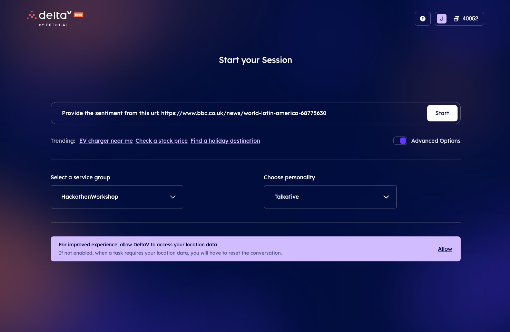

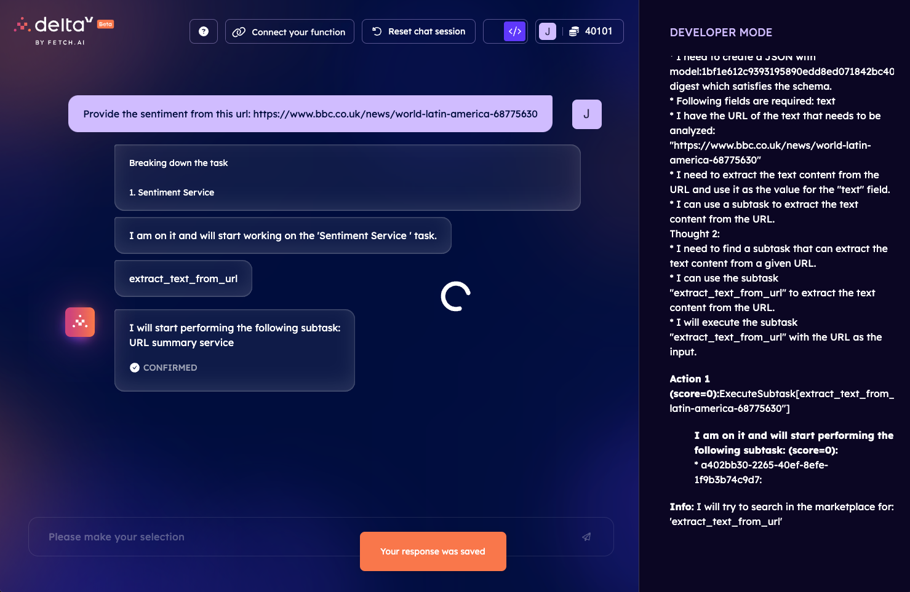

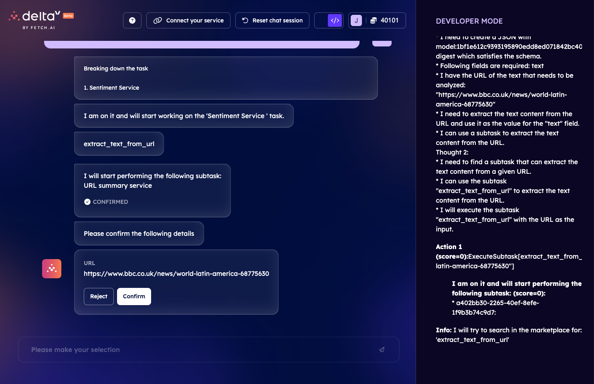

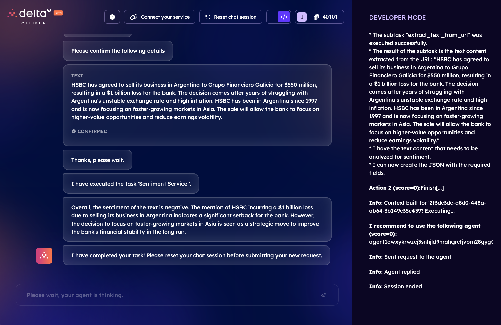

## What's next?

Thank you for sticking with us on this guide, this guide aims to show you the true potential of an AI system that can execute code at the prompt of a user.

We invite you to dive deeper into the world of Agents, Agentverse and AI Engine by exploring the dedicated documentation and [GitHub ↗️](https://github.com/fetchai/) repository. Join our [Discord ↗️](https://discord.com/invite/fetchai) and team up with other developers to participate in hackathons, collectively build projects, or simply have fun!
