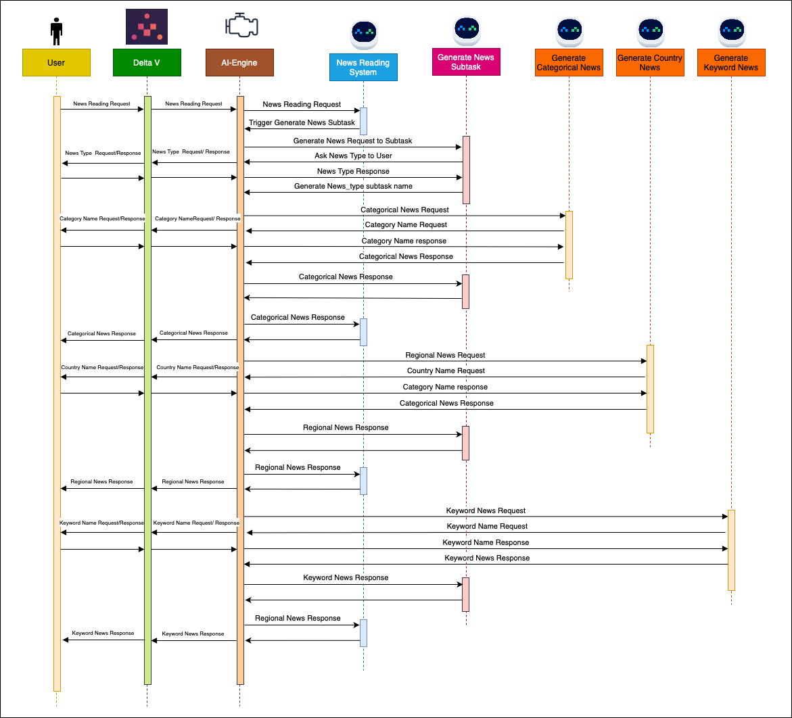
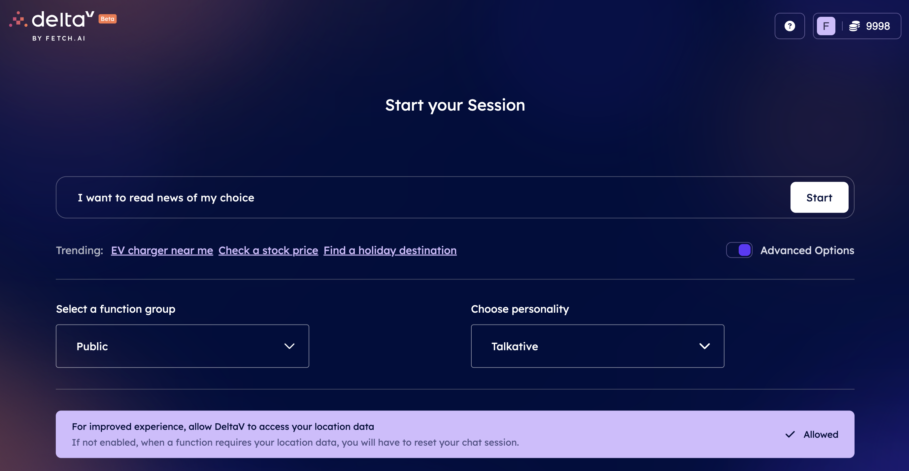
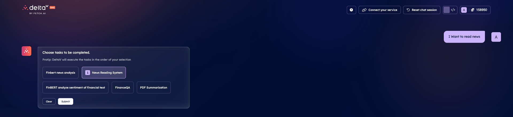
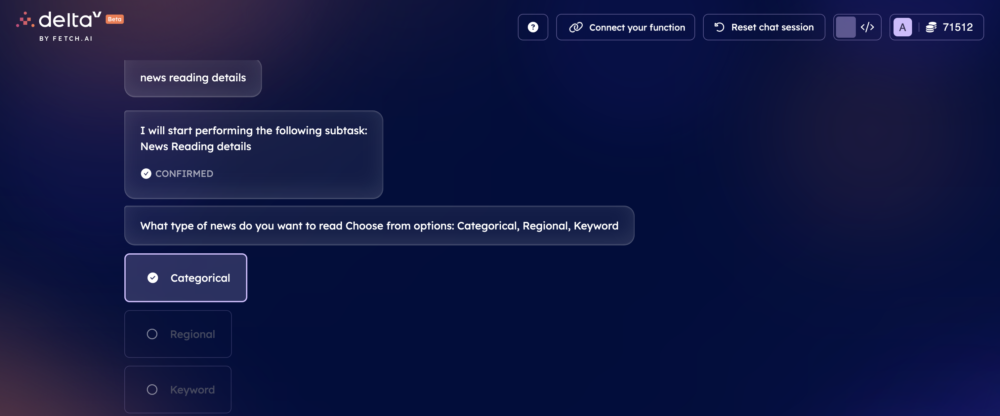
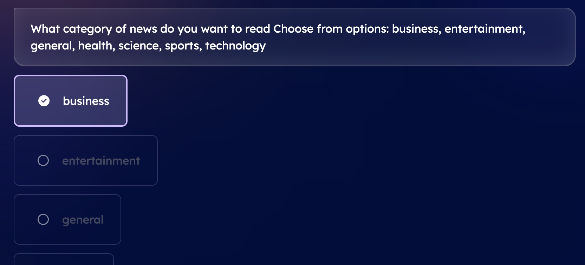
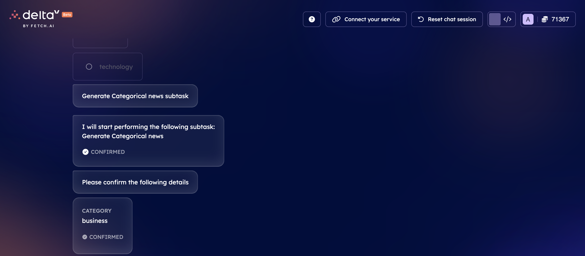
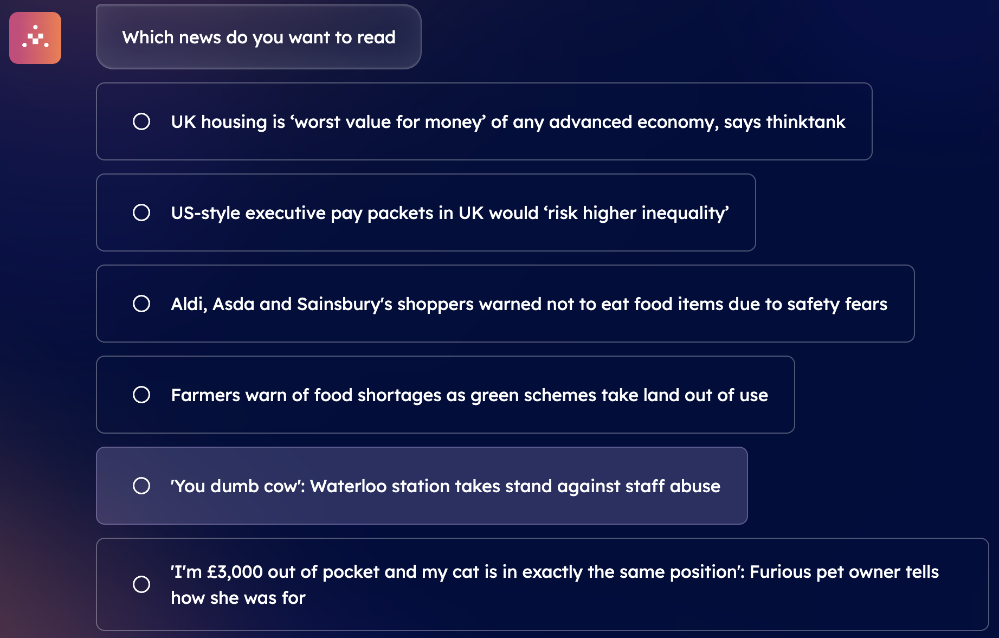
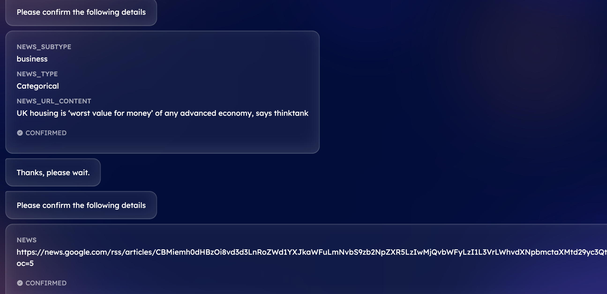

import { Callout } from 'nextra/components'
import PackageVersion from 'components/package-version'

# Multi-file agent pipeline for AI Engine: using News API to build network of functions and secondary functions in Agentverse

## Introduction

This agents network helps users to read news of different types including **Categorical**, **Country** based or **Keyword** related news. The system operates based on a multiple layers structure of Primary and Secondary functions, each one of them playing a vital role in delivering personalized news content to users.

There are three layers of functions to let users read news and which altogether return news matching the specific type and subtype based on the user's preferences. For an overall workflow of the user's requests, please refer below flow chart.



First of all, we have the **News Reading URL System**; this one acts as the gateway to news headlines. This layer enables the connection between users and the latest news headlines. When the user expresses interest in reading the news, the [AI Engine ↗️](/concepts/ai-engine/ai-engine-intro) drives the News Reading System and initiates the process of fetching news articles for the user. Once the system understands your intent is to read news headlines, it will call upon the **News Reading Details Secondary function**. At this point, users will be required to provide the news type and subtype they want to read via [DeltaV ↗️](/concepts/ai-engine/deltav).

Once users provides the input for the type and subtype of news they want to read, the system will take in the user's preferences and decide which specific type of news the user is interested in, whether it it categorical (e.g., business or sports), regional news from a specific country, or news related to a particular keyword.

With the user's news preference in hand, the system redirects request to one of the specialized Secondary functions: the **Generate news_type Secondary function**. These Secondary functions are like expert news gatherers, each dedicated to a specific type of news based on the user's preference provided.

All **Primary** and **Secondary** functions redirections are handled by **AI Engine**. It processes user preferences and triggers the appropriate functions to fulfil the user's objective. By providing clear and concise field descriptions for each Primary and Secondary functions, the AI Engine will ensure straightforward navigation through the News Reading System and operations, making it easy for users to stay informed on the topics that matter the most to them.

## Prerequisites

Make sure you have read the following resources before going on with this guide:

    - [Quick Start Guide for uAgents Framework ↗️](/guides/agents/quickstart)
    - [Creating your first agent ↗️](/guides/agents/getting-started/create-a-uagent)
    - [Agents address ↗️](/guides/agents/getting-started/getting-uagent-address)
    - [Almanac contract ↗️](/concepts/fetch-network/almanac)
    - [Register in Almanac ↗️](/guides/agents/register-in-almanac)
    - [Agents protocols ↗️](/references/uagents/uagents-protocols/agent-protocols)
    - [Exchange protocol ↗️](/references/uagents/uagents-protocols/exchange-protocol)
    - [Agent Functions ↗️](/guides/agents/intermediate/agent-functions)
    - [Make your agents AI Engine compatible ↗️](/guides/agents/intermediate/ai-engine-compatible-agent)
    - [Multi-file agent pipeline for AI Engine: Hugging face API to create a multi agent pipeline ↗️](/guides/agents/intermediate/primary-secondary-functions)

## Imports needed

    - [uAgents ↗️](https://pypi.org/project/uagents/)
    - [AI Engine ↗️](https://pypi.org/project/uagents-ai-engine/)

## Primary and Secondary functions

The **Primary** and **Secondary** functions descriptions and names should be relevant to make it easy for the LLM to identify the type of Secondary function to trigger and when. Descriptions of Primary and Secondary functions should always indicate when specific Secondary functions should be triggered. In this case one of multiple Secondary functions is to be triggered, it should be provided in the dictionary to enhance the LLM's understanding. For instance, you can refer to the example below where the **News Reading Details Secondary function** triggers one of the **Generate news_type Secondary function** based on the user's requirement.

**Field description** is another feature of services which should mention use of subtasks in a clear and concise way.
Refer to the [Agentverse Functions ↗️](/guides/agents/intermediate/agent-functions#primary-and-secondary-functions) for more details on Primary and Secondary functions. Also, have a look at the [Agentverse Functions ↗️](/guides/agentverse/agentverse-functions/field-descriptions-for-deltav) for guidance on fields descriptions of your Agent Functions!

## News API

Login to [News API ↗️](https://newsapi.org/docs/endpoints/top-headlines) and get your API key by logging in and registering for API. This API key will be used in agent scripts to fetch news related to a specific type and subtype.

### News Reading URL System Agent

This agent helps users to read news according to their willingness. This agent triggers the news details gathering secondary functions and asks the user for the news type and subtype they want to read today. This agent responds to the final result to the [DeltaV ↗️](/concepts/ai-engine/deltav) GUI as well.

    ```python copy filename="agent.py"

    # Here we demonstrate how we can create a news reading system agent that is compatible with DeltaV
        
    # After running this agent, it can be registered to DeltaV on Agentverse. For registration you will have to use the agent's address

    # Import required libraries
    import requests
    from ai_engine import UAgentResponse, UAgentResponseType

    # Define News Reading Model
    class News(Model):
        news : str

    # Define Protocol for news reading system
    news_protocol = Protocol("News System")

    # Define a handler for the News system protocol
    @news_protocol.on_message(model=News, replies = UAgentResponse)
    async def on_news_request(ctx: Context, sender: str, msg: News):
        #Printing the news response on logger
        ctx.logger.info(f"Received news request from {sender} with title: {msg.news}")
        #Creating hyperlink and sending final response to the DeltaV GUI
        message = f"<a href='{msg.news}'>YOUR NEWS CONTENT</a>"
        await ctx.send(sender, UAgentResponse(message = message, type = UAgentResponseType.FINAL))


    # Include the Generate News protocol in your agent
    agent.include(news_protocol)
    ```

Now click on the **Run** button in the upper right corner of the editor so that you have your news system agent agent up and running!

### News Reading Details Agent

This agent asks users for the type and subtype of news they want to read today from options like **categorical**, **country** related or **keyword** related and respective subtypes. It then directs the user request to relevant secondary function to generate that type of news title and respond it back to the **News Reading system**.

    ```python copy filename="agent.py"
    # Here we demonstrate how we can create a news details agent that is compatible with DeltaV.
    # After running this agent, it can be registered to DeltaV on Agentverse. For registration you will have to use the agent's address.

    # Import required libraries
    import requests
    import json
    from ai_engine import UAgentResponse, UAgentResponseType

    # Define News Generating Model.
    class GetNewsDetails(Model):
        news_type: str
        news_subtype : str
        news_url_content : str

    # Define Generate news protocol.
    generate_news_protocol = Protocol("Get News Details")

    # Define a handler for the News generation protocol
    @generate_news_protocol.on_message(model=GetNewsDetails, replies=UAgentResponse)
    async def news_details_agent(ctx: Context, sender: str, msg: GetNewsDetails):
        
        # Logging user request
        ctx.logger.info(f"Received ticket request from {sender} with prompt: {msg.news_type} and {msg.news_subtype}")#and {msg.news_subtype}
        # Defining dictionary for country codes
        country_codes = {
        "argentina": "ar", "australia": "au", "austria": "at", "belgium": "be", 
        "bulgaria": "bg", "brazil": "br", "canada": "ca", "china": "cn", 
        "colombia": "co", "cuba": "cu", "czech republic": "cz", "germany": "de", 
        "egypt": "eg", "france": "fr", "united kingdom": "gb", "greece": "gr", 
        "hong kong": "hk", "hungary": "hu", "indonesia": "id", "ireland": "ie", 
        "israel": "il", "india": "in", "italy": "it", "japan": "jp", 
        "south korea": "kr", "lithuania": "lt", "latvia": "lv", "morocco": "ma", 
        "mexico": "mx", "malaysia": "my", "nigeria": "ng", "netherlands": "nl", 
        "norway": "no", "new zealand": "nz", "philippines": "ph", "poland": "pl", 
        "portugal": "pt", "romania": "ro", "serbia": "rs", "russia": "ru", 
        "saudi arabia": "sa", "sweden": "se", "singapore": "sg", "slovenia": "si", 
        "slovakia": "sk", "thailand": "th", "turkey": "tr", "taiwan": "tw", 
        "ukraine": "ua", "united states": "us", "venezuela": "ve", "south africa": "za"
        }


        try:
            # Generate news based on the requested category.
            ctx.logger.info('Getting News URL')
            ctx.logger.info(f'User have selected {msg.news_type} type and {msg.news_subtype} subtype')

            # Checking news type and getting news url
            if msg.news_type.lower() == 'categorical': # For categorical news type
                main_url = f"https://newsapi.org/v2/top-headlines?country=gb&category={msg.news_subtype}&apiKey={api_key}"
                response = requests.get(main_url).json()
                ctx.logger.info(response)
                # Iterate through the news articles to find a title containing the msg.news
                for article in response['articles']:
                    if msg.news_url_content.lower() in article['title'].lower():
                        # If found, send the URL back as a clickable link
                        news_url = article['url']
                        ctx.logger.info(f'Categorical news {news_url}')
                        await ctx.send(sender, UAgentResponse(message = str(news_url), type = UAgentResponseType.FINAL))
            elif msg.news_type.lower() == 'regional': # For regional news type
                main_url = f"https://newsapi.org/v2/top-headlines?country={country_codes.get(msg.news_subtype.lower())}&apiKey={api_key}"
                response = requests.get(main_url).json()
                ctx.logger.info(response)
                # Iterate through the news articles to find a title containing the msg.news
                for article in response['articles']:
                    if msg.news_url_content.lower() in article['title'].lower():
                        # If found, send the URL back as a clickable link
                        news_url = article['url']
                        ctx.logger.info(f'Regional news {news_url}')
                        await ctx.send(sender, UAgentResponse(message = str(news_url), type = UAgentResponseType.FINAL))
            
            elif msg.news_type.lower() == 'keyword': # For Keyword news type
                main_url = f"https://newsapi.org/v2/top-headlines?q={msg.news_subtype}&apiKey={api_key}"
                response = requests.get(main_url).json()
                ctx.logger.info(response)
                # Iterate through the news articles to find a title containing the msg.news
                for article in response['articles']:
                    if msg.news_url_content.lower() in article['title'].lower():
                        # If found, send the URL back as a clickable link
                        news_url = article['url']
                        ctx.logger.info(f'Keyword news {news_url}')
                        await ctx.send(sender, UAgentResponse(message = str(news_url), type = UAgentResponseType.FINAL))
            else: # If news type is not valid
                await ctx.send(sender, UAgentResponse(message = "You have not provided valid news type", type = UAgentResponseType.FINAL))

        # Handle any exceptions that occur during news generation.
        except Exception as exc:
            ctx.logger.error(f"Error in generating  news: {exc}")
        
            # Send an error response with details of the encountered error.
            await ctx.send(
                sender,
                UAgentResponse(
                    message=f"Error in generating news: {exc}",
                    type=UAgentResponseType.ERROR
                    )
                    )

    # Include the Generate News protocol in your agent.
    agent.include(generate_news_protocol)
    ```

Now click on the **Run** button in the upper right corner of the editor so that you have your news system agent agent up and running!

### Generate Categorical News

This subtask is triggered if the user wants to read categorical news and it provides the the category of news which is subtype in news reading details from options business, entertainment, general, health, science, sports, technology and return specific news titles options as list to **News Reading Details Secondary function**.

    ```python copy filename="agent.py"
    # Here we demonstrate how we can create a categorical news generating agent that is compatible with DeltaV.
    # After running this agent, it can be registered to DeltaV on Agentverse. For registration you will have to use the agent's address.

    # Importing libraries
    import requests
    import json
    from ai_engine import UAgentResponse, UAgentResponseType

    # Define the Generate News model
    class GenerateNews(Model):
        category: str

    # Define protocol for categorical news generation
    generate_cat_news_protocol = Protocol("Generate Categorical News")

    # Define function to generate news according to category in great britain - GB
    async def generate_news(category):
        api_key = 'YOUR_NEWS_API_KEY'
        main_url = f"https://newsapi.org/v2/top-headlines?country=gb&category={category}&apiKey={api_key}"
        news = requests.get(main_url).json() 
        #strip the source, get top 10 news and join the list with ' nnn ' to return the news as string and not list (DeltaV compatible type)
        titles = [article['title'].split(' - ')[0].strip() for article in news['articles']]
        titles = titles[:10]
        return titles

    # Define a handler for the Categorical News generation protocol
    @generate_cat_news_protocol.on_message(model=GenerateNews, replies=UAgentResponse)
    async def on_generate_cat_news_request(ctx: Context, sender: str, msg: GenerateNews):
        # Logging category of news user wants to read
        ctx.logger.info(f"Received ticket request from {sender} with prompt: {msg.category}")
        try:
            # Generate news based on the requested category
            news_titles = generate_news(msg.category)
            #logging news
            ctx.logger.info(news_titles)
            # Send a successful response with the generated news
            await ctx.send(sender, UAgentResponse(message = str(news_titles), type = UAgentResponseType.FINAL))
                
        # Handle any exceptions that occur during news generation
        except Exception as exc:
            ctx.logger.error(f"Error in generating News: {exc}")
            # Send an error response with details of the encountered error.
            await ctx.send(
                sender,
                UAgentResponse(
                    message=f"Error in generating News: {exc}",
                    type=UAgentResponseType.ERROR
                )
            )


    # Include the Generate News protocol in your agent
    agent.include(generate_cat_news_protocol)
    ```

Remember that you need to provide the `api_key` parameter to correctly run this code. Now click on the **Run** button in the upper right corner of the editor so that you have your news system agent agent up and running!

### Generate Regional News

This subtask is triggered if the user wants to read regional or country specific news, it gets country as news subtype **News Reading details Secondary function** and get list of news titles.

    ```python copy filename="agent.py"
    # Import libraries
    import requests
    import json
    from ai_engine import UAgentResponse, UAgentResponseType

    # Define dictionary with country codes
    country_codes = {
        "argentina": "ar", "australia": "au", "austria": "at", "belgium": "be", 
        "bulgaria": "bg", "brazil": "br", "canada": "ca", "china": "cn", 
        "colombia": "co", "cuba": "cu", "czech republic": "cz", "germany": "de", 
        "egypt": "eg", "france": "fr", "united kingdom": "gb", "greece": "gr", 
        "hong kong": "hk", "hungary": "hu", "indonesia": "id", "ireland": "ie", 
        "israel": "il", "india": "in", "italy": "it", "japan": "jp", 
        "south korea": "kr", "lithuania": "lt", "latvia": "lv", "morocco": "ma", 
        "mexico": "mx", "malaysia": "my", "nigeria": "ng", "netherlands": "nl", 
        "norway": "no", "new zealand": "nz", "philippines": "ph", "poland": "pl", 
        "portugal": "pt", "romania": "ro", "serbia": "rs", "russia": "ru", 
        "saudi arabia": "sa", "sweden": "se", "singapore": "sg", "slovenia": "si", 
        "slovakia": "sk", "thailand": "th", "turkey": "tr", "taiwan": "tw", 
        "ukraine": "ua", "united states": "us", "venezuela": "ve", "south africa": "za"
    }

    # Define the Generate News model
    class GenerateNews(Model):
        country: str

    # Define function to generate regional news according to country
    async def get_regional_news(country):
        api_key = 'YOUR_API_KEY'
        main_url = f"https://newsapi.org/v2/top-headlines?country={country_codes.get(country.lower())}&apiKey={api_key}"
        news = requests.get(main_url).json() 
        # Strip the source, get top 10 news and join the list with nnn to return the news as string and not list - DeltaV compatible type
        titles = [article['title'].split(' - ')[0].strip()for article in news['articles']]
        titles = titles[:10]
        return titles

    # Define protocol for regional news generation Protocol
    generate_news_reg_protocol = Protocol("Generate Regional News")

    # Define a handler for the Regional News generation protocol
    @generate_news_reg_protocol.on_message(model=GenerateNews, replies=UAgentResponse)
    async def on_generate_news_request(ctx: Context, sender: str, msg: GenerateNews):

        ctx.logger.info(f"Received ticket request from {sender} with prompt: {msg.country}")
        try:
            # Get the country code from the country_code dictionary
            country_code = country_codes.get(msg.country.lower())
            # Generate news based on the requested country and log it on agentverse
            news_titles = await get_regional_news(msg.country)
            ctx.logger.info(f"Message from endpoint: {news_titles}")
            # Send a successful response with the generated news
            await ctx.send(sender, UAgentResponse(message=str(news_titles), type=UAgentResponseType.FINAL))
        # Handle any exceptions that occur during news generation
        except Exception as exc:
            ctx.logger.error(f"Error in generating News: {exc}")
            # Send an error response with details of the encountered error
            await ctx.send(
                sender,
                UAgentResponse(
                    message=f"Error in generating News: {exc}",
                    type=UAgentResponseType.ERROR
                )
            )
                

    # Include the Generate Regional News protocol in your agent
    agent.include(generate_news_protocol)
    ```

Remember that you need to provide the `api_key` parameter to correctly run this code. Now click on the **Run** button in the upper right corner of the editor so that you have your news system agent agent up and running!

### Generate Keyword News

This subtask is triggered if the user wants to read keyword specific news, it gets keyword as news subtype **News reading details Secondary function** and get list of news titles.

    ```python copy filename="agent.py"
    # Import libraries
    import requests
    import json
    from ai_engine import UAgentResponse, UAgentResponseType

    # Define the Generate News model
    class GenerateNews(Model):
        keyword: str

    # Define protocol for keyword news generation
    generate_news_keyw_protocol = Protocol("Generate Keyword News")
    
    # Define function to generate news according to keyword
    async def get_keyword_news(keyword):

        api_key = 'YOUR_API_KEY'
        main_url = f"https://newsapi.org/v2/top-headlines?q={keyword}&apiKey={api_key}"
        news = requests.get(main_url).json() 
        # Strip the source, get top 10 news and join the list with nnn to return the news as string and not list - DeltaV compatible type
        titles = [article['title'].split(' - ')[0].strip() for article in news['articles']]
        titles = titles[:10]
        return titles

    # Define a handler for the Keyword News generation protocol
    @generate_news_keyw_protocol.on_message(model=GenerateNews, replies=UAgentResponse)
    async def on_generate_news_request(ctx: Context, sender: str, msg: GenerateNews):

        ctx.logger.info(f"Received news request from {sender} with prompt: {msg.keyword}")
        # Generate news based on the requested keyword
        try:
            news_titles = get_keyword_news(msg.keyword)
            # Send a successful response with the generated news
            await ctx.send(
                sender,
                UAgentResponse(
                    message=str(news_titles),
                    type=UAgentResponseType.FINAL
                )
            )

        # Handle any exceptions that occur during news generation
        except Exception as exc:
            ctx.logger.error(f"Error in generating News: {exc}")
            # Send an error response with details of the encountered error
            await ctx.send(
                sender,
                UAgentResponse(
                    message=f"Error in generating News: {exc}",
                    type=UAgentResponseType.ERROR
                )
            )

    # Include the Generate Keyword News protocol in your agent
    agent.include(generate_news_keyw_protocol)
    ```

Remember that you need to provide the `api_key` parameter to correctly run this code. Now click on the **Run** button in the upper right corner of the editor so that you have your news system agent agent up and running!

## Registering Functions

Let's navigate to the [Agentverse ↗️](https://agentverse.ai) to start registering your agent Functions.

    <Callout type="info" emoji="ℹ️">
      For further information on Agent Functions and registration process, see [Register Agent Functions on the Agentverse ↗️](/guides/agentverse/registering-agent-services) resource.

    </Callout>

Considering the local agents in this guide, in order to register **Local Agents and respective Functions** on the Agentverse, you will first need to log in the [Agentverse ↗️](https://agentverse.ai/) and head over to the **My Agents** tab. Then, click on **Local Agents** tab and click one of the **Connect Local Agent** buttons.


You will need to provide the **local agent address** and make sure it is running on your terminal as only running agents can enroll Agent Functions on the Agentverse!


   <Callout type="warning" emoji="⚠️">
     If you see a message saying **"We couldn't find this agent address on Fetch Network"** you will need to wait for some time (around 5 minutes) until the protocols are uploaded successfully on the Fetch Network and your agent is retrievable.
   </Callout>

Once your agent is retrieved correctly, you will see a box depicting it within the **My Agents** tab. Click on it and head over to the **Deploy** tab and click on **+ New Function**. Here, you can now provide the needed details for your Agent Function in the dedicated fields. Remember to provide detailed descriptions for what your **Agent Function** does and the **Fields** for data Models expected. understanding of Functions fields descriptions.

You will need to fill the Agent Function form out with a description for each _Primary_ and _Secondary_ functions.

### News Reading URL System

    - **Function title**: just the name of your function; in this example let's call it **News Reading URL System**.
    - **Description for AI Engine**: super important to be as detailed as you can, as reasoning engine looks at descriptions to understand what your function does; in this example we can specify something like "**Always go for Secondary function with ID **news reading details** secondary function. The function provides news clickable hyperlink user wants to read according to their choice.**".
    - **Application**: Primary function.
    - **Protocol** and **Data Model** will be automatically populated based on the source code of [your news reading system agent ↗️](/guides/agents/advanced/utilizing-api-to-build-network-of-task-and-subtask#news-reading-agent).
    - **Field descriptions**:

        _news_: Go for Secondary function with id "news reading details".  never ask this to user. This describes news which user wants to read.

Click **Save** button after filling out the form.

### News Reading Details Secondary function

    - **Function title**: just the name of your service; in this example let's call it **News Reading details**.
    - **Description for AI Engine**: super important to be as detailed as you can, as reasoning engine looks at descriptions to understand what your function does; in this example we can specify something like "**This function takes different details for news reading from user. This is triggered always after News Reading url system.**
    - **Application**: Secondary function.
    - **Protocol** and **Data Model** will be automatically populated based on the source code of [your news generating agent ↗️](/guides/agents/advanced/utilizing-api-to-build-network-of-task-and-subtask#news-generating-agent).
    - **Field descriptions**: Below are the field descriptions for News reading system.
        - news_subtype - **This describes the news subtype user wants to read and ask for question corresponding to user's choice of news type below. Only ask one of the below to user:**

            - **'categorical': One from list [business, entertainment, general, health, science, sports, technology].**
            - **'regional' : What is the country you want to get news for?,**
            - **'keyword' : What is the keyword you want to read news for?**
            
        - news_type - **This is type of news user wants to read from options from Categorical, Regional or Keyword. After this ask user for field news_subtype.**
        - news_url_content - **Trigger corresponding secondary function according to 'news_type' given by user to get this field:**

            - **Categorical: Generate Categorical news Secondary function;**
            - **Regional:  Generate Regional News Secondary function;**
            - **Keyword: Generate Keyword News Secondary function.**

                **This provides list of relevant news options, ask user which news they want to read.**
                **user category, keyword and country as provided by user in field 'news_subtype'.**

Click **Save** button after filling out the form.

### Generate Categorical News 

    - **Function title**: just the name of your service; in this example let's call it **Generate Categorical News**.
    - **Description for AI Engine**: Super important to be as detailed as you can, as reasoning engine looks at descriptions to understand what your function does; in this example we can specify something like "**This function helps generate list of options for categorical news for the user. Give these options to user and ask let them select the option they want to choose.**".
    - **Application**: Secondary function.
    - **Protocol** and **Data Model** will be automatically populated based on the source code of [your generate categorical agent ↗️](/guides/agents/advanced/utilizing-api-to-build-network-of-task-and-subtask#generate-categorical-news).
    - **Field descriptions**:
        - _category_ - **this is provided by user in news subtype in news reading details. This is category for which user want to read news.**

Click **Save** button after filling out the form.

### Generate Regional News Secondary function

    - **Function title**: just the name of your function; in this example let's call it **Generate Regional news**.
    - **Description for AI Engine**: super important to be as detailed as you can, as reasoning engine looks at descriptions to understand what your function does - in this example we can specify something like "**This function helps generate list of options for regional news for the user. Give these options to user and ask let them select the option they want to choose.**".
    - **Application**: Secondary functions.
    - **Protocol** and **Data Model** will be automatically populated based on the source code of [your generate regional agent ↗️](/guides/agents/advanced/utilizing-api-to-build-network-of-task-and-subtask#generate-regional-news).
    - **Field descriptions**:
        - _country_ - **this is provided by user in news subtype in news reading details. This is country for which user want to read news.**.

Click **Save** button after filling out the form.

### Generate Keyword News Secondary function

    - **Function title**: just the name of your function; in this example let's call it **Generate Keyword**.
    - **Description for AI Engine**: super important to be as detailed as you can, as reasoning engine looks at descriptions to understand what your function does; in this example we can specify something like "**This function helps generate list of options for keyword news for the user. Give these options to user and ask let them select the option they want to choose.**".
    - **Application**: Secondary function.
    - **Protocol** and **Data Model** will be automatically populated based on the source code of [your generate keyword agent ↗️](/guides/agents/advanced/utilizing-api-to-build-network-of-task-and-subtask#generate-keyword-news).
    - **Field descriptions**:
        - _keyword_ - **this is provided by user in news subtype in news reading details. This is keyword for which user want to read news.**.

Click **Save** button after filling out the form

## Let's Find our Function on deltaV

Now, head to [DeltaV ↗️](https://deltav.agentverse.ai/) and sign in.

Firstly, type in something like **I want to read news of my choice** into what function you would like to assemble and switch on **Advanced Options**. In advanced options select **All function groups** and click on **submit** button.

    <Callout type="warning" emoji="⚠️">
      We encourage everyone operating on DeltaV to select the **Next Generation** AI Engine personality type. This AI Engine personality stands as a significant personality type offering _enhanced scalability_, _reliability_, and _flexibility_. The major key features include advanced context understanding, improved function recommendations, and the ability to handle multiple dialogue formats.
    </Callout>



After being navigated to the chat screen, you will be asked to select an Objective (function).

As your objective (`I want to read news of my choice`) specified on the previous screen contained words related to the description of your news reading system agent, your News Reading URL System function is listed as an option.

Let's select it.



**News Reading Details Secondary function** will be triggered once we select **News Reading URL System** and it will provide options as mentioned in field description for **News Reading Secondary Function**.

Select the news type and subtype you want to read.





Once you select the news type respective Secondary functions will be triggered as mentioned in [objective description ↗️](/guides/agents/advanced/utilizing-api-to-build-network-of-task-and-subtask#news-reading-details-subtask) for **Generate news_type secondary function**.

The respective **Generate news_type secondary function** will fetch _category_, _country_ or _keyword_ based on news type and subtype selected and will generate _top news_ related to news subtype provided.

The news list will be passed from **Generate news_type Secondary functions** to **News Reading Details Secondary functions** and user can select one title.

Chosen news title URL will be fetched and provided to **News Reading URL system** and User will get clickable link to read news in details.








With that, **you have gotten a news reading url service which can be discovered and contacted with DeltaV. Awesome!**

    <Callout type="info" emoji="ℹ️">
      If one of multiple secondary functions is to be triggered, it should be mentioned in dictionary rather than writing a description of each as it confuses the DeltaV LLM model. If we mention **"Trigger generate categorical secondary functions for user selecting categorical news and trigger generate regional for user selecting regional news and so on...."**, will lead to either non-traceability of secondary functions or wrong selection of secondary functions.
    </Callout>
