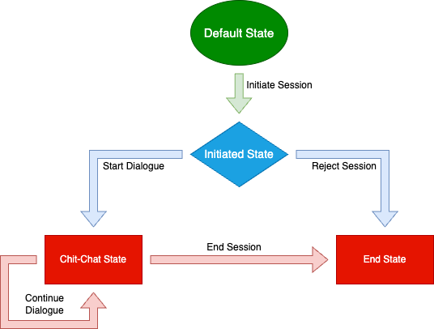

# Dialogues 💬

## Introduction 📙

### Concept of Agent-based Dialogues 🤖

Agent-based dialogues facilitate structured interaction between `agents` in distributed system. These dialogues helps agents communicate, exchange information, and maintain context, making them essential for UI such as [DeltaV ↗️](https://deltav.agentverse.ai/) for chit-chat conversation and also other chatbots or virtual assistants.

### Purpose of chit-chat dialogue system

The `ChitChat Dialogue` system illustrates a practical application of agent-based dialogues focused on simulating casual, chit-chat conversations. It serves as a tutorial for developers interested in implementing adaptable dialogue systems.

### Overview of Guide's content 

    - [**System Architecture:**](/guides/dialogues/dialogues#system-architecture-) Overview of the system components and their interactions.
    - [**Dialogue Components:**](/guides/dialogues/dialogues#dialogue-components) Details on dialogue states, transitions, and message models.
    - [**Setup and Configuration:**](/guides/dialogues/dialogues#setup-and-configuration) Instructions for setting up and running the agents.
    - [**Implementation and Customization:**](/guides/dialogues/dialogues#implementation-and-customization) How to implement and customize dialogue flows.
    - [**Examples:**](/guides/dialogues/dialogues#examples) Demonstrating practical implementation of dialogues.

## System Architecture 📐

The `ChitChatDialogue` is structured around network of agents that communicate through structured dialogues, Below is overview of architecture :

### Components:

    - **Agents:**  Independent entities [uagents ↗️](/guides/agents/create-a-uagent) that communicate by sending and receiving structured messages.
    - **Dialogue Manager:** Orchestrates the state transitions and manages the flow of dialogues according to predefined rules.(ChitChatDialogue class)
    - **Message Models:** Define the format of messages to ensure consistency across the system.
    - **Node:** Manages the states of each dialogue (e.g., initiated, chatting, concluded) and handles transitions based on message exchanges.

### Interactions:

    - **Message exchange:** Agents exchange message with each other, leading to change in state (Node) of dialogue forward.
    - **State management:** The dialogue manager updates the dialogue state (Node) based on received messages and current state.


## Dialogue Components:

The `ChitChatDialogue` system is defined through a series of dialogue components that dictate how agents interact. Here are the key components:

### Node (Dialogue State): 
    
    - **Default state:** This is the default state of the dialogue. Every session starts in this state and is automatically updated once the dialogue starts.
    - **Initiated State:** This represents beginning of a dialogue when an initiation message is received.
    - **Chit-Chat state:** This is the state in which messages are exchanged.
    - **End State:** This is the state after the dialogue has been concluded. 

### Edges (Transitions):

    - **Initiate Session:** Transitions from the default state to the initiated state upon receiving an initiation message.
    - **Reject Session:** This is the transition for when the dialogue is rejected
    - **Start Dialogue:** Moves the dialogue from initiated to chit chatting upon acceptance of the session.
    - **Continue Dialogue:** Maintains the dialogue in the chit chatting state, allowing for ongoing message exchange.
    - **End Session:** Transitions from chit chatting to be concluded, effectively ending the session.

### Message Models:

Message models define the structure of messages exchanged during the dialogue:

    - **InitiateChitChatDialogue:** Initiates the dialogue.
    - **AcceptChitChatDialogue:** Signals acceptance of the dialogue initiation.
    - **ChitChatDialogueMessage:** Carries the actual dialogue content.
    - **ConcludeChitChatDialogue:** Ends the dialogue.
    - **RejectChitChatDialogue:** Rejects the dialogue initiation.

<br></br>

<br></br>

## Setup and Configuration

### System Requirements

    - **Python** : Python version > 3.8 with `pip` installed as well.
    - **uagents** : Fetch.ai's uagent python library.
    - **Network Configuration:** Open ports on machine where agents are going to run.

## Implementation and Customization

This section outlines how to implement the core functionalities of the Dialogue system and how to adapt or extend the dialogue flows to meet specific requirements. It covers the implementation details using the provided classes and how to customize the dialogue to handle different scenarios or add new functionalities.

### Implementing the ChitChatDialogue

1. Defining Dialogue Nodes and Edges:
    - **Nodes:** The dialogue begins in a default state and transitions through initiated, chatting, and concluded states based on the flow of messages.
    - **Edges:** Each edge is represented as an transition between nodes, triggered by specific message types.
    <br></br>

2. Setting Up Dialogue Class:

    - Use the ChitChatDialogue class as the basis for the dialogue system. This class should include:
        - **Initialization:** Set up the dialogue with initial nodes and edges.
        - **State Handlers:** Implement methods to handle transitions between states as triggered by incoming messages.

```python
class ChitChatDialogue(Dialogue):
    def __init__(self, version: str | None = None, agent_address: str | None = None):
        super().__init__(
            name="ChitChatDialogue",
            version=version,
            agent_address=agent_address,
            nodes=[default_state, init_state, chatting_state, end_state],
            edges=[init_session, reject_session, start_dialogue, cont_dialogue, end_session],
        )

def on_initiate_session(self, model: Type[Model]):
    """
    This handler is triggered when the initial message of the
    dialogue is received. From here you can either accept or reject.
    Logic that is needed to complete any kind of handshake or considers
    global agent state should go here.
    """
    return super()._on_state_transition(init_session.name, model)
```
<br></br>
3. Message Handlers:

    - Implement functions to handle the reception of each message type in agents, corresponding to the dialogue transitions.
    - Decorate these functions with handlers that link them to specific transitions in the dialogue.

```python
@chitchat_dialogue.on_initiate_session(InitiateChitChatDialogue)
async def start_chitchat(ctx: Context, sender: str, _msg: InitiateChitChatDialogue):
    # logic to accept the dialogue and transition to the next state
    await ctx.send(sender, AcceptChitChatDialogue())
```
<br></br>
### Customizing Dialogue Flows

1. Adding New Nodes and Edges:

    - To introduce new scenarios or handle additional types of interactions, define new nodes and edges.
    - For instance, adding a "paused" node for dialogues that need to temporarily halt.
<br></br>
2. Modifying Message Models:

    - Adapt or extend existing message models to include new data fields or types, supporting richer interactions.
    - Example for a new message type that includes additional context:

```python
class ExtendedChitChatDialogueMessage(Model):
    text: str
    context_info: dict
```
<br></br>
3. Implementing Complex Business Logic:

    - Enhance handlers to include more sophisticated logic based on the application’s needs, such as integrating with external APIs or processing complex datasets.

```python
@chitchat_dialogue.on_continue_dialogue(ChitChatDialogueMessage)
async def continue_chitchat(ctx: Context, sender: str, msg: ChitChatDialogueMessage):
    response = process_input(msg.text)  # Your custom processing logic
    await ctx.send(sender, ChitChatDialogueMessage(text=response))
```
<br></br>
## Examples

To demonstrate practical application and provide a clear pathway for your own implementations, the following examples detail how the ChitCha Dialogue system can be configured and run using agents. Each example showcases different aspects of dialogue management:

    - [**Open Dialogue:**](/examples/open-dialogue-chitchat.mdx) Agents engage in an open dialogue where each step and state transition within the ChitChatDialogue is visible and interactive. This setup is ideal for understanding the flow of messages and the impact of state changes in real-time.
    - [**Predefined Dialogue:**](/examples/predefined-dialogue-chitchat.mdx)   In this configuration, Agents operate within a more streamlined and automated version of the ChitChatDialogue. Most interactions, except for the initiation and periodic chit-chat messages, are automated and hidden from the user. This scenario is suited for environments where minimal user interaction is desirable or necessary.


The `ChitChat Dialogue` system serves as a robust framework for developing and implementing agent-based dialogues. By exploring the provided examples and engaging with the dialogue system firsthand, developers can gain a deep understanding of the nuances of state management, message handling, and dialogue transitions in a distributed agent environment.


