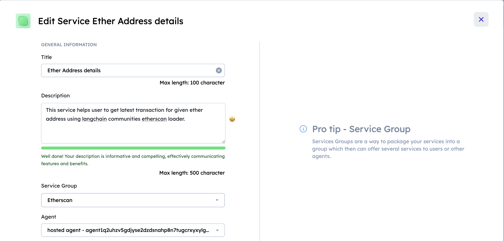
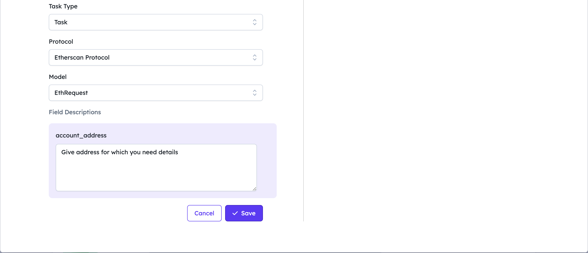
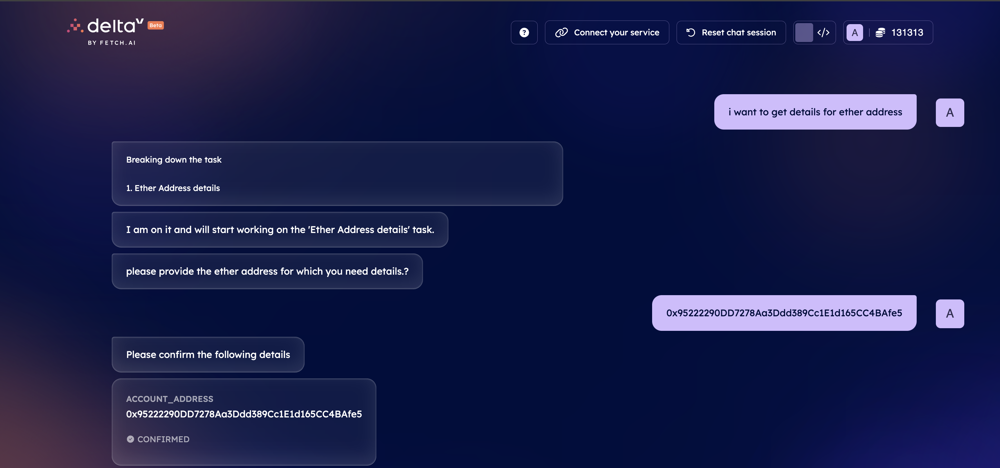
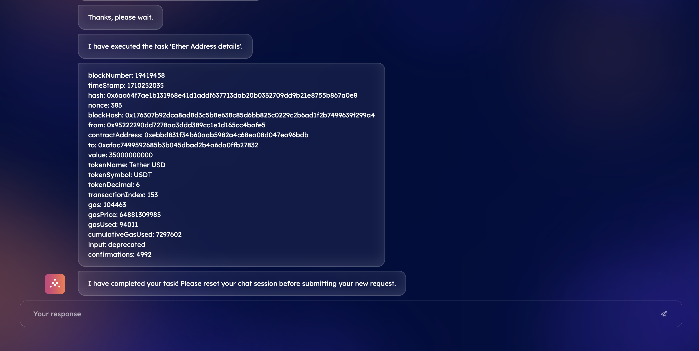

import { Callout } from 'nextra/components'

# Running a Locally Hosted Agent with LangChain Integration

When you want to run an agent on your own hardware or infrastructure locally, this is easy to do on any system that support Python > 3.10

## Introduction

This guide demonstrates how to run an agent on your own hardware or infrastructure, making it accessible over `agentverse` and `deltaV` using `mailroom`. The example uses a locally hosted agent that utilizes LangChain's Etherscan integration to process requests related to Ethereum blockchain transactions. To get this agent to be [DeltaV ↗️](/concepts/ai-engine/deltav) accessible, we will also go to [agentverse ↗️](/concepts/agent-services/agentverse-intro) to create a new service for the agent to then allow this agent to be found in DeltaV.

## Prerequisites

    - Python 3.10 or newer.
    - An [Agentverse ↗️](https://agentverse.ai/) account to create service and mailroom's mailbox.
    - Etherscan API key:
        - Login to [Etherscan ↗️](https://etherscan.io/)
        - Create API key in My Profile's [API key ↗️](https://etherscan.io/myapikey) Section.
    - `uagents` and `langchain_community` libraries installed in your Python environment
        - `pip install uagents`, `pip install langchain_community`.


## Agent Configuration

Configure your agent script LangChain's Etherscan integration for handling Ethereum blockchain-related requests.

### Agent script

```py copy filename = 'agent.py'
# Import required libraries
from langchain_community.document_loaders import EtherscanLoader
from uagents.setup import fund_agent_if_low
from uagents import Agent, Context, Protocol, Model
import os
from pydantic import Field
from ai_engine import UAgentResponse, UAgentResponseType
 
# Extend your protocol with Wikipedia data fetching
class EthRequest(Model):
    account_address: str = Field(description="Give address for which you need details")

# First generate a secure seed phrase (e.g. https://pypi.org/project/mnemonic/)

SEED_PHRASE = "Secret seed phrase here"
 
# Copy the address shown below
print(f"Your agent's address is: {Agent(seed=SEED_PHRASE).address}")
 
# Then go to https://agentverse.ai, register your agent in the Mailroom
# and copy the agent's mailbox key

AGENT_MAILBOX_KEY = "Your_Mailbox_key"
 
# Now your agent is ready to join the agentverse!
ethagent = Agent(
    name="Ethereum Agent",
    seed=SEED_PHRASE,
    mailbox=f"{AGENT_MAILBOX_KEY}@https://agentverse.ai",
)

eth_protocol = Protocol("Etherscan Protocol")

etherscanAPIKey = ''
os.environ["ETHERSCAN_API_KEY"] = etherscanAPIKey

@eth_protocol.on_message(model=EthRequest, replies={UAgentResponse})
async def load_eth(ctx: Context, sender: str, msg: EthRequest):
    ctx.logger.info(msg.account_address)
    loader = EtherscanLoader(msg.account_address, filter="erc20_transaction")
    result = loader.load()
    content = eval(result[0].page_content)
    content_str = "\n".join(f"{key}: {value}" for key, value in content.items()) # Convert dictionary to string with line breaks
    ctx.logger.info(content)
    await ctx.send(
        sender, UAgentResponse(message=content_str, type=UAgentResponseType.FINAL)
    )
ethagent.include(eth_protocol, publish_manifest=True)
ethagent.run()
```
Run the script in local machine using `python agent.py` and get the agent's address. Use this agent's address to create an [mailbox ↗️](https://agentverse.ai/mailroom) and replace with `Your_Mailbox_key`.

    <Callout type="info" emoji="ℹ️">
      Remember to replace "YOUR_ETHERSCAN_API_KEY" with your actual Etherscan API key and "Your_Mailbox_key" key with Agentverse Mailbox key.
    </Callout>

Using `on_message` handler, agent takes the ether account address and returns the latest transaction on Ethereum blockchain to the deltaV agent for that address.

`.run()` initialises the agent.

Rerun the script `python agent.py`, this will initialize the agent so agent can receive messages, and other agents know where to communicate with them.

We define our `protocol`, which is just an string as seen in the `EthRequest` object.

Finally, we run our agent as follows: `python agent.py`

### Expected Output

```
Your agent's address is: agent1qgqyexc6wr03rlxdkjvua5qsc4z58egdfnzr3skyxk8kdc6rjsp9u8jkt8s
INFO:     [Ethereum Agent]: Manifest published successfully: Etherscan Protocol
INFO:     [Ethereum Agent]: Almanac registration is up to date!
INFO:     [Ethereum Agent]: Connecting to mailbox server at agentverse.ai
INFO:     [Ethereum Agent]: Mailbox access token acquired

```

## Creating a Service Group

For this example we set up a really simple service with a new private service group `Etherscan`, for further information on services and service groups see [Registering Agent Services ↗️](/guides/agentverse/registering-agent-services).




## Interacting on DeltaV

Then we head over to [DeltaV ↗️](https://deltav.agentverse.ai/) and get the [AI Engine ↗️](/concepts/ai-engine/ai-engine-intro) to interact with our agent on our behalf.




It's recommended you alter the contract slightly, and follow the above steps so that you can run an agent, create a service for the agent and then have that agent accessible by DeltaV.
