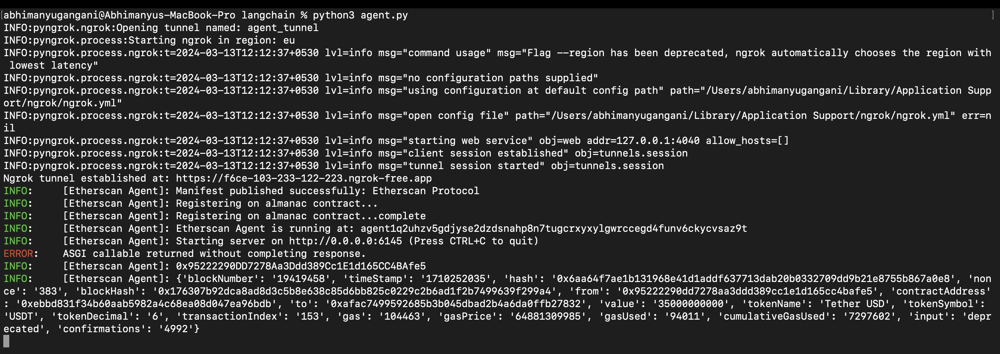

import { Callout } from 'nextra/components'

# Running a Locally Hosted Agent with LangChain and Ngrok Integration

When we want to run an agent on your own hardware or infrastructure locally; this is easy to do on any system that support Python 3.10

## Introduction

This guide demonstrates how to run an agent on your own hardware or infrastructure, making it accessible over the internet using ngrok. The example uses a locally hosted agent that utilizes LangChain's Etherscan integration to process requests related to Ethereum blockchain transactions. To get this agent to be [DeltaV ↗️](/concepts/ai-engine/deltav) accessible, we will also go to [agentverse ↗️](/concepts/agent-services/agentverse-intro) to create a new service for the agent,to then allow this agent to be found in DeltaV.

## Prerequisites

    - Python 3.10 or newer
    - Ngrok account and ngrok installed on your local machine. [Ngrok Account setup Guide ↗️](https://ngrok.com/docs/getting-started/)
    - An active internet connection
    - Etherscan API key
        - Login to [Etherscan ↗️](https://etherscan.io/)
        - Create API key in My Profile's [API key ↗️](https://etherscan.io/myapikey) Section.
    - uagents, langchain_community, and pyngrok libraries installed in your Python environment
        - `pip install uagents`, `pip install langchain_community`, `pip install pyngrok`


## Agent Configuration:

Configure your agent script with the ngrok forwarding URL and set up LangChain's Etherscan integration for handling Ethereum blockchain-related requests.

### Agent script

```py copy filename = 'agent.py'
# Importing Required libraries
from langchain_community.document_loaders import EtherscanLoader
from uagents.setup import fund_agent_if_low
from uagents import Agent, Context, Protocol, Model
import os
from pydantic import Field
from ai_engine import UAgentResponse, UAgentResponseType
from pyngrok import ngrok, conf

# Ngrok setup
ngrok_config = conf.get_default()
ngrok_config.monitor_thread = False
ngrok_config.region = "eu"  # Change to your preferred region
ngrok_config.remote_management = False
ngrok_config.web_addr = False
http_tunnel = ngrok.connect(addr=6145, proto="http", name="agent_tunnel")
tunnel_url = http_tunnel.public_url
print(f"Ngrok tunnel established at: {tunnel_url}")

# Defining agent with dynamically set endpoint
ethagent = Agent(
    name="Etherscan Agent",
    port=6145,
    seed="Etherscan secret seed phrase",
    endpoint=[f"{tunnel_url}/submit"],  # Use ngrok tunnel URL
)

fund_agent_if_low(ethagent.wallet.address()) # Adding funds to the agent's wallet

# Getting agent's address on startup
@ethagent.on_event("startup")
async def startup(ctx: Context):
    ctx.logger.info(f"Etherscan Agent is running at: {ethagent.address}")

class EthRequest(Model):
    account_address: str = Field(description="Ethereum account address for transaction details")

eth_protocol = Protocol("Etherscan Protocol") # Define protocol

# Set your Etherscan API key
etherscanAPIKey = 'YOUR_ETHERSCAN_API_KEY'
os.environ["ETHERSCAN_API_KEY"] = etherscanAPIKey

# Define message handler for getting latest transaction of ethereum account
@eth_protocol.on_message(model=EthRequest, replies={UAgentResponse})
async def load_eth(ctx: Context, sender: str, msg: EthRequest):
    loader = EtherscanLoader(msg.account_address, filter="erc20_transaction") # Getting ERC20 transactions
    result = loader.load()
    # Format and send response
    content_str = "\n".join(f"{key}: {value}" for key, value in result[0].page_content.items())
    await ctx.send(sender, UAgentResponse(message=content_str, type=UAgentResponseType.FINAL))

ethagent.include(eth_protocol, publish_manifest=True)
ethagent.run()

```
<Callout type="info" emoji="ℹ️">
Remember to replace "YOUR_ETHERSCAN_API_KEY" with your actual Etherscan API key and adjust the ngrok_config.region as needed.
</Callout>

The agent is initialised with an endpoint, and a port - this is so that we can receive messages, and other agents know where to send them. 
We call `fund_agent_if_low` to get some funds, if we need them. And we define our `protocol`, which is just an str as seen in the `EthRequest` 
object.

Using `on_message` handler, agent takes the address and returns the latest transaction on Ethereum blockchain to the deltaV agent for that address.

`.run()` initialises the agent.

Finally, we run our agent as follows: python agent.py

### Expected Output:



## Creating a service Group:

For this example we set up a really simple service for a new service group, for further information on services and service 
groups see [Registering Agent Services ↗️](/guides/agentverse/registering-agent-services).


## Interacting on DeltaV

Then we head over to [DeltaV ↗️](https://deltav.agentverse.ai/) and get the [AI Engine ↗️](/concepts/ai-engine/ai-engine-intro) to interact with our agent on our behalf.


It's recommended you alter the contract slightly, and follow the above steps so that you can run an agent, create a service for the agent and then have that agent accessible by DeltaV.