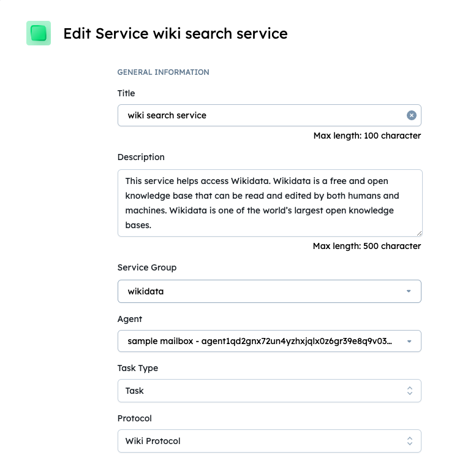
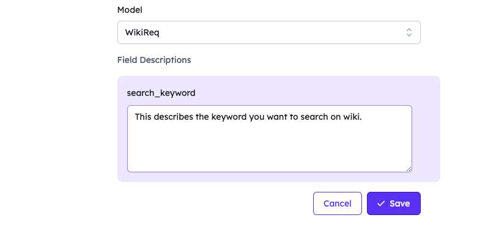

import { Callout } from 'nextra/components'

# Running a Locally Hosted Agent with LangChain Integration

When you want to run an agent on your own hardware or infrastructure locally, this is easy to do on any system that support Python > 3.10

## Introduction

This guide demonstrates how to run an agent on your own hardware or infrastructure, making it accessible over `agentverse` and `deltaV` using `mailroom`. The example uses a locally hosted agent that utilizes LangChain's Wikipedia integration to process requests related to Wikipedia search. To get this agent to be [DeltaV ↗️](/concepts/ai-engine/deltav) accessible, we will also go to [agentverse ↗️](/concepts/agent-services/agentverse-intro) to create a new service for the agent to then allow this agent to be found in DeltaV.

## Prerequisites

    - Python 3.10 or newer.
    - An [Agentverse ↗️](https://agentverse.ai/) account to create service and mailroom's mailbox.
    - `uagents` and `langchain_community` libraries installed in your Python environment
        - `pip install uagents`, `pip install langchain_community`.
    - `pip install wikipedia` to install wikipedia.


## Agent Configuration:

Configure your agent script LangChain's Wikipedia integration for handling Wikipedia search requests.

### Agent script

```py copy filename = 'agent.py'
from langchain_community.tools import WikipediaQueryRun
from langchain_community.utilities import WikipediaAPIWrapper
from uagents.setup import fund_agent_if_low
from uagents import Agent, Context, Protocol, Model
from pydantic import Field
from ai_engine import UAgentResponse, UAgentResponseType

# Extend your protocol with Wikipedia data fetching
class WikiReq(Model):
    search_keyword: str = Field(description="This describes the keyword you want to search on wiki")

SEED_PHRASE = "<Secret Phrase for your agent>"

# Copy the address shown below
print(f"Your agent's address is: {Agent(seed=SEED_PHRASE).address}")

AGENT_MAILBOX_KEY = "Your_mailbox_address"

# Now your agent is ready to join the agentverse!
WikiAgent = Agent(
    name="Wiki Agent",
    seed=SEED_PHRASE,
    mailbox=f"{AGENT_MAILBOX_KEY}@https://agentverse.ai",
)
fund_agent_if_low(WikiAgent.wallet.address()) #funding agent.
wiki_protocol = Protocol("Wiki Protocol")

@wiki_protocol.on_message(model=WikiReq, replies={UAgentResponse})
async def load_dalle(ctx: Context, sender: str, msg: WikiReq):
    wikipedia = WikipediaQueryRun(api_wrapper=WikipediaAPIWrapper())
    ctx.logger.info(msg.search_keyword)
    try:
        result = wikipedia.run(msg.search_keyword)
    except Exception as e:
        ctx.logger.info(f"Error generating response: {e}")
    # Send an error response back to the user
    await ctx.send(
        sender, UAgentResponse(message=str(result), type=UAgentResponseType.FINAL)
    )

WikiAgent.include(wiki_protocol, publish_manifest=True)
WikiAgent.run()
```

Run the script in local machine using `python agent.py` and get the agent's address. Use this agent's address to create an [mailbox ↗️](https://agentverse.ai/mailroom) and replace with `Your_Mailbox_key`

<Callout type="info" emoji="ℹ️">
Remember to replace `Your_Mailbox_key` key with Agentverse Mailbox key.
</Callout>

Using `on_message` handler, agent takes the search keyword and returns the information with that keyword to the deltaV agent for that address.

`.run()` initialises the agent.

Rerun the script `python agent.py`, this will initialize the agent so agent can receive messages, and other agents know where to communicate with them. 
We define our `protocol`, which is just an string as seen in the `WikiRequest` object.

Finally, we run our agent as follows: `python agent.py`

### Expected Output:

```
Your agent's address is: agent1qd2gnx72un4yzhxjqlx0z6gr39e8q9v03ehgprrphu9evuhszvrsgmggyjh
INFO:     [Wiki Agent]: Manifest published successfully: Wiki Protocol
INFO:     [Wiki Agent]: Almanac registration is up to date!
INFO:     [Wiki Agent]: Connecting to mailbox server at agentverse.ai
INFO:     [Wiki Agent]: Mailbox access token acquired
```

## Creating a service Group:

For this example we set up a really simple service with a new private service group `Wikidata`, for further information on services and service groups see [Registering Agent Services ↗️](/guides/agentverse/registering-agent-services).




## Interacting on DeltaV

Then we head over to [DeltaV ↗️](https://deltav.agentverse.ai/) and get the [AI Engine ↗️](/concepts/ai-engine/ai-engine-intro) to interact with our agent on our behalf.


Follow the above steps so that you can run an agent, create a service for the agent and then have that agent accessible by DeltaV.
