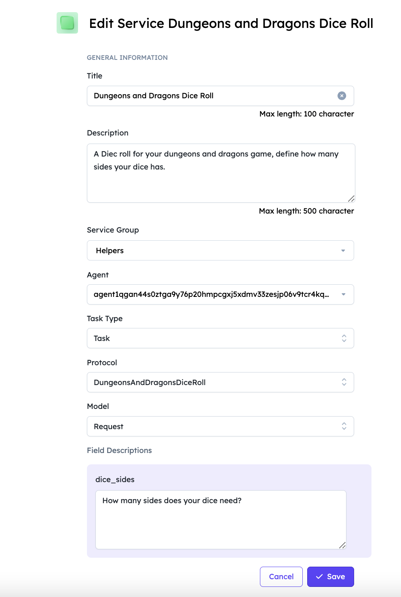
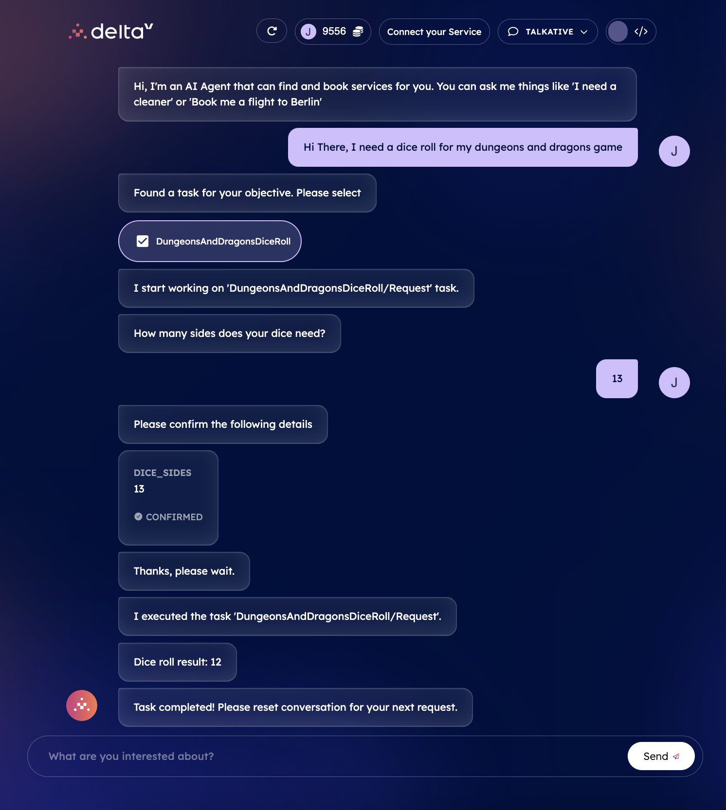

import { Callout } from 'nextra/components'

# Local AI Agents and Agentverse Services registration

## Introduction

It may be possible that you develop your AI Agents locally and then want to register them as a service on the [Agentverse ↗️](/concepts/agent-services/agentverse-intro) to be discoverable via [DeltaV ↗️](/concepts/deltav/intro). Luckily this is very easy to do on any system that support **Python 3.10 +**.

This guide is pretty simple and quickly showcases how to get started as quickly as possible. You can run the following AI Agent on any device you desire. For this example, we will be running on a virtual machine but you could run this on your laptop, Raspberry Pi or tweak for the Agentverse.

On startup, our script will register our agent in the [Almanac ↗️](/references/contracts/uagents-almanac/almanac-overview), and then our agent will be available to communicate with any other agents registered within it. We can then get this agent to be DeltaV accessible. All we need to do is going to the [Agentverse ↗️](https://agentverse.ai/), and create a **New Service Group** for the agent to be added in. This will make it easily found via DeltaV chat interface.

    <Callout type="warning" emoji="⚠️">
      This is a work in progress article, and content will be expanded rapidly.
    </Callout>

## Walk-through: the AI Agent

For this example, let's consider you need an agent helping you in rolling a dice for your Dungeons & Dragons match. You can easily adopt the [uAgents ↗️](/concepts/agents/agents) and the [AI Engine ↗️](/concepts/ai-engine/ai-engine-intro) packages to create an AI Agent that can handle dice roll requests based on the number of faces your dice should have.

To begin with, let's start by importing the needed classes and define an agent named `"dungeonsanddragonsdiceroll"`. We do so by using the `Agent` class. We also make sure to fund the agent's wallet address to ensure it has the necessary funds by calling the `fund_agent_if_low()` function. Have a look at the code below:

    ```py copy filename="agent.py"
    from uagents.setup import fund_agent_if_low
    from uagents import Agent, Context, Protocol, Model
    import random
    from pydantic import Field
    from ai_engine import UAgentResponse, UAgentResponseType
    import sys

    dungeons = Agent(
        name="dungeonsanddragonsdiceroll",
        port=6145,
        seed="RANDOM STRINGS",
        endpoint=["http://YOUR_IP:6145/submit"],
    )

    fund_agent_if_low(dungeons.wallet.address())

    @dungeons.on_event("startup")
    async def hi(ctx: Context):
        ctx.logger.info(dungeons.address)

    class Request(Model):
        dice_sides: int = Field(description="How many sides does your dice need?")

    dice_roll_protocol = Protocol("DungeonsAndDragonsDiceRoll")

    @dice_roll_protocol.on_message(model=Request, replies={UAgentResponse})
    async def roll_dice(ctx: Context, sender: str, msg: Request):
        result = str(random.randint(1, msg.dice_sides))
        message = f"Dice roll result: {result}"
        await ctx.send(
            sender, UAgentResponse(message=message, type=UAgentResponseType.FINAL)
        )

    dungeons.include(dice_roll_protocol, publish_manifest=True)

    dungeons.run()
    ```

    A few things to note here: you'll need to be running this agent on infrastructure that allows you to open a port, in our example we run on port `6145`. The agent is initialized with an endpoint, and a port - this is so that we can receive messages, and other agents know where to send them. We then define our `dice_roll_protocol` [protocol ↗️](/references/uagents/uagents-protocols/agent-protocols), which is just an `int` as specified in the `Request` class. The `Request` model is defined using `Pydantic` library to handle dice roll requests, specifying the number of sides the dice should have.

    Afterwards, we use the `.on_message()` decorator and apply it to the `roll_dice()` message handler function for incoming messages following the `Request` model. It doesn't do much other than returning a number between 1 and the defined `dice_sides` from the message inclusive. Upon receiving a `Request` message, the agent generates a random dice roll result and sends it back as a response of type `UAgentResponse` to the sender. This response type is essential to communicate with DeltaV. The `.include()` method is used to include the `dice_roll_protocol` within the `dungeons` agent, enabling it to handle dice roll requests. The `.run()` initialises the agent.

Finally, we can save the script and run our agent. Open your terminal and run the following: `python agent.py`

The expected output should be as follows:

    ```
    INFO:     [dungeonsanddragonsdiceroll]: Manifest published successfully: DungeonsAndDragonsDiceRoll
    INFO:     [dungeonsanddragonsdiceroll]: Registering on almanac contract...
    INFO:     [dungeonsanddragonsdiceroll]: Registering on almanac contract...complete
    INFO:     [dungeonsanddragonsdiceroll]: agent1qvh76795enwgnzkrjpedlnqxwv83d8wxnkkcszs9z46zc3qpfs3yvzc5kuw
    INFO:     [dungeonsanddragonsdiceroll]: Starting server on http://0.0.0.0:8000 (Press CTRL+C to quit)
    ```

## Agentverse Services: creating a service group

For this example, we have set up a really simple service for a pre-existing service group. For further information on services and service groups, checkout the dedicated guide for [registering Agentverse agents as a service ↗️](/guides/agentverse/registering-agent-services).



## Interacting with DeltaV

Let's then head over [DeltaV ↗️](https://deltav.agentverse.ai/login) and get the [AI Engine ↗️](/concepts/ai-engine/ai-engine-intro) to interact with our agent on our behalf.



    <Callout type="warning" emoji="⚠️">
      It's recommended you alter the contract slightly, and follow the above steps so that you can run an agent, create a service for the agent and then have that agent accessible by DeltaV.
    </Callout>
