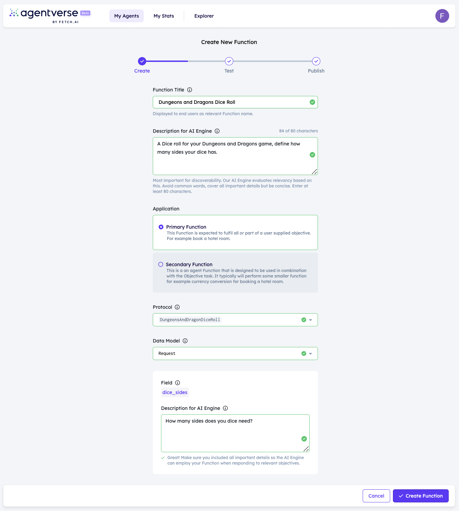

import { Callout } from 'nextra/components'

    <Callout type="info" emoji="ℹ️">
      This is a work in progress article, and will be expanded rapidly.
    </Callout>

# Running locally

Sometimes you'll want to run an agent on your own hardware or infrastructure; luckily this is very easy to do on any system that support Python 3.10.

## Introduction

This system is pretty simple, as to get you started as quickly as possible. We're going to run this agent on any device you'd like, in this scenario we're running on a VM but you could run this on your laptop, raspberry pi or tweak for Agentverse. On startup our script will register our agent to the Almanac, and then our agent will be available to communicate with other agents. To get this agent to be [DeltaV ↗️](/concepts/ai-engine/deltav) accessible,  we will also go to agentverse to create a new service for the agent, to then allow this agent to be found in DeltaV.

## The agent

```py copy filename="agent.py"
from uagents.setup import fund_agent_if_low
from uagents import Agent, Context, Protocol, Model
import random
from pydantic import Field
from ai_engine import UAgentResponse, UAgentResponseType
import sys

dungeons = Agent(
    name="dungeonsanddragonsdiceroll",
    port=6145,
    seed="RANDOM STRINGS",
    endpoint=["http://YOUR_IP:6145/submit"],
)

fund_agent_if_low(dungeons.wallet.address())

@dungeons.on_event("startup")
async def hi(ctx: Context):
    ctx.logger.info(dungeons.address)

class Request(Model):
    dice_sides: int = Field(description="How many sides does your dice need?")

dice_roll_protocol = Protocol("DungeonsAndDragonsDiceRoll")

@dice_roll_protocol.on_message(model=Request, replies={UAgentResponse})
async def roll_dice(ctx: Context, sender: str, msg: Request):
    result = str(random.randint(1, msg.dice_sides))
    message = f"Dice roll result: {result}"
    await ctx.send(
        sender, UAgentResponse(message=message, type=UAgentResponseType.FINAL)
    )


dungeons.include(dice_roll_protocol, publish_manifest=True)

dungeons.run()
 ```

A few things to note; you'll need to be running this agent on infrastructure that allows you to open a port, in our example we run on port `6145`.

The agent is initialised with an endpoint, and a port - this is so that we can receive messages, and other agents know where to send them. We call `fund_agent_if_low` to get some funds, if we need them. And we define our protocol, which is just an int as seen in the `Request` object.

Our `on_message` doesn't do much other than return a number between 1 and the defined `dice_sides` from the message inclusive. However, the response type is of  `UAgentResponse` which is essential to communicate with DeltaV.

`.run()` initialises the agent.

Finally, we  run our agent as follows: `python agent.py`

**Expected output**:

```
INFO:     [dungeonsanddragonsdiceroll]: Manifest published successfully: DungeonsAndDragonsDiceRoll
INFO:     [dungeonsanddragonsdiceroll]: Registering on almanac contract...
INFO:     [dungeonsanddragonsdiceroll]: Registering on almanac contract...complete
INFO:     [dungeonsanddragonsdiceroll]: agent1qvh76795enwgnzkrjpedlnqxwv83d8wxnkkcszs9z46zc3qpfs3yvzc5kuw
INFO:     [dungeonsanddragonsdiceroll]: Starting server on http://0.0.0.0:6145 (Press CTRL+C to quit)
```

## Register your Agent Function on the Agentverse

For this example we set up a really simple Agent Function (i.e., Agent Service). For further information on Agent Functions and registration process, see [Agentverse Services ↗️](/guides/services/services) and [Register Agent Functions on the Agentverse ↗️](/guides/agentverse/registering-agent-services) resources.

To register **Local Agents and Functions**, you will first need to log in the [Agentverse ↗️](https://agentverse.ai/) and head over to the **My Agents** tab. Then, click on **Local Agents** tab and click one of the **Connect Local Agent** buttons.


You will need to provide the **local agent address** and make sure it is running on your terminal as only running agents can enroll Agent Functions on the Agentverse!


You can now provide the needed details for your Agent Function in the dedicated fields. Remember to provide detailed descriptions for what your **Agent Function** does and the **Fields** for data Models expected.



## Interacting on DeltaV

Then we head over to [DeltaV ↗️](https://deltav.agentverse.ai/) and get the [AI Engine ↗️](/concepts/ai-engine/ai-engine-intro) to interact with our agent on our behalf.


It's recommended you alter the contract slightly, and follow the above steps so that you can run an agent, create a function for the agent and then have that agent accessible by DeltaV.
