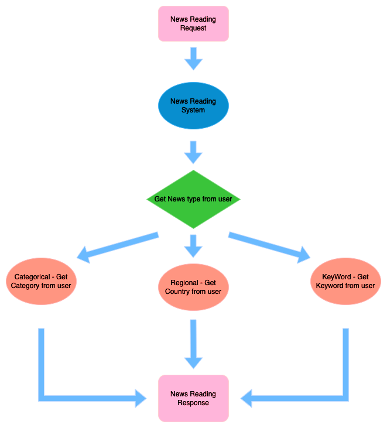
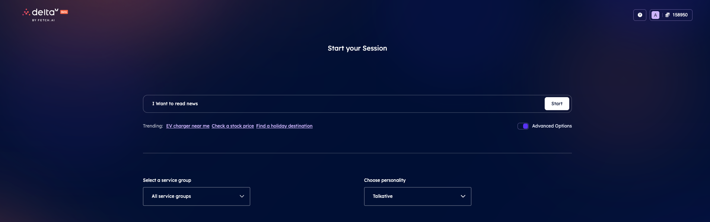
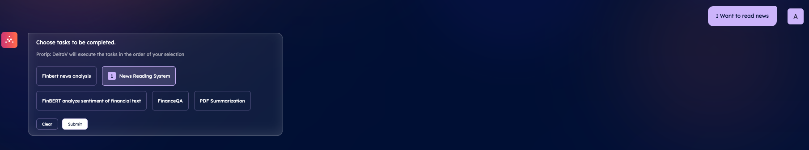
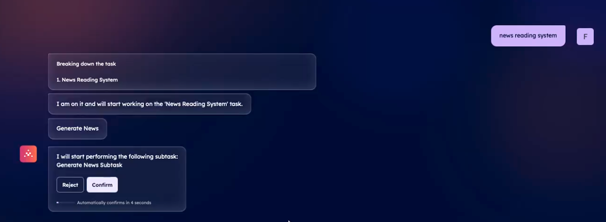
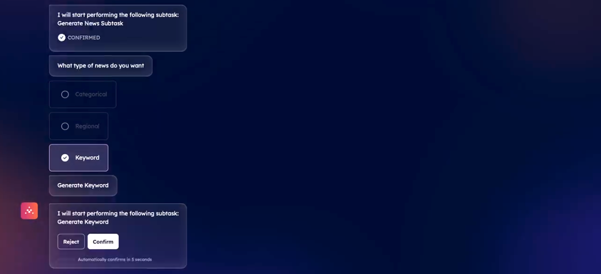
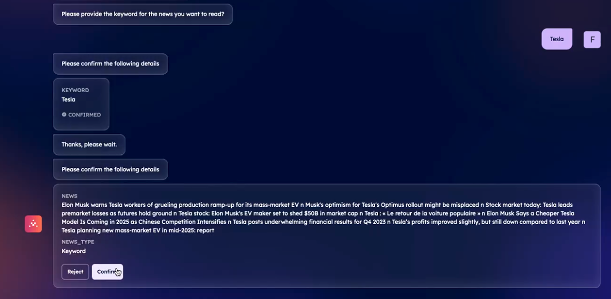
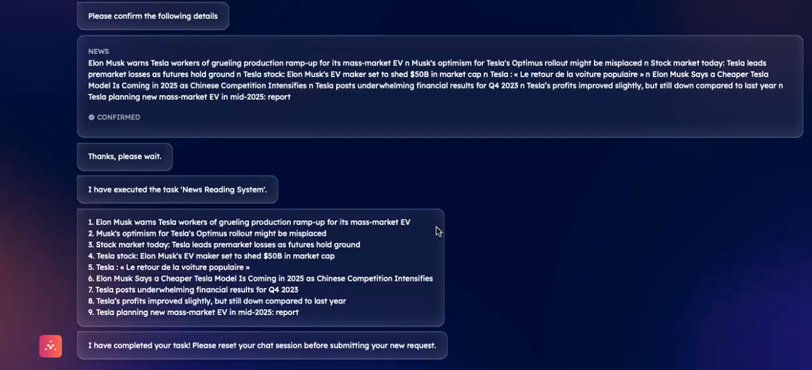

import { Callout } from 'nextra/components'

# Using News API to build network of tasks and subtasks in Agentverse

## Introduction

This agent network helps users to read news of different types including Categorical, Country based or Keyword related news. There are three layers of services to let users read news. These services altogether return news of specific type and subtype based on user preference.

Three different layers of subtasks are included in this News Reading System, Generate News subtask, and Generate {news_type} subtasks. For workflow of user requests please refer below flow chart.



## Task and Subtask

The task and subtask descriptions and names should be relevant to make it easy for the LLM to identify the type of subtask to trigger and when. Descriptions of tasks and subtasks should always indicate when specific subtasks should be triggered. In this case one of multiple subtasks is to be triggered, it should be provided in the dictionary to enhance the LLM's understanding. For instance, you can refer to the example below where the "Generate News" subtask triggers one of the "Generate news_type subtasks”  based on the user’s requirement.

Field description is another feature of services which should mention use of subtasks in a clear and concise way. Refer [Agentverse Services ↗️](/concepts/agent-services/services) for more details on tasks and subtasks.

## News API

Login to [News API ↗️](https://newsapi.org/docs/endpoints/top-headlines) and get your API key by logging in and registering for API. This API key will be used in agent scripts to fetch news related to a specific type and subtype.

## Agents

For this navigate to [your agents ↗️](https://agentverse.ai/agents) and click on the **New Agent** button. Click on blank agent and name them as mentioned in titles below:

### News Reading Agent

This agent helps users to **read news** according to their willingness. This agent triggers the news generating subtask and asks the user for the news type they want to read today. This agent responds to the final result to the deltaV GUI as well.

    ```python copy filename="agent.py"
        # Here we demonstrate how we can create a news reading system agent that is compatible with DeltaV.
        
        # After running this agent, it can be registered to DeltaV on Agentverse's Services tab. For registration you will have to use the agent's address. 

        # Import required libraries
        import requests
        import json
        from ai_engine import UAgentResponse, UAgentResponseType

        # Define News Reading Model
        class News(Model):
            news : str

        # Define Protocol for news reading system
        news_protocol = Protocol("News System")

        # Define a handler for the News system protocol
        @news_protocol.on_message(model=News, replies = UAgentResponse)
        async def on_news_request(ctx: Context, sender: str, msg: News):
            #splitting the news titles with nnn and enumerating them with line break for visually better results
            result_list = msg.news.split(" nnn ")
            final_news = '\n'.join([f"{i + 1}. {title}" for i, title in enumerate(result_list)])
            #Printing the news response on logger
            ctx.logger.info(f"Received news request from {sender} with prompt: {final_news}")
            #sending final response to the DeltaV GUI
            await ctx.send(sender, UAgentResponse(message = final_news, type = UAgentResponseType.FINAL))

        # Include the Generate News protocol in your agent
        agent.include(news_protocol)
    ```
Now click on the **Run** button in the upper right corner of the editor so that you have your news system agent agent up and running!

### News Generating Agent

This agent asks users for the type of news they want to read today from options like categorical, Country related or keyword related. It then directs the user request to relevant subtasks to generate that type of news and respond it back to the News Reading system.

    ```python copy filename="agent.py"
        # Here we demonstrate how we can create a news generating agent that is compatible with DeltaV.
        
        # After running this agent, it can be registered to DeltaV on Agentverse's Services tab. For registration you will have to use the agent's address. 

        # Import required libraries
        import requests
        import json
        from ai_engine import UAgentResponse, UAgentResponseType

        # Define News Generating Model
        class GenerateNews(Model):
        news_type: str
        news : str

        # Define Generate news protocol
        generate_news_protocol = Protocol("Generate News")

        # Define a handler for the News generation protocol
        @generate_news_protocol.on_message(model=GenerateNews, replies=UAgentResponse)
        async def on_generate_news_request(ctx: Context, sender: str, msg: GenerateNews):

            try:
            # Generate news based on the requested category
                ctx.logger.info('Generating News')
                ctx.logger.info(f'User have selected {msg.news_type} category')
       
                ctx.logger.info(f'Generate News \n {msg.news}')
                message = msg.news
            # Send a successful response with the generated news
            await ctx.send(
                sender,
                UAgentResponse(
                    message= message,
                    type=UAgentResponseType.FINAL
                    )
                    )
            # Handle any exceptions that occur during news generation
            except Exception as exc:
                ctx.logger.error(f"Error in generating  news: {exc}")
            
            # Send an error response with details of the encountered error
                await ctx.send(
                    sender,
                    UAgentResponse(
                        message=f"Error in generating news: {exc}",
                        type=UAgentResponseType.ERROR
                        )
                        )

        # Include the 'Generate News' protocol in your agent
        agent.include(generate_news_protocol)
    ```
Now click on the **Run** button in the upper right corner of the editor so that you have your news system agent agent up and running!

### Generate Categorical News

This subtask is triggered if the user wants to read categorical news and it asks the user for the category of news they want from options business, entertainment, general, health, science, sports, technology and return specific news to Generate News subtask.

    ```python copy filename="agent.py"

        # Here we demonstrate how we can create a categorical news generating agent that is compatible with DeltaV.
        
        # After running this agent, it can be registered to DeltaV on Agentverse's Services tab. For registration you will have to use the agent's address.

        #importing libraries
        import requests
        import json
        from ai_engine import UAgentResponse, UAgentResponseType

        # Define the Generate News model
        class GenerateNews(Model):
            category: str

        # Define protocol for categorical news generation
        generate_cat_news_protocol = Protocol("Generate Categorical News")

        #Define function to generate news according to category in great britain(gb)
        async def generate_news(category):
            api_key = 'YOUR_NEWS_API_KEY'
            main_url = f"https://newsapi.org/v2/top-headlines?country=gb&category={category}&apiKey={api_key}"
            news = requests.get(main_url).json() 
            #strip the source, get top 10 news and join the list with ' nnn ' to return the news as string and not list (DeltaV compatible type)
            titles = [article['title'].split(' - ')[0].strip() for article in news['articles']]
            titles = titles[:10]
            results = ' nnn '.join([f"{title}" for title in titles])

            return results

        # Define a handler for the Categorical News generation protocol
        @generate_cat_news_protocol.on_message(model=GenerateNews, replies=UAgentResponse)
        async def on_generate_news_request(ctx: Context, sender: str, msg: GenerateNews):
            #Logging category of news user wants to read
            ctx.logger.info(f"Received ticket request from {sender} with prompt: {msg.category}")

            try:
                # Generate news based on the requested category
                news = generate_news(msg.category)
                #logging news
                ctx.logger.info(news)
                message = str(news)
                # Send a successful response with the generated news
                await ctx.send(sender, UAgentResponse(message = message, type = UAgentResponseType.FINAL))
                
            # Handle any exceptions that occur during news generation
            except Exception as exc:
                ctx.logger.error(f"Error in generating News: {exc}")

                # Send an error response with details of the encountered error
                await ctx.send(
                    sender,
                    UAgentResponse(
                        message=f"Error in generating News: {exc}",
                        type=UAgentResponseType.ERROR
                    )
                )

        # Include the 'Generate News' protocol in your agent
        agent.include(generate_cat_news_protocol)
    ```

Now click on the **Run** button in the upper right corner of the editor so that you have your news system agent agent up and running!

### Generate Regional News

This subtask is triggered if the user wants to read regional or country specific news, asks the user for the country they want to read news about and returns specific news to Generate News subtask.

    ```python copy filename="agent.py"
        #importing libraries
        import requests
        import json
        from ai_engine import UAgentResponse, UAgentResponseType

        #define dictionary with country codes
        country_codes = {
            "argentina": "ar", "australia": "au", "austria": "at", "belgium": "be", 
            "bulgaria": "bg", "brazil": "br", "canada": "ca", "china": "cn", 
            "colombia": "co", "cuba": "cu", "czech republic": "cz", "germany": "de", 
            "egypt": "eg", "france": "fr", "united kingdom": "gb", "greece": "gr", 
            "hong kong": "hk", "hungary": "hu", "indonesia": "id", "ireland": "ie", 
            "israel": "il", "india": "in", "italy": "it", "japan": "jp", 
            "south korea": "kr", "lithuania": "lt", "latvia": "lv", "morocco": "ma", 
            "mexico": "mx", "malaysia": "my", "nigeria": "ng", "netherlands": "nl", 
            "norway": "no", "new zealand": "nz", "philippines": "ph", "poland": "pl", 
            "portugal": "pt", "romania": "ro", "serbia": "rs", "russia": "ru", 
            "saudi arabia": "sa", "sweden": "se", "singapore": "sg", "slovenia": "si", 
            "slovakia": "sk", "thailand": "th", "turkey": "tr", "taiwan": "tw", 
            "ukraine": "ua", "united states": "us", "venezuela": "ve", "south africa": "za"
        }

        # Define the Generate News model
        class GenerateNews(Model):
            country: str

        #define function to generate regional news according to country
        async def get_regional_news(country):

            api_key = 'YOUR_API_KEY'
            main_url = f"https://newsapi.org/v2/top-headlines?country={country_codes.get(country.lower())}&apiKey={api_key}"
            news = requests.get(main_url).json() 
            #strip the source, get top 10 news and join the list with ' nnn ' to return the news as string and not list (DeltaV compatible type)
            titles = [article['title'].split(' - ')[0].strip()for article in news['articles']]
            titles = titles[:10]
            results = ' nnn '.join([f"{title}" for title in titles])

            return results

        # Define protocol for regional news generation Protocol
        generate_news_reg_protocol = Protocol("Generate Regional News")

        # Define a handler for the Regional News generation protocol
        @generate_news_reg_protocol.on_message(model=GenerateNews, replies=UAgentResponse)
        async def on_generate_news_request(ctx: Context, sender: str, msg: GenerateNews):

            ctx.logger.info(f"Received ticket request from {sender} with prompt: {msg.country}")

            try:
                #Get the country code from the country_code dictionary
                country_code = country_codes.get(msg.country.lower())
                # Generate news based on the requested country and log it on agentverse
                message = await get_regional_news(msg.country)
                ctx.logger.info(f"Message from endpoint: {message}")
                # Send a successful response with the generated news
                await ctx.send(sender, UAgentResponse(message=message, type=UAgentResponseType.FINAL))
            # Handle any exceptions that occur during news generation
            except Exception as exc:
                ctx.logger.error(f"Error in generating News: {exc}")
                # Send an error response with details of the encountered error
                await ctx.send(
                    sender,
                    UAgentResponse(
                        message=f"Error in generating News: {exc}",
                        type=UAgentResponseType.ERROR
                    )
                )
                
        # Include the 'Generate Regional News' protocol in your agent
        agent.include(generate_news_protocol)
    ```
Now click on the **Run** button in the upper right corner of the editor so that you have your news system agent agent up and running!

### Generate Keyword News

This subtask is triggered if the user wants to read keyword specific news, asks the user for the keyword they want to read news about and returns specific news to Generate News subtask.

    ```python copy filename="agent.py"
        #importing libraries
        import requests
        import json
        from ai_engine import UAgentResponse, UAgentResponseType

        #Define the Generate News model
        class GenerateNews(Model):
            keyword: str

        # Define protocol for keyword news generation
        generate_news_keyw_protocol = Protocol("Generate Keyword News")

        #Define function to generate news according to keyword
        async def get_keyword_news(keyword):

            api_key = 'YOUR_API_KEY'
            main_url = f"https://newsapi.org/v2/top-headlines?q={keyword}&apiKey={api_key}"
            news = requests.get(main_url).json() 
            #strip the source, get top 10 news and join the list with ' nnn ' to return the news as string and not list (DeltaV compatible type)
            titles = [article['title'].split(' - ')[0].strip() for article in news['articles']]
            titles = titles[:10]
            results = ' nnn '.join([f"{title}" for title in titles])

            return results

        # Define a handler for the Keyword News generation protocol
        @generate_news_keyw_protocol.on_message(model=GenerateNews, replies=UAgentResponse)
        async def on_generate_news_request(ctx: Context, sender: str, msg: GenerateNews):

            ctx.logger.info(f"Received news request from {sender} with prompt: {msg.keyword}")
            # Generate news based on the requested keyword
            try:
                news = get_keyword_news(msg.keyword)
                # Send a successful response with the generated news
                await ctx.send(
                    sender,
                    UAgentResponse(
                        message=news,
                        type=UAgentResponseType.FINAL
                    )
                )
            # Handle any exceptions that occur during news generation
            except Exception as exc:
                ctx.logger.error(f"Error in generating News: {exc}")
                # Send an error response with details of the encountered error
                await ctx.send(
                    sender,
                    UAgentResponse(
                        message=f"Error in generating News: {exc}",
                        type=UAgentResponseType.ERROR
                    )
                )
        # Include the 'Generate Keyword News' protocol in your agent
        agent.include(generate_news_keyw_protocol)
    ```

Now click on the **Run** button in the upper right corner of the editor so that you have your news system agent agent up and running!

## Registering Services 

Similar to the [previous section ↗️](/guides/agentverse/registering-agent-services#register-your-agents-and-services) let's navigate to the [Agentverse Services ↗️](https://agentverse.ai/services) section to start registering your agent as a service.
After clicking the **+ New Service** button provide all details required - fill the form out as mentioned below for each task and subtask:

### News Reading System

    - **Service title**: just the name of your service - in this example let's call it **News Reading System**
    - **Description**: Super important to be as detailed as you can, as reasoning engine looks at descriptions to understand what your service does - in this example we can specify something like this: **Execute the News Reading system based on the news generated by the Generate News subtask, always prioritizing the Generate News subtask.**
    - **Service group**: the group the to be created service belongs to - click on the **Add new Service Group** option and let's create a service group with the name **News**.
    - **Agent**: select your newly created **News Reading System** agent from the list
    - **Task type**: Task
    - **Protocol** and **Model** will be automatically populated based on the source code of [your news reading system agent ↗️](/guides/agentverse/registering-news-reading-agent#News-Reading-Agent)
    - **Field descriptions** : 
        news : Describes the news which will be generate from the Generate News subtask. Always go for Generate News subtask never ask this field from user. All the news articles generated are presented as strings.

Click **Save** button after filling out the form

### Generate News Subtask

    - **Service title**: just the name of your service - in this example let's call it **Generate News Subtask**
    - **Description**: Super important to be as detailed as you can, as reasoning engine looks at descriptions to understand what your service does - in this example we can specify something like this: **Task to generate the news based on the news type given by user and respective subtask should always being triggered. Keys and values of news_type and receptive subtask to be triggered always is below:
        {Categorical : Generate Categorical Subtask,
        Country : Generate Country Subtask,
        Keyword : Generate Keyword Subtask}
    always execute relevant subtask for news type provided.**
    - **Service group**: The group the to be created service belongs to - click on the **Add new Service Group** option and let's create a service group with the name **News**.
    - **Agent**: select your newly created **News Generating Agent** agent from the list
    - **Task type**: Subtask
    - **Protocol** and **Model** will be automatically populated based on the source code of [your news reading system agent ↗️](/guides/agentverse/registering-news-reading-agent#News-Generating-Agent)
    - **Field descriptions** : Below are the field descriptions for News reading system
        news : This is the news provided by respective subtask which will be triggered on basis of news type provided by user. this should be never asked to user and Keys:values of news type and respective subtask to be executed always is given below:
        {Categorical : Generate Categorical Subtask,
        Country : Generate Country Subtask,
        Keyword : Generate Keyword Subtask}
        never to be asked by user and provided by respective subtasks.

        news_type : This is the news type given by user from option categorical, regional or keyword news. Keys and values of news type provided by and respective subtask to be triggered always is given below :
        {Categorical : Generate Categorical Subtask,
        Country : Generate Country Subtask,
        Keyword : Generate Keyword Subtask}
        this should always be provided by user

Click **Save** button after filling out the form

### Generate Categorical News Subtask

    - **Service title**: just the name of your service - in this example let's call it **Generate Categorical**
    - **Description**: Super important to be as detailed as you can, as reasoning engine looks at descriptions to understand what your service does - in this example we can specify something like this: **subtask to generate categorical and is always triggered if user wants to know about categorical news in Generate News subtask.**
    - **Service group**: the group the to be created service belongs to - click on the **Add new Service Group** option and let's create a service group with the name **News**.
    - **Agent**: select your newly created **Generate Categorical News** agent from the list
    - **Task type**: Subtask
    - **Protocol** and **Model** will be automatically populated based on the source code of [your news reading system agent ↗️](/guides/agentverse/registering-news-reading-agent#Generate-Categorical-News)
    - **Field descriptions** :
        category : describes the category provided by user about which he want to get news for. This should always be provided by user in all cases.This task responds to generate news subtask. This should be from options business, entertainment, general, health, science, sports, technology

Click **Save** button after filling out the form

### Generate Regional News Subtask

    - **Service title**: just the name of your service - in this example let's call it **Generate Country**
    - **Description**: Super important to be as detailed as you can, as reasoning engine looks at descriptions to understand what your service does - in this example we can specify something like this: **subtask to generate country news and is always triggered if user wants to know about Country news in Generate News subtask.**
    - **Service group**: the group the to be created service belongs to - click on the **Add new Service Group** option and let's create a service group with the name **News**.
    - **Agent**: select your newly created **Generate Regional News** agent from the list
    - **Task type**: Subtask
    - **Protocol** and **Model** will be automatically populated based on the source code of [your news reading system agent ↗️](/guides/agentverse/registering-news-reading-agent#Generate-Regional-News)
    - **Field descriptions** :
        country : describes the country provided by user about which he wants to get news for. This should always be provided by user in all cases. This task responds to generate news subtask always and not News reading system. What is the country you want to know news about? is the question asked to user.

Click **Save** button after filling out the form

### Generate Keyword News Subtask

    - **Service title**: just the name of your service - in this example let's call it **Generate Keyword**
    - **Description**: Super important to be as detailed as you can, as reasoning engine looks at descriptions to understand what your service does - in this example we can specify something like this: **subtask to generate keyword and is always triggered if user wants to know about keyword news in Generate News subtask.**
    - **Service group**: the group the to be created service belongs to - click on the **Add new Service Group** option and let's create a service group with the name **News**.
    - **Agent**: select your newly created **Generate Keyword News** agent from the list
    - **Task type**: Subtask
    - **Protocol** and **Model** will be automatically populated based on the source code of [your news reading system agent ↗️](/guides/agentverse/registering-news-reading-agent#Generate-Keyword-News)
    - **Field descriptions** :
        keyword : describes the keyword provided by user about which he want to get news for. This should always be provided by user in all cases.This task responds to generate news subtask.

Click **Save** button after filling out the form

## Let's Find our service on deltaV

Now, head to [DeltaV ↗️](https://deltav.agentverse.ai/) and sign in.

Firstly, type in something like **I want to read news** into what service you would like to assemble and switch on **Advanced Options**. In advanced options select **All service groups** and click on **submit** button. 



After being navigated to the chat screen, you will be asked to select a task (service).
As your objective (`I want to read news`) specified on the previous screen contained words related to the [description of your news reading system agent ↗️](/guides/agentverse/registering-news-reading-agent#News-Reading-System), your News Reading System service is listed as an option.
Let's select it.



Subtask Generate News Subtask will be triggered once we select News Reading System and it will provide options as mentioned in [field description ↗️] (/guides/agentverse/registering-news-reading-agent#Generate-News-Subtask) for Generate news subtask.
Select the news type you want to read.



Once you select the news type respective subtask will be triggered as mentioned in [task description ↗️] (/guides/agentverse/registering-agent-coin-toss#Generate-News-Subtask) for Generate news_type subtask.
The respective Generate news_type subtask will ask for category, country or keyword based on news type selected and will generate top 10 news related to news subtype provided.





The news will be passed from Generate news_type subtask > Generate News Subtask > News reading system.

With that, **you have got a news reading service which can be discovered and contacted with DeltaV. Awesome!**

**Note :** If one of multiple subtask is to be triggered, it should be mentioned in dictionary rather than writing a description of each as it confuses the DeltaV LLM model. If we mention **"Trigger generate categorical subtask for user selecting categorical news and trigger generate regional for user selecting regional news and so on...."**, will lead to either untracability of subtask or wrong selection of subtasks.
