import { Callout } from 'nextra/components'

# Creating an Agentverse hosted agent 🤖

## Introduction

In the [Agentverse ↗️](https://agentverse.ai/), you can create and host any type of agent you want to create in the [My Agents ↗️](/concepts/agent-services/agent-hosting). Note that managed agents are currently a beta feature and therefore do not fully support the entire [AI Agents ↗️](/concepts/agents/agents) toolset for development. Improvements and upgrades are planned for the future!

There are 2 different ways you can start creating your agents. You can either choose to create an agent:

    1.  From a blank script, by clicking on **+ Agents**.
    2.  From a specified use case, by clicking on **+ Use Case**.

## Creating an agent

You can create your AI Agent from a blank script by navigating towards the [Agentverse ↗️](https://agentverse.ai/), [sign in ↗️](/concepts/agent-services/getting-started) and choosing the **My Agents** tab. Here, click on the **+ Agents** button.

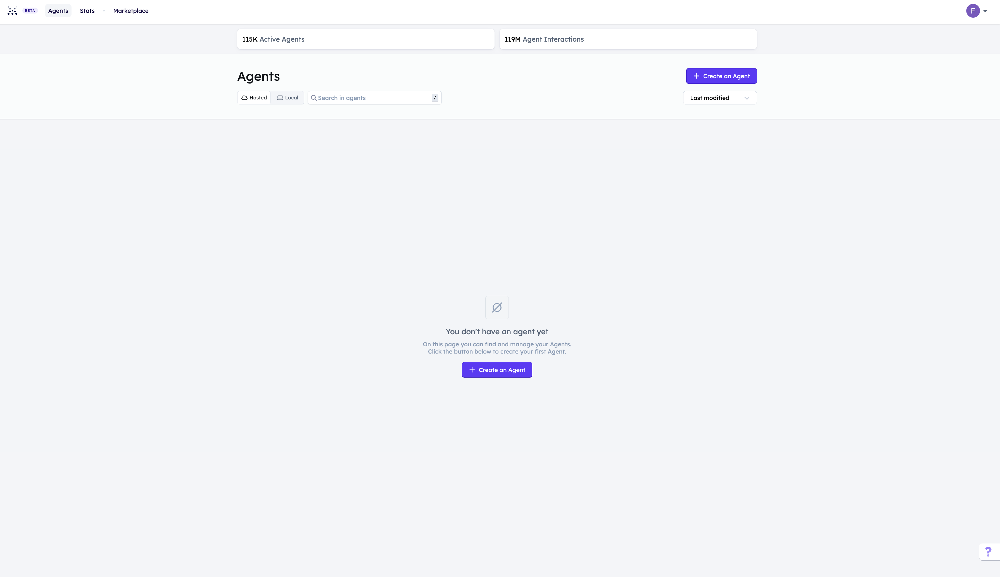

By choosing the **+ Agents** button, you will first need to provide a name for the agent you plan to build. For instance, let's create an agent named **alice**.

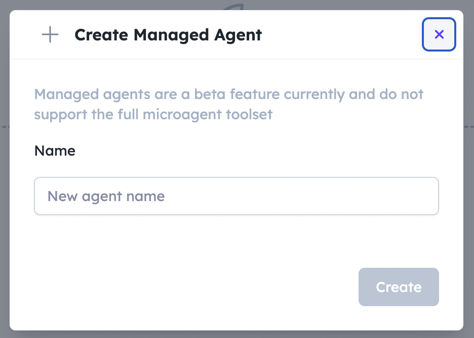

Once you select it, your agent will be ready to be coded and a box will appear in the **My Agents** page with different data being displayed about the agent you have just created, including the agent's **name** and **address**.

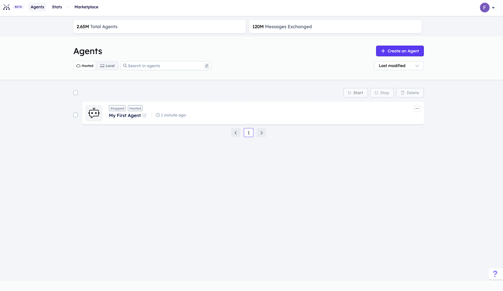

If you click on this box, the code editor will be displayed, with which you can easily code your agent. This is the **Agent Editor**. With this editor, you can create, edit and refine the code for the agent you have in mind in one place. The agent editor provides you with various basic information about your agent, including the **agent address** and **wallet address**.

    <Callout type="info" emoji="ℹ️">
      For additional information on AI Agent addresses, have a look at our dedicated documentation: [Getting an agent addresses 🤖📫 ↗️](/guides/agents/getting-uagent-address).
    </Callout>

The Agent Editor has an integrated **agent.py** file that allows you to start programming immediately! The Agent Editor offers you the option of structuring your project into several file windows, which are located on the left-hand side of the editor window. All you have to do is enter a name for the new file to be added. An additional feature of the Agent Editor is that at the bottom of the editor you will find the **Agent Logs**, a built-in terminal that displays the output of your script after it has been executed.

    <Callout type="info" emoji="ℹ️">
      This way, we aim at making agents' development as quick and efficient as possible. This is a great tool to determine if your code runs smoothly and to check if any error arises so for you to directly intervene and solve it if needed!
    </Callout>

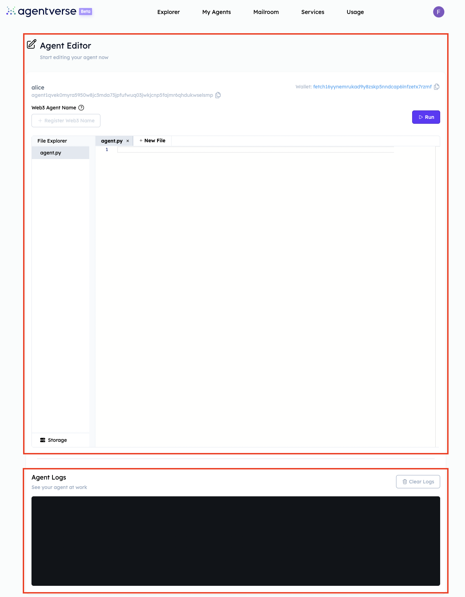

## Create your first hosted agent on the Agentverse!

You are now ready to start using the Agentverse to create and edit your agents in few minutes! To begin with, you can create a simple agent printing **"Hello world!"** in the Agent Logs on an interval of 3 seconds by using the `.on_interval()` decorator.

Here's an example:

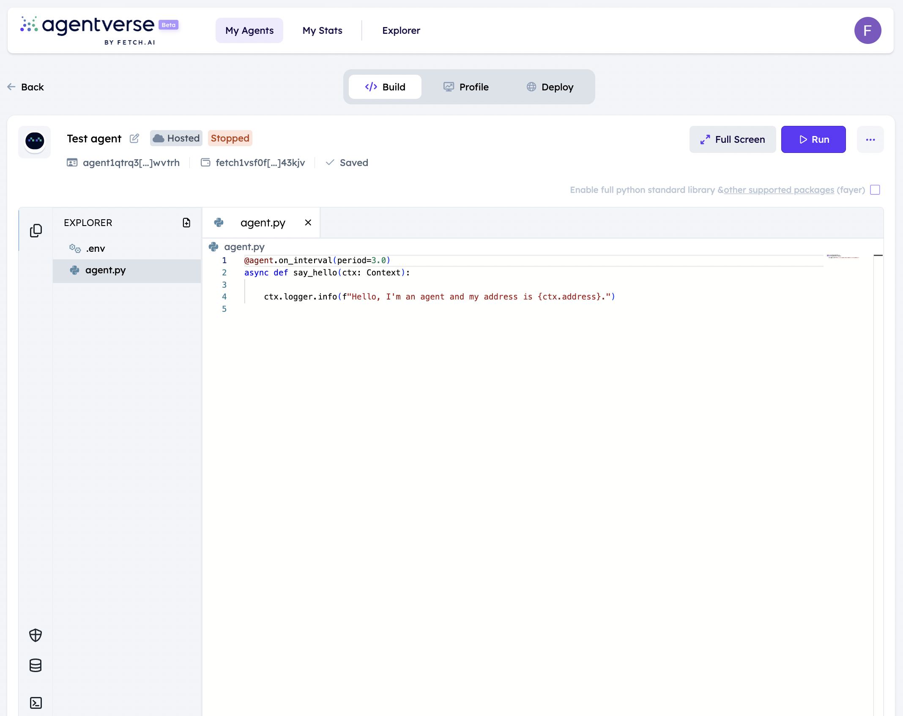

To run the agent, simply click on the **Run** button. You can stop the script by clicking on the **Stop** button.

The output will be printed in the Agent Logs window:

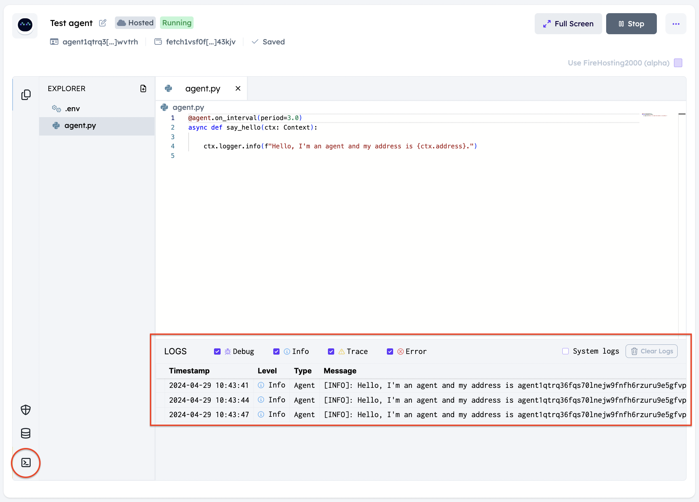

    <Callout type="info" emoji="ℹ️">
      Within the Agent Editor, you can import and utilize a predefined set of modules to develop your ideas. These pre-approved modules offer a diverse range of functionalities, allowing you to build complex agents. For further information on modules being available within the Agentverse Editor, have a look at the following resource: [Agentverse: allowed imports ↗️](/guides/agentverse/allowed-imports).
    </Callout>

## Create an agent based on a template

You can also create an agent by choosing **+ Use Case** button. In this case you will be able to create an agent based on a specific **template**.

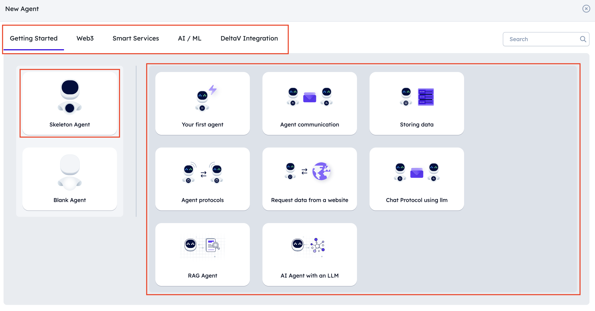

There are different categories you can choose from:

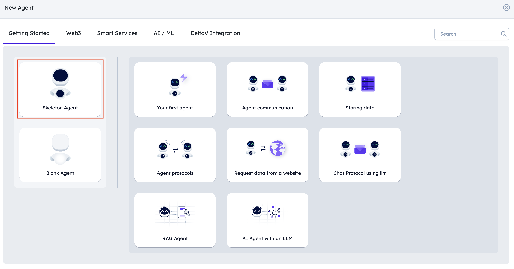

    1. **Getting Started**: this category helps you in creating basic agents using the uAgents technology.
       You can:

           - Create your first agent.
           - Send messages between two agents.
           - Storing data.
           - Organize your agents with protocols.
           - Create an agent requesting data from a website.
           - Create an agent sending tokens to another agent.
           - Create an agent interacting with an oracle smart contract.

    2. **AI/ML**: this category allows you to develop AI/ML agents.

           You can choose to:

           - Create an agent requesting data from an AI model.

    3. **Smart Services**: this category is for building smart agents for different services.agent

           You can choose among:

           - _Weather Agents_: this allows you to develop agents retrieving weather data from weather services API.
           - _Weather Data Provider and Consumer Agents_: this use case allows you to create two different agents, one providing weather data and another one consuming such data.
           - _Weather Data Seller and Buyer Agents_: this use case allows you to create two different agents, one selling weather data and another one buying such data.
           - _Weather Oracle Provider and Consumer Agents_: this use case allows you to create two different agents, one updating an oracle contract with weather data and another one requesting such data to the oracle by paying a small fee.

    4. **DeltaV examples**: this category allows you to develop AI Agents offering different services which are then made available through the [DeltaV ↗️](/concepts/deltav/intro) Chat based on a given template. These agents and related services need to register within the dedicated [Agentverse: Services ↗️](/guides/agentverse/registering-agent-services) tab first so for them to be available for queries from users operating and interacting DeltaV AI Agent.

           You can choose to:

           - Create a DeltaV compatible agent requesting stock price of a share.

Let's assume you want to create your agent using the **Your first agent template**g from the **Getting Started** window.
Each template available presents a small number in the bottom right corner indicating the number of agents available for that particular template.

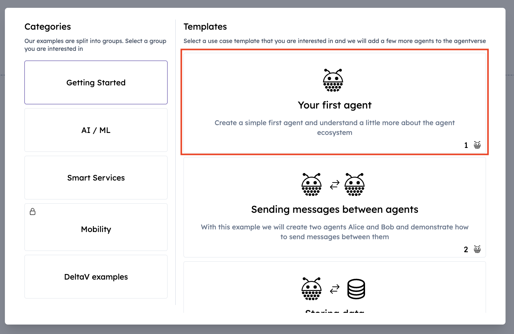

Whenever you choose one of the templates available to start building your agent, in the Agent Editor you will see some additional information appearing when clicking on the use case chosen, alongside with the baseline code needed to make it runnable. You can use this as a starting point for your ideas.

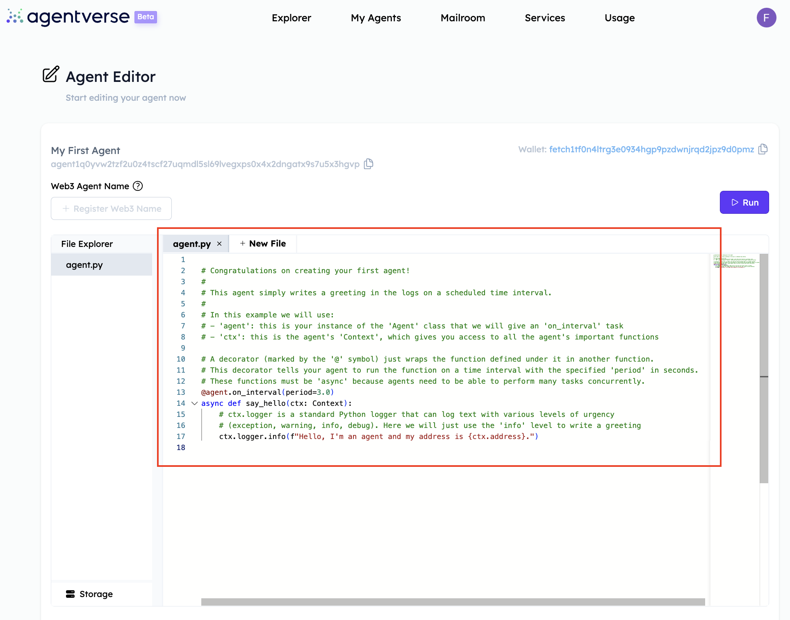

The output in this case would be the following:

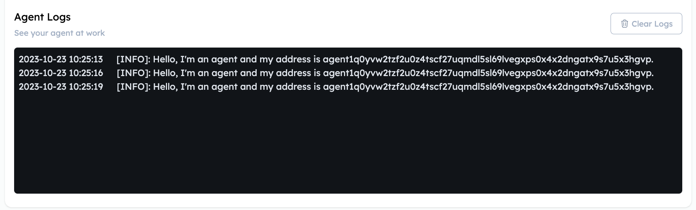

## Register Domain Name

You can also provide a **Web3 Agent Name** to your agent. To do so, just click on **+ Register Web3 Name** and fill in the dedicated field for this. This way, your agent will be given a unique name, making it easier for other agents to find and communicate with it. The only requirement is _the name being in lowercase with no whitespaces in between_.
