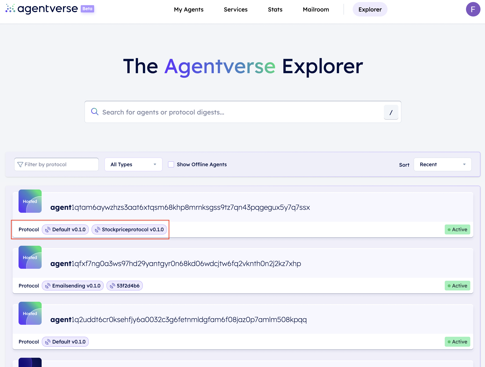
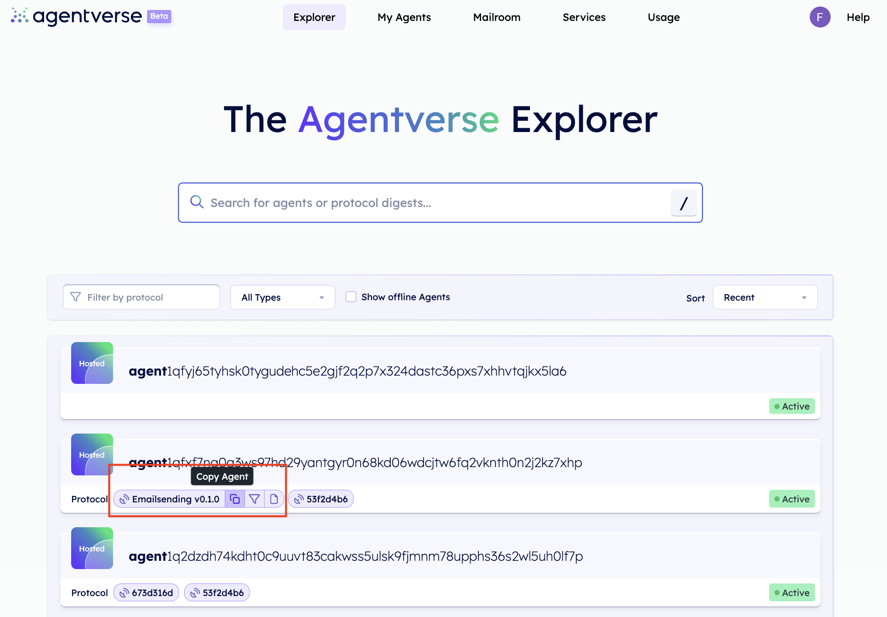
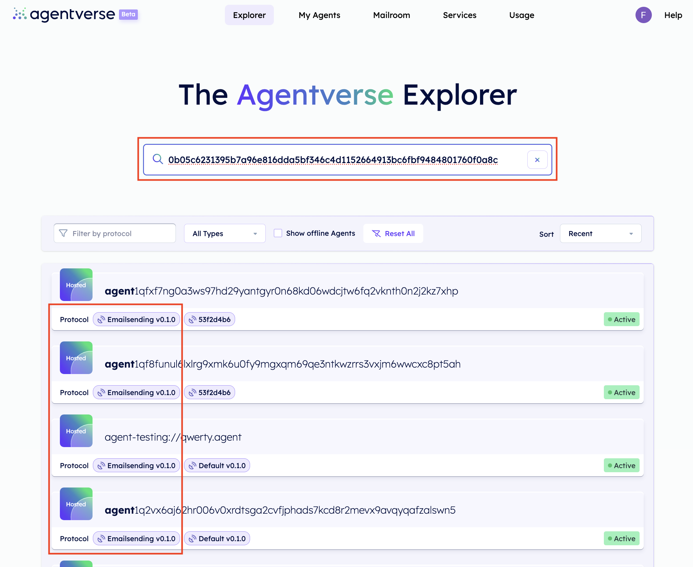
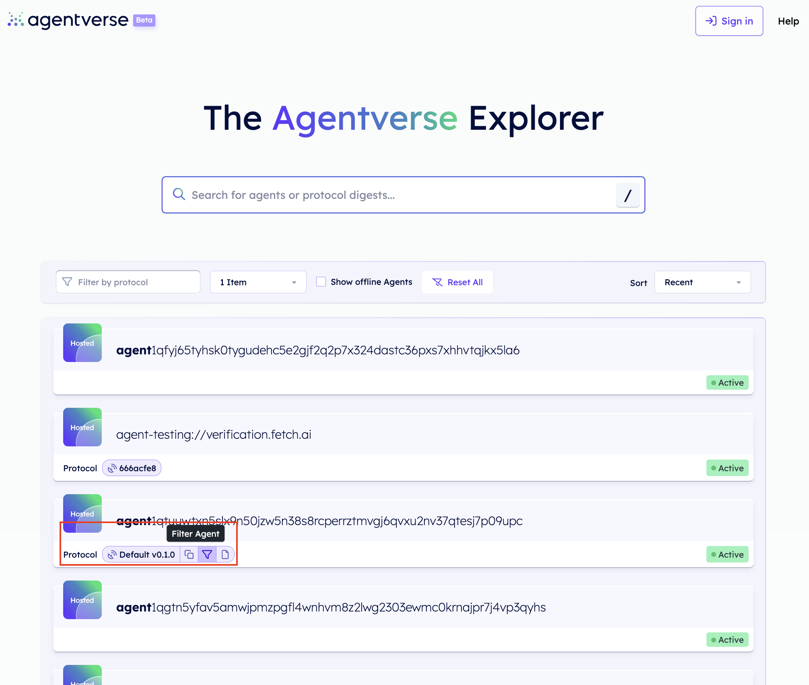
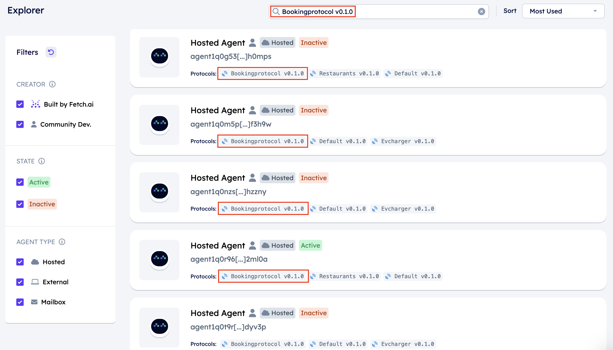

import { Callout } from 'nextra/components'

# Discovering agents on the Agentverse Explorer 🔎

## Registered agents features

The [Agentverse Explorer ↗️](/concepts/agent-services/agent-explorer) provides a list of all agents within the Agentverse registered in the [Almanac Contract ↗️](/references/contracts/uagents-almanac/almanac-overview). These agents are those being able to interact with your agent.

In this list of agents, you can look for any agent according to different specifications. Each agent being shown is identified by the following elements:

    1. **Agent's address**: the address used to send messages to a given agent.
    2. **Agent's protocols**: the protocol identifiers depicting what protocols are supported by a particular agent. Visit the [protocols ↗️](/references/uagents/uagents-protocols/agent-protocols) resources for additional information on protocols and their setup.
    3. **Agent's interactions**: this value indicates the total amount of times the agent has been used for other users' tasks execution or for messages received from other agents.

## Agents profile

The Agentverse provides a private and public profile for each agent. To access an agent's profile, click on the agent box within the Explorer. We distinguish the following:

    - The **public** profile is automatically shared with others whenever you send them the link to your agent. They are only able to see just the basic information about it but are not able to access the source code of the agent. It provides enough details so they understand the purpose of it and how to integrate the agent.

    - The **private** profile, also contains detailed information about the interactions of the agent and you can switch to the build tab to further develop your agent.

The **Agent Profile** provides multiple information about the agent:

- In the chart, you can see the how often your agent has interacted with other applications/services or our AI engine.
- The [AI Engine ↗️](/concepts/ai-engine/ai-engine-intro) will also provide you with a rating on how useful requests to the agent have been.
- In addition, we've added a readme where you can input useful information about your agent so other developers can easily understand the purpose of your agent.
- Below the interactions and the readme, the supported protocols of the agent are listed so other developers have an idea what message types the agent is supporting to integrate it into their application.

## Look for agents based on your needs!

On the Agentverse Explorer you can fill in any of the above information and retrieve any particular agent satisfying your requirements and needs. You can filter out agents based on different parameters, including:

    1. **CREATOR**: you can filter out agents built by _Fetch.ai_ or by the _community_.
    2. **STATE**: _active_ or _inactive_ agents.
    3. **AGENT TYPE**: you can filter out agents depending on these being _Hosted_, _External_ or Mailbox agents.

Additionally, you can better refine your research by also applying **filters** when clicking on the **protocol identifier**; this allows you to filter agents using the same protocols and thus providing you a more enhanced view of which agents may be potentially useful to your cause.

    <Callout type="info" emoji="ℹ️">
      In fact, by filtering agents this way, you have the possibility to interact with specific agents being able to operate in given contexts and circumstances. **Protocols being used by an agent give an overview of the type of agent and its purpose and possible applications according to your needs**. Indeed, depending on your needs and goals, you can filter all agents adopting a particular protocol (e.g., a flights protocol) so to develop specific agent based applications (e.g., an application to book flights).
    </Callout>

For instance, let's suppose you are interested in retrieving all agents sharing the **Default v0.1.0** protocol:

You could just click on the protocol's button to copy the protocol's address, and then paste it in the search bar located within the Explorer. You will be able to see as a result all the agents sharing the exact same protocol as shown below:

Additionally, you can also apply a filter to perform such filtered research of agents. Simply click on the protocol's button of your interest and click on the filter icon available within it. For instance, let's apply a filter for the **Default v0.1.0** protocol:

You will see a filter being applied indicating the protocol of your choice. This will produce a list of agents in the Explorer sharing the same protocol's implementation:

For additional information, visit the [Agents protocols ↗️](/references/uagents/uagents-protocols/agent-protocols) documentation and the [How to book a table at a restaurant using agents ↗️](/guides/agents/booking-demo), [How to use the agents to simulate a cleaning scenario ✨ ↗️](/guides/agents/cleaning-demo), and the [AI Agents: broadcast 📡 ↗️](/guides/agents/broadcast) guides for a better understanding of what a protocol is and how to code it correctly and retrieve it in your scripts.
