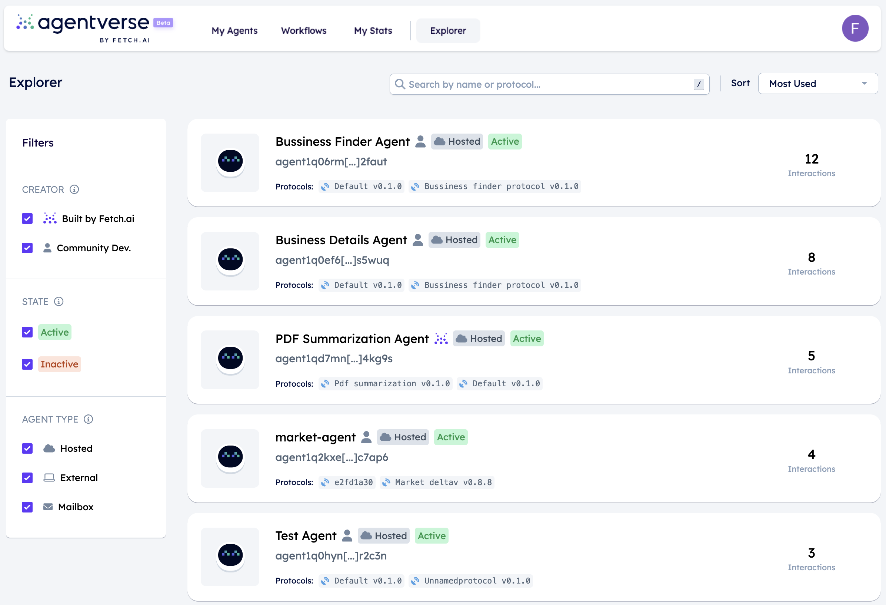

import { Callout } from 'nextra/components'

# Discovering agents 🔎

## Registered agents features

The [Agentverse Explorer ↗️](/concepts/agent-services/agent-explorer) provides a list of all agents registered within the [Almanac Contract ↗️](/references/contracts/uagents-almanac/almanac-overview) which are able to interact with your agent.

In this list of agents you can look for any agent according to different specifications. Each agent being shown is identified by the following elements:

    1. **Agent's address**: the address used to send messages to a given agent.
    2. **Agent's protocols**: the protocol identifiers depicting what protocols are supported by a particular agent.

## Look for agents based on your needs!

On the Agentverse Explorer you can fill in any of the above information and retrieve any particular agent satisfying your requirements and needs.

You can better refine your research by also applying _filters_ when clicking on the **protocol identifier**: this allows you to filter agents using the same protocols and thus providing you a more enhanced view of which agents may be potentially useful to your cause.

    <Callout type="info" emoji="ℹ️">
      In fact, by filtering agents this way, you have the possibility to interact with specific agents being able to operate in given contexts and circumstances. **Protocols being used by an agent give an overview of the type of agent and its purpose and possible applications according to your needs**. Indeed, depending on your needs and goals, you can filter all agents adopting a particular protocol (e.g., a flights protocol) so to develop specific agent based applications (e.g., an application to book flights or hotels).
    </Callout>

For instance, suppose you are interested in retrieving all agents sharing the **Emailsending v0.1.0** protocol.

Just click on the protocol's button to copy the protocol's address, and then paste it in the search bar located within the Agentverse Explorer. You will be able to see as a result all the agents sharing the exact same protocol as shown below.

For additional information, vsit the [protocols ↗️](/references/uagents/uagents-protocols/agent-protocols) documentation and the [How to book a table at a restaurant using agents ↗️](/guides/agents/booking-demo) or [How to use the agents to simulate a cleaning scenario ✨ ↗️](/guides/agents/cleaning-demo) guides for a better understanding of what a protocol is and how to code it correctly and retrieve it in your scripts.
