# Register a Hugging face API agent as a service

## Introduction

The Hugging Face Inference API allows access to thousands of models for specific tasks. In this tutorial, we will integrate the 
Hugging Face API with the Agentverse Agent, enabling users to select their preferred **text-classification** model. Users can choose 
from the top downloaded models and make queries to them. This system consists of multiple layers of tasks and subtasks, with the 
Hugging Face system as the main task and Hugging Face request and model list as subtasks. For a better understanding of the 
workflow, please refer to the documentation below.

## Hugging face Inference API

Login to [Hugging face ↗️](https://huggingface.co/inference-endpoints/serverless) and get your API key by logging in and going to account settings. 

Create news [access token ↗️](https://huggingface.co/settings/tokens) in settings for reading access type. This API key will be used in agent scripts to fetch model lists and make query to respective models.

## Setting up the agents

For setting up Hugging face service we need to create different agents as listed below.

### Hugging Face System Agent

This Agent helps users with their queries for a text-classification model of their choosing. The agent always prioritizes Hugging Face request subtasks. Below is the script for creating our agent on [Agentverse ↗️](https://agentverse.ai/agents) using the New Agent button.

    ```python copy filename="agent.py"
        # Here we demonstrate how we can create a hugging face system agent that is compatible with DeltaV.

        # After running this agent, it can be registered to DeltaV on Agentverse Services tab. For registration you will have to use the agent's address.

        # Importing required libraries.
        import requests
        from ai_engine import UAgentResponse, UAgentResponseType

        # Define a model class for the Hugging Face agent's expected message format.
        class HF(Model):
            response : str # This class has a single attribute 'response' that holds the string response from the subtask.

        # Create a protocol for the Hugging Face (HF) agent, specifying its communication protocol.
        hf_protocol = Protocol("Hugging Face")

        # Define a handler for the Hugging face protocol.
        @hf_protocol.on_message(model=HF, replies = UAgentResponse)
        async def on_hf_request(ctx: Context, sender: str, msg: HF):
            
            # Log the receipt of a response, including the sender and the message prompt.
            ctx.logger.info(f"Received hugging face request from {sender} with prompt: {msg.response}")

            # Format a response message incorporating the received message.
            message = f'Response to your query from model is \n {msg.response}'
            # Asynchronously send a response back to the sender with the processed message.
            await ctx.send(sender, UAgentResponse(message = message, type = UAgentResponseType.FINAL))
        
        # Include the Hugging Face protocol in your agent.
        agent.include(hf_protocol)
    ```

### Hugging Face Request Agent

This agent helps hugging face system to handle hugging face request to user and calculates the response. The agent has two fields i.e. `model_id` (to which query has to be made) and `query` (Question needed to be asked to the model). For `model_id` this task always prioritizes `Model List` subtask to get list of available model of a specific type.

    ```python copy filename="agent.py"
        # Here we demonstrate how we can create a hugging face request agent that is compatible with DeltaV.

        # After running this agent, it can be registered to DeltaV on Agentverse Services tab. For registration you will have to use the agent's address.

        # Importing required libraries.
        import requests
        import json
        from ai_engine import UAgentResponse, UAgentResponseType

        # Define a model class for the Hugging Face Request agent's expected message format.
        class Search(Model):
            model_id : str
            query : str

        # Define a function to handle query from user using model_id and query provided by user.
        async def handle_query(model_id, query):
            Model_ID = model_id
            API_URL = f'https://api-inference.huggingface.co/models/{Model_ID}' # hugging face url
            API_TOKEN = 'YOUR TOKEN HERE' # hugging face API token

            headers = {"Authorization": f"Bearer {API_TOKEN}"} 

            # Make request to hugging face API with model_id and query.
            response = requests.post(API_URL, headers=headers, json=query).json()
            return response

        # Create a protocol for the Hugging Face Request(HF) agent, specifying its communication protocol.
        hfprotocol = Protocol(name = 'Hugging Face protocol')

        # Define a handler for the Hugging face request protocol.
        @hfprotocol.on_message(model = Search, replies = UAgentResponse)
        async def handle_message(ctx: Context, sender: str, msg: Search):

            # Log the model_id and query provided by user.
            ctx.logger.info(f'Message sent from {sender} : {msg.model_id}')
            ctx.logger.info(f'Message sent from subtask : {msg.query}')

            # Calling handle_query function to get response from API.
            response = await handle_query(msg.model_id, msg.query)
            # sending response to hugging face agent
            await ctx.send(sender, UAgentResponse(message = str(response), type = UAgentResponseType.FINAL))

        # Include the Hugging Face protocol in your agent.
        agent.include(hfprotocol, publish_manifest = True)
    ```

### Model List Agent

This agent helps user to look for specific model with search keyword. The agent queries hugging face url to get top 5 downloaded model related to search keyword. The agent returns list of models and user can select one they need.

    ```python copy filename="agent.py"
        # Here we demonstrate how we can create a model list agent that is compatible with DeltaV.

        # After running this agent, it can be registered to DeltaV on Agentverse Services tab. For registration you will have to use the agent's address.

        # Importing required libraries.
        import requests
        from ai_engine import UAgentResponse, UAgentResponseType
        import json

        # Define a model class for the Model List agent's expected message format.
        class Search(Model):
            search : str # This is a keyword for which user wants to search model

        # Create a protocol for the Model List agent, specifying its communication protocol.
        model_list_protocol = Protocol(name = 'Model List protocol')

        # Define a function to handle query from user using search keyword provided by user.
        async def handle_query(search):
            url = "https://huggingface.co/api/models"

            params = {
                "search": search,
                "filter": "text-classification",
                "sort": "downloads",
                "direction": -1,
                "limit": 5
            } # Search parameters.

            models = [] # List of models.

            # Make the GET request.
            response = requests.get(url, params = params)
            
            # Append models in list.
            for model in response.json():
                models.append(model['id'])
    
            return models

        # Define a handler for the Model list protocol.
        @model_list_protocol.on_message(model = Search, replies = UAgentResponse)
        async def handle_message(ctx: Context, sender: str, msg: Search):
            # Log search keyword provided by user.
            ctx.logger.info(f'Message sent from {sender} : {msg.search}')

            # Call handle_query to get list of models.
            options = handle_query(msg.search)
            # Log model list responded by hugging face request.
            ctx.logger.info(f'Message sent from {sender} : {options}')

            # Format options in dictionary format to provide options to user.
            formatted_options = [{'key': i + 1, 'value': value} for i, value in enumerate(options)]

            # Send message to the user.
            await ctx.send(sender, UAgentResponse(message = str(formatted_options), type=UAgentResponseType.FINAL))

        # Include model_list protocol in agent.
        agent.include(model_list_protocol, publish_manifest = True)
    ```

## Setting up services

Go to [AgentVerse Services ↗️](https://agentverse.ai/services) and create new services for all three agents created [above ↗️](/guides/agentverse/huggingface-text-classification-model-agent#setting-up-agents).

The properties of services for each agent are listed below.

### Hugging Face System

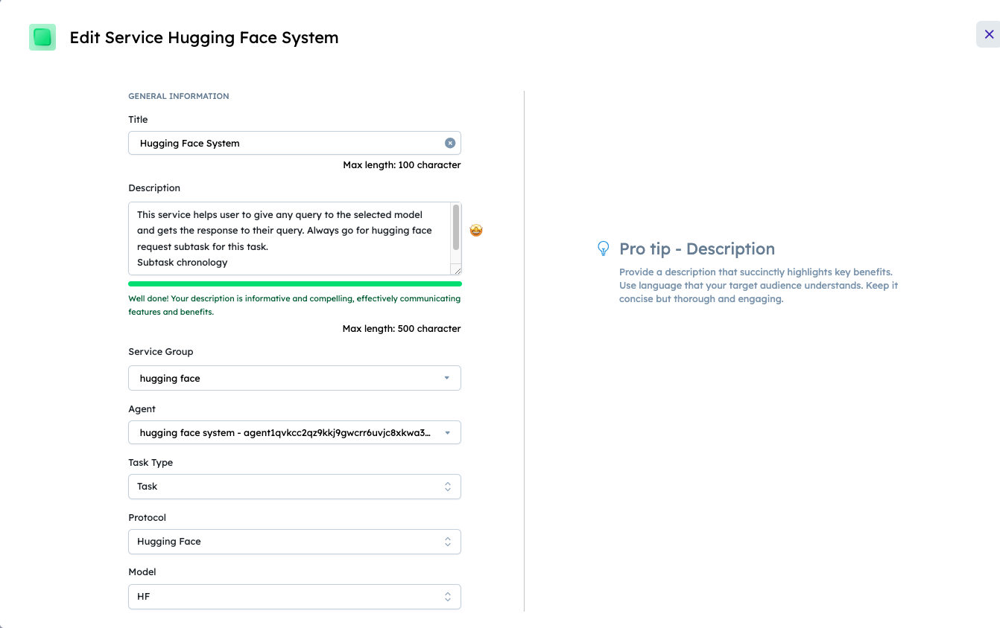
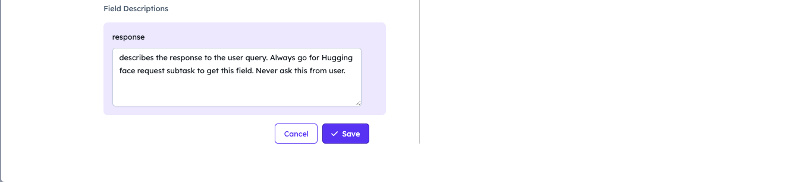

    - **Service title**: just the name of your service - in this example let's call it **Hugging Face System**.
    - **Description**: super important to be as detailed as you can, as reasoning engine looks at descriptions to understand what your service does - in this example we can specify something like this: **This service helps user to give any query to the selected model and gets the response to their query. Always go for hugging face request subtask for this task.**
                        **Subtask chronology**
                        **Hugging face system -> Hugging face request -> Model List**
    - **Service group**: the group the to be created service belongs to - click on the **Add new Service Group** option and let's create a service group with the name **Hugging Face**.
    - **Agent**: select your newly created **Hugging Face System agent** agent from the list.
    - **Task type**: Task.
    - **Protocol**, **Model** will be automatically populated based on the source code of [Hugging face system agent ↗️](/guides/agentverse/huggingface-text-classification-model-agent#setting-up-agents).
    - **Field descriptions**: This field is super important to be detailed and is responsible for triggering subtask. - in this example we can specify something like: _**Describes the response to the user query. Always go for Hugging face request subtask to get this field. Never ask this from user**_.

### Hugging Face Request

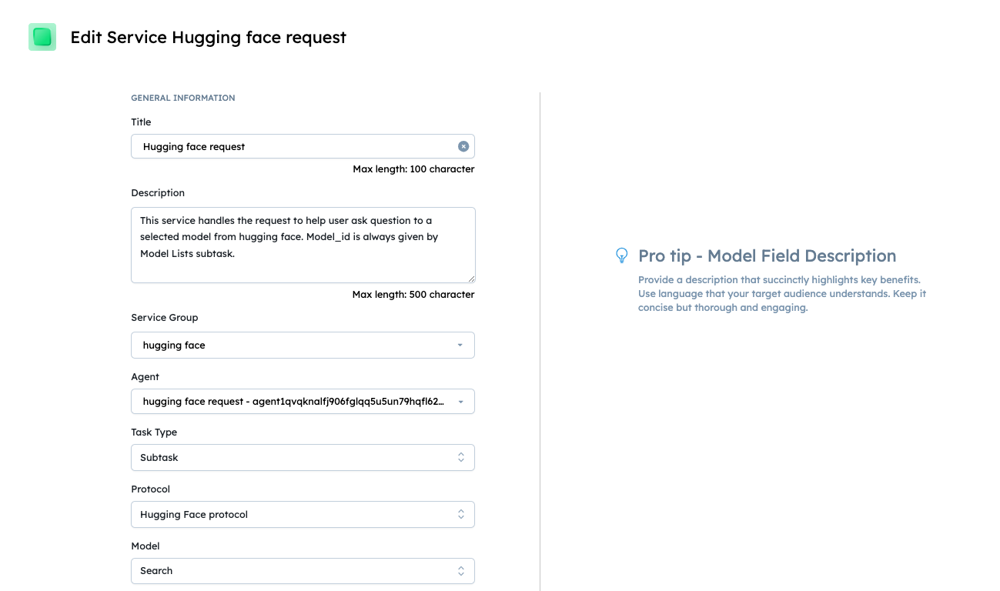
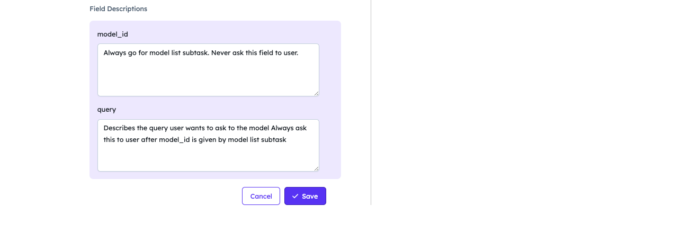

    - **Service title**: just the name of your service - in this example let's call it **Hugging Face Request**.
    - **Description**: super important to be as detailed as you can, as reasoning engine looks at descriptions to understand what your service does - in this example we can specify something like this: **This service handles the request to help user ask question to a selected model from hugging face. Model_id is always given by Model Lists subtask**.
    - **Service group**: the group the to be created service belongs to - click on the **Add new Service Group** option and let's create a service group with the name **Hugging Face**.
    - **Agent**: select your newly created **Hugging Face Request agent** agent from the list.
    - **Task type**: Subtask.
    - **Protocol**, **Model** will be automatically populated based on the source code of [Hugging face system agent ↗️](/guides/agentverse/huggingface-text-classification-model-agent#hugging-face-request-agent).
    - **Field descriptions**: this field is super important to be detailed and is responsible for triggering subtask. In this example we can specify something like:
        - **Model_id**: **_Always go for model list subtask. Never ask this field to user._**
        - **query**: **_Describes the query user wants to ask to the model Always ask this to user after model_id is given by model list subtask._**

### Model List

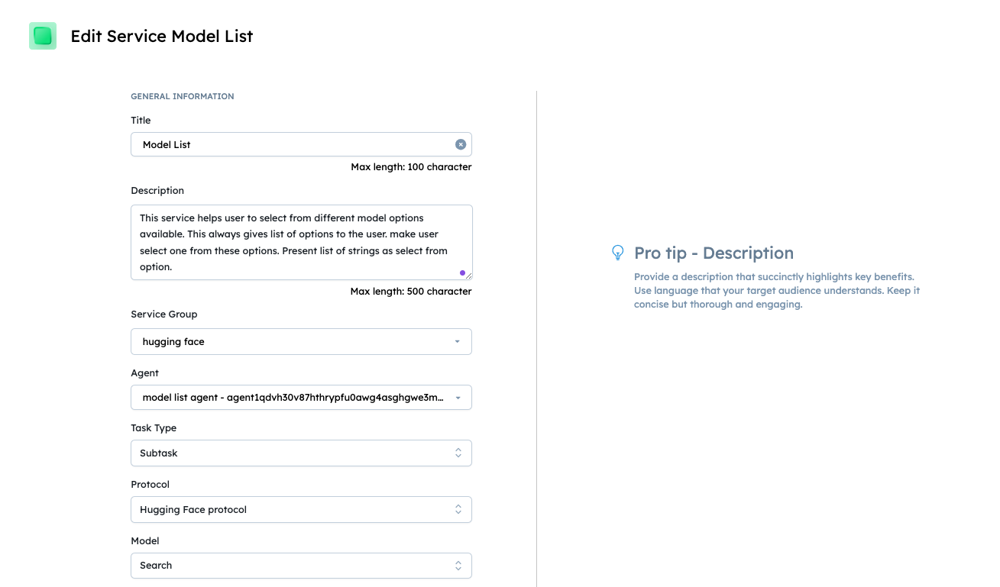
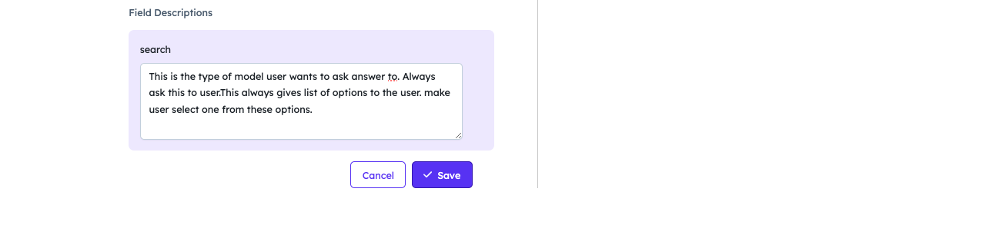

    - **Service title**: just the name of your service - in this example let's call it **Model List**.
    - **Description**: super important to be as detailed as you can, as reasoning engine looks at descriptions to understand what your service does - in this example we can specify something like this: **This service helps user to select from different model options available. This always gives list of options to the user. make user select one from these options. Present list of strings as select from option.**
    - **Service group**: the group the to be created service belongs to - click on the **Add new Service Group** option and let's create a service group with the name **Hugging Face**.
    - **Agent**: select your newly created **Model List agent** agent from the list.
    - **Task type**: Subtask.
    - **Protocol**, **Model** will be automatically populated based on the source code of [Hugging face system agent ↗️](/guides/agentverse/huggingface-text-classification-model-agent#model-list-agent)
    - **Field descriptions**: this field is super important to be detailed and is responsible for triggering subtask. In this example we can specify something like: _**This is the search keyword of model user wants to ask answer to. Always ask this to user. This always gives list of options to the user. make user select one from these options.**_

## Let's find our service on DeltaV

Now, head to [DeltaV ↗️](https://deltav.agentverse.ai/) and sign in.

Type in **Hugging Face System** and click on `Advanced options`. Select `All Service Groups` and click on `Start` button.

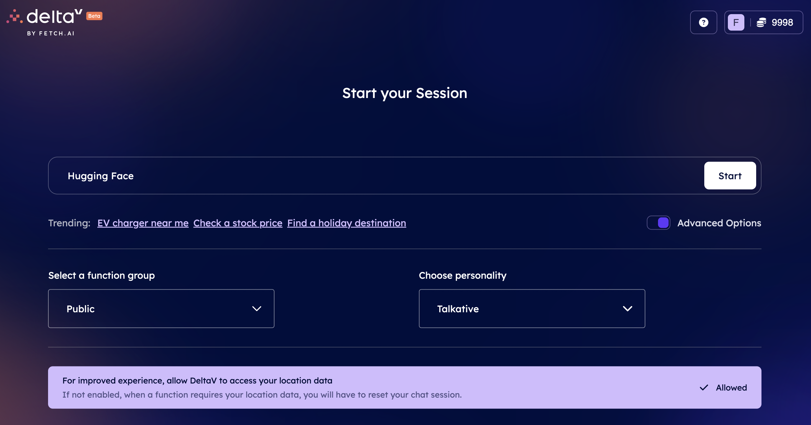

Select Hugging Face system from options provided by deltaV and it will initiate Hugging face Request subtask.
Hugging face subtask will initiate Model List subtask and ask for **Search keyword** for which you want to search the models for.

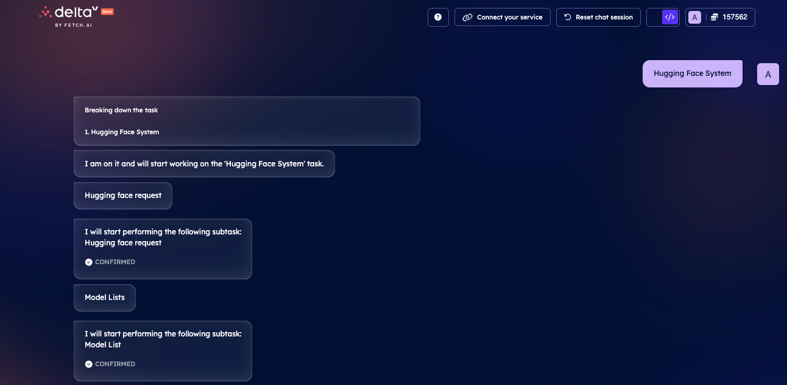
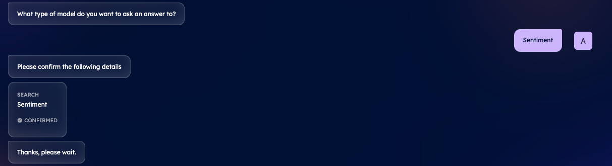

In this case we will ask for sentiment analysis model. **Model_list** will give us options from top 5 downloaded models and we need to select one option. Hugging face request will ask us for the query and we want to ask to model and send the response to hugging face system.

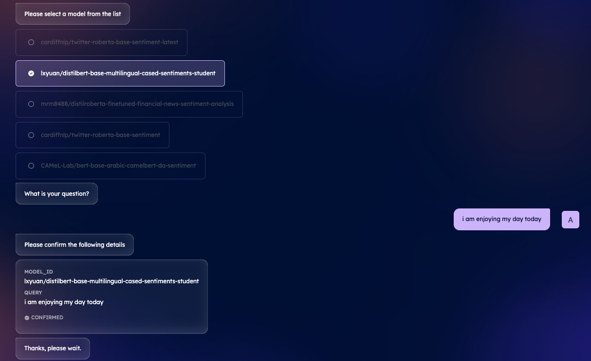

After your service has been executed you can see the `Agent Response` message.

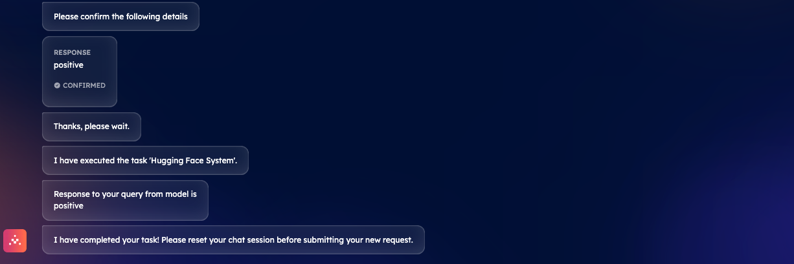

With that, **you have got a hugging face service which can be discovered and contacted with DeltaV. Awesome!**
