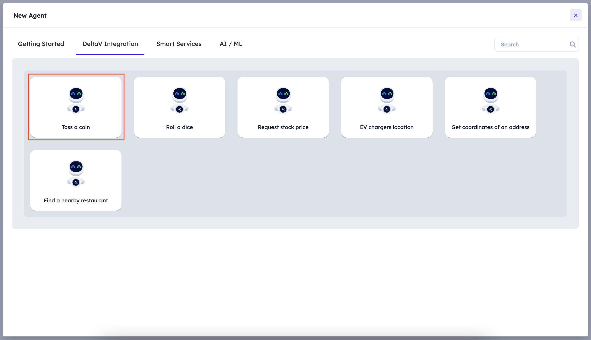
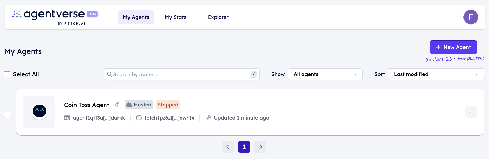
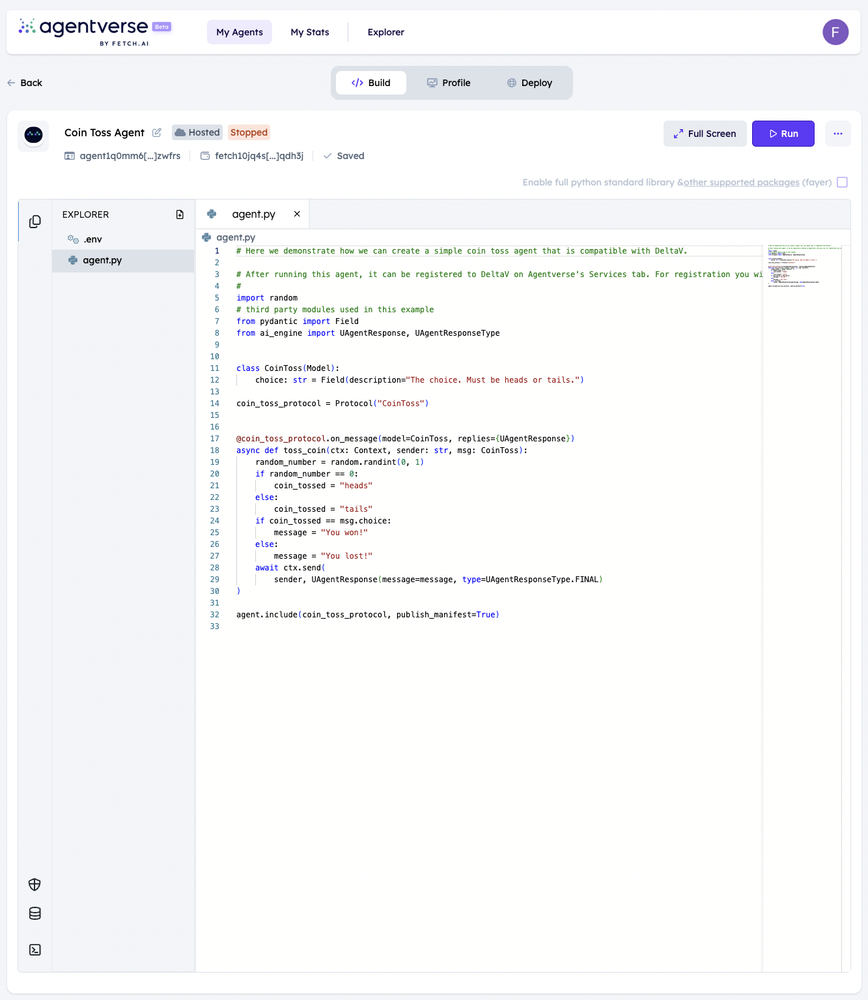
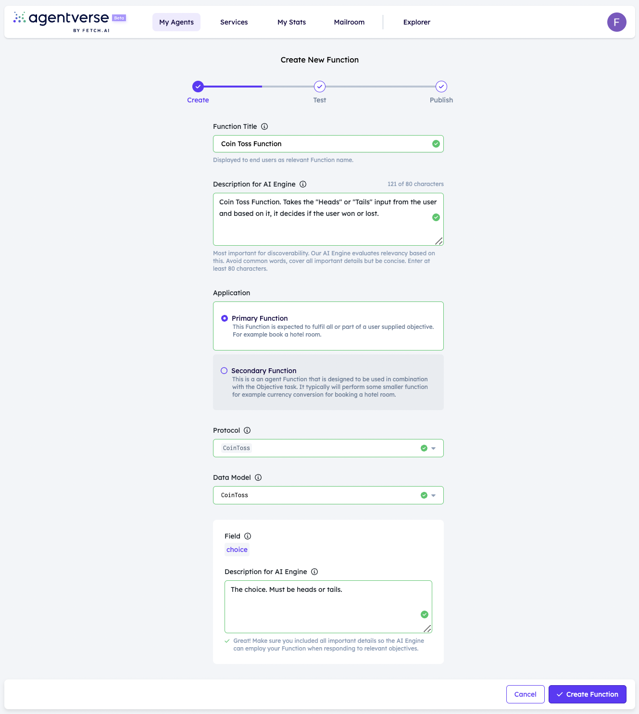

import { Callout } from 'nextra/components'

# Register a coin toss agent as a service

In the [previous section ↗️](/guides/agentverse/registering-agent-services) you have got familiar with the creation of an agent that that can be registered as a service and then can be used in DeltaV.
To make the process of getting familiar with DeltaV compatible services as simple as possible, there are several use cases you can try without needing to write a single line of code.

## Create your coin toss agent!

For this navigate to [your agents ↗️](https://agentverse.ai/agents) and click on the **Use case** button:


When the dialog is open, select the **DeltaV compatible Coin Toss Agent** use case:



Now a new agent has been created for you:



## Run your coin toss agent!

After clicking on the row of your newly created agent, you should be able to see the source code of your coin toss agent in the editor view:

    ```python copy filename="agent.py"
        # Here we demonstrate how we can create a simple coin toss agent that is compatible with DeltaV.

        # After running this agent, it can be registered to DeltaV on Agentverse's Services tab. For registration you will have to use the agent's address. 
        #
        import random
        # third party modules used in this example
        from pydantic import Field
        from ai_engine import UAgentResponse, UAgentResponseType


        class CoinToss(Model):
            choice: str = Field(description="The choice. Must be heads or tails.")

        coin_toss_protocol = Protocol("CoinToss")


        @coin_toss_protocol.on_message(model=CoinToss, replies={UAgentResponse})
        async def toss_coin(ctx: Context, sender: str, msg: CoinToss):
            random_number = random.randint(0, 1)
            if random_number == 0:
                coin_tossed = "heads"
            else:
                coin_tossed = "tails"
            if coin_tossed == msg.choice:
                message = "You won!"
            else:
                message = "You lost!"
            await ctx.send(
                sender, UAgentResponse(message=message, type=UAgentResponseType.FINAL)
        )

        agent.include(coin_toss_protocol, publish_manifest=True)
    ````
Now click on the **Run** button in the upper right corner of the editor so that you have your coin toss agent up and running!



## Register your coin toss agent!

Similar to the [previous section ↗️](/guides/agentverse/registering-agent-services#register-your-agents-and-services) let's navigate to the [Agentverse Services ↗️](https://agentverse.ai/services) section to start registering your agent as a service.

After clicking the **+ New Service** button provide all details required - fill the form out as follows:



    - **Service title**: just the name of your service - in this example let's call it **Coin toss service**
    - **Description**: Super important to be as detailed as you can, as reasoning engine looks at descriptions to understand what your service does - in this example we can specify something like this: **Coin toss service. Takes the "heads" or "tails" input from the user and based on it it decides if the user won or lost.**
    - **Service group**: the group the to be created service belongs to - If you already have the **Use case** service group created in the previos coin toss example select that. If you haven't created a service group click on the **Add new Service Group** option and let's create a service group with the name **Use case**.
    - **Agent**: select your newly created **deltav compatible coin toss agent** agent from the list
    - **Task type**, **Protocol**, **Model** and **Field descriptions** will be automatically populated based on the source code of your coin toss agent.

## Let's find our service on DeltaV

Now, head to [DeltaV ↗️](https://deltav.agentverse.ai/) and sign in.

You will be asked to select a **Service Group**. Let's select the `Use case` service group in the dropdown positioned on the upper right part of the screen as that's the one we created for this guide.


After being navigated to the chat screen, specify an objective like **"Please return me a zero"**.


Then, this is the full output:


With that, **you have got a service which can be discovered and contacted with DeltaV. Awesome!**
