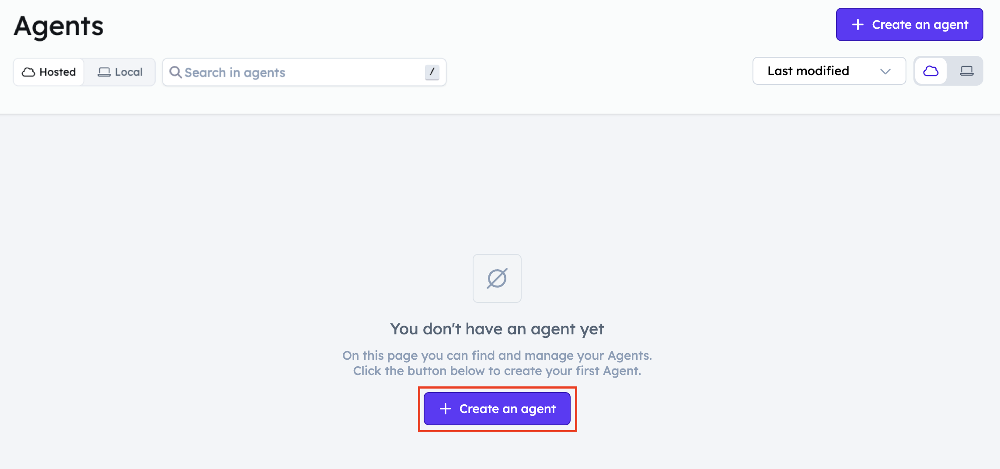
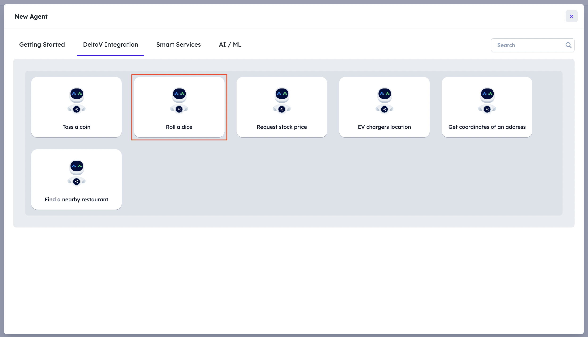
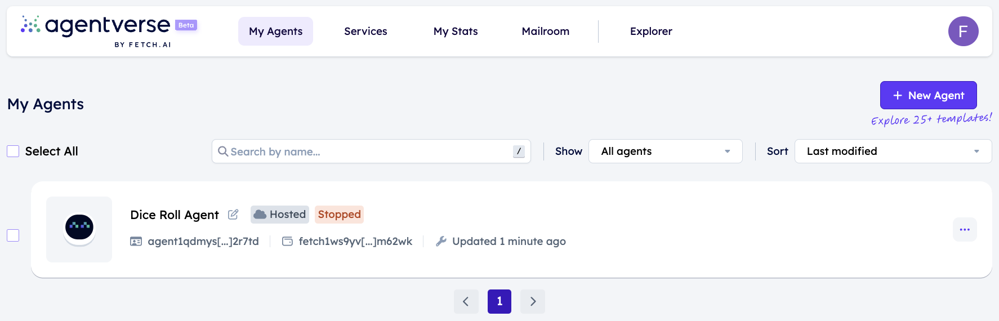
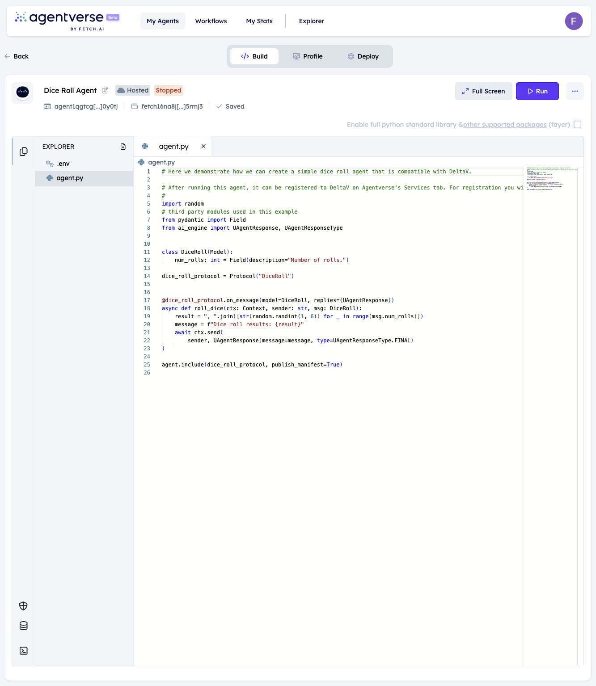
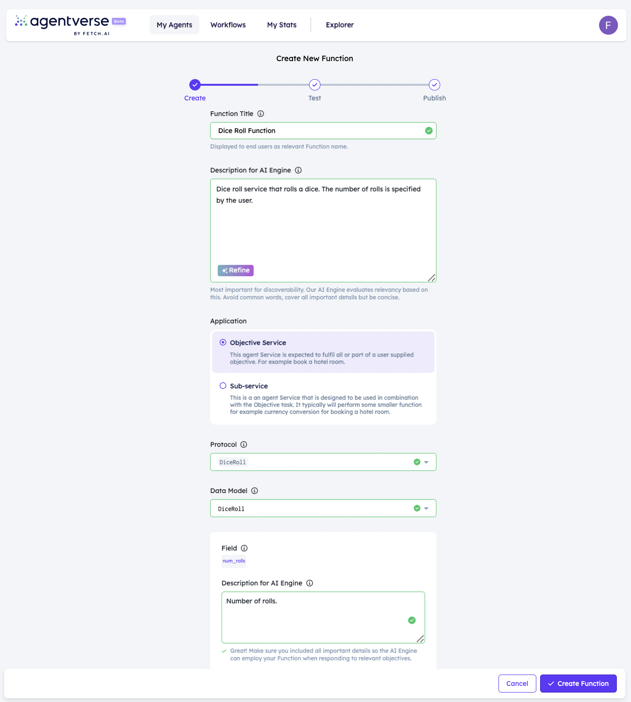
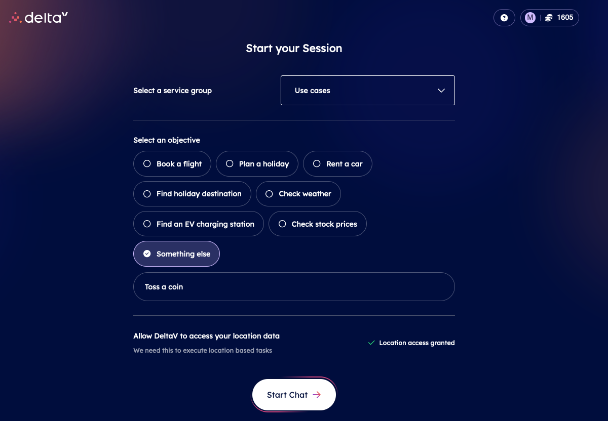

import { Callout } from 'nextra/components'

# Register a dice roll agent as a service

In the [previous section ↗️](/guides/agentverse/registering-agent-coint-toss) you have got familiar with the creation of a coin toss agent that can be registered as a service and then can be used in DeltaV

In this example we are going to try out another use case - dice roll agent.

## Create your dice roll agent!

For this navigate to [your agents ↗️](https://agentverse.ai/agents) and click on the **Use case** button:



When the dialog is open, select the **DeltaV compatible Dice Roll Agent** use case:



Now a new agent has been created for you:



## Run your dice roll agent!

After clicking on the row of your newly created agent, you should be able to see the source code of your dice roll agent in the editor view:

    ```python copy filename="agent.py"
        # Here we demonstrate how we can create a simple dice roll agent that is compatible with DeltaV.

        # After running this agent, it can be registered to DeltaV on Agentverse's Services tab. For registration you will have to use the agent's address. 
        #
        import random
        # third party modules used in this example
        from pydantic import Field
        from ai_engine import UAgentResponse, UAgentResponseType


        class DiceRoll(Model):
            num_rolls: int = Field(description="Number of rolls.")

        dice_roll_protocol = Protocol("DiceRoll")


        @dice_roll_protocol.on_message(model=DiceRoll, replies={UAgentResponse})
        async def roll_dice(ctx: Context, sender: str, msg: DiceRoll):
            result = ", ".join([str(random.randint(1, 6)) for _ in range(msg.num_rolls)])
            message = f"Dice roll results: {result}"
            await ctx.send(
                sender, UAgentResponse(message=message, type=UAgentResponseType.FINAL)
        )

        agent.include(dice_roll_protocol, publish_manifest=True)
    ````
Now click on the **Run** button in the upper right corner of the editor so that you have your dice roll agent up and running!



## Register your dice roll agent!

Similar to the [previous section ↗️](/guides/agentverse/registering-agent-coin-toss#register-your-coin-toss-agent) let's navigate to the [Agentverse Services ↗️](https://agentverse.ai/services) section to start registering your agent as a service.

After clicking the **+ New Service** button provide all details required - fill the form out as follows:



    - **Service title**: just the name of your service - in this example let's call it **Dice roll service**
    - **Description**: Super important to be as detailed as you can, as reasoning engine looks at descriptions to understand what your service does - in this example we can specify something like this: **Dice roll service that rolls a dice. The number of rolls is specified by the user.**
    - **Service group**: the group the to be created service belongs to - click on the **Add new Service Group** option and let's create a service group with the name **Use case**.
    - **Agent**: select your newly created **deltav compatible dice roll agent** agent from the list
    - **Task type**, **Protocol**, **Model** and **Field descriptions** will be automatically populated based on the source code of your dice roll agent.

## Let's find our service on DeltaV

Now, head to [DeltaV ↗️](https://deltav.agentverse.ai/) and sign in.

You will be asked to select a **Service Group**. Let's select the `Use case` service group in the dropdown positioned on the upper right part of the screen as that's the one we created for this guide.



After being navigated to the chat screen, specify an objective like **"Please return me a zero"**.


Then, this is the full output:


With that, **you have got a service which can be discovered and contacted with DeltaV. Awesome!**
