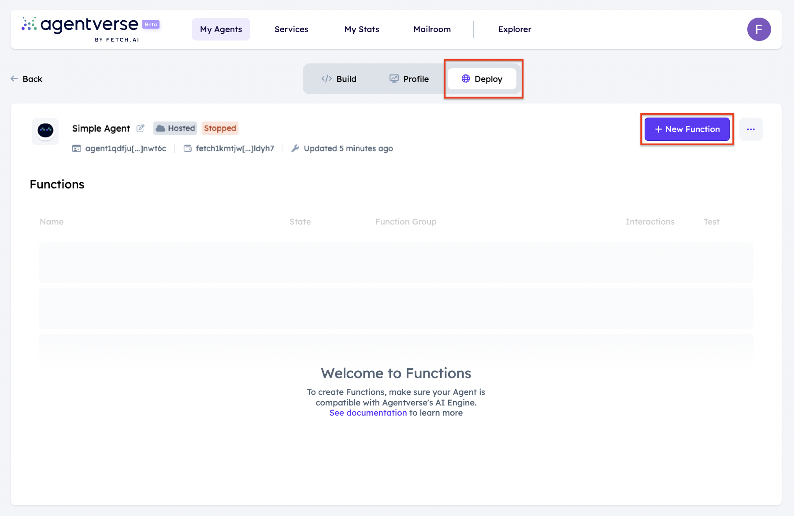
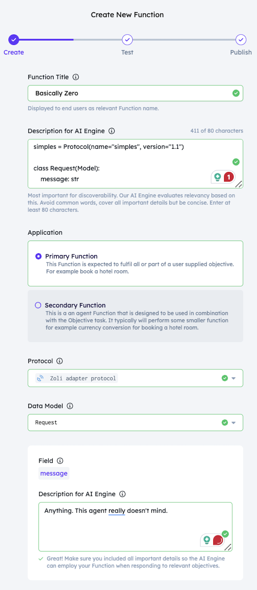
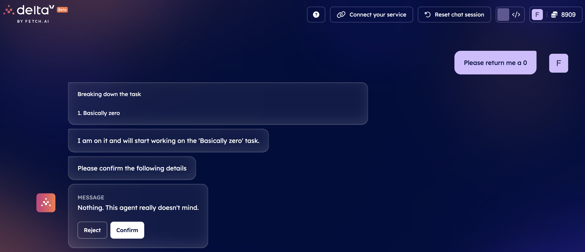

import { Callout } from 'nextra/components'

# Agentverse Services: register your Agents Functions on the Agentverse!

## Introduction

The [Agentverse: Services ↗️](/guides/services/services) feature allows you to enrol your agent in the system so as to be discovered by other agents and start interacting with them. This feature aims at connecting multiple agents offering different Services identified as Agents Functions so to enhance users journey, results and development. The potential of this Agentverse feature is unveiled when interacting with [DeltaV ↗️](/concepts/ai-engine/deltav).

First of all, to proceed with a service registration on the [Agentverse ↗️](https://agentverse.ai), you will need to start by creating a dedicated [AI Agent ↗️](/concepts/agents/agents) wrapping up the Agent Function you wish to provide to users. You can create and code your AI Agent directly on the [Agentverse: My Agents ↗️](/concepts/agent-services/agent-hosting) tab by clicking on dedicated **+ New Agent** button.

You will then need to define the [protocol ↗️](/references/uagents/uagents-protocols/agent-protocols). You can do this by creating a **simple_protocol.py** within the Agent Editor window:

    ```py copy filename="simple_protocol.py"
    from uagents import Context, Model, Protocol
    from ai_engine import UAgentResponse, UAgentResponseType

    simples = Protocol(name="simples", version="1.1")

    class Request(Model):
        message: str

    @simples.on_message(model=Request, replies={UAgentResponse})
    async def handle_message(ctx: Context, sender: str, msg: Request):
        await ctx.send(sender, UAgentResponse(message="0", type=UAgentResponseType.FINAL))
    ```

Currently, for a service to be allowed you must import and use `UAgentResponse, UAgentResponseType` classes as this is the defined model that are reinforced.

    <Callout type="info" emoji="ℹ️">
      `UAgentResponseType` is used to represent different response types of the agent. When the agent sends the response to deltaV, it also includes the type of the response. It contains the following types:

        - `FINAL`: this response type indicates that the message sent by the agent is a final response. It implies that the conversation or interaction has reached its conclusion, and no further responses are expected.
        - `ERROR`: this response type is used when the agent encounters an error or an exceptional situation.
        - `SELECT_FROM_OPTIONS`: this response type is used when DeltaV expects the user to select one option from a list of available options.
        - `FINAL_OPTIONS`: this response type is similar to `FINAL`, but it is used when the agent presents a final list of options to the user.
    </Callout>

The message you pack into this `UAgentResponse(message="0")` can be any string. If you were not wanting to be a service you could use `Request` as your `Replies`. Let's now define the **agent.py** script for our agent:

    ```py copy filename="agent.py"
    from simple_protocol import simples

    agent.include(simples)
    ```

    <Callout type="info" emoji="ℹ️">
      You can follow the [Creating an Agentverse hosted agent 🤖↗️](/guides/agentverse/creating-a-hosted-agent) guide if you don't know how to create an agent, or simply haven't created one already.
    </Callout>

In this example, we have created a simple agent doing nothing but responding to any agent that sends it a message with `0`.

The Agentverse Service functionality shows its potential when operating on the [DeltaV ↗️](/concepts/ai-engine/deltav) platform. This because Agents registered within the Agentverse, are those retrieved by the AI Engine when users interact with DeltaV chat interface to require a specific objective execution.

    <Callout type="info" emoji="ℹ️">
      This way the integration between the Agentverse Services functionality and DeltaV spreads adoption of Agent Functions to a greater plethora of users. Checkout the [Book any service with DeltaV ↗️](/guides/deltav/deltav-chat-interface) guide for additional information on possible queries available via DeltaV.
    </Callout>

Once you finalised the development of your agent and it is being run (assuming no issues arise), then the agent and its [protocols ↗️](/references/uagents/uagents-protocols/agent-protocols) manifests are uploaded to the [Almanac ↗️](/references/contracts/uagents-almanac/almanac-overview) contact in the form of **protocol digests**.

    <Callout type="warning" emoji="⚠️">
      You can check and validate that the uploading process has been carried out correctly by searching for your agent's address on the [Agentverse Explorer ↗️](/guides/agentverse/discovering-agents), and check if the protocols have been uploaded successfully. If not, you need to wait until the protocols will be uploaded successfully.
    </Callout>

## Register your agents and services!

On the [Agentverse ↗️](https://agentverse.ai/) within the **My Agents** tab we previously defined our agent. In here, we can now define the Agent Services we want to provide to users. In this context, Services are developed as **Agents Functions** directly within the Agent Editor window appearing when developing your Hosted Agents. This because agents provide specific functionalities to users depending on objective requested.

Let's go ahead and click the **Deploy** tab. You need to make sure your agent is up and running as Functions can be registered only if your agent is running.



Then, you will be required to provide multiple information as shown below:



There's a little to unpack here, but it's quite simple:

    - **Function title**: just the name of your Agent Function.
    - **Description**: super important to be as detailed as you can, as reasoning AI Engine looks at descriptions to understand what your Agent Function does.
    - **Application**: Primary or Secondary Function. For a detailed definition, check [here ↗️](/guides/services/services#primary-and-secondary-functions)
    - **Protocol**: it's defined in your `Agent`.
    - **Model**: again, we defined that in `simple_protocol.py`.
    - **Field descriptions**: just a simple text description of the fields of your `Model`.

### Provide a detailed description

The description is super important to the success of your Agent Function. You need to be very descriptive so that the AI Engine can retrieve your agents correctly.

An example for an agent that returns zero:

    `"This Agent Function returns the value zero. This agent returns a string representation of the integer 0. This Function is a representation of the value of zero."`

#### A **bad** example for an agent that sells analytical data on .csv file you send to it:

`"This Agent Function gives inferences on the data file you upload."`

#### A **good** example for an agent that sells analytical data on .csv file you send to it:

`"This Agent Function gives insight and inferences into the CSV file you upload. The function can give you insight into your CSV data. Upload a CSV file to learn more about the data."`

You may need to test your description, if you're ever having trouble let us know over on our [Discord ↗️](https://discord.gg/fetchai).

## Just in case, to test!

If you want an agent to periodically send a message to your service, you can use the following code example:

    ```python copy filename="simple_interval.py"
    from ai_engine import UAgentResponse, UAgentResponseType

    class Request(Model):
        message: str

    @agent.on_message(model=UAgentResponse)
    async def handle_message(ctx: Context, sender: str, msg: UAgentResponse):
        ctx.logger.info(f"Received message from {sender}: {msg.message}")

    @agent.on_interval(period=3.0)
    async def send_message(ctx: Context):
        await ctx.send('YOUR AGENT ADDRESS', Request(message="hello there bob"))
        ctx.logger.info(f"Message has been sent to basically zero")
    ````

## Let's find our service on DeltaV

Now, head to [DeltaV ↗️](https://deltav.agentverse.ai/) and sign in.

You will be asked to select a **Service Group**. We selected `Helpers` as that is the one we created for this guide.


Then, we ask **"Please return me a zero"**:




Then, this is the full output:


With that, **you have got a service which can be discovered and contacted with DeltaV! Awesome!**

    <Callout type="info" emoji="ℹ️">
      For additional examples on how to register an Agent FUnction on the Agentverse and subsequently DeltaV, have a look at the other guides we have prepared for you: [register a coin toss agent as a Function 🪙 ↗️](/guides/agentverse/registering-agent-dice-roll) and [register a dice roll agent as a Function 🎲 ↗️](/guides/agentverse/registering-agent-dice-roll).

      You can also check our dedicated [guide ↗️](/guides/agents/running-locally) helping you to create a locally run Agent with an Agent Function, which is then registered on the Agentverse and then retrievable on DeltaV!
    </Callout>
