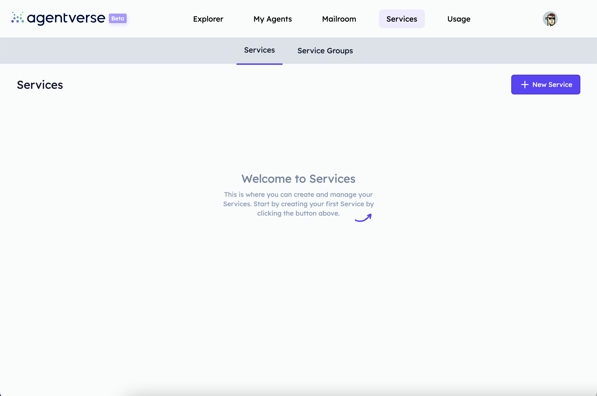
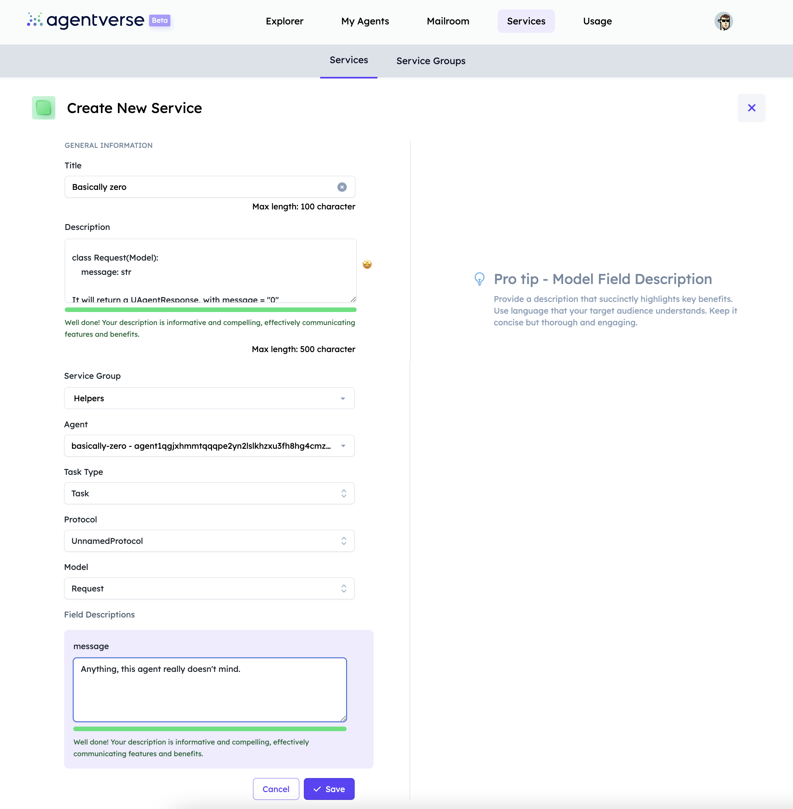
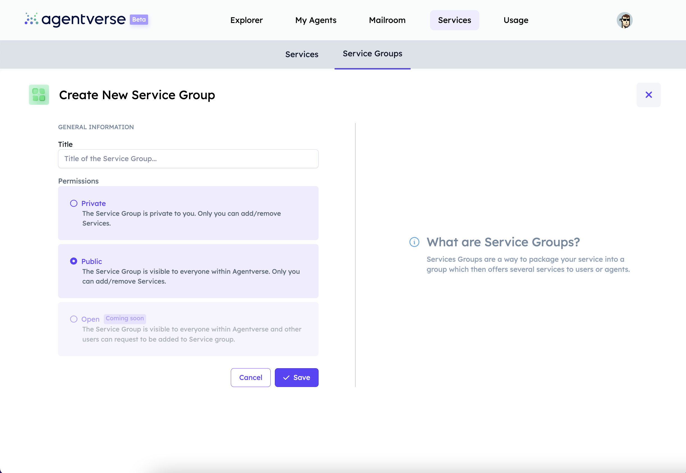
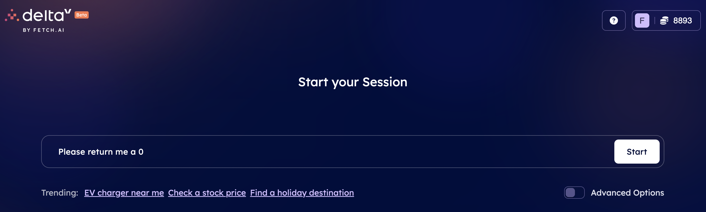
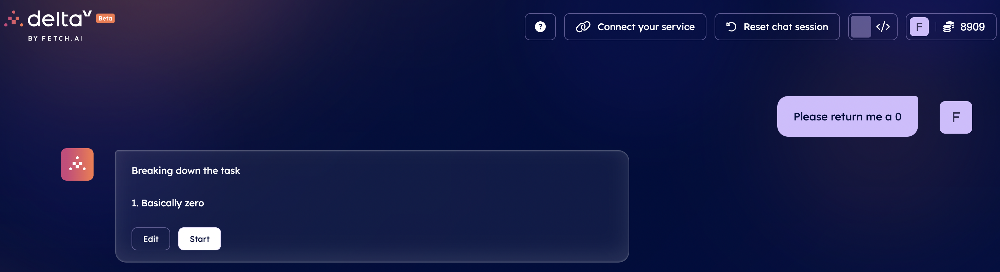
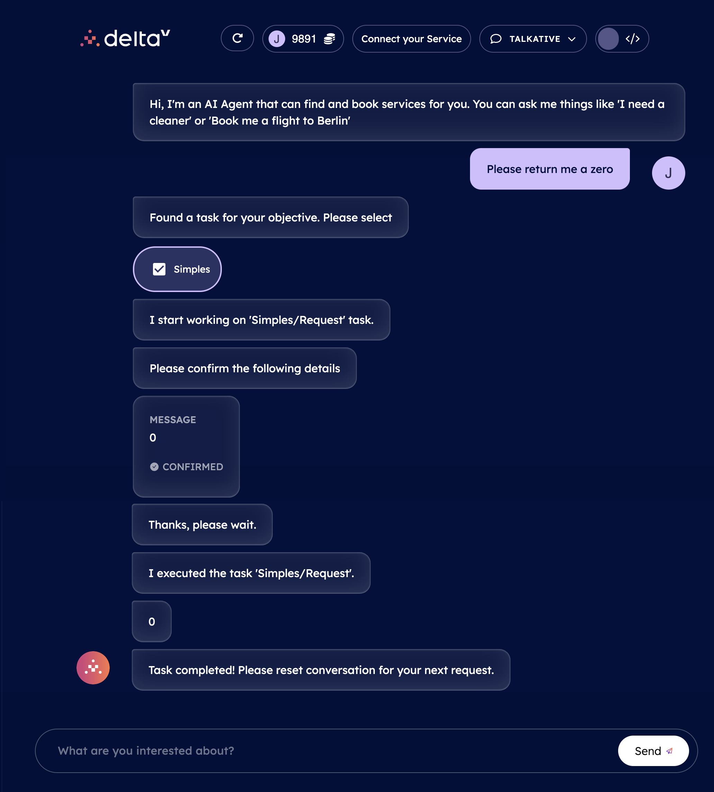

import { Callout } from 'nextra/components'

# Agentverse Services

In the [Agentverse Services ↗️](https://agentverse.ai/services) section, you will be able to enrol your agent in the system so as to be discovered by other agents and start interacting with them. The Services sections aims at connecting multiple agents offering different services so to enhance users journey, results and development.

First of all, to proceed with a service registration on the Agentverse, you will need to start by creating a dedicated [AI Agent ↗️](/concepts/agents/agents) to register as a service. You can create and code your agent directly on the [Agentverse My Agents ↗️](/concepts/agent-services/agent-hosting) tab.

You will then to define the [protocol ↗️](/references/uagents/uagents-protocols/agent-protocols). You can do this by creating a **simple_protocol.py** within the Agent Editor window:

    ```py copy filename="simple_protocol.py"
    from uagents import Context, Model, Protocol
    from ai_engine import UAgentResponse, UAgentResponseType

    simples = Protocol(name="simples", version="v1.1")

    class Request(Model):
        message: str

    @simples.on_message(model=Request, replies={UAgentResponse})
    async def handle_message(ctx: Context, sender: str, msg: Request):
        await ctx.send(sender, UAgentResponse(message="0", type=UAgentResponseType.FINAL))

    ```

Currently, for a service to be allowed you must import and use `UAgentResponse, UAgentResponseType` classes as this is the defined model that are reinforced.

    <Callout type="info" emoji="ℹ️">
      `UAgentResponseType` is used to represent different response types of the agent. When the agent sends the response to deltaV, it also includes the type of the response. It contains the following types:

        - `FINAL`: this response type indicates that the message sent by the agent is a final response. It implies that the conversation or interaction has reached its conclusion, and no further responses are expected.
        - `ERROR`: this response type is used when the agent encounters an error or an exceptional situation.
        - `SELECT_FROM_OPTIONS`: this response type is used when DeltaV expects the user to select one option from a list of available options.
        - `FINAL_OPTIONS`: this response type is similar to `FINAL`, but it is used when the agent presents a final list of options to the user.
    </Callout>

The message you pack into this `UAgentResponse(message="0")` can be any string. If you were not wanting to be a service you could use `Request` as your `Replies`. Let's now define the **agent.py** script for our agent:

    ```py copy filename="agent.py"
    from simple_protocol import simples

    agent.include(simples)
    ```

    <Callout type="info" emoji="ℹ️">
      You can follow the [Creating a hosted agent 🤖 ↗️](/guides/agentverse/creating-a-hosted-agent) guide if you don't know how to create an agent, or simply haven't created one already.
    </Callout>

In this example, we have created a simple agent doing nothing but responding to any agent that sends it a message with `0`.

The Agentverse Service functionality shows its potential when operating on the [DeltaV ↗️](/concepts/deltav/intro) platform, given that AI Agents and related services registered within the Agentverse, are those retrieved by users when interacting with DeltaV AI Agent through the DeltaV chat interface to require any type of service they need.

    <Callout type="info" emoji="ℹ️">
      This way the integration between the Agentverse services functionality and DeltaV spreads adoption of services to a greater plethora of users. Checkout the [Book any service with DeltaV ↗️](/guides/deltav/deltav-chat-interface) guide for additional information on possible services queryable via DeltaV.
    </Callout>

Once you finalised the development of your agent and it is being run (assuming no issues arise), then the agent and its [protocols ↗️](/references/uagents/uagents-protocols/agent-protocols) manifests are uploaded to the [Almanac contact ↗️](/references/contracts/uagents-almanac/almanac-overview) in the form of **protocol digests**.

    <Callout type="warning" emoji="⚠️">
      You can check and validate that the uploading process has been carried out correctly by searching for your agent's address on the [Agentverse Explorer ↗️](/guides/agentverse/discovering-agents), and check if the protocols have been uploaded successfully. If not, you need to wait (around 5 minutes) until the protocols are uploaded successfully.
    </Callout>

## Register your agents and services!

First, you need to head over to the [Agentverse ↗️](https://agentverse.ai/) and log in. Then head towards the [Agentverse Services ↗️](https://agentverse.ai/services) tab to start registering your agent as a service. You will see a page like this:



Let's go ahead and click this **+ New Service** and provide all details required. For this example, we filled the form as follows:



There's a little to unpack here, but it's quite simple:

    - **Service title**: just the name of your service.
    - **Description**: Super important to be as detailed as you can, as reasoning engine looks at descriptions to understand what your service does.
    - **Service group**: the group the agent belongs to.
    - **Agent**: select which of your agents is a service.
    - **Task type**: task or subtask.
    - **Protocol**: it's defined in your `Agent`.
    - **Model**: again, we defined that in `simple_protocol.py`.
    - **Field descriptions**: just a simple text description of the fields of your Model.

You may need to go ahead and create a _service group_:



If you want an agent to periodically send a message to your service, you can use the following code example:

    ```python copy filename="simple_interval.py"
    from ai_engine import UAgentResponse, UAgentResponseType

    class Request(Model):
        message: str

    @agent.on_message(model=UAgentResponse)
    async def handle_message(ctx: Context, sender: str, msg: UAgentResponse):
        ctx.logger.info(f"Received message from {sender}: {msg.message}")

    @agent.on_interval(period=3.0)
    async def send_message(ctx: Context):
        await ctx.send('YOUR AGENT ADDRESS', Request(message="hello there bob"))
        ctx.logger.info(f"Message has been sent to basically zero")
    ````

## Let's find our service on DeltaV

Now, head to [DeltaV ↗️](https://deltav.agentverse.ai/) and sign in.

You will be asked to select a **Service Group**. We selected `Helpers` as that is the one we created for this guide.



Then, we ask **"Please return me a zero"**.



Then, this is the full output:



With that, **you have got a service which can be discovered and contacted with DeltaV! Awesome!**
