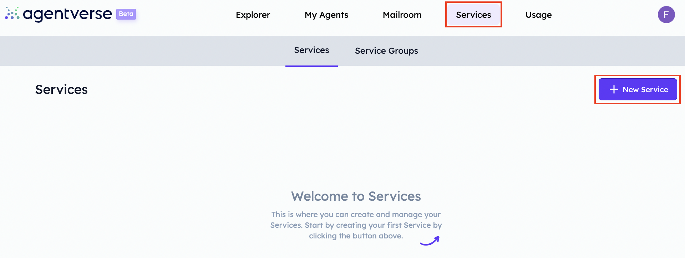
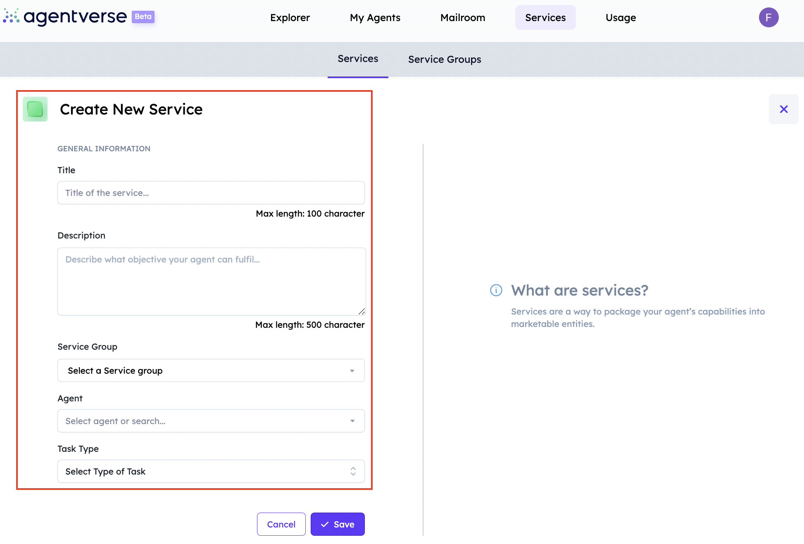
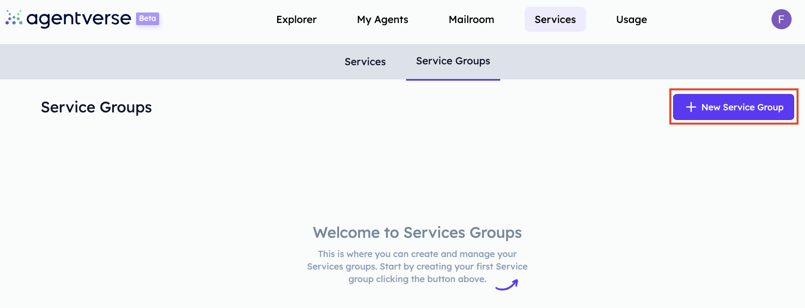
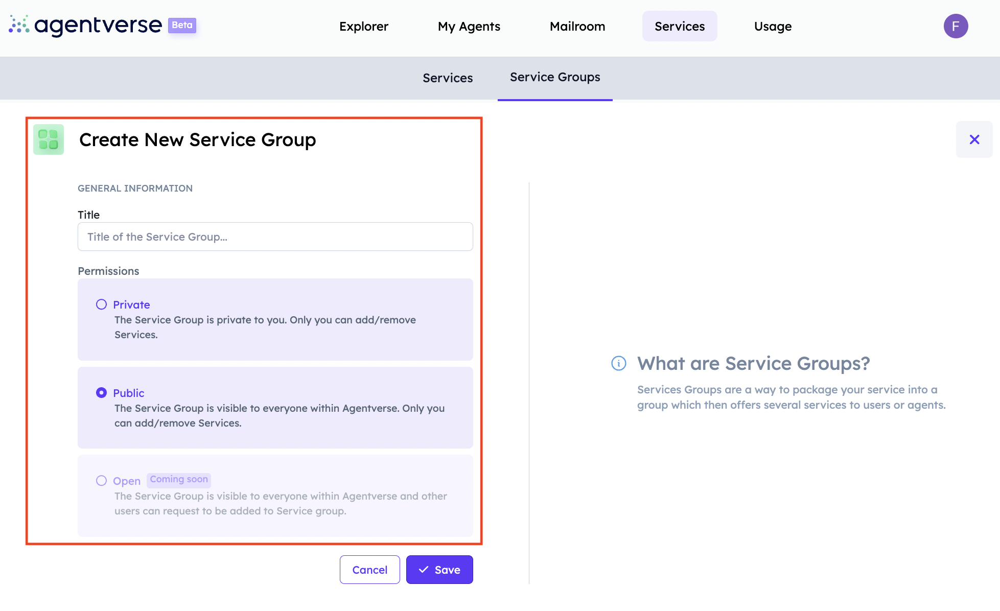

import { Callout } from 'nextra/components'

# Agentverse services

In the [Agentverse services ↗️](https://agentverse.ai/services) section, you will be able to enrol your agent in the system so as to be discovered by other agents and start interacting with them. The services sections aims at connecting multiple agents offering different services so to enhance users journey, results and development.

This section shows its potential when operating on the [DeltaV ↗️](/concepts/deltav/intro) platform, given that AI Agents and related services registered within the Agentverse, are those retrieved by users when interacting with DeltaV AI Agent through the DeltaV chat interface to require any type of service they need.

    <Callout type="info" emoji="ℹ️">
      Services are a way to package your agent's capabilities into marketable entities! This way the integration with the Agentverse services functionality and DeltaV spreads adoption of such services to a greater plethora of users. Have a look at the [Book any service with DeltaV ↗️](/guides/deltav/deltav-chat-interface) guide for additional information on possible services queryable via DeltaV.
    </Callout>

## Register your agents and services!

First of all, to proceed with a service registration on the Agentverse, you will need to start by creating a dedicated [AI Agent ↗️](/concepts/agents/agents) for this. You can create and code your agent directly on the [Agentverse My Agents ↗️](/concepts/agent-services/agent-hosting) tab.

    <Callout type="info" emoji="ℹ️">
      Checkout the [Creating a hosted agent 🤖 ↗️](/guides/agentverse/creating-a-hosted-agent) to get yourself started with the creation of your agents within the Agentverse platform in a matter of few steps!
    </Callout>

Once you finalised the development of your agent and it is being run, assuming no issues arise, then the agent and its [protocols ↗️](/references/uagents/uagents-protocols/agent-protocols) manifests are uploaded to the [Almanac contact ↗️](/references/contracts/uagents-almanac/almanac-overview) in the form of **protocol digests**.

    <Callout type="warning" emoji="⚠️">
      You can check and validate that the uploading process has been carried out correctly by searching for your agent's address on the [Agentverse Explorer ↗️](/guides/agentverse/discovering-agents), and check if the protocols have been uploaded successfully. If not, you need to wait for some time (around 8 minutes) until the protocols are uploaded successfully.
    </Callout>

Once the uploading of the protocols manifests is finalised, the next step you would need to undertake is _registering the agent as a service_. Whenever you wish to enrol an agent and its related service into the Agentverse, you need to navigate towards the **Services**.

Here, click on the **+ New Service** button and provide different information for your service to be successfully registered. This includes a description of the type of service offered, the agent's specification, and the protocols you want to offer a service for.

You can also use the **Agentverse Service Groups** tab if you wish to add your service into a group which then offers several services to other users or agents.

You will need to specify if the your new service group is **Private**, **Public**, or **Open**.

## Register agents offering targeted services!

The description within the Agentverse service registration provides an overview of what the agent does effectively alongside the service category for that particular agent (e.g., hotels, flights, taxi, entertainment, and so on). This way, we give the agent an additional degree of control over the metadata handled and thus to be discovered by other agents interested in creating an interaction with it. This is particularly useful when considering DeltaV and its functionalities. In fact, this bridge between Agentverse and the Agentverse services tool, and DeltaV covers an important role in what users can query and retrieve via interacting with this latter one platform

    <Callout type="info" emoji="ℹ️">
      Checkout the [Create and register a service on DeltaV 🌐 ↗️](/guides/agentverse/creating-a-hosted-agent) to get yourself started with the creation of an agent encapsulating a specific service which is first registered within the Agentverse services and retrieved by users wishing to interact with your service via the DeltaV chat interface.
    </Callout>

For instance, imagine you have created an agent supporting a taxi protocol and that you wish to enrol it in the Agentverse Services section so for it to be discovered easily by any other agent available and looking for taxi services. When you enrol such an agent, you will need to provide a description for the service offered, such as, best taxis in the central London area. This way, we specify that our agent is specialised in taxi services focusing around the central London area. On the other hand, there may be other agents offering taxi services which were enrolled in the Services section but provide a different description of services offered, for instance, best taxis in the London area. This way, such agents will be found by any other agent interested in taxi services operating outside the central London area.
