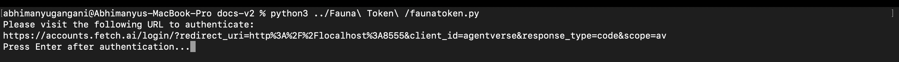
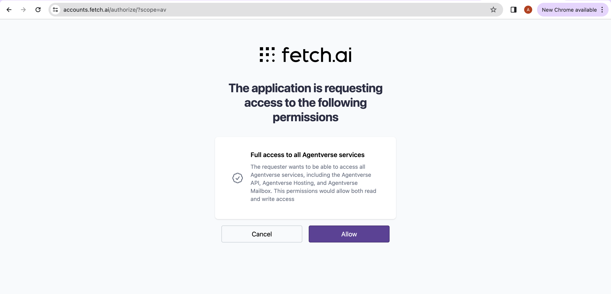
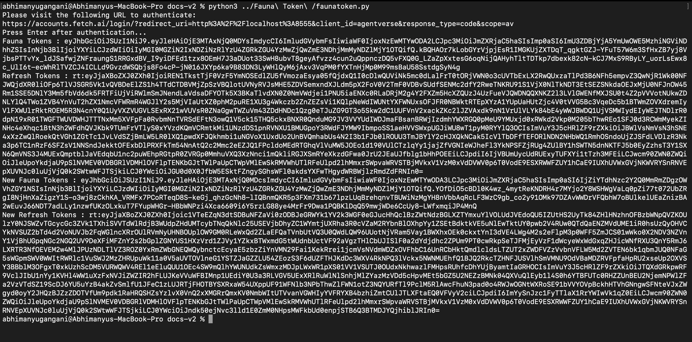

# Using Fauna Token Script

## Introduction

This guide will walk through process of using Fauna token script to fetch fauna token and refresh fauna tokens to make API calls to `Agentverse` and `AI Engine` APIs. We will fetch
tokens using Fetch.ai accounts service. Before starting, ensure you have python installed on your computer.

## Script to fetch Fauna tokens

    ```py copy filename = faunatoken.py
import threading
import time
import requests
import urllib.parse
from http.server import BaseHTTPRequestHandler, HTTPServer

# Constants for the OAuth flow and API interaction.
FAUNA_URL = 'https://accounts.fetch.ai'
SCOPE = 'av'
CLIENT_ID = 'agentverse'
TOKEN_URL = f'{FAUNA_URL}/v1/tokens'
REDIRECT_URI = 'http://localhost:8555'
access_code = None

class OAuthServer(BaseHTTPRequestHandler):
    def log_message(self, format, *args):
        # Suppress default logging for clarity.
        return

    def do_GET(self):
        global access_code
        parsed = urllib.parse.urlparse(self.path)
        params = urllib.parse.parse_qs(parsed.query)
        if 'code' in params:
            access_code = params['code'][0]
            with open('access_code.txt', 'w') as f:
                f.write(access_code)
            self.send_response(200)
            self.end_headers()
            self.wfile.write(b'Authentication successful, you may now close this tab.')
        else:
            self.send_response(400)
            self.end_headers()
            self.wfile.write(b'Missing authorization code.')

def start_server():
    # Starts the HTTP server to handle OAuth redirects.
    server = HTTPServer(('127.0.0.1', 8555), OAuthServer)
    threading.Thread(target=server.serve_forever).start()
    return server

def get_tokens(auth_code):
    # Exchanges authorization code for access and refresh tokens.
    response = requests.post(
        TOKEN_URL,
        json={
            'grant_type': 'authorization_code',
            'code': auth_code,
            'client_id': CLIENT_ID,
            'redirect_uri': REDIRECT_URI,
            'scope': SCOPE,
        }
    )
    response.raise_for_status()
    return response.json()

def refresh_tokens(refresh_token):
    # Uses the refresh token to obtain a new access token and refresh token.
    response = requests.post(
        TOKEN_URL,
        json={
            'grant_type': 'refresh_token',
            'refresh_token': refresh_token,
            'client_id': CLIENT_ID,
            'scope': SCOPE,
        }
    )
    response.raise_for_status()
    return response.json()

def get_auth_url():
    # Generates URL for initiating OAuth authorization.
    return f'{FAUNA_URL}/login/?{urllib.parse.urlencode({"redirect_uri": REDIRECT_URI, "client_id": CLIENT_ID, "response_type": "code", "scope": SCOPE})}'

def shutdown_server(server):
    # Shuts down the OAuth redirect HTTP server.
    server.shutdown()

if __name__ == '__main__':
    server = start_server()
    print("Please visit the following URL to authenticate:")
    print(get_auth_url())
    # Wait for the user to authenticate and for the server to receive the code
    input("Press Enter after authentication...")
    # Assuming the user has authenticated and 'access_code' has been set
    if access_code:
        tokens = get_tokens(access_code)
        fauna_token = tokens['access_token']
        refresh_tokent = tokens['refresh_token']
        print(f'Fauna Tokens : {fauna_token}')
        print(f'Refresh Tokens : {refresh_tokent}')
        
        tokens = refresh_tokens(refresh_tokent)
        new_fauna_token = tokens['access_token']
        new_refresh_tokent = tokens['refresh_token']
        print(f'New Fauna Tokens : {new_fauna_token}')
        print(f'New Refresh Tokens : {new_refresh_tokent}')

    shutdown_server(server)

    ```

## Steps to use Fauna token script

    1. Setting up Python Environment
    
        - Use terminal to save above python script to a file named `faunatoken.py`.
        - Ensure having python library `requests` installed on computer, if not do it using `pip install requests` on terminal.
    <br></br>
    2. Running the Fauna token script

        - Open terminal and navigate to the library where you have saved `faunatoken.py` script.
        - Run script using `python faunatoken.py` command in terminal.
    <br></br>
    3. Authorizing using get_auth_url and retrieving Tokens

        - Once the script is executed it will return a authorization URL, use the link using any browser to authenticate by logging into your Agentverse account.
        - After getting `Authentication successful, you may now close this tab.` on browser press enter on terminal.
        - Script will return pair of `fauna_token` and `refresh_fauna_token`.
        - Optionally `refresh_token` can be used to get new pair of tokens.
        - Call `shutdown_server` function to shut the server and end the script.
    <br></br>
    Please refer below images for expected output.

    1. Running `faunatoken.py` in terminal.

    

    2. Using `Authentication URL` to login and authenticate agentverse account.

    

    3. Getting `Fauna tokens` and `Refresh Fauna Tokens` printed on Terminal.
    
     

## Using Fauna Token script to fetch tokens for Application.

    1. Store the `faunatoken.py` file in same directory as application script.
    2. Use faunatoken python script as library to fetch tokens and refresh tokens for your application.

   

