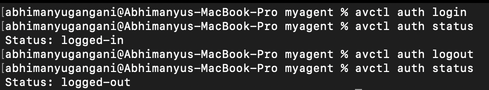

# Avctl auth

AVCTL auth command are used for authorisation and logging in and logging off of user.

## Authentication commands

- `auth login` - Log in to the CLI.
- `auth logout` - Log the current user out from the CLI.
- `auth status` - Print out the current status of the authorization.

