import { Callout } from 'nextra/components'

# Avctl Hosting

AVCTL hosting command are used for perform agent related actions using command line interface.

## Hosting commands

Before starting actions related to agents make a directory using `mkdir myagent`.

1. `hosting init` - Initialize agent template.

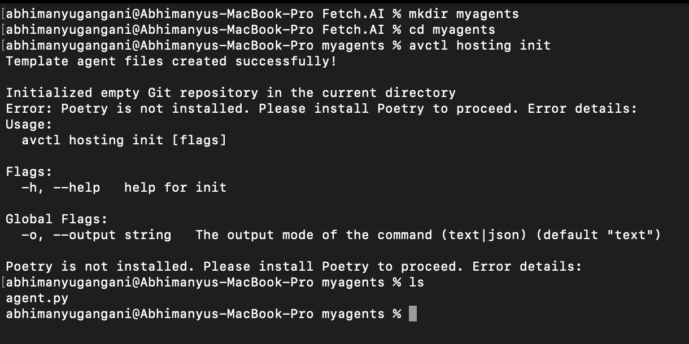

2. `hosting get agents` - Get all agents for the user.

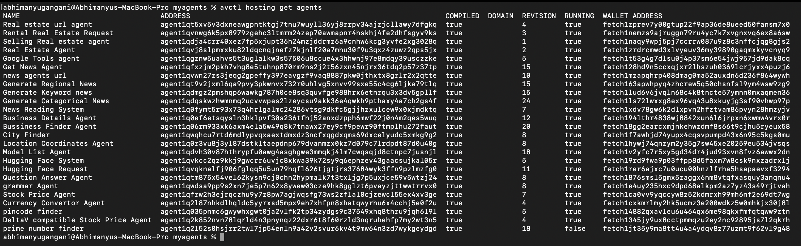

3. `hosting get agent` - Prints the selected deployed agent.

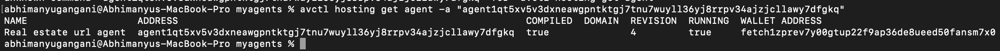

4. `hosting pull` - Pull agent files from Agentverse.

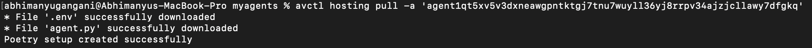

5. `hosting run -l` - Run Agent (optional `-l` flag for logs) if `a` not provided it returns latest pulled agent.  

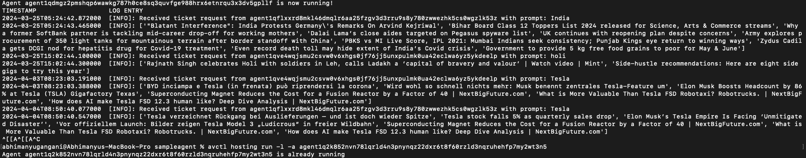

6. `hosting stop` - Stop agent

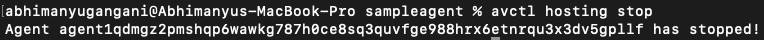

7. `hosting push` - Upload files to Agentverse.

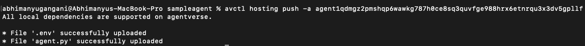

8. `hosting sync` - Automatically synchronize your local files with those in Agentverse. This command decides whether to pull or push files based on which location has the most recent changes.

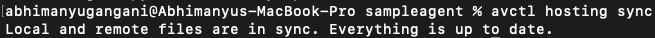

9. `hosting logs -f` - Print agent logs (optional `-f` option to follow logs). 

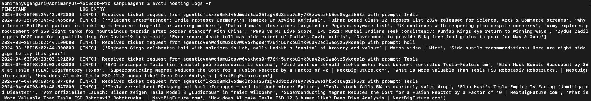

10. `hosting deploy -n <name>` - Deploy an agent to Agentverse. This command also updates and restarts the agent if it's already deployed.

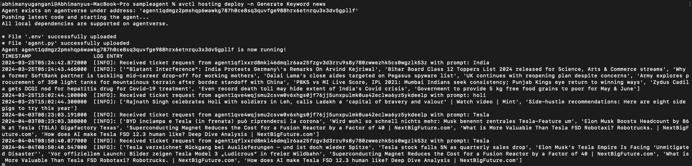

11. `hosting secrets add <secret_name>` - Add a secret

12. `hosting secrets delete <secret_name>` - Delete a secret

13. `hosting secrets get` - Retrieve names of all secrets.

14. `hosting packages` - Lists all supported packages by Agentverse.

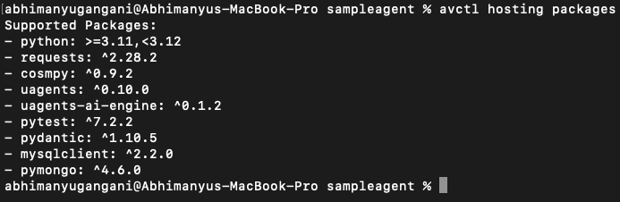

15. `hosting delete` - Deletes an agent from agentverse.

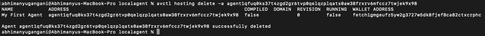
 
<Callout type="info" emoji="ℹ️">
    Note : For hosting **push** and **sync** commands the agent should be always in stopped state.
</Callout>