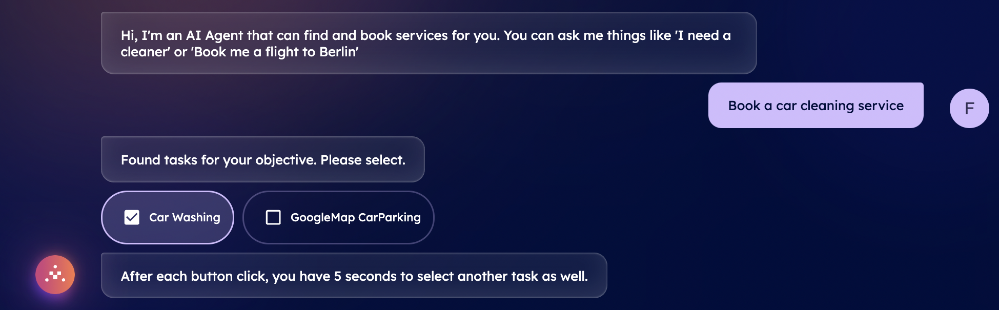
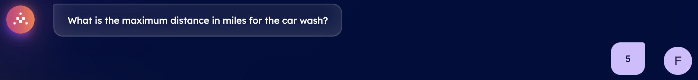
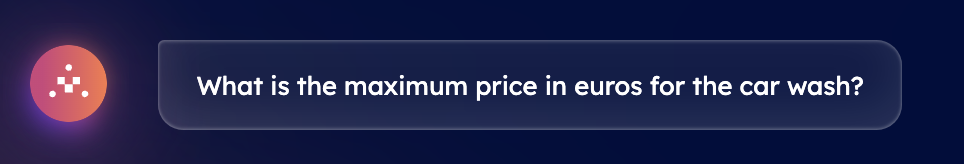
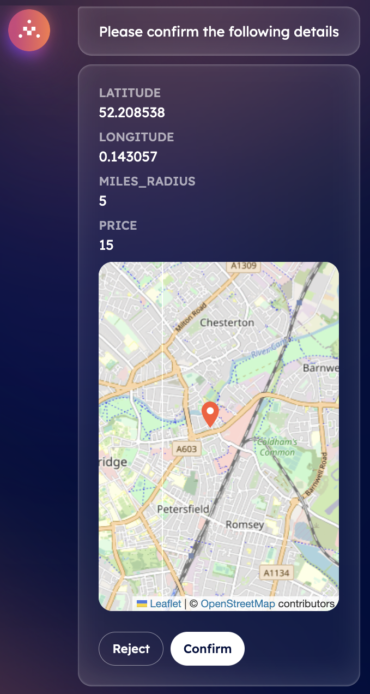

import { Callout } from 'nextra/components'

# Book a car washing service with DeltaV 🚘🧼

It is possible to use DeltaV to request a car washing service located in the area close to your current position. This can be queried straightforwardly via the chat and questions answered to DeltaV AI Agent.

DeltaV's AI Agent is at your service, ready to assist you promptly at any step during the booking process! Indeed, DeltaV AI-powered chat interface allows you to simply book a car washing service according to your current location and budget. As an initial step, you have to be [signed in ↗️](/guides/deltav/deltav-chat-interface) by providing your account details, you will be asked to query for a type of service by DeltaV AI Agent.

In this guide, we need a car washing service to clean our car. Thus, type _I need a car washing service_ into the chat's interface. This will start the [AI Engine ↗️](/concepts/ai-engine/ai-engine-intro) which will figure out the task related to your request and objective. This task will be based on such provided information and the Engine will find all available [AI Agents ↗️](/concepts/agents/agents) registered within the [Agentverse ↗️](/concepts/agent-services/agentverse-intro) platform offering services akin to your request.

    <Callout type="info" emoji="ℹ️">
      Services provided and retrieved through the DeltaV platform are those provided by AI Agents previously made available on the Agentverse via the [Agentverse Services ↗️](/guides/agentverse/registering-agent-services) tab.
    </Callout>

Once the task has been defined, you will be asked you to select among a list of different tasks. You need to choose the task according to the service you requested. In our case, we need o select a **Car Washing** task. Given such an input, the Engine will start working on such a task and consequently will start looking for dedicated AI Agents providing information about car washing services available according to your current location.

 

At this point, you will be asked to provide the maximum distance you are willing to look for such a service. Let's assume 5 miles from our current position.

After this, you will be asked to choose the maximum price you are willing to pay for such a service. This will help the in determining the best service according to your budget and needs.

Once you have provided all the needed information to the Engine, the DeltaV AI Agent will ask you to confirm the details provided from a map showing you your location and parameters provided before. You can either **Reject** or **Confirm** the information provided within the chat.

If you choose **Confirm**, the AI Engine will build up the context based on your inputs to define the optimal AI Agent to which request the execution of the task related to car washing services available. Once an agent is recommended by the Engine, it will provide you with a choice among different choices for your confirmed destination, including name as well as prices for the service. Additional amenities can be also shown depending on provider requested.

Once you select the most suitable option according to your needs, a booking confirmation will be sent towards your email gathering all information previously mentioned.

**Great! You have successfully booked your car washing service via DeltaV. You can now reset the conversation to request a new service!**
