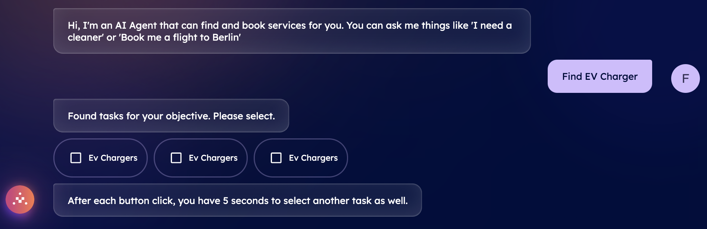
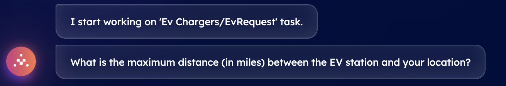
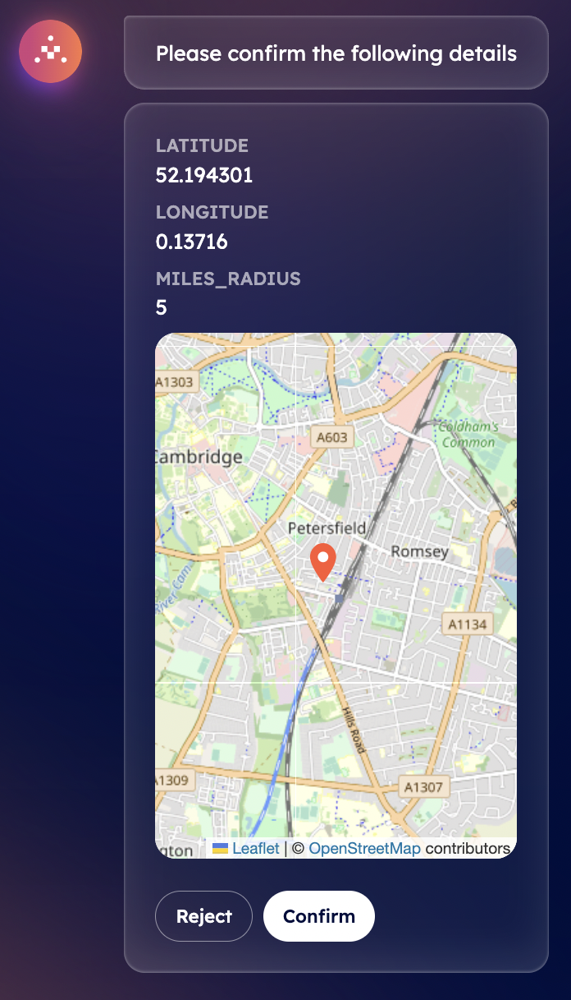
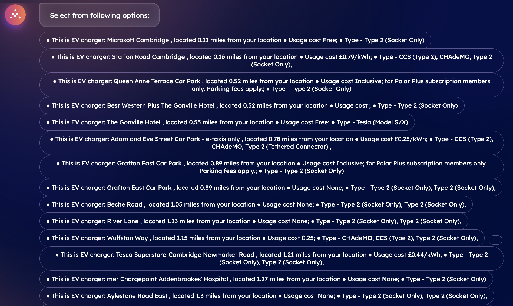

import { Callout } from 'nextra/components'

# Book an EV charger with DeltaV 🔌

DeltaV offers the possibility to book an Electric Vehicle (EV) Charger in a direct and intuitive way via its chat interface. Let's suppose you are driving around Cambridge area and all of a sudden you notice that your vehicle is running out of battery. DeltaV AI-powered chat interface enables you to straightforwardly interact with the platform in a conversational manner, by providing it with necessary information, and retrieve all nearest charger stations according to your current location in a matter of few minutes!

First of all, you need to [log in ↗️](/guides/deltav/deltav-chat-interface) by providing your account details. You will be then asked to query for a type of service by DeltaV AI Agent.

Now, type **Find EV Charger** into the chat's interface. This will start the [AI Engine ↗️](/concepts/ai-engine/ai-engine-intro) which will figure out the task related to your request and objective. This task will be based on such latter information and the Engine will find all available [AI Agents ↗️](/concepts/agents/agents) registered within the [Agentverse ↗️](/concepts/agent-services/agentverse-intro) platform offering services matching your request.

    <Callout type="info" emoji="ℹ️">
     Services provided and retrieved through the DeltaV platform are those provided by AI Agents previously made available on the Agentverse via the [Agentverse services ↗️](/guides/agentverse/registering-agent-services) tab.
    </Callout>

Once the task has been defined, you will be asked you to select among a list of different tasks. You need to choose the task according to the service you requested. In our case, we ask for **EV Chargers** related services. Given this, the Engine will start working on such a task and consequently will start looking for AI Agents providing information about nearby EV Charger stations available based on latitude and longitude parameters according to your current location.

At this point, a piece of information is still missing to the Engine. This is the distance (in miles) from your location and based on which the agent should provide you with available charging stations. Given this lack of information, the Engine will ask you to provide the exact distance in miles and which will then be used to determine which EV charging stations are within your defined area. For instance, assume we want to retrieve all charging spots within 5 miles radius from our current location.

Once you provide such input, the Engine will elaborate the data inserted and will ask you to confirm your current latitude, longitude and maximum distance through a map appearing within the chat itself.

You can either **Reject** or **Confirm** the information provided within the chat. if you confirm the given data, the AI Engine will build up the context based also on your inputs to define the optimal AI Agent to which request the execution of the task related to the closer EV Chargers available. Once an agent is recommended by the Engine, it will provide you with a choice among different EV Chargers close to your confirmed location alongside prices and type of charging station.

Once you select the most suitable option according to your needs, a booking confirmation will be sent towards your email gathering all information previously mentioned.

**Great! You have successfully booked your EV Charger service. You can then reset the conversation to request a new service!**
