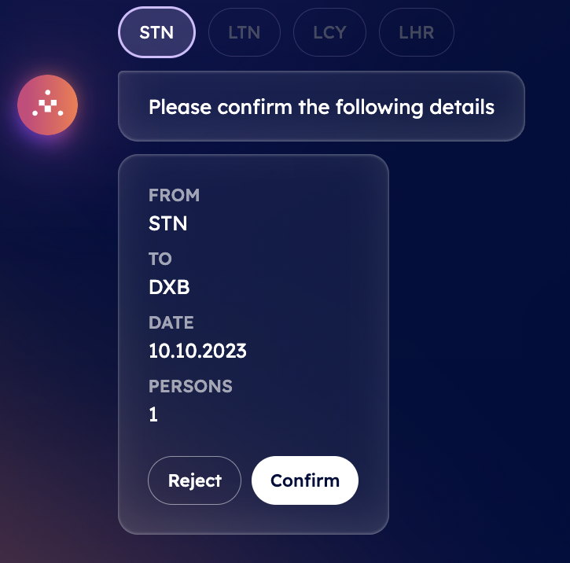

import { Callout } from 'nextra/components'

# Book a flight with DeltaV ✈️

DeltaV offers a direct and intuitive journey that transcends the limitations of conventional online flight booking. In this context, let's assume you need to book a flight to the city of Dubai.

    <Callout type="info" emoji="ℹ️">
      Unlike traditional booking engines, DeltaV leverages advanced AI algorithms to understand your preferences, travel history, and constraints, so as to provide you with tailored recommendations according to your unique needs, ensuring you get the best options for your journey.
    </Callout>

**Need to adjust your travel dates or explore alternative flight options?**

    DeltaV's AI Agent is at your service, ready to assist you promptly at any step of your booking process!

**But how can you book such a flight using this revolutionary platform?**

    DeltaV AI-powered chat interface enables you to interact with the platform in a conversational manner. First of all, once you have [signed in ↗️](/guides/deltav/deltav-chat-interface) by providing your account details, you will be asked to query for a type of service by DeltaV AI Agent.

Now, type **Book a flight to Dubai** into the chat's interface. This will start the [AI Engine ↗️](/concepts/ai-engine/ai-engine-intro) which will figure out the task related to your request and objective. This task will be based on such latter information and the Engine will find all available [AI Agents ↗️](/concepts/agents/agents) registered within the [Agentverse ↗️](/concepts/agent-services/agentverse-intro) platform offering services akin to your request.

    <Callout type="info" emoji="ℹ️">
     Services provided and retrieved through the DeltaV platform are those provided by AI Agents previously made available on the Agentverse via the [Agentverse services ↗️](/guides/agentverse/registering-agent-services) tab.
    </Callout>

Once the task has been defined, you will be asked you to select among a list of different tasks. You need to choose the task according to the service you requested. In our case, a **Flights** task.

Given such an input, the Engine will start working on such a task and consequently will start looking for AI Agents providing information about nearby airports available based on latitude and longitude parameters according to your current location.

At this point, a piece of information is still missing to the Engine. This is the _departure date_ of your flight. Given this lack of information, the Engine will ask you to provide the exact date of departure, by letting you choose from a small pop-up calendar with all dates available.

Once you select a date, the Engine will then be missing an additional piece of information about the trip being a **one-way** or **round trip** solution. Because of this, it will then ask you to choose between these two options. In case of a round trip, you will need to provide the return date accordingly.

Then, the Engine will require you to insert the **number of people** taking part in the travel. You will need to type this amount manually within the chat's messages bar and press **Send**.

Then, you will be presented some options related to airports available.

If you choose **NearbyAirports**,  the Engine will provide you with a request confirmation message indicating to confirm **latitude** and **longitude** details related to your current position. A **map** will be shown as well as latitude and longitude values. In addition to this option, you could also be given the **AirportsByCity** option. In this case, you will be given information about the destination airport within the chat's interface. The departure airport considered will be the one located closer to your current location.

You can either **Reject** or **Confirm** the information provided within the chat. If you choose **NearbyAirports** option and confirm, the AI Engine will build up the context based also on your inputs to define the optimal AI Agent to which request the execution of the task related to the closer airports available. Once an agent is recommended by the Engine, it will provide you with a choice among different IATA codes representing airports located close to your confirmed location.

    <Callout type="info" emoji="ℹ️">
      In case you are traveling from London, you will be given the following codes: LCY (London City Airport), LGW (London Gatwick Airport), LHR (London Heathrow Airport), and STN (London Stansted Airport).
    </Callout>

You will need to choose your preferred choice.

Finally, you will be asked to **Confirm** the details related to your flights request, including departure and arrival airports as well as dates of the flights and number of passengers.

You can either **Confirm** or **Reject**. By confirming, the Engine will build the context according to your responses and will then look for the best AI Agent to execute the task of finding tickets accordingly with related prices. Once an agent is recommended and chosen, it will execute the task and send the related answers back to the Engine which will then display them in the chat interface for you to choose the preferred one. At this point, you will be given information about different airlines and flights, with prices, hours of departure and arrival, and total duration of the flight.

Once you select the most suitable option according to your needs, a booking confirmation will be sent towards your email gathering all information previously mentioned.

**You can then reset the conversation to request a new service!**
