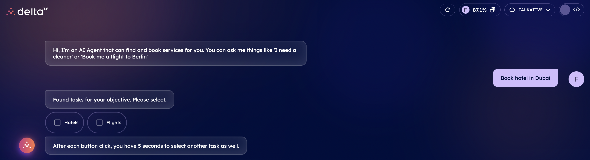
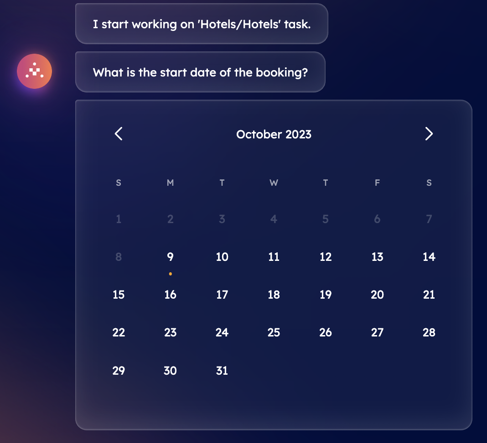
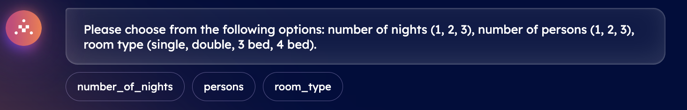
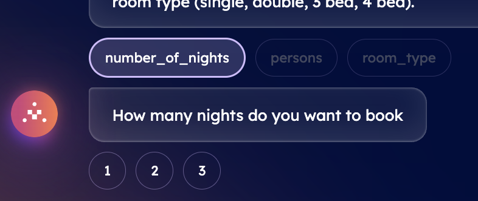
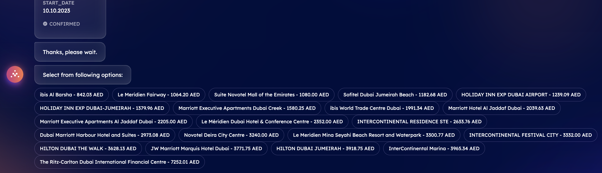
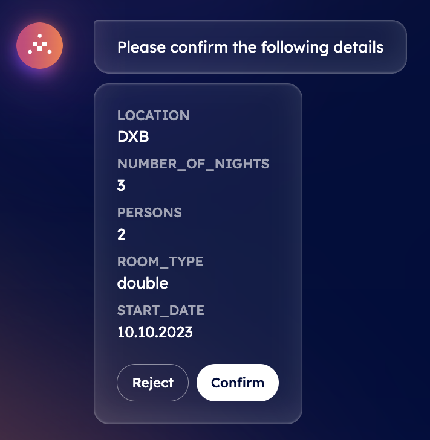

import { Callout } from 'nextra/components'

# Book a hotel with DeltaV 🛎

DeltaV offers a direct and intuitive way for simply carry out an online hotel booking request. In this context, let's assume you need a hotel accommodation in the city of Dubai.

    <Callout type="info" emoji="ℹ️">
      DeltaV leverages advanced AI algorithms to understand your preferences, travel history, and constraints, so as to provide you with tailored recommendations according to your unique needs, ensuring you get the best options for your journey.
    </Callout>

**Need to adjust your travel dates or explore alternative hotel options?**

DeltaV's AI Agent is at your service, ready to assist you promptly at any step during your booking process! Indeed, DeltaV AI-powered chat interface allows you to simply book a hotel according to your needs and desire in a straightforward way. As an initial step, once you have [signed in ↗️](/guides/deltav/deltav-chat-interface) by providing your account details, you will be asked to query for a type of service by DeltaV AI Agent.

In our current scenario, we need a hotel accommodation. Thus, type _Book a hotel in Dubai_ into the chat's interface. This will start the [AI Engine ↗️](/concepts/ai-engine/ai-engine-intro) which will figure out the task related to your request and objective. This task will be based on such latter information and the Engine will find all available [AI Agents ↗️](/concepts/agents/agents) registered within the [Agentverse ↗️](/concepts/agent-services/agentverse-intro) platform offering services akin to your request. Services provided and retrieved through the DeltaV platform are those provided by AI Agents previously made available on the Agentverse via the [Agentverse Services ↗️](/guides/agentverse/registering-agent-services) tab.

Once the task has been defined, you will be asked you to select among a list of different tasks. You need to choose the task according to the service you requested. In our case, we need o select a **Hotels** task. Given such an input, the Engine will start working on such a task and consequently will start looking for dedicated AI Agents providing information about accommodations available according to your current destination option.

At this point, you will be asked to provide the start date of your stay by selecting a specific date within a pop-up calendar in the chat's interface.

After this, you will be asked to choose the number of nights you are planning to book.

You can choose up to 3 nights for each hotel accommodation request.

Once you provided this information, you will be asked to also provide information obout the number of people the room should fit and the type of room you wish to book. Click on the option you wish to provide information for.

Once you have provided all the needed information to the Engine, the DeltaV AI Agent will ask you to confirm the details provided.You can either **Reject** or **Confirm** the information provided within the chat.

If you choose **Confirm**, the AI Engine will build up the context based on your inputs to define the optimal AI Agent to which request the execution of the task related to hotel accommodations available. Once an agent is recommended by the Engine, it will provide you with a choice among different hotels names for your confirmed destination as well as prices for your planned journey.

Once you select the most suitable one according to your needs, a booking confirmation will be sent towards your email gathering all information previously mentioned.

**You can then reset the conversation to request a new service!**
