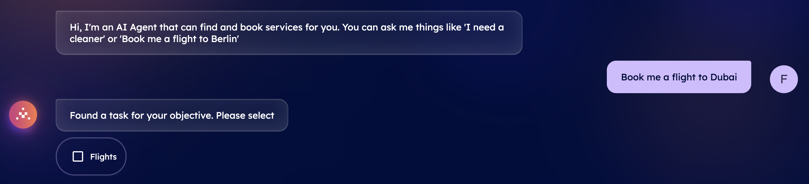
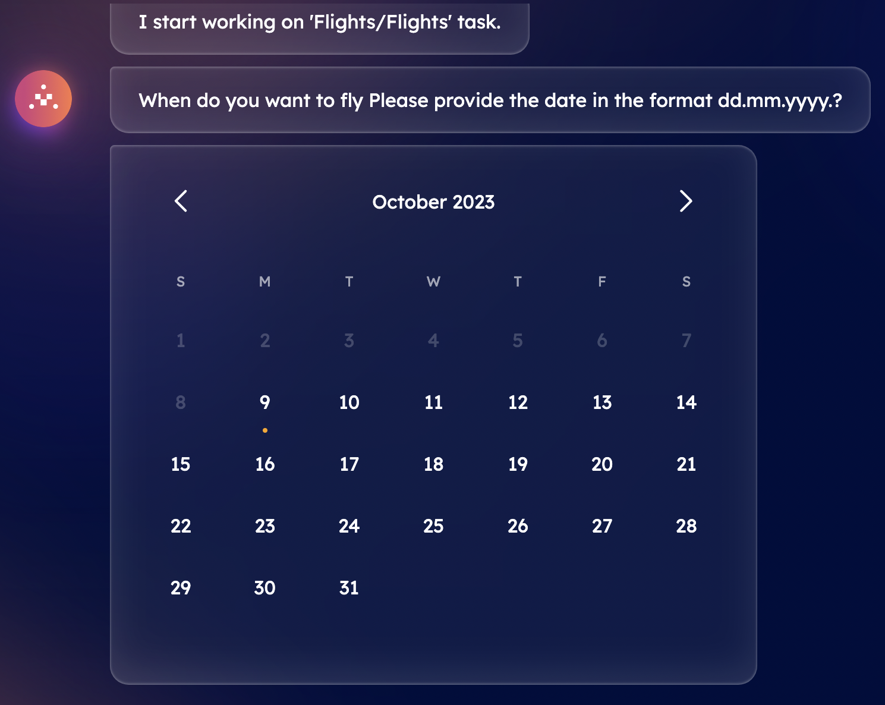
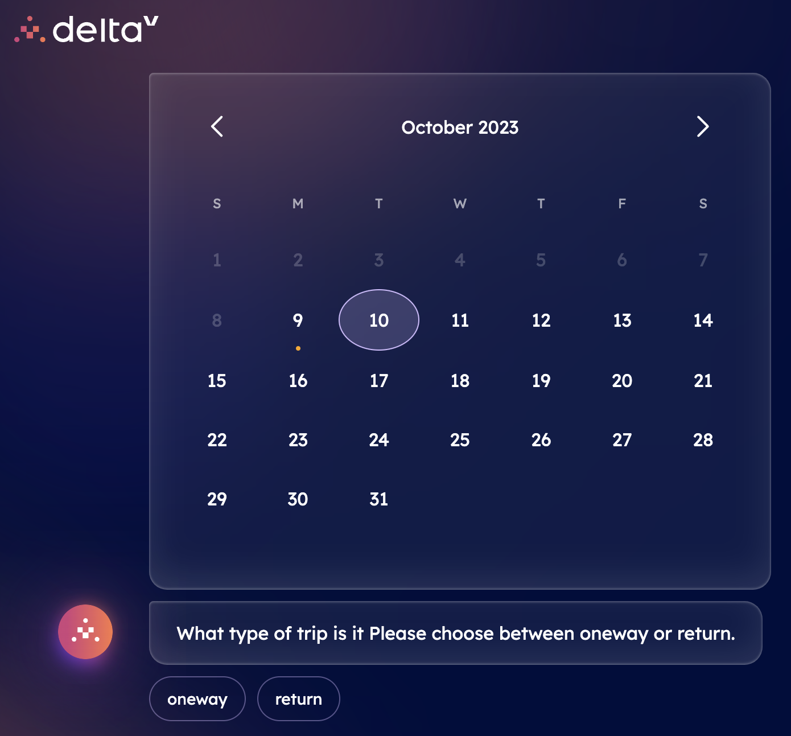
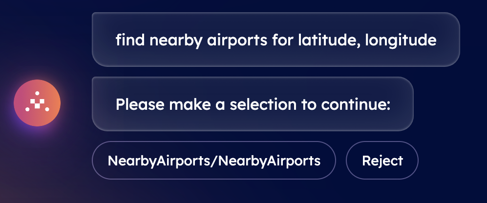
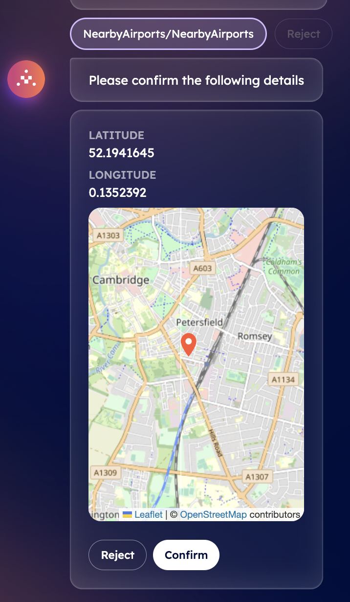
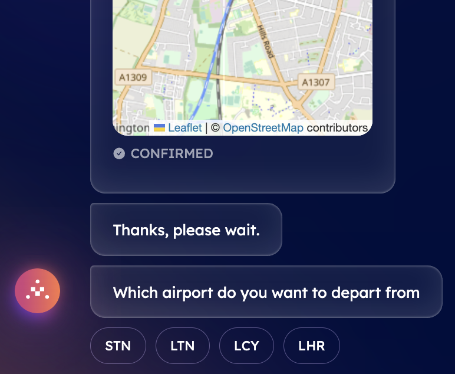
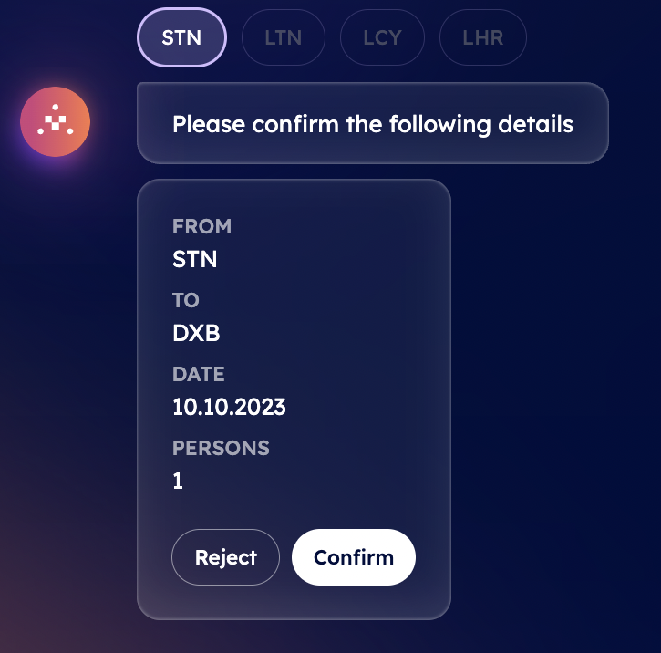
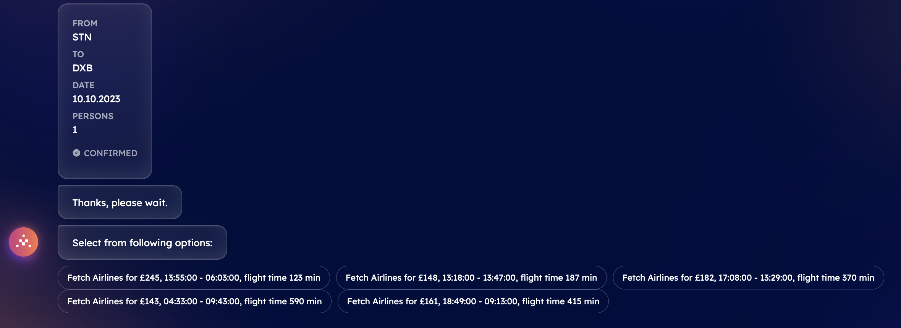

import { Callout } from 'nextra/components'

# Book any service with DeltaV!

DeltaV streamlines the process of booking various services, ensuring a simple and direct experience that takes just few minutes to be completed. With DeltaV's AI Agent by your side, you have instant assistance at every step of the booking journey.

DeltaV empowers users to make diverse service inquiries to book different services made available through the [Agentverse ↗️](/concepts/agent-services/agentverse-intro) platform. In fact, in the Agentverse, businesses can register agents specialized in specific service categories subsequently made accessible via DeltaV's chat interface to end-users. This means DeltaV users can effortlessly engage in conversations to book _flights_, _accommodations_, _car parking_, _EV chargers_, and _so on_, by connecting with the AI Agents registered within the Agentverse providing such services options.

In contrast to conventional booking systems, DeltaV harnesses advanced AI algorithms, which consider your preferences, travel history, constraints, proximity to points of interest, and location to offer personalized recommendations, ensuring you receive the best options for your journey.

The AI-driven chat interface of DeltaV enables natural interaction with the platform. The initial step involves [logging ↗️](/guides/deltav/deltav-chat-interface) by providing your account details. Subsequently, you will be prompted to make a service inquiry through DeltaV's AI Agent.

Upon providing the DeltaV AI Agent with your specific query, the platform's components straightforwardly start working together. This process begins with the [AI Engine ↗️](/concepts/ai-engine/ai-engine-intro), ensuring optimal task execution for your request, ultimately culminating in the swift and direct booking of your required service.

**Let's have a look at possible services queries journey to help you understand how DeltaV works!**

## Plan a trip using DeltaV

DeltaV makes it possible to quickly plan a trip to any place in the world by simply providing its AI Agent with the needed information. For instance, you can book your flight and accommodation in a matter of few clicks.

**Let's get started!**

### Book a flight with DeltaV ✈️

Let's assume you need to book a **flight** to the city of Dubai. You will need to type _Book a flight to Dubai_ into the chat's interface. This will start the [AI Engine ↗️](/concepts/ai-engine/ai-engine-intro) which will figure out the task related to your request and objective. This task will be based on such destination information and the Engine will find all available [AI Agents ↗️](/concepts/agents/agents) registered within the [Agentverse ↗️](/concepts/agent-services/agentverse-intro) platform offering services akin to your request, that is flights services related agents.

    <Callout type="info" emoji="ℹ️">
     Services provided and retrieved through DeltaV platform are those provided by AI Agents previously made available on the Agentverse via the [Agentverse services ↗️](/guides/agentverse/registering-agent-services) tab.
    </Callout>

Once the task has been defined, you will be asked you to select among a list of different tasks. You need to choose the task according to the service you requested. In our case, a **Flights** task.

Given such input, the Engine will start working on such a task and consequently will start looking for AI Agents providing information about nearby airports available based on latitude and longitude parameters according to your current location. At this point, a piece of information is still missing to the Engine. This is the _departure date_ of your flight. Given this lack of information, the Engine will ask you to provide the exact date of departure, by letting you choose from a small pop-up calendar with different available dates.

Once you select a date, the Engine will then be missing an additional piece of information about the trip being a **one-way** or **round trip** solution. Because of this, it will then ask you to choose between these two options. In case of a round trip, you will need to provide the return date accordingly.

Then, the Engine will require you to insert the **number of people** taking part in the travel. You will need to type this amount manually within the chat's message bar and press **Send**. Then, you will be presented some options related to airports available.

    <Callout type="info" emoji="ℹ️">
      If you choose **NearbyAirports**, the Engine will provide you with a request confirmation message indicating to confirm latitude and longitude details related to your providedp position. A map will be shown as well as latitude and longitude values. In addition to this option, you could also be given the **AirportsByCity** option. In this case, you will be given information about the destination airport within the chat's interface. The departure airport considered will be the one located closer to your current location.
    </Callout>

You can either **Reject** or **Confirm** the information provided within the chat. If you choose **NearbyAirports** option and confirm, the AI Engine will build up the context based also on your inputs to define the optimal AI Agent to which request the execution of the task related to the closer airports available. Once an agent is recommended by the Engine, it will provide you with a choice among different IATA codes representing airports located close to your confirmed location.

    <Callout type="info" emoji="ℹ️">
      In case you are traveling from London, you will be given the following codes: LCY (London City Airport), LGW (London Gatwick Airport), LHR (London Heathrow Airport), and STN (London Stansted Airport).
    </Callout>

You will need to choose your preferred choice. Finally, you will be asked to **Confirm** the details related to your flights request, including departure and arrival airports as well as dates of the flights and number of passengers.

You can either **Confirm** or **Reject**. By confirming, the Engine will build the context according to your responses and will then look for the best AI Agent to execute the task of finding tickets accordingly with related prices. Once an agent is recommended and chosen, it will execute the task and send the related answers back to the Engine which will then display them in the chat interface for you to choose the preferred one. At this point, you will be given information about different airlines and flights, with prices, hours of departure and arrival, and total duration of the flight.

Once you select the most suitable option according to your needs, a booking confirmation will be sent towards your email gathering all information previously mentioned.

**Great! You have successfully booked your flight to Dubai. You can now reset the conversation to request a new service!**

### Book a hotel with DeltaV 🛎

Let's now assume you need an **accommodation** for your journey in Dubai. In this scenario, let's assume you are looking for a hotel accommodation. Thus, type _Book a hotel in Dubai_ into the chat's interface. As before, this will start the [AI Engine ↗️](/concepts/ai-engine/ai-engine-intro) which will figure out the task related to your request and objective and find all available [AI Agents ↗️](/concepts/agents/agents).

Once the task has been defined, you need to choose the task according to the service you requested. In this case, you need o select a **Hotels** task. Given such an input, the Engine will start working on such a task and consequently will start looking for dedicated [AI Agents ↗️](/concepts/agents/agents) registered within the [Agentverse ↗️](/concepts/agent-services/agentverse-intro) offering hotel booking related services, according to your destination option.

At this point, you will be asked to provide the start date of your stay by selecting a specific date within a pop-up calendar in the chat's interface.

After this, you will be asked to choose the number of nights you are planning to book.

Once you provided this information, you will be asked to also provide the number of people the room should fit and the type of room you wish to book. Click on the option you wish to provide information for. Once you have provided all the needed information to the Engine, the DeltaV AI Agent will ask you to confirm the details provided. You can either **Reject** or **Confirm** the information provided within the chat.

If you choose **Confirm**, the AI Engine will build up the context based on your inputs to define the optimal AI Agent to which request the execution of the task related to hotel accommodations available. Once an agent is recommended by the Engine, it will provide you with a choice among different hotels names for your confirmed destination as well as prices for your planned journey.

Once you select the most suitable one according to your needs, a booking confirmation will be sent towards your email gathering all information previously mentioned.

**Great! You successfully booked your hotel accommodation. You can now reset the conversation to request a new service!**

## Book car related services

In these examples, we provide an overview of possible services related to vehicles, including booking an Electric Vehicle charger, a parking spot, or a car washing service using DeltaV AI Agent.

**Let's get started!**

### Book an EV charger with DeltaV 🔌

DeltaV also offers the possibility to book an **Electric Vehicle (EV) charger** in a direct and intuitive way via its chat interface. Let's suppose you are driving around Cambridge area and all of a sudden you notice that your vehicle is running out of battery. You can use DeltaV and quickly retrieve all nearest charger stations according to your current location. Within the chat, type _Find EV Charger_.

Once the task has been defined, you will be asked to select a task according to the service you requested. In your case, **EV Chargers** related services. Given this, the Engine will start working on such a task and consequently will start looking for AI Agents providing information about nearby EV Charger stations available based on latitude and longitude parameters according to your current location. At this point, a piece of information is still missing to the Engine. This is the distance (in miles) from your location and based on which the agent should provide you with available charging stations. Given this lack of information, the Engine will ask you to provide the exact distance in miles and which will then be used to determine which EV charging stations are within your defined area. For instance, assume that we want to retrieve all charging spots within 5 miles radius from our current location.

Once you provide such input, the Engine will elaborate the data inserted and will ask you to confirm your latitude, longitude and maximum distance parameters through a map appearing in the chat.

You can either **Reject** or **Confirm** the information provided within the chat. if you **Confirm** the given data, the AI Engine will build up the context based also on your inputs to define the optimal AI Agent to which request the execution of the task related to the closer EV Chargers available. Once an agent is recommended by the Engine, it will provide you with a choice among different EV Chargers close to your confirmed location alongside prices and type of charging station.

Once you select the most suitable option according to your needs, a booking confirmation will be sent towards your email gathering all information previously mentioned.

**Great! You have successfully booked your EV Charger service. You can now reset the conversation to request a new service!**

### Book a car washing service with DeltaV 🚘🧼

Let's now use DeltaV to request a **car washing** service located in the area close to your current position. This can be queried straightforwardly via DeltaV AI Agent.

Assuming that we need a car washing service to clean our car, type _I need a car washing service_ into the chat's interface to start the [AI Engine ↗️](/concepts/ai-engine/ai-engine-intro) and figure out the task related to your request and objective.

Once the task has been defined, you will need to choose the task according to the service you requested. In your case, we need o select a **Car Washing** task. Given such an input, the Engine will start looking for dedicated AI Agents providing information about car washing services available according to your specified location.

At this point, you will be asked to provide the maximum distance you are willing to look for such a service. Let's assume 5 miles from our current position.

After this, you will be asked to choose the maximum price you are willing to pay for such a service. This will help the in determining the best service according to your budget and needs.

Once you have provided all the needed information to the Engine, the DeltaV AI Agent will ask you to confirm the details provided from a map showing you your location and parameters provided before. You can either **Reject** or **Confirm** the information provided within the chat.

If you choose **Confirm**, the AI Engine will build up the context based on your inputs to define the optimal AI Agent to which request the execution of the task related to car washing services available. Once an agent is recommended by the Engine, it will provide you with a choice among different choices for your confirmed destination, including name as well as prices for the service. Additional amenities can be also shown depending on service provider requested.

Once you select the most suitable option according to your needs, a booking confirmation will be sent towards your email gathering all information previously mentioned.

**Great! You have successfully booked your car washing service via DeltaV. You can now reset the conversation to request a new service!**

### Book a car parking spot service with DeltaV 🅿️🚗

In this guide we use DeltaV to book a **car parking** service to park our car safely. Thus, type _I need a parking spot_ into the chat's interface.

Once the task has been defined, you will need to choose the task according to the service you requested. In your case, you need to select a **GoogleMap CarParking** task. Given such an input, the Engine will start working on such a task and consequently will start looking for dedicated AI Agents providing information about parking services available according to your desired location.

At this point, you will be asked to provide the maximum distance you are willing to look for such a service. Let's assume 5 miles from our current position. Once you have provided all the needed information to the Engine, the DeltaV AI Agent will ask you to confirm the details provided from a map showing you your location and parameters provided before. You can either **Reject** or **Confirm** the information within the chat.

If you choose **Confirm**, the AI Engine will build up the context based on your inputs to define the optimal AI Agent to which request the execution of the task related to car parking services available. Once an agent is recommended by the Engine, it will provide you with a choice among different choices for your confirmed location, including name as well as the link towards the parking providers' websites.

Once you select the most suitable option according to your needs, a booking confirmation will be sent towards your email gathering all information previously mentioned.

**Great! You have successfully booked your car parking spot via DeltaV. You can now reset the conversation to request a new service!**
