import { Callout } from 'nextra/components'

# Book any service with DeltaV!

DeltaV streamlines the process of booking various type of services, ensuring a simple and direct experience that takes just few minutes to be completed. With DeltaV's AI Agent by your side, you have instant assistance at every step of the booking journey.

DeltaV empowers users to make diverse service inquiries to book different services made available through the [Agentverse ↗️](/concepts/agent-services/agentverse-intro) platform. In fact, within the Agentverse, businesses can register agents specialized in specific service categories subsequently made accessible via DeltaV's chat interface to end-users.

    <Callout type="info" emoji="ℹ️">
     Services provided and retrieved through DeltaV platform are those provided by Agents previously made available on the Agentverse via the [Agentverse Services ↗️](/guides/agentverse/registering-agent-services) section. Checkout this guide to understand how to register an agent as a service on the Agentverse and query for this service via DeltaV chat interface.
    </Callout>

 This means DeltaV users can effortlessly engage in conversations to book _flights_, _accommodations_, _car parking_, _EV chargers_, and _so on_, by connecting with the [Agents ↗️](/concepts/agents/agents) registered within the Agentverse providing such services options.

    <Callout type="info" emoji="ℹ️">
     You can checkout our dedicated guide for [Creating an Agentverse hosted agent 🤖 ↗️](/guides/agentverse/creating-a-hosted-agent) to understand how to create an AI Agent on the Agentverse.
    </Callout>

In contrast to conventional booking systems, DeltaV harnesses advanced AI algorithms, which consider your preferences, travel history, constraints, proximity to points of interest, and location to offer personalized recommendations, ensuring you receive the best options for your journey.

The AI-driven chat interface of DeltaV enables natural interaction with the platform. The initial step involves [logging ↗️](/guides/deltav/deltav-chat-interface) by providing your account details. Subsequently, you will be prompted to make a service inquiry through DeltaV's AI Agent.

Upon providing the DeltaV AI Agent with your specific query, the platform's components straightforwardly start working together. This process begins with the [AI Engine ↗️](/concepts/ai-engine/ai-engine-intro), ensuring task execution for your request, ultimately culminating in the swift and direct booking of your required service.

**Let's have a look at possible services queries journey to help you understand how DeltaV works!**

## Example - Plan a trip using DeltaV
### Book a flight and an accommodation at your desired destination!

DeltaV makes it possible to quickly plan a trip to any place in the world by simply providing its AI Agent with the needed information. For instance, you can book your flight and accommodation in a matter of few clicks.

**Let's get started!**

### Book a flight with DeltaV ✈️

Let's assume you need to book a **flight** to the city of Dubai. Enter a _Book a flight to Dubai_ objective within the search bar.

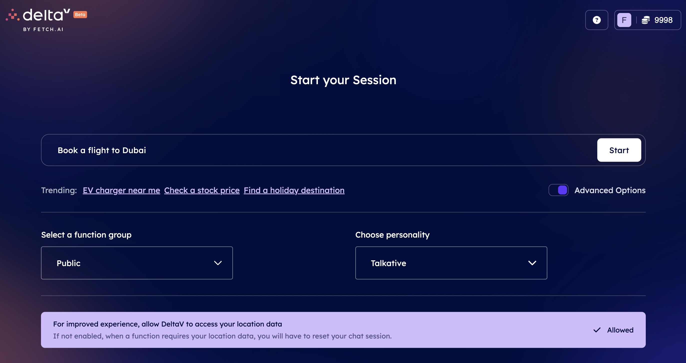

The AI Engine will start looking for all those services (tasks) registered within the Agentverse the description of which is related to the objective you specified. Once the tasks related to the objective have been recommended, you will be asked to select among a list of different tasks available within the chat. You need to choose the task according to the service you want to request. In our case, a **Flights** task.

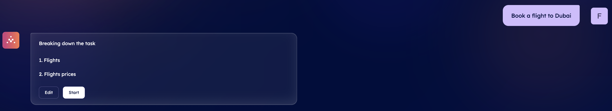

Given such input, the AI Engine will start working on such a task and consequently will start looking for Subtasks providing information about nearby airports available based on latitude and longitude parameters according to your location.

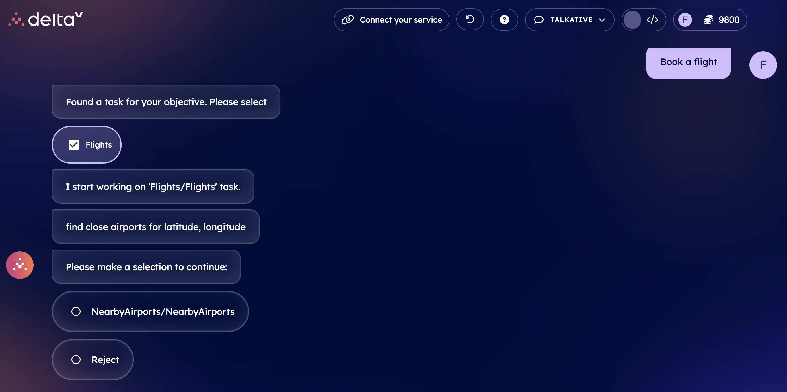

    <Callout type="info" emoji="ℹ️">
      If you choose **NearbyAirports**, the Engine will provide you with a request confirmation message indicating to confirm latitude and longitude details related to your provided position. A map will be shown as well as latitude and longitude values. In addition to this option, you could also be given the **AirportsByCity** option. In this case, you will be given information about the airports for chosen city within the chat's interface. The departure airport considered will be the one located closer to your current location.
    </Callout>

If you choose **NearbyAirports** option, you will be provided with a map alongside latitude and longitude values depicting your location. You will need to either **Confirm** or *Reject** this. If you confirm, the AI Engine will build up the context based also on your inputs to define the optimal AI Agent to which request the execution of the task related to the closer airports available.

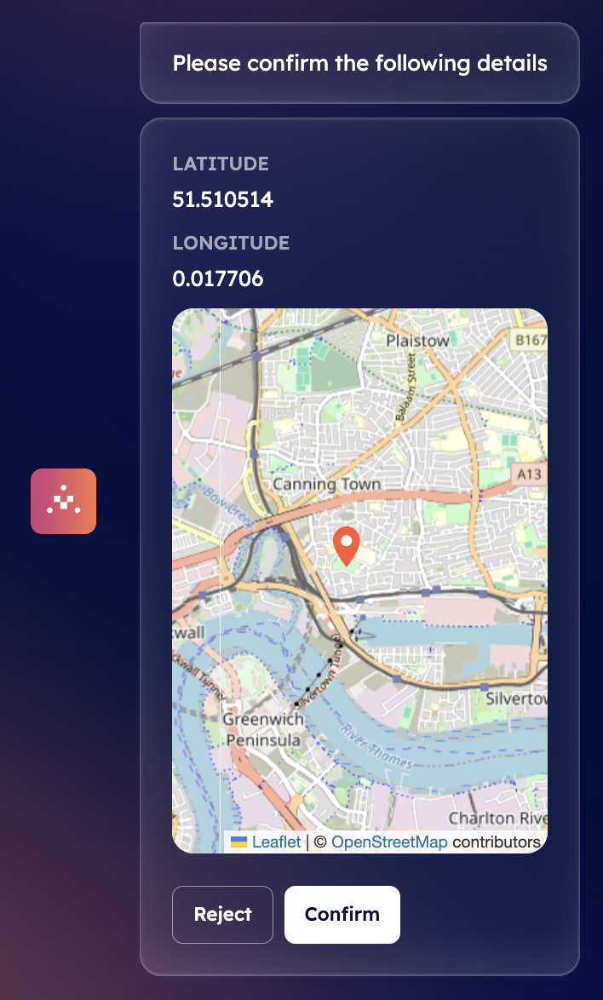

 Once a subtask is executed by the AI Engine, it will provide you with a choice among different IATA codes representing airports located close to your confirmed location.

    <Callout type="info" emoji="ℹ️">
      In case you are traveling from London, you will be given the following codes: LCY (London City Airport), LGW (London Gatwick Airport), LHR (London Heathrow Airport), and STN (London Stansted Airport).
    </Callout>

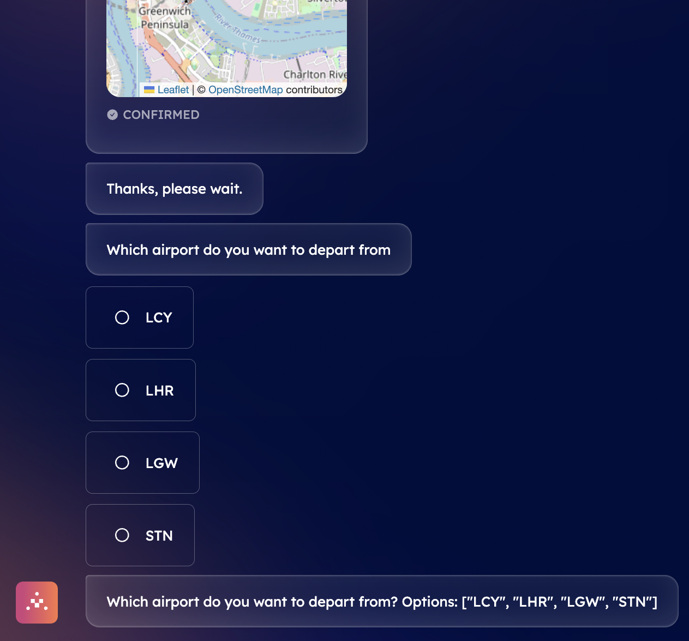

Then, the AI Engine will need to know if you are planning a one-way or round trip. Let's suppose we choose a round trip format.

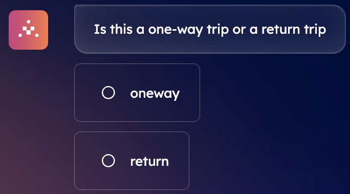

Lastly, the AI Engine will also be missing information about the actual **departure and return dates** of the flights. Given this lack of information, the it will ask you to provide the exact dates of departure, by letting you choose from different small pop-up calendars with different available dates.

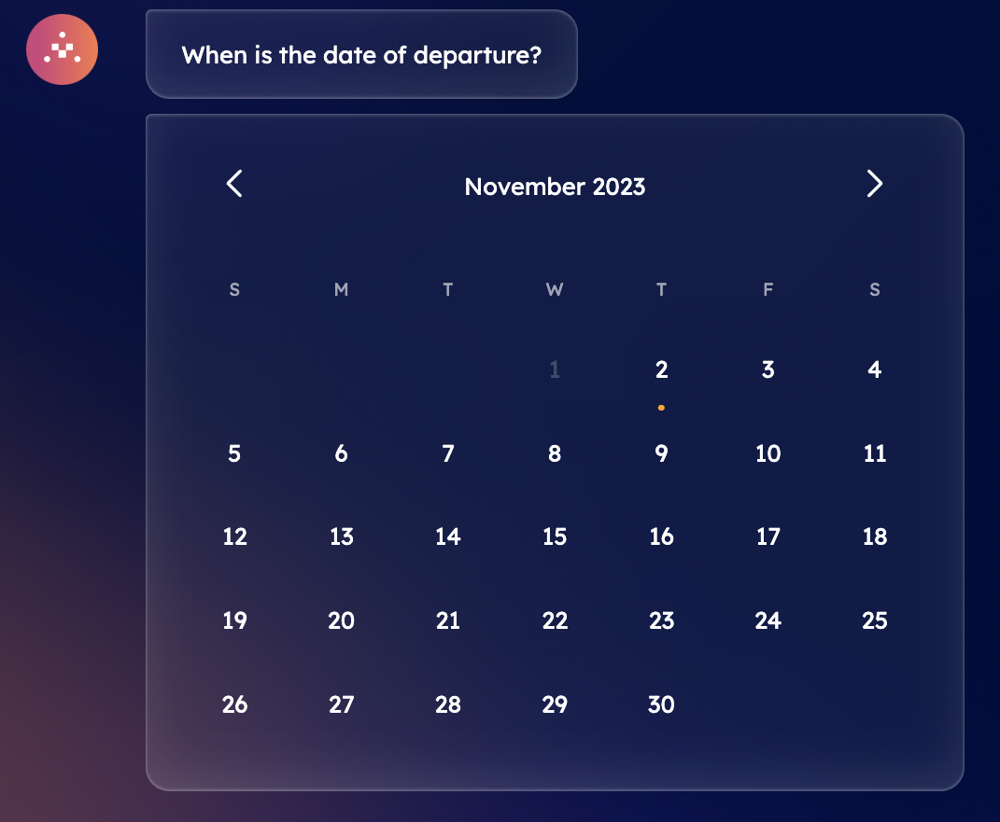

The Engine will require you to insert the **number of people** taking part in the travel. You will need to type this amount manually within the chat's message bar and press **Send**.

Once you provided all of this data to the AI Engine, you will be presented with a summary depicting all of your choices, and you will need to either **Confirm** or *Reject** this message.

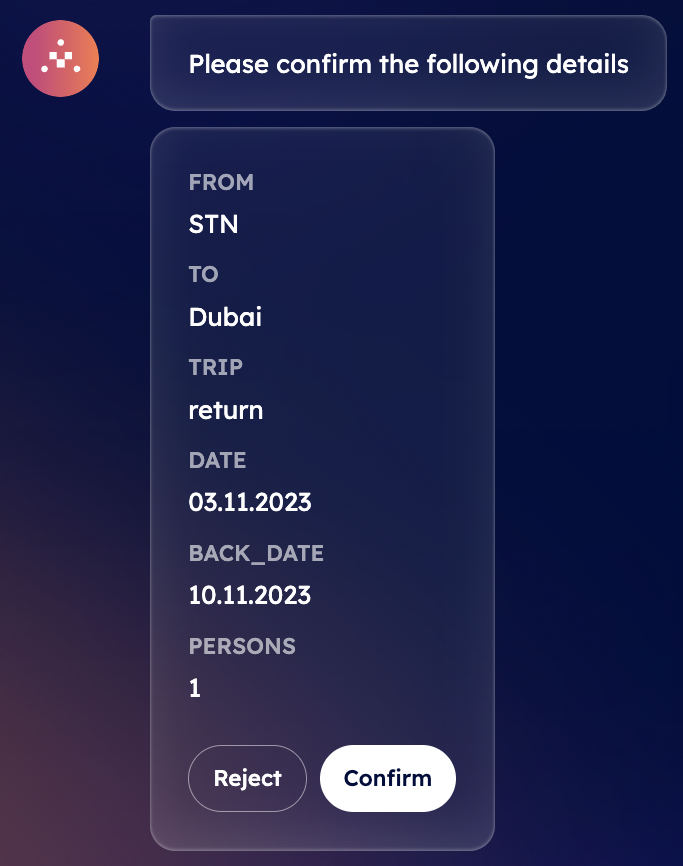

By confirming, the AI Engine will build the context according to your responses and will then look for the best AI Agent to execute the task of finding tickets with related prices. Once an agent is recommended and chosen, it will execute the task and send the related answers back to the AI Engine which will then display them in the chat interface for you to choose the preferred one. At this point, you will be given information about different airlines and flights, with prices, hours of departure and arrival, and total duration of the flight.

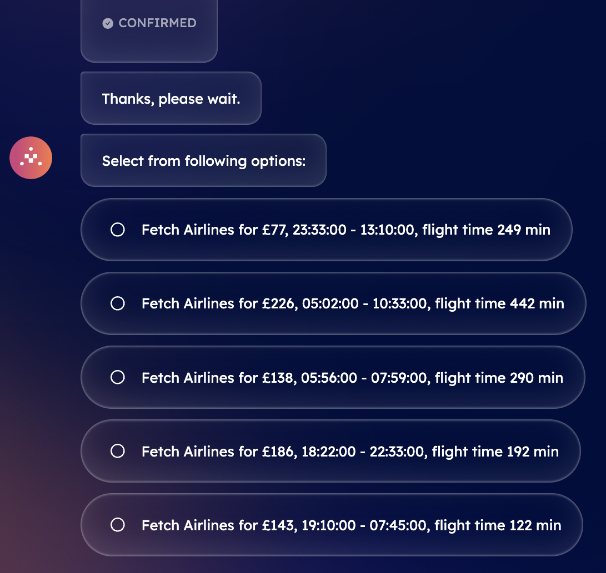

Once you select the most suitable flights option according to your needs, a booking confirmation will be sent towards your email gathering all information previously mentioned.

**Great! You have successfully booked your flight to Dubai. You can now reset the conversation to request a new service!**

### Book a hotel with DeltaV 🛎

Let's now assume you need an **accommodation** for your journey in Dubai. For this, you will need to type a **Book a hotel in Dubai** task.

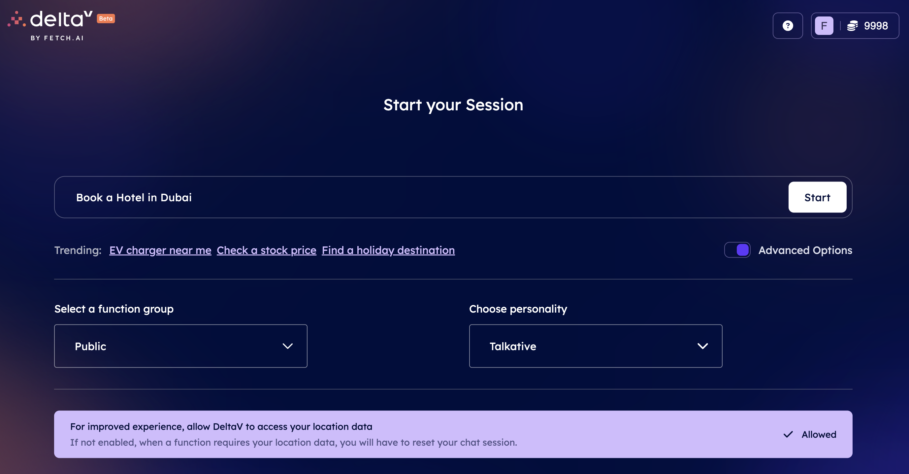

The AI Engine will start looking for all agents registered within the Agentverse offering services related to the objective you previously inserted. It will then define the task related to your request and select the best AI Agent available aligning with it.

Once the task has been defined, you will be asked you to select among a list of different tasks available within the chat.

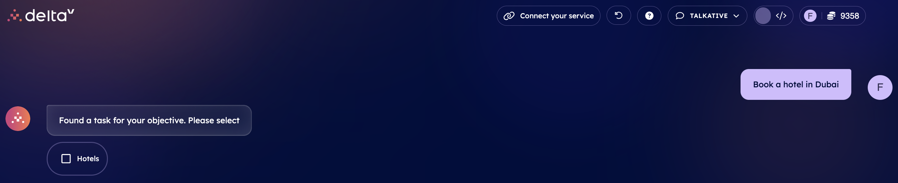

Given such an input, the AI Engine will start working on this task and consequently will start looking for dedicated Agents registered within the Agentverse offering hotel booking related services, according to your provided information. Considered that you specified your destination within the initial objective, the AI Engine will provide you with a pop-up calendar from which you will need to choose the arrival date at the hotel.

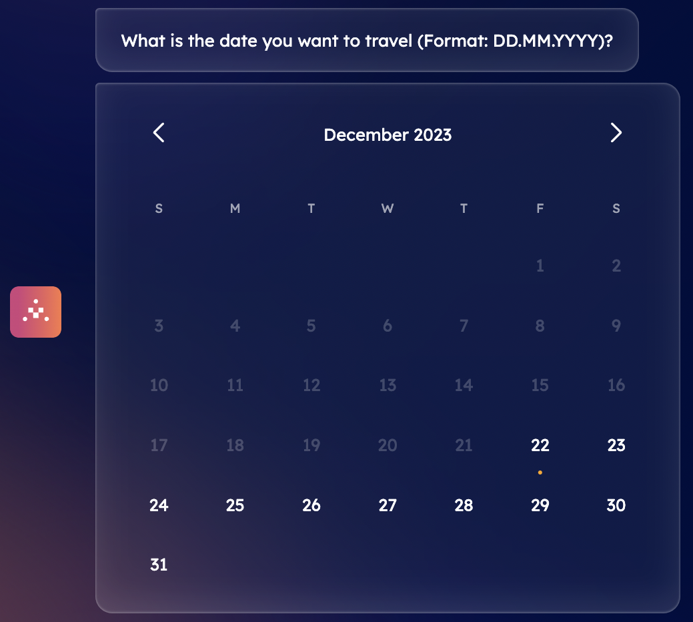

Once you have provided all the needed information to the AI Engine, the DeltaV AI Agent will ask you to confirm the details provided.

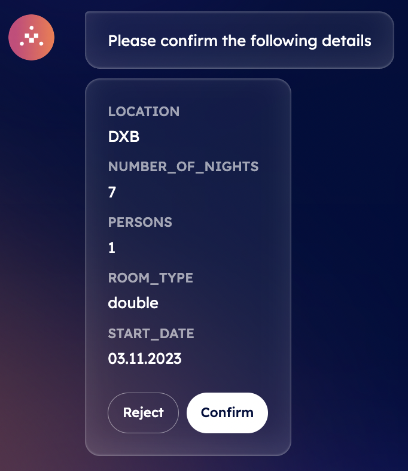

You can either **Reject** or **Confirm** the information provided within the chat. If you choose **Confirm**, the AI Engine will build up the context based on your inputs to define the optimal AI Agent to which request the execution of the task related to hotel accommodations available. Once an agent is recommended by the Engine, it will provide you with a choice among different hotels names for your confirmed destination as well as prices for your planned journey.

    <Callout type="info" emoji="ℹ️">
      If see any wrong information within this confirmation message, you can always reject it. This way, you will be asked to provide the correct data and then confirm once again.
    </Callout>

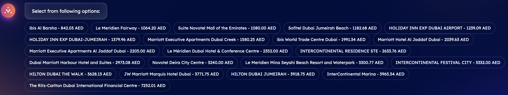

Once you select the most suitable one according to your needs, a booking confirmation will be sent towards your email gathering all information for your stay.

**Great! You successfully booked your hotel accommodation. You can now reset the conversation to request a new service!**

## Book any other service you may need!

In the above examples, we illustrate the process of booking a flight and a hotel for your desired travel destination.

In addition to travel related services, it is possible to query for any type of service you may be thinking of via DeltaV and its chat. You can request services related to **vehicles**, including **booking an Electric Vehicle charger**, **a parking spot**, or **a car washing service** using DeltaV AI Agent.

You may be also interested in querying for **finance** related services such as **querying for the price of a specific stock** on the market, or query for **weather** related services, such as **checking the weather** at some defined location.

**No matter what your request may be, DeltaV has the potential to exponentially simplify the overall user journey in the execution and delivery of any service according to your needs!*

If you are a business, and you are interested in trying this revolutionary platform to offer your services and expand your operations, click on the **Connect your Service** button within DeltaV chat interface and checkout our dedicated guide for [Registering agent services on the Agentverse ↗️](/guides/agentverse/registering-agent-services) to understand how to do this correctly!
