import { Callout } from 'nextra/components'

# Create and register a service on DeltaV 🌐

## Introduction

The aim of this guide is to show how register a service of any type on the [Agentverse services ↗️](/guides/agentverse/registering-agent-services) tab and make this service available on [DeltaV ↗️](/concepts/deltav/intro) for queries from users interacting with its chat interface.

This way, DeltaV innovative search paradigm enables companies to register their services and provide them with a valuable opportunity to monetize their services, expand their user base, and expand their earnings over time.

**Let's get started!**

## Register your service on the Agentverse - EV charger example

First of all, to register a service in the Agentverse services, you would need to create a dedicated agent for this. Let's assume we want to provide Electric Vehicles (EVs) charging related services. Thus, we need to create an agent encapsulating all the logic needed and the protocols being implemented. For this example, we coded an [AI Agent ↗️](/concepts/agents/agents) called **EV_charger_agent**, and a [protocols ↗️](/references/uagents/uagents-protocols/agent-protocols), namely a **booking_protocol**. You can easily create your agents within the Agentverse by following our dedicated guide: [Creating a hosted agent 🤖 ↗️](/guides/agentverse/creating-a-hosted-agent).

Once you finalised the development of your agent and it is being run (assuming no issues arise), then the agent and its protocols manifests are uploaded to the [Almanac contact ↗️](/references/contracts/uagents-almanac/almanac-overview) in the form of **protocol digests** do for it to be retrieved by any other agent registered as well. To check if the uploading process has been carried out correctly, you can search for your agent's address on the [Agentverse Explorer ↗️](/guides/agentverse/discovering-agents), and check if the protocols have been uploaded successfully.

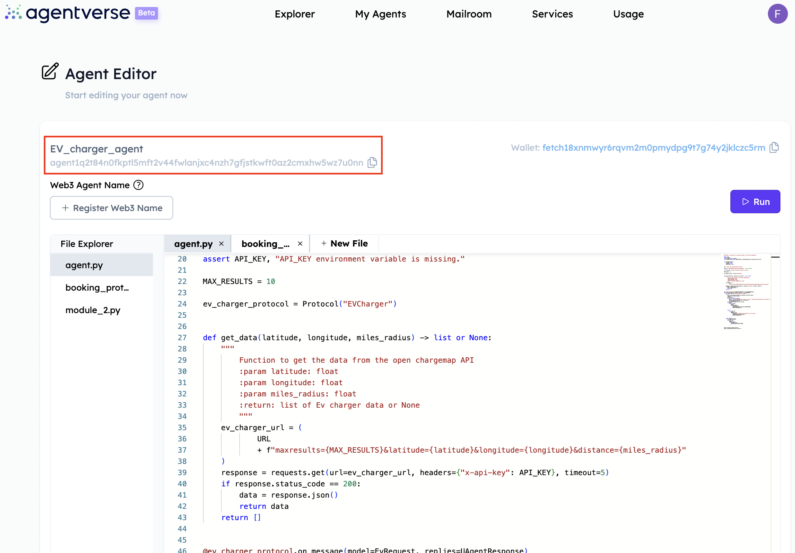

If not, you need to wait for some time (around 8 minutes) until the protocols are uploaded successfully. If the process was correctly carried out, then you would have something similar to this:

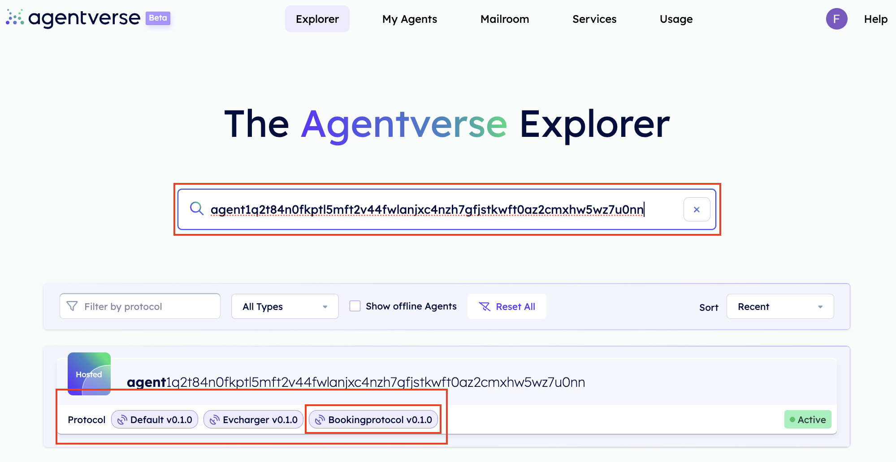

Once the uploading of the protocols manifests is finalised, the next step you would need to undertake is _registering the agent as a service_.

To do this, you need to navigate towards the **Services** tab. In here, you need to create a new service group on Agentverse. To do so, click on **Service Group** tab and select **+ New Service Group**.

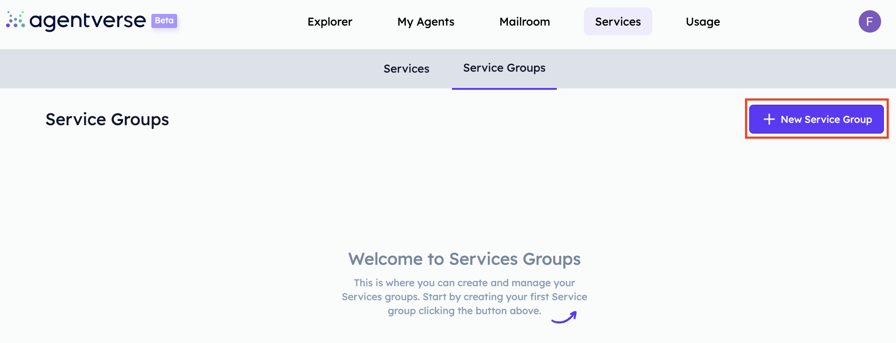

You will need to create a Service Group by providing its title and permissions level. For our example, let's call it **EV Charger template** and importantly, set permissions to **Public**.

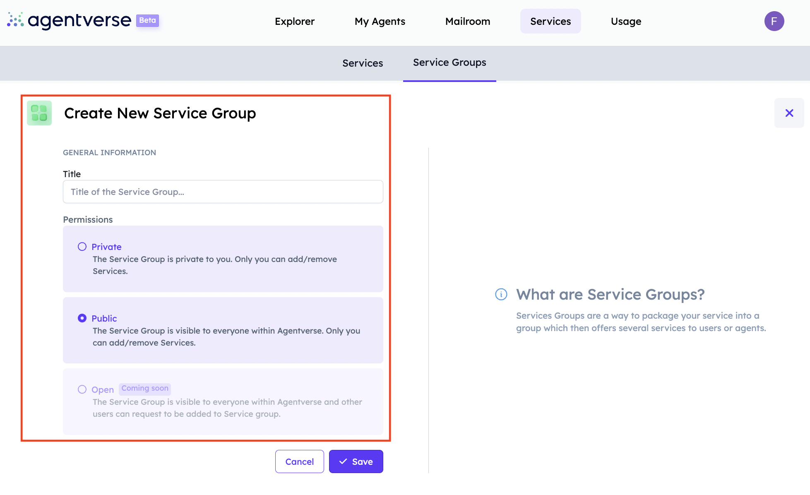

You will see something similar to the following:

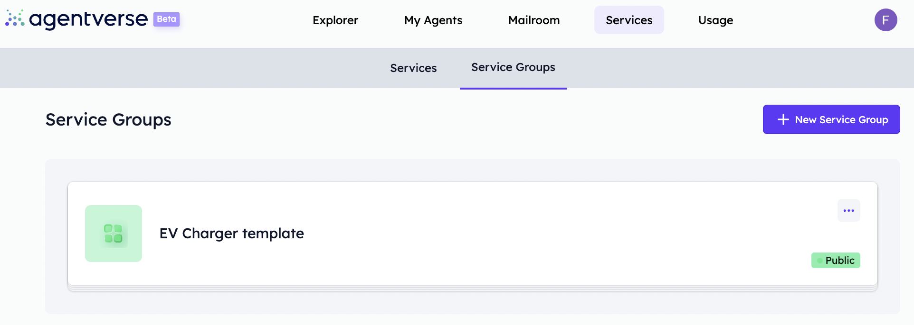

We are now ready to register our service. Click on the **Services** tab within Agentverse services and click on **+ New Service**.

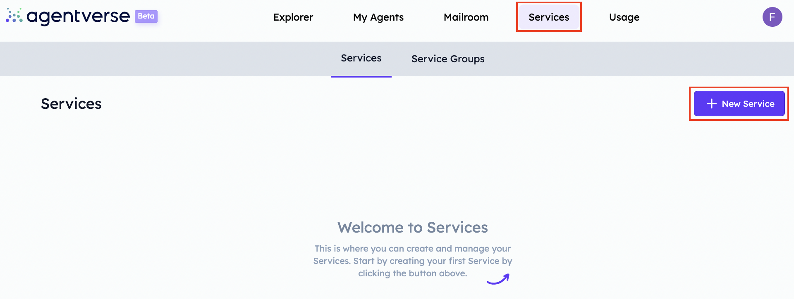

Then, you will need to provide all information required as shown below:

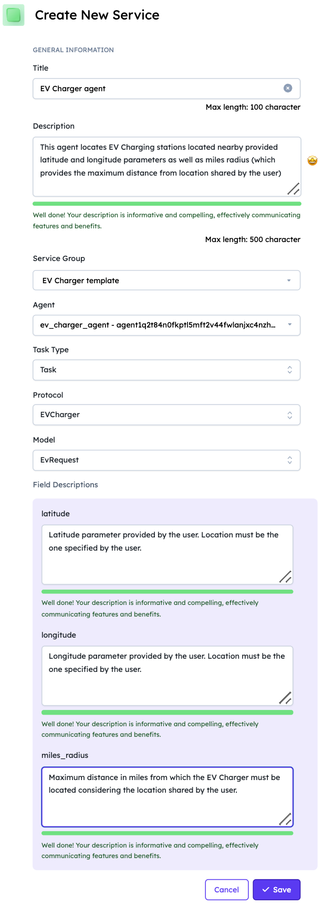

    <Callout type="warning" emoji="⚠️">
      Remember that you need to provide a detailed description of the service offered, as well as, the one for the parameters taken into account when running the research according to data provided by the user. In our example, these would be the _latitude_, _longitude_ and _miles radius_ parameters.
    </Callout>

Once you are satisfied, click on **Save** button.

    <Callout type="warning" emoji="⚠️">
      Importantly, your agent needs to have a **protocol** to be registered as a service, otherwise registration will not successfully complete.
    </Callout>

With this, **your service is now live** and ready to be discoverable via DeltaV chat interface!

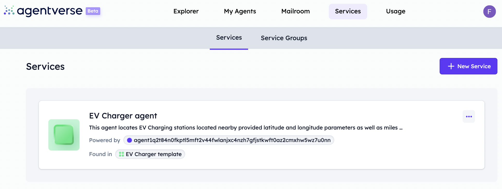

## Query for your service on DeltaV

Now, head over [DeltaV ↗️](https://deltav.agentverse.ai/login) platform. Here, you will need to log in.

Once logged in successfully, you will be asked to choose a service group to continue. This provides the [AI Engine ↗️](/concepts/ai-engine/ai-engine-intro) with information about the task you want to query about. In our example, we will have the **EV Charger template** service group we previously created.

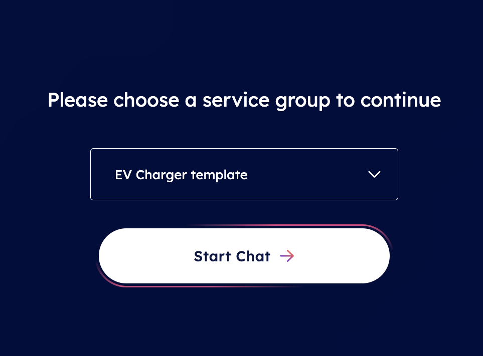

Once selected, you will be redirected towards DeltaV chat interface from which you can start inquiring for EV Charger services according to your needs.

Let's assume you are in London and you need an EV Charger within 3 miles radius.

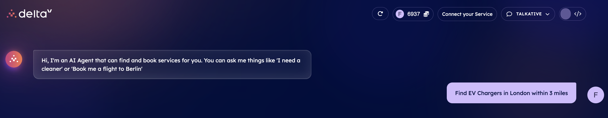

This will start the [AI Engine ↗️](/concepts/ai-engine/ai-engine-intro) which will figure out the task related to your request and objective. This task will be based on such latter information and the Engine will find the available [AI Agents ↗️](/concepts/agents/agents) registered within the [Agentverse ↗️](/concepts/agent-services/agentverse-intro) offering services matching your request. In our case, we need to select the **EVCharger** task.

Given this, the Engine will start working on such a task and consequently will start looking for AI Agents providing information about nearby EV Charger stations available based on latitude and longitude parameters according to your provided location, considering also the radius (in miles) within which the EV charger should be located.

The Engine will then elaborate the data inserted and will ask you to confirm the latitude, longitude and maximum distance through a map appearing in the chat.

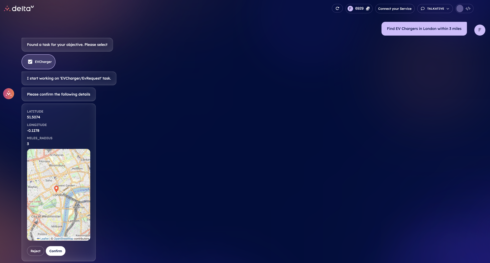

You can either **Reject** or **Confirm** the information provided. If you **Confirm** the given data, the AI Engine will build up the context based also on your inputs to define the optimal AI Agent to which request the execution of the task related to closer EV Chargers available to provided location. Once an agent is recommended by the Engine, it will provide you with a choice among different EV Chargers close to your confirmed location alongside prices and type of charging station.

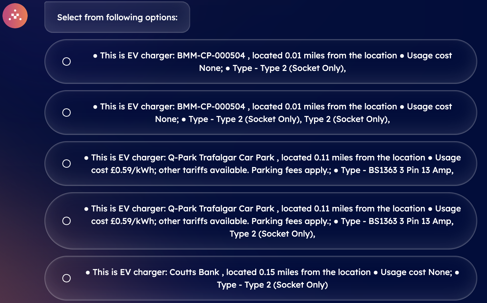

Now, you need to select your preferred choice. Once selected, the task will be executed and a confirmation email with all details regarding your booking will be sent to your email address provided during the log in.

**Great! We have successfully created one agent encapsulating a service and then registered it within the Agentverse so for it to be visible to everyone. Then, thanks to the bridge between the Agentverse service section and DeltaV, we managed to successfully retrieve our service and book an EV charger in a straightforward way by providing different search parameters.**

