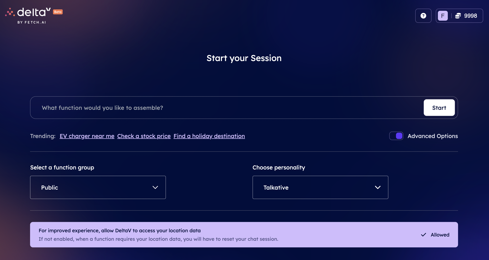
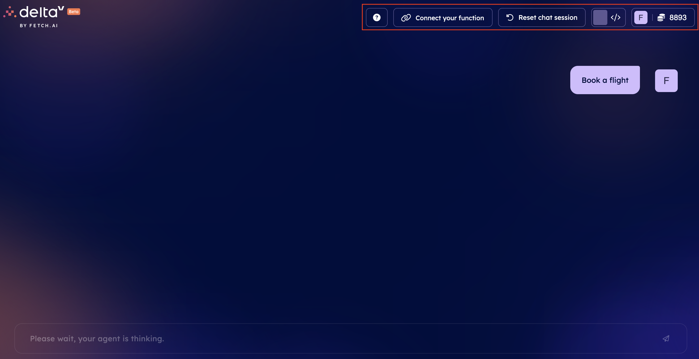

import { Callout } from 'nextra/components'

# DeltaV chat interface

[DeltaV ↗️](https://deltav.agentverse.ai/login) chat interface presents multiple features. When landing on [DeltaV ↗️](/concepts/ai-engine/deltav), you will first be required to log in providing your details. Once you do so, you will be prompted towards the **Start your Session** page where you will be able to enter your queries.

    <Callout type="info" emoji="ℹ️">
      If you enable **Advanced Options**, you will be able to define the **service group** for the query you are looking for, and the style/personality of the language model used to provide answers to your queries. You can choose among the following options:

            - _Talkative_ and _Talkative v2_ modes: this is our base system and is a hybrid language model using advanced and open source models.
            - _Thoughtful_ mode: this is the most powerful model which can be set to answer your queries. It does the best job but it is still under development and will be available soon.
            - _Gemini Pro_ mode: this integrates with Google Gemini Pro LLM.
            - _Creative_ modes: these models use our own LLM which we are training (i.e. finetuning) given that these are based on open source LLMs.
    </Callout>

As soon as you enter a service query, you will be directed towards the actual DeltaV chat interface. Here, you will interact with DeltaV chat agent. In the **top right corner** of the chat interface, we have different **buttons**:

    - **? button**: this provides you with resources to get started with DeltaV, including video resources as well as links towards the platform and APIs documentation.

    - **Connect your Service button**: by clicking on this, you will be redirected towards the [Agentverse ↗️](/concepts/agent-services/agentverse-intro) so for you to register any [Agent Function ↗️](/guides/services/services) you may wish to make visible via DeltaV chat interface. This provides an innovative way of monetize your Agent Functions and get the most out of those! For additional information, Checkout the dedicated guide to [Registering agent Functions on the Agentverse ↗️](/guides/agentverse/registering-agent-services) which illustrates the process of enrolling your Agent Functions on the Agentverse. For additional resources, have a look at the following guides: [Register a coin toss agent as a Function ↗️](/guides/agentverse/registering-agent-coin-toss) and [Register a dice roll agent as a Function ↗️](/guides/agentverse/registering-agent-dice-roll).

    - **Reset chat session button**: this will reset your conversation with DeltaV AI Agent.

    - **Developer button**: this button, if turned on, will allow you to have a look at the developer information made available in a side window depicting all activity and logic taking place at each step during the discussion with DeltaV AI Agent. It is a useful resource for developers as you can peek into what is happening internally in the system. It shows information based on what thoughts the [AI Engine ↗️](/concepts/ai-engine/ai-engine-intro) is making when taking decision. Also shows more detailed error messages.

    - **Profile button**: here you will find information about your _USED CREDIT_ amount. This is the amount of credit you spent interacting via the AI Engine and LLMs. The cost depends on the AI personality used. If you run out of credit you can request more. In here, you will also find the _Log out_ option.

Now that we have covered all essential pieces of the DeltaV chat interface, **we are ready to start our first service query!**

    <Callout type="info" emoji="ℹ️">
      Checkout the [Book any service with DeltaV! ↗️](/guides/deltav/book-service-with-deltav) guide to get started with your first query using this platform!

      Also, checkout the [Running Locally ↗️](/guides/agents/running-locally) guide in case you developed an Agent Function locally and you wish to make it retrievable via DeltaV!
    </Callout>
