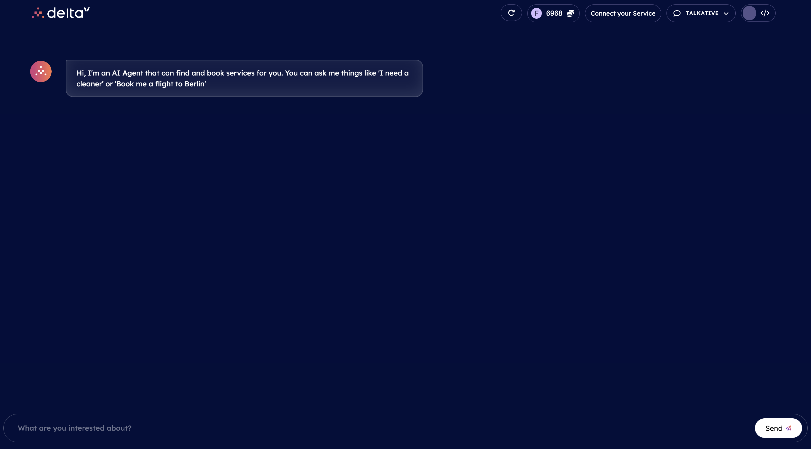
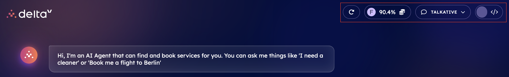

import { Callout } from 'nextra/components'

# DeltaV chat interface

The DeltaV chat interface is straightforward and presents multiple features.

At first sight, we have a message from DeltaV AI Agent telling us to query for any type of service we need.

In the **top right corner** of the chat interface, we have different **buttons**:

    - **Reset button**: this will reset your conversation with DeltaV AI Agent up to the first welcome message.

    - **Profile button**: here you will find information about your _USED CREDIT_ amount. This is the amount of credit you spent interacting via the [AI Engine ↗️](/concepts/ai-engine/ai-engine-intro) and LLMs. The cost depends on the AI personality used. If you run out of credit you can request more. In here, you will also find the _Log out_ option.

    - **Connect your Service button**: by clicking on this, you will be redirected towards the [Agentverse ↗️](/concepts/agent-services/agentverse-intro) so for you to register any service you may wish to make visible via DeltaV chat interface. This provides an innovative way of monetize your services and get the most out of those! For additional information, Checkout the dedicated [guide ↗️](/guides/agentverse/registering-agent-services) we created to illustrate the process of enrolling your service in a straightforward way via the Agentverse services and subsequently DeltaV.

    - **AI Personality button**: this one allows you to set the style/personality of the language model used to provide answers to your queries. You can choose among the following options:

            - _Talkative_ mode: this is our base system and is a hybrid language model using advanced and open source models.
            - _Thoughtful_ mode: this is the most powerful model which can be set to answer your queries. It does the best job but it is still under development and will be available soon.
            - _Creative_ mode: this model uses our own LLM which we are training (i.e. finetuning) given that it is based on open source LLMs.

    - **Developer button**: this button, if turned on, will allow you to have a look at the developer information made available in a side window depicting all activity and logic taking place at each step during the discussion with the DeltaV AI Agent. It is a useful resource for developers as you can peek into what is happening internally in the system. It shows information based on what thoughts the AI Engine is making when taking decision. Also shows more detailed error messages.

Now that we have covered all essential pieces of the DeltaV chat interface, **we are ready to start our first service query!**

    <Callout type="info" emoji="ℹ️">
      Checkout the [Book any service with DeltaV! ↗️](/guides/deltav/book-service-with-deltav) guide to get yourself started with your first service booking using this revolutionary platform!
    </Callout>
