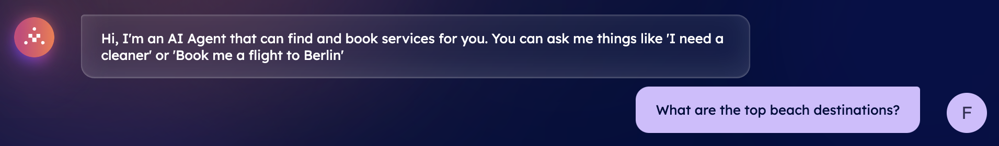
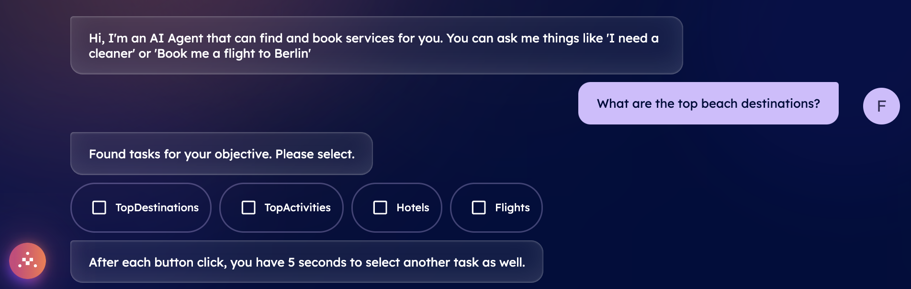
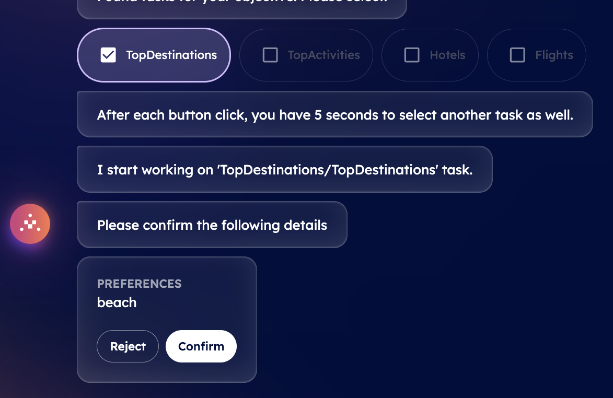
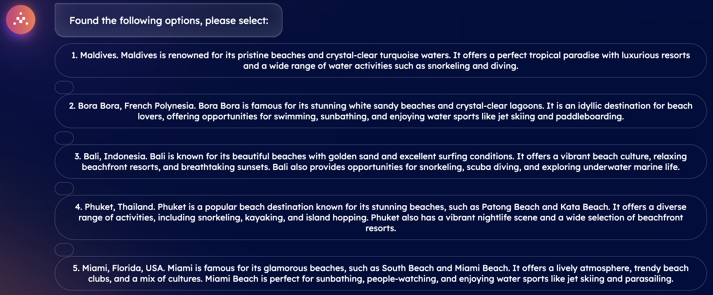
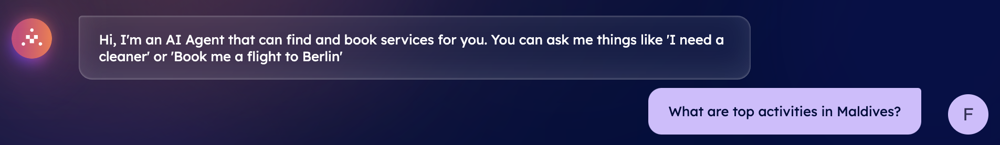
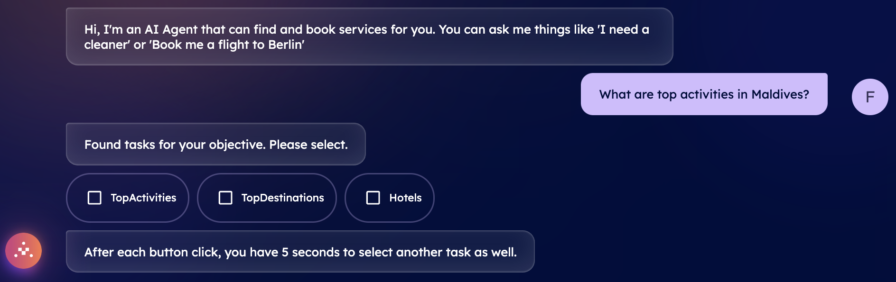
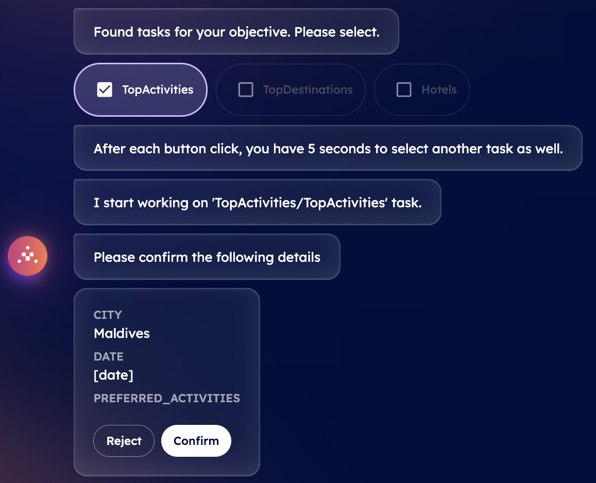
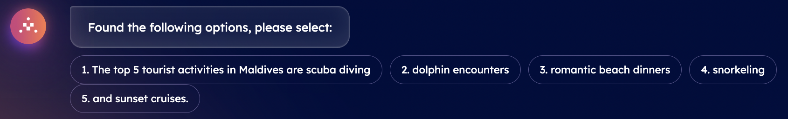

import { Callout } from 'nextra/components'

# Find top destinations and activities with DeltaV

It is possible to use DeltaV to define different aspects of your holiday planning journey. For instance, you can use this platform to retrieve top destinations for different type of holidays and related top activities to be carried out during your journey. For instance, you can use DeltaV to have an overview of top beach destinations according to current trends. Based on these suggestions provided by DeltaV AI Agent, you can then query it for activities available at any given destination.

Below we give you an insight of the **Top Destinations** and **Top Activities** queries which can be made through DeltaV chat interface.

## Top destinations

Let's suppose that you would like to spend a nice relaxed holiday at some popular beach destination worldwide but unsure where to go. You can query DeltaV AI Agent to retrieve the top destinations based on your desires.

DeltaV's AI Agent is at your service, ready to assist you in making a choice. As an initial step, you have to be [logged in ↗️](/guides/deltav/deltav-chat-interface) by providing your account details. Then, you will be asked to query for a type of service by DeltaV AI Agent.

In this guide, we want an overview of top beach destinations, thus, type **Top beach destinations** into the chat's interface.

This will start the [AI Engine ↗️](/concepts/ai-engine/ai-engine-intro) which will figure out the task related to your request and objective. This task will be based on such provided information and the Engine will find all available [AI Agents ↗️](/concepts/agents/agents) registered within the [Agentverse ↗️](/concepts/agent-services/agentverse-intro) platform offering services akin to your request.

    <Callout type="info" emoji="ℹ️">
      Services provided and retrieved through the DeltaV platform are those provided by AI Agents previously made available on the Agentverse via the [Agentverse Services ↗️](/guides/agentverse/registering-agent-services) tab.
    </Callout>

Once the task has been defined, you will be asked you to select among a list of different tasks. You need to choose the task according to the service you requested. In our case, we need o select a **TopDestinations** task. Given such an input, the Engine will start working on such a task and consequently will start looking for dedicated AI Agents providing information about popular beach destinations.

At this point, you will be asked to confirm the type of destination you are looking for. In our case, we are looking for a **beach** destination. You can either **Reject** or **Confirm** the message within the chat.

If you choose **Confirm**, the AI Engine will build up the context based on your inputs to define the optimal AI Agent to which request the execution of the task related to top beach destinations available. Once an agent is recommended by the Engine, it will provide you with a choice among different choices for your confirmed destination.

**Great! You have successfully queried for popular beach destinations via DeltaV. You can now reset the conversation to request a new service.**

## Top activities

Let's suppose that you queried DeltaV AI Agent to retrieve nice and popular beach holiday destinations and that you made a choice. In above example, we chose Maldives as our preferred destination. At this point, you might be interested in popular activities which are available at this location and on which you may start planning your journey in more details.

DeltaV's AI Agent is at your service even in this case. All you need to do is querying for a type of service by DeltaV AI Agent.

In this guide, we want an overview of top activities available in the Maldives. For this reason, you will need to type **Top activities in Maldives** into the chat's interface.

This will start the [AI Engine ↗️](/concepts/ai-engine/ai-engine-intro) which will figure out the task related to your request and objective. This task will be based on such provided information and the Engine will find all available [AI Agents ↗️](/concepts/agents/agents) registered within the [Agentverse ↗️](/concepts/agent-services/agentverse-intro) platform offering services akin to your request.

Once the task has been defined, you will be asked you to select among a list of different tasks. You need to choose the task according to the service you requested. In our case, we need o select a **TopActivities** task. Given such an input, the Engine will start working on such a task and consequently will start looking for dedicated AI Agents providing information about popular activities available at such holiday destination.

At this point, you will be asked to confirm the destination you are looking for. In our case, we are looking for **Maldives**. You can either **Reject** or **Confirm** the message within the chat.

If you choose **Confirm**, the AI Engine will build up the context based on your inputs to define the optimal AI Agent to which request the execution of the task related to top beach destinations available. Once an agent is recommended by the Engine, it will provide you with a choice among different activities for your confirmed destination.

**Great! You have successfully queried for popular beach destinations via DeltaV and for related activities available there. You can now start planning your journey in further detail, for example by booking a flight and a hotel at your preferred destination. To do so, reset the conversation to request a new service. For instance, you could decide to either [book a flight ↗️](/guides/deltav/book-flight-with-deltav) towards this destination, or [book an accommodation ↗️](/guides/deltav/book-hotel-with-deltav)for your journey straightforwardly via DeltaV chat interface!**

**Have a look at our dedicated [guides ↗️](/guides#deltav) for deeper understanding of the services queryable via DeltaV!**
