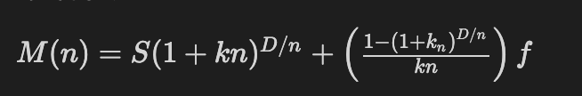
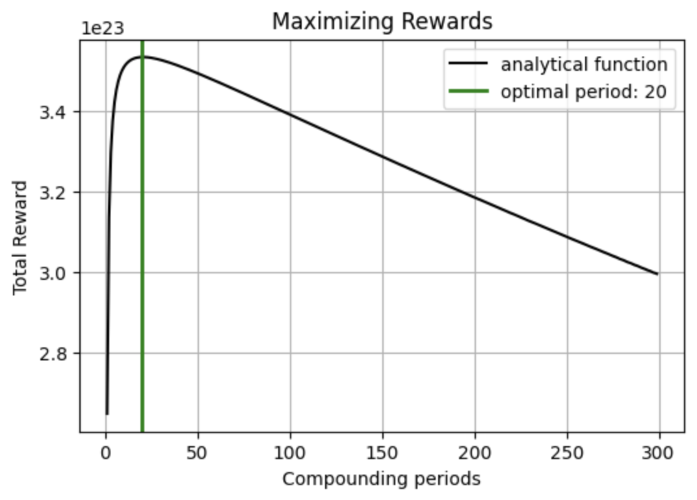
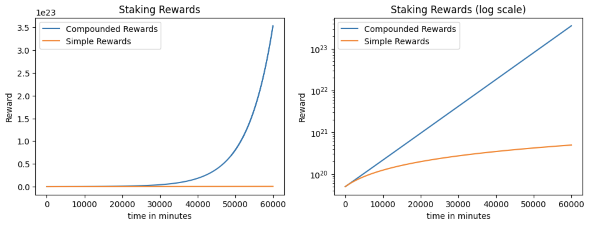

import { CodeGroup, CodeSegment, DocsCode, GithubCodeSegment } from "../../../../../components/code";

# Stake optimizer

## Getting started

Whenever we delegate tokens to a validator for a determined period, you can use the [`auto-compounder` ↗️](/guides/fetch-network/cosmpy/use-cases/stake-auto-compounder) to get increasing rewards. You can maximize your rewards for a given staking period by selecting an optimal compounding period. To do this, you will need to follow these steps:

    - **Set and query variables**: when calculating staking rewards, you need to set and query variables such as staking parameters, transaction fees, and network parameters.
    - **Calculate reward rate**: after you select and query all the variables needed, you will calculate the reward rate.
    - **Calculate optimal compounding period**: you will calculate the optimal compounding period that will maximize your rewards.

First of all, we need to define a network to work with:

```py copy
from cosmpy.aerial.client import LedgerClient
from cosmpy.aerial.config import NetworkConfig

ledger = LedgerClient(NetworkConfig.fetchai_stable_testnet())
```

## Set and query variables
### Staking variables

First, we need to define the desired amount and the total period that we would like to stake in: `initial_stake` and `total_period` variables. Here we will stake 50 TESTFET for 60000 minutes. For this guide, we will work with minutes as a time unit:

```py copy
initial_stake = 50000000000000000000
total_period = 60000
```

### Validator selection and variables

We are now ready to select a validator to delegate our tokens. We can do this by analyzing which one has the lowest commission and a reasonable amount of stake delegated compared to the total stake.

```py copy
from cosmpy.protos.cosmos.staking.v1beta1.query_pb2 import QueryValidatorsRequest

req = QueryValidatorsRequest()
resp = ledger.staking.Validators(req)

# Calculate the total stake currently in the testnet
# Status = 3 means that the validator is bonded
validators_stake = [int(validator.tokens) for validator in resp.validators if validator.status == 3]
total_stake = sum(validators_stake)

# For every bonded validator, we print commission and percentage of total stake
print("MONIKER      COMMISSION   % of TOTAL STAKE")
for validator in resp.validators:
    if validator.status == 3:
        moniker = validator.description.moniker
        commission = int(validator.commission.commission_rates.rate)/1e18*100
        print(moniker[:10]," ", commission,"%     ", round(int(validator.tokens)/total_stake*100,3),"%")
```

Once you run the code above, you will observe each validator commission rate and its percentage delegated of the total stake. The most important parameter to observe in each validator is the commission it takes from rewards. We should always select a validator with the lower commission as long as it has a reasonable stake compared with the total stake.

```py copy
# get all the active validators on the network
validators = ledger.query_validators()

# Query info of selected validator
selected_validator = "validator0"
validator = [v for v in validators if v.moniker == selected_validator][0]
query_validator = [v for v in resp.validators if v.description.moniker == selected_validator][0]

# Set the commission %
commission = int(query_validator.commission.commission_rates.rate)/1e18

# Set percentage delegated of total stake
pct_delegated = initial_stake/total_stake
```

In this case, at the moment the code is run, all validators have the same commission, therefore, we simply select the validator with the highest stake, which is validator0. Feel free to select the most convenient validator when you run the code above. We will save the variables `commission` and the fraction `pct_delegated` of our `initial_stake` to the `total_stake` to use them both later on.

### Estimate transaction fees

We now need to know an estimate of the transaction fees we will face every time we claim rewards and delegate tokens. For that, both claim rewards and delegate tokens transactions were combined into a single multi-msg transaction to simulate the total fees.

```py copy
from cosmpy.aerial.client.distribution import create_withdraw_delegator_reward
from cosmpy.aerial.client.staking import create_delegate_msg
from cosmpy.aerial.tx import SigningCfg
from cosmpy.aerial.wallet import LocalWallet
from cosmpy.crypto.keypairs import PrivateKey
from cosmpy.crypto.address import Address
from cosmpy.aerial.tx import Transaction

# Use any address with at least the amount of initial_stake available
key = PrivateKey("XZ5BZQcr+FNl2usnSIQYpXsGWvBxKLRDkieUNIvMOV7=")
alice = LocalWallet(key)
alice_address = Address(key)._display

tx = Transaction()

# Add delegate msg
tx.add_message(create_delegate_msg(alice_address,validator.address,initial_stake,"atestfet"))

# Add claim reward msg
tx.add_message(create_withdraw_delegator_reward(alice_address, validator.address))

account = ledger.query_account(alice.address())
tx.seal(SigningCfg.direct(alice.public_key(), account.sequence),fee="",gas_limit=0)
tx.sign(alice.signer(), ledger.network_config.chain_id, account.number)
tx.complete()

# simulate the fee for the transaction
_, str_tx_fee = ledger.estimate_gas_and_fee_for_tx(tx)
```

Since the output of this function is a string, we need to convert it to an int and round it up to get a more conservative estimate for the `fee`.

```py copy
denom = "atestfet"
tx_fee = str_tx_fee[:-len(denom)]

# Add a 20% to the fee estimation to get a more conservative estimate
fee = int(tx_fee) * 1.20
```

### Query network variables

There are three network variables that we need to query since they will contribute to the staking rewards calculation: `total_supply`, `inflation`, and `community_tax`.

```py copy
# Total Supply of tokens
req = QueryTotalSupplyRequest()
resp = ledger.bank.TotalSupply(req)
total_supply = float(json.loads(resp.supply[0].amount))

# Inflation
req = QueryParamsRequest(subspace="mint", key="InflationRate")
resp = ledger.params.Params(req)
inflation = float(json.loads(resp.param.value))

# Community Tax
req = QueryParamsRequest(subspace="distribution", key="communitytax")
resp = ledger.params.Params(req)
community_tax = float(json.loads(resp.param.value))
```

### Calculate reward rate

We can now proceed to calculate a theoretical staking rewards rate using the variables gathered above. These are: `inflation`, `total_supply`, `pct_delegated`, `community_tax` and `commission`:

```py copy
# Calculate annual reward
annual_reward = (inflation * total_supply) *pct_delegated* (1- community_tax)*(1- commission)

# Convert from annual reward to minute reward
minute_reward = annual_reward/360/24/60

# Set the rate
rate = minute_reward/initial_stake
```

### Calculate optimal compounding period

We can calculate the optimal compounding period that maximizes our staking rewards analytically by using the following formula:



    Where:

    - M = Total stake at time D
    - S = Initial Stake
    - f = Transaction Fee
    - k = Reward Rate
    - m = Number Of Compounding Transactions
    - n = Compounding Period
    - D = m x n = Total Staking Time

We will now find the value that maximizes reward by taking the first derivative with respect to _n_ and finding the root in the interval _(0,D]_:

```py copy
import numpy as np
from sympy.utilities.lambdify import lambdify, implemented_function
from sympy import *
from scipy.optimize import brentq

f = fee
S = initial_stake
k = rate
D = total_period

# x will represent n
x = Symbol("x")

# Define the function
M = (S*(1+(k*x))**(D/x))+((1-((1+(k*x))**(D/x)))/(k*x))*f
Mx = lambdify(x,M)

# Take the first derivative with respect to x
M_prime = M.diff(x)
Mx_prime = lambdify(x,M_prime)

# Find the maximum reward value by finding the root of the function
optimal_period = brentq(Mx_prime, 0.1, D)

print("optimal_period: ", analytical_optimal_period, " minutes")
```

You can make use of the `optimal_period` value in the staking [`auto-compounder` ↗️](/guides/fetch-network/cosmpy/use-cases/stake-auto-compounder) to maximize your rewards.

You can also plot the function along with the optimal period to observe the results in the following manner:

```py copy
import matplotlib.pyplot as plt

plot = plt.figure(0,figsize=(6,4), dpi=100)

y = np.linspace(1,300, 100)
plt.plot(y,Mx(y),"k", label = 'analytical function')
plt.axvline(x = optimal_period, color = 'g', linewidth = 2, label = f'optimal period: {round(optimal_period)}')
plt.legend()

plt.xlabel("Compounding periods")
plt.ylabel('Total Reward')
plt.title('Maximizing Rewards')
plt.grid()
```



Finally, we can compare the compounding staking rewards to a simple non-compounding strategy:

```py copy
# Compounding Strategy
comp_rewards = []
rewards = 0
period = optimal_period
S = initial_stake
for i in range(total_period):
    rewards = rewards + (S*rate)
    if i%period == 0:
        S = S + rewards - fee
        rewards = 0
    comp_rewards.append(S)
S = S + rewards - (fee/2)
comp_rewards.append(S)

# Simple Strategy
s_reward = initial_stake*rate
simple_rewards = [initial_stake+(s_reward*i) for i in range(comp_period)]

# Plots
plot = plt.figure(0,figsize=(12,4), dpi=100)

plt.subplot(1,2,1)
plt.plot(comp_rewards, label = "Compounded Rewards")
plt.plot(simple_rewards, label = "Simple Rewards")
plt.xlabel("time in minutes")
plt.ylabel('Reward')
plt.title('Staking Rewards')
plt.legend()

plt.subplot(1,2,2)

plt.plot(total_rewards, label = "Compounded Rewards")
plt.plot(simple_rewards, label = "Simple Rewards")
plt.xlabel("time in minutes")
plt.ylabel('Reward')
plt.title('Staking Rewards (log scale)')
plt.legend()

plt.yscale('log')
```



Now that we have presented the concepts and ideas behind the stake optimizer, have a look at the abbreviated version of the code provided below:

<GithubCodeSegment digest="a608b5c9917268dbca34403c79ab4432">
    <CodeSegment
        path="https://github.com/fetchai/uAgent-Examples/blob/main/5-documentation/guides/fetch-network/cosmpy/use-cases/stake-optimizer/aerial_stake_optimizer.py"
        lineStart={1}
        lineEnd={195}
        hosted={true}
    />
</GithubCodeSegment>
<CodeGroup dynamic hasCopy isLocalHostedFile digest='a608b5c9917268dbca34403c79ab4432'>

<DocsCode local={true}>
	```py copy filename="aerial_stake_optimizer.py"

	import json
	
	from cosmpy.aerial.client import LedgerClient, NetworkConfig
	from cosmpy.aerial.client.distribution import create_withdraw_delegator_reward
	from cosmpy.aerial.client.staking import create_delegate_msg
	from cosmpy.aerial.faucet import FaucetApi
	from cosmpy.aerial.tx import SigningCfg, Transaction
	from cosmpy.aerial.wallet import LocalWallet
	from cosmpy.protos.cosmos.bank.v1beta1.query_pb2 import QueryTotalSupplyRequest
	from cosmpy.protos.cosmos.params.v1beta1.query_pb2 import QueryParamsRequest
	from cosmpy.protos.cosmos.staking.v1beta1.query_pb2 import QueryValidatorsRequest
	
	
	# This function returns the total reward for given:
	# * f -> fee
	# * S -> Initial Stake
	# * k -> Reward Rate
	# * D -> Total staking period
	# * x -> Compounding Period
	def M(x, f, S, k, D):
	    """
	    Calculate the total reward.
	
	    :param x: Compounding Period
	    :param f: fee
	    :param S: Initial Stake
	    :param k: Reward Rate
	    :param D: Total staking period
	
	    :return: Total reward
	    """
	    return (S * (1 + (k * x)) ** (D / x)) + (
	            (1 - ((1 + (k * x)) ** (D / x))) / (k * x)
	    ) * f
	
	
	def main():
	    """Run main."""
	    ledger = LedgerClient(NetworkConfig.fetchai_stable_testnet())
	    faucet_api = FaucetApi(NetworkConfig.fetchai_stable_testnet())
	
	    # Set initial stake and desired stake period
	    initial_stake = 50000000000000000000
	    total_period = 60000
	
	    req = QueryValidatorsRequest()
	    resp = ledger.staking.Validators(req)
	
	    # Calculate the total staked in the testnet
	
	    total_stake = 0
	    # validator.status == 3 refers to bonded validators
	    validators_stake = [
	        int(validator.tokens) for validator in resp.validators if validator.status == 3
	    ]
	    total_stake = sum(validators_stake)
	
	    # Get validators commissions
	    validators_commission = [
	        int(validator.commission.commission_rates.rate)
	        for validator in resp.validators
	        if validator.status == 3
	    ]
	
	    validators = ledger.query_validators()
	    validator = "not_selected"
	
	    # Choose a threshold for a validators minimum percentage of total stake delegated
	    stake_threshold = 0.10
	
	    for _i in range(len(validators_commission)):
	
	        # Choose validator with lower commission
	        validator_index = validators_commission.index(min(validators_commission))
	
	        # Verify that it meets the minimum % threshold
	        validator_stake_pct = validators_stake[validator_index] / total_stake
	        if validator_stake_pct >= stake_threshold:
	            # Set the selected validator
	            validator = validators[validator_index]
	            break
	
	        # We omit this validator by setting his commission to infinity
	        validators_commission[validator_index] = float("inf")
	
	    if validator == "not_selected":
	        # Restart validators_commission list with original values
	        validators_commission = [
	            int(validator.commission.commission_rates.rate)
	            for validator in resp.validators
	            if validator.status == 3
	        ]
	
	        print("No validator meets the minimum stake threshold requirement")
	
	        # Proceed to select the validator with the lowest commission
	        validator_index = validators_commission.index(min(validators_commission))
	        validator = validators[validator_index]
	
	    # Query validator commission
	    commission = float(resp.validators[0].commission.commission_rates.rate) / 1e18
	
	    # Set percentage delegated of total stake
	    pct_delegated = initial_stake / total_stake
	
	    # Estimate fees for claiming and delegating rewards
	
	    alice = LocalWallet.generate()
	    alice_address = str(alice.address())
	
	    alice_balance = ledger.query_bank_balance(alice.address())
	
	    while alice_balance < initial_stake:
	        print("Providing wealth to alice...")
	        faucet_api.get_wealth(alice.address())
	        alice_balance = ledger.query_bank_balance(alice.address())
	
	    tx = Transaction()
	
	    # Add delegate msg
	    tx.add_message(
	        create_delegate_msg(alice_address, validator.address, initial_stake, "atestfet")
	    )
	
	    # Add claim reward msg
	    tx.add_message(create_withdraw_delegator_reward(alice_address, validator.address))
	
	    account = ledger.query_account(alice.address())
	
	    tx.seal(
	        SigningCfg.direct(alice.public_key(), account.sequence), fee="", gas_limit=0
	    )
	    tx.sign(alice.signer(), ledger.network_config.chain_id, account.number)
	    tx.complete()
	
	    # simulate the fee for the transaction
	    _, str_tx_fee = ledger.estimate_gas_and_fee_for_tx(tx)
	
	    denom = "atestfet"
	    tx_fee = str_tx_fee[: -len(denom)]
	
	    # Add a 20% to the fee estimation to get a more conservative estimate
	    fee = int(tx_fee) * 1.20
	
	    # Query chain variables
	
	    # Total Supply of tokens
	    req = QueryTotalSupplyRequest()
	    resp = ledger.bank.TotalSupply(req)
	    total_supply = float(json.loads(resp.supply[0].amount))
	
	    # Inflation
	    req = QueryParamsRequest(subspace="mint", key="InflationRate")
	    resp = ledger.params.Params(req)
	    inflation = float(json.loads(resp.param.value))
	
	    # Community Tax
	    req = QueryParamsRequest(subspace="distribution", key="communitytax")
	    resp = ledger.params.Params(req)
	    community_tax = float(json.loads(resp.param.value))
	
	    # Annual reward calculation
	    annual_reward = (
	            (inflation * total_supply)
	            * pct_delegated
	            * (1 - community_tax)
	            * (1 - commission)
	    )
	
	    # Convert from annual reward to minute reward
	    minute_reward = annual_reward / 360 / 24 / 60
	    rate = minute_reward / initial_stake
	
	    # Compute optimal period
	    f = fee
	    S = initial_stake
	    k = rate
	    D = total_period
	
	    # List of compounding periods
	    X = list(range(1, D))
	
	    # Evaluate function M on each compounding period
	    R = [M(x, f, S, k, D) for x in X]
	
	    # Fnd the period that maximizes rewards
	    optimal_period = R.index(max(R)) + 1
	
	    # These values can be used in aerial_compounder.py to maximize rewards
	    print("total period: ", total_period, "minutes")
	    print("optimal compounding period: ", optimal_period, "minutes")
	
	
	if __name__ == "__main__":
	    main()

```
</DocsCode>

</CodeGroup>


